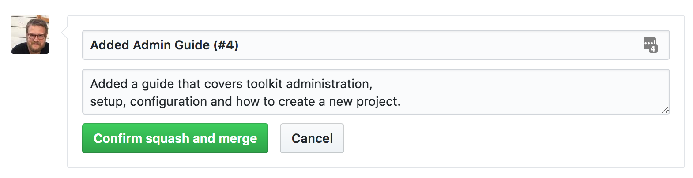

[](https://github.com/shotgunsoftware/developer.shotgunsoftware.com/actions/workflows/publish-docs.yml)
[](https://github.com/shotgunsoftware/tk-doc-generator)


# [developer.shotgridsoftware.com](https://developer.shotgridsoftware.com/)

> :warning: Our Developer documentation has relocated and this site will be discontinued soon. [Visit our new Developer Help Center here.](https://help.autodesk.com/view/SGDEV/ENU/)

Welcome to the source repository for [developer.shotgridsoftware.com](https://developer.shotgridsoftware.com/). This repository holds the markdown source and configuration used to generate the  developer site.

## How does it work?

The  Developer site uses *continous integration*. What you see in the master branch of this repository is reflected on the developer website. You create github issues and pull requests in order to make changes to the Repository.

The site uses the [Toolkit Documentation Generation system](https://github.com/shotgunsoftware/tk-doc-generator) to convert markdown, sphinx and other content to a website, complete with search, table of contents etc.

# Making a change to the documentation

If you want to make a change to the content on the developer site, please work in a branch in github and submit a pull request. 

## Formatting and style

For documentation on syntax and formatting guidelines, please see 
the **style guide** that comes 
with the documentation generation system.

- [tk-doc-generator style guide](https://developer.shotgridsoftware.com/tk-doc-generator/19bd79d8/)

## Adding content

For a new file to show up on the site, you'll need to add it to the Table of Contents in the left sidebar:

1. Add it to [`docs/_data/toc.yml`](https://github.com/shotgunsoftware/developer.shotgunsoftware.com/blob/master/docs/_data/toc.yml). Use a meaningful token to identify your page, using dashes to separate words, for example, `pipeline-integrations`.
2. In [`docs/_data/en/toc_text.yml`](https://github.com/shotgunsoftware/developer.shotgunsoftware.com/blob/master/docs/_data/en/toc_text.yml), provide the English translation for the token you used, as you want it to show up in the left sidebar, for example, "Pipeline Integrations".
3. Create the file in the proper place in the directory structure. Add metadata to the top, using the identifier you used in `toc.yml`, and following this model:

```
---
layout: default
title: "Pipeline Integrations"
pagename: pipeline-integrations
lang: en
---
```

**Special Characters:** If using special characters (including colons) in page titles, it's necessary to wrap the title in ASCII double quotes, as shown in the example above.


## Updating ``tk-doc-generator`` version

To update the version of ``tk-doc-generator``, follow these steps:

    git submodule init
    git submodule update
    cd tk-doc-generator
    git fetch
    git checkout <commit-id-you-need-or-branch-name>
    cd ..
    git commit -a -m "Updated version of tk-doc-generator"


## Site Preview

Once you have created a pull request, the system will automatically
generate a preview of the full site for every change you make, making
it easy to see what your changes will look like before they are released.

## Documentation Review

Once you have submitted a pull request, it will be reviewed and merged by our team. Once merged, it will become part of the 
official documentation.

## Merging with master

When code is merged into master, make sure to 
put in a meaningful title and description, and include the pull request id. For example:



