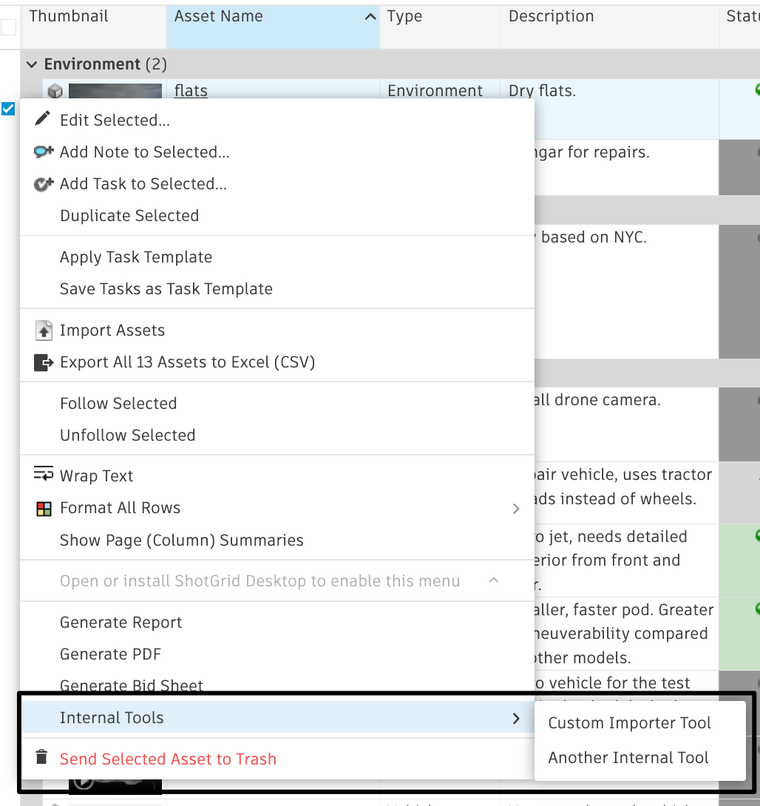
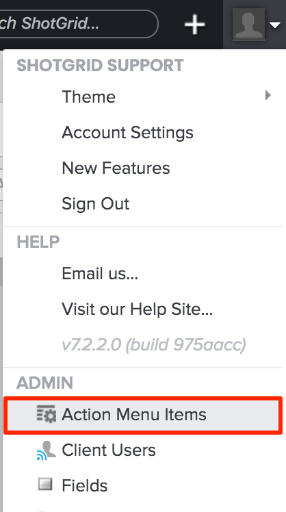

# Custom Action Menu Items

API developers can customize context menu items on a per-entity basis, through Action Menu Items (AMIs). For example, from a Versions page, you could select multiple versions, right-click, then choose “Build a PDF Report.”

## Action Menu Item fields

**1. Title (title):** The display name of the menu item.

**2. Entity Type (entity_type):** Restrict the menu item to only appear on one type of entity page, such as Version. Omitting this key (a nil value) has the effect of allowing the menu item on ALL enabled entities.

**3. URL (url):** The URL of our script that will create the PDF report.

**4. Order (list_order):** The ordinal position of the menu item (relative to other custom menu items).

**5. Light Payload (light_payload):** When using a [custom protocol](https://developer.shotgridsoftware.com/af0c94ce/) your script will receive the id of the event log entry record that holds the payload information instead of the full payload itself.

**6. Configure Menu Options:** There are a few options to select from:

- **Include in the right-click menu on an Entity record:** This is the default value that will include the AMI by right-clicking on a record.
    

- **Include in "Add Entity" dropdown menu on Entity pages:** Option to include this AMI in the "Add Entity" dropdown menu (ex: "Add Asset", "Add Shot", etc.).
    

- **Override "Add Entity" button on Entity pages:** This option allows you to overwrite the "Add Entity" button with an AMI.
    

- **Include in Internal Resources section of the User Menu:** This gives you the option to customize the User Menu with internal resources. Learn more about [customizing the user menu with internal resources here](https://help.autodesk.com/view/SGSUB/ENU/?guid=SG_Administrator_ar_display_options_ar_user_menu_customization_html).

**7. Folder (folder):** Allows you to organize AMIs into folders within the context menu (currently only a single level of folders is supported).
   

**8. Open in Modal Overlay:** Allows AMIs to open in an iframe window, instead of in a new tab. Please note that if Shotgun is running HTTPS, then all iframes need to be HTTPS as well.

**9. Poll for Data Updates (poll_for_data_updates):** Starts a polling loop to query for event log entries. This is for cases where the code on the other end of the ActionMenuItem makes changes back to Shotgun via the API on entities that are visible on the page that triggered the ActionMenuItem.

**10. Restrict to Permission Groups (permissions_groups):** Allows you to restrict access for the AMI to only specified permission groups. If left empty, AMI will be available for all users.

**11. Restrict to Projects (projects):** Will make it so the AMI only shows up in specified Projects. If left empty, AMI will be available in all Projects.

**12. Secret Token:** Secure your AMI by setting a [secret token](https://help.autodesk.com/view/SGSUB/ENU/?guid=SG_Administrator_ar_general_security_ar_securing_amis_html).

**13. Selection Required (selection_required):** Determines whether the menu item will be active if there are no rows currently selected.

## Types of Action Menu items

There are two types of menu items you can create:

## HTTP URL example

As an example, you can create a custom menu item called “Build PDF Report.” This will allow people to go to any Versions page, select one or more Versions, right-click, and then choose “Build PDF Report” from the  menu. Doing this will launch a script, which you must create, to get a nicely formatted report sent back to their browser. Here's how it works:

### Create the menu item via the UI

From the settings menu, choose Action Menu Items to open the AMI Admin page. 

To create a new AMI, click on . 

Fill out the Title and any other required fields, and click on “Create Action Menu Item.”

### What happens when a user clicks on the AMI?

 dispatches a POST request in a new window, or in a modal dialog if that option was selected, and sends along data from the current page (as part of the POST request) to the receiving URL. Here's an example of the workflow.

*   User navigates to a Versions page
*   User selects one or more Versions
*   User brings up the context menu (by right-clicking or clicking on the gear menu in the toolbar)
*   User clicks ‘Build PDF Report’
*    dispatches a POST request to the AMI’s URL in a new window (If your  server is served over HTTPS, and your URL is served over HTTP, expect to see a browser warning)
*   Your script, located at the URL specified, processes the POST data, and generates a PDF document
*   A nicely formatted PDF report is sent back to the user for viewing or download

## Custom protocol handler example

A more advanced implementation of custom AMIs involves setting up a custom protocol handler (e.g., ://process_version). This allows you to bridge  with applications like Maya, RV, or Cinesync via a script on your local computer. When you specify a non HTTP(S) protocol, data is sent via GET instead of POST to your URL. You may want to use this to launch an in-house tool to dispatch different requests.

Read more about custom protocols in [Launching Applications Using Custom Browser Protocols](https://developer.shotgridsoftware.com/67695b40/).

> **Note:** We also have built-in integration with Maya and other software packages via [ integrations](https://developer.shotgridsoftware.com/d587be80/) .

### Light payload

When using custom protocols, the query information is sent as a GET request. Certain operating system and browser combinations have varying limitations of the size of the GET request they allow. We suggest enabling the light payload checkbox on custom protocol AMIs. With light payload checked, your script will receive a single event log entry ID that it can fetch to get the full payload from by reading the `ami_payload` key of the record's `meta` field.

## Examples

Here are some related example scripts to help get you started:

*   [Handling ActionMenuItem Calls](https://developer.shotgridsoftware.com/python-api/cookbook/examples/ami_handler.html)
*   [Version Packager](https://developer.shotgridsoftware.com/python-api/cookbook/examples/ami_version_packager.html)

## Payload contents

### User data

*   **user_id:** The user ID of the currently logged in user (e.g., 34)
*   **user_login:** The login of the currently logged in user (e.g., joe)

### Entity data

*   **entity_type:** The entity type of the current page or view (e.g., Version)
*   **selected_ids:** A comma-separated list of the selected entity IDs (e.g., 931, 900)
*   **ids:** A comma-separated list of all IDs of the entities returned by the current page's query. This returns ALL IDs, including those that aren't visible due to pagination. (e.g., 931, 900, 904, 907). If "Selection required" was checked on the AMI, this value will be the same as **selected_ids** .

### Page data

*   **title:** The page title (e.g., "All Versions")
*   **page_id:** The ID of the page from which the action menu item was clicked (e.g., 1353)
*   **server_hostname:** The hostname of the system where the AMI was triggered. Can be useful if you have multiple servers invoking the same AMIs like a staging and a production server.
*   **referrer_path:** the canonical path of the URL where the AMI was invoked.
*   **session_uuid:** The unique identifier for the window where this AMI was invoked. This can be used with the “Poll for Data Updates” checkbox and the Python API's [`set_session_uuid`](https://developer.shotgridsoftware.com/python-api/reference.html?highlight=session_uuid#shotgun_api3.shotgun.Shotgun.set_session_uuid) method to broadcast back information to the page where the AMI was invoked. **Note:** This feature’s polling for updates falls off exponentially and eventually stops so if your AMI doesn’t update before polling stops, you may not see any updates in your source page.
*   **cols:** A comma-separated list of system field names of all the visible columns on the page (e.g., code, sg_status_list, description)
*   **column_display_names:** A comma-separated list of display names of all the visible columns on the page (e.g., Version, Status, Description)
*   **view:** The view that was selected when the AMI was invoked. Multiple views can be created for any given page via the design page mode.
*   **sort_column:** The system name of the column that was sorted by (e.g., code). Only sends the first sort key if there are multiple, see **sort_columns**
*   **sort_direction:** (e.g., asc or desc) Only sends the first sort direction if there are multiple, see **sort_directions**
*   **sort_columns:** A comma separated list of the system names of the columns that the page or view was sorted by (e.g., code,created_at). Only sent if there are multiple sorting keys
*   **sort_directions:** A comma separated list of the system names of the columns that the page or view was sorted by (e.g., code, created_at). Only sent if there are multiple sorting keys
*   **grouping_column:** The system name of the column that was grouped by (e.g., code). Only sends the first grouping column if there are multiple, see **grouping_columns**
*   **grouping_method:** The method the by which the grouping occurs (e.g. grouping by `entitytype` for an entity field or `month` for a date field). Only sends the first grouping method if there are multiple, see **grouping_columns**
*   **grouping_direction:** The grouping direction (e.g., asc or desc) Only sends the first grouping direction if there are multiple, see **grouping_directions**
*   **grouping_columns:** A comma separated list of system names of the columns that the data was grouped by (e.g., code,created_at). Only sent if there are multiple grouping columns
*   **grouping_methods:** A comma separated list of grouping methods (e.g., entity_type,month). Only sent if there are multiple grouping columns
*   **grouping_directions:** A comma separated list of grouping directions (e.g., asc,desc). Only sent if there are multiple grouping columns

### Project data (only sent if all entities on the current page share the same project)

*   **project_name:** The name of the Project (e.g., Gunslinger)
*   **project_id:** The ID of the Project (e.g., 81)

# Internal Resources Menu

To learn more about leveraging Action Menu Items for Internal Resources in the User Menu, [visit our Admin Guide here](https://help.autodesk.com/view/SGSUB/ENU/?guid=SG_Administrator_ar_display_options_ar_user_menu_customization_html).