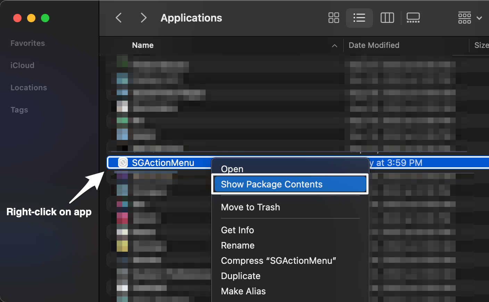
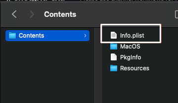

# Launching Applications Using Custom Browser Protocols

## Content

- [Registering a protocol](#registering-a-protocol)
  - [Registering a protocol on Windows](#registering-a-protocol-on-windows)
  - [Registering a protocol on macOS](#registering-a-protocol-on-macos)
  - [Registering a protocol on Linux](#registering-a-protocol-on-linux)

A very practical version of an [Action Menu Item](action-menu-items-create.md) (AMI) is a variant that will run an application or a script on your local computer. For this to work you need to set up a connection between your browser and the script or application you wish to run. This link is called a custom browser protocol.

You may want to set up a type of link where if a user clicks on it, it will launch the [foo] application. Instead of having ‘http’ as the prefix, you need to designate a custom protocol, such as ‘foo’. Ideally you want a link that looks like:  
```
foo://some/info/here
```

The operating system has to be informed how to handle protocols. By default, all of the current operating systems know that ‘http’ should be handled by the default web browser, and ‘mailto’ should be handled by the default mail client. Sometimes when applications are installed, they register with the OS and tell it to launch the applications for a specific protocol.

As an example, if you install RV, the application registers `rvlink://` with the OS and tells it that RV will handle all `rvlink://` protocol requests to show an image or sequence in RV. So when a user clicks on a link that starts with `rvlink://` , as you can do in , the operating system will know to launch RV with the link and the application will parse the link and know how to handle it.

See the [RV User Manual for more information about how RV can act as a protocol handler](https://help.autodesk.com/view/SGSUB/ENU/?guid=SG_RV_rv_manuals_rv_user_manual_rv_user_manual_chapter_c_html#c-2-installing-the-protocol-handler) for URLs and the “rvlink” protocol.

# Registering a protocol

## Registering a protocol on Windows

On Windows, registering protocol handlers involves modifying the Windows Registry. Here is a generic example of what you want the registry key to look like:

```
HKEY_CLASSES_ROOT
foo
(Default) = "URL:foo Protocol"
URL Protocol = ""
shell
open
command (Default) = "foo_path" "%1"
```
The target URL would look like:

```
foo://host/path...
```



**Windows QT/QSetting example**

If the application you are developing is written using the QT (or PyQT / PySide) framework, you can leverage the QSetting object to manage the creation of the registry keys for you.

This is what the code looks like to automatically have the application set up the registry keys:

```
// cmdLine points to the foo path.
//Add foo to the Os protocols and set foobar to handle the protocol
QSettings fooKey("HKEY_CLASSES_ROOT\\foo", QSettings::NativeFormat);
mxKey.setValue(".", "URL:foo Protocol");
mxKey.setValue("URL Protocol", "");
QSettings fooOpenKey("HKEY_CLASSES_ROOT\\foo\\shell\\open\\command", QSettings::NativeFormat);
mxOpenKey.setValue(".", cmdLine);
```

**Windows example that starts a Python script via a  AMI**

A lot of AMIs that run locally may opt to start a simple Python script via the Python interpreter. This allows you to run simple scripts or even apps with GUIs (PyQT, PySide or your GUI framework of choice). Let’s look at a practical example that should get you started in this direction.

**Step 1: Set up the custom “” protocol**

Using Windows Registry Editor:

```
[HKEY_CLASSES_ROOT\]
@="URL: Protocol"
"URL Protocol"=""
[HKEY_CLASSES_ROOT\\shell]
[HKEY_CLASSES_ROOT\\shell\open]
[HKEY_CLASSES_ROOT\\shell\open\command]
@="python""sgTriggerScript.py""%1"
```

This setup will register the `://` protocol to launch the `python` interpreter with the first argument being the script `sgTriggerScript.py` and the second argument being `%1` . It is important to understand that `%1` will be replaced by the URL that was clicked in the browser or the URL of the AMI that was invoked. This will become the first argument to your Python script.



**Step 2: Parse the incoming URL in your Python script**

In your script you will take the first argument that was provided, the URL, and parse it down to its components in order to understand the context in which the AMI was invoked. We’ve provided some simple scaffolding that shows how to do this in the following code.

**Python script**

```
import sys
import urlparse
import pprint
def main(args):
    # Make sure we have only one arg, the URL
    if len(args) != 1:
        return 1
    # Parse the URL:
    protocol, fullPath = args[0].split(":", 1)
    path, fullArgs = fullPath.split("?", 1)
    action = path.strip("/")
    args = fullArgs.split("&")
    params = urlparse.parse_qs(fullArgs)
    # This is where you can do something productive based on the params and the
    # action value in the URL. For now we'll just print out the contents of the
    # parsed URL.
    fh = open('output.txt', 'w')
    fh.write(pprint.pformat((action, params)))
    fh.close()
if __name__ == '__main__':
    sys.exit(main(sys.argv[1:]))
```

**Step 3: Connect the  interface with your custom protocol and ultimately, your script**

Finally, create an AMI in  whose URL value will be `shotgrid://processVersion` . You can assign this AMI to any entity type you wish, but this example uses the Version entity.

Go to a Version page, right-click on a version and select your AMI from the menu. This should make your browser open a `shotgrid://` URL which will be redirected to your script via the registered custom protocol.

In the `output.txt` file in the same directory as your script you should now see something like this:
```
('processVersion',
 {'cols': ['code',
           'image',
           'entity',
           'sg_status_list',
           'user',
           'description',
           'created_at'],
  'column_display_names': ['Version Name',
                           'Thumbnail',
                           'Link',
                           'Status',
                           'Artist',
                           'Description',
                           'Date Created'],
  'entity_type': ['Version'],
  'ids': ['6933,6934,6935'],
  'page_id': ['4606'],
  'project_id': ['86'],
  'project_name': ['Test'],
  'referrer_path': ['/detail/HumanUser/24'],
  'selected_ids': ['6934'],
  'server_hostname': ['my-site.shotgrid.autodesk.com'],
  'session_uuid': ['9676a296-7e16-11e7-8758-0242ac110004'],
  'sort_column': ['created_at'],
  'sort_direction': ['asc'],
  'user_id': ['24'],
  'user_login': ['shotgrid_admin'],
  'view': ['Default']})
```

**Possible variants**

By varying the keyword after the `//` part of the URL in your AMI, you can change the contents of the `action` variable in your script, all the while keeping the same `shotgrid://` protocol and registering only a single custom protocol. Then, based on the content of the `action` variable and the contents of the parameters, your script can understand what the intended behavior should be.

Using this methodology you could open applications, upload content via services like FTP, archive data, send email, or generate PDF reports.

## Registering a protocol on macOS

To register a protocol on macOS BigSur and Monterey, you need to create an `.app` bundle that is configured to run your application or script.

**Step 1: AppleScript Script Editor**

First, start by writing the following script in the AppleScript Script Editor:

```
on open location this_URL
    do shell script "sgTriggerScript.py '" & this_URL & "'"
end open location 
```

**Debugging Tip:** Catching an error and then displaying it in a popup will allow you to see if there were any issues executing the Python script without it erroring silently. Here is an example snippet that can be added to your AppleScript for a try on error:

```
on open location this_URL
	try
		do shell script "/path/to/script.py '" & this_URL & "'"
	on error errStr
		display dialog "error" & errStr
	end try
end open location 
```

> **Note:** To ensure you are running Python from a specific shell, such as `tcsh`, you can change the do shell script for something like the following: do shell script `tcsh -c \"sgTriggerScript.py '" & this_URL & "'\"`. In the Script Editor, save your short script as an _Application Bundle_.

**Step 2: Edit the `info.plist` file**

Find the saved Application Bundle, and Open Contents. 



Then, open the `info.plist` file and add the following to the plist dict:



```xml
<key>CFBundleIdentifier</key>
<string>com.mycompany.AppleScript.</string>
<key>CFBundleURLTypes</key>
<array>
<dict>
<key>CFBundleURLName</key>
<string></string>
<key>CFBundleURLSchemes</key>
<array>
<string></string>
</array>
</dict>
</array>
```

You can also change the following three strings (optional):
```
com.mycompany.AppleScript.


```

The third string is the protocol handler; therefore a URL would be:  

```
shotgrid://something
```

**If using BigSur, you will need to _delete_ the following lines in the `info.plist` file, which fall between the `NSAppleEventsUsageDescription` and `NSSystemAdministrationUsageDescription`.** If you are using a version older than BigSur, skip this step and continue to step 3 below.

```xml
	<key>NSAppleMusicUsageDescription</key>
	<string>This script needs access to your music to run.</string>
	<key>NSCalendarsUsageDescription</key>
	<string>This script needs access to your calendars to run.</string>
	<key>NSCameraUsageDescription</key>
	<string>This script needs access to your camera to run.</string>
	<key>NSContactsUsageDescription</key>
	<string>This script needs access to your contacts to run.</string>
	<key>NSHomeKitUsageDescription</key>
	<string>This script needs access to your HomeKit Home to run.</string>
	<key>NSMicrophoneUsageDescription</key>
	<string>This script needs access to your microphone to run.</string>
	<key>NSPhotoLibraryUsageDescription</key>
	<string>This script needs access to your photos to run.</string>
	<key>NSRemindersUsageDescription</key>
	<string>This script needs access to your reminders to run.</string>
	<key>NSSiriUsageDescription</key>
	<string>This script needs access to Siri to run.</string> 
  ```

**Step 3: Move your `.app` bundle to the Applications folder**

Finally, move your `.app` bundle to the Applications folder of your Mac. Then double click on it—that will register your protocol with the operating system.

The data flow looks like this: once you click the AMI in , or click a URL that starts with `shotgrid://` , the `.app` bundle will respond to it and pass the URL over to your Python script. At this point the same script that was used in the Windows example can be used and all the same possibilities apply.



## Registering a protocol on Linux

Use the following code:
```
gconftool-2 -t string -s /desktop/gnome/url-handlers/foo/command 'foo "%s"'
gconftool-2 -s /desktop/gnome/url-handlers/foo/needs_terminal false -t bool
gconftool-2 -s /desktop/gnome/url-handlers/foo/enabled true -t bool
```
Then use the settings from your local GConf file in the global defaults in:  
```
/etc/gconf/gconf.xml.defaults/%gconf-tree.xml
```

Even though the change is only in the GNOME settings, it also works for KDE. Firefox and GNU IceCat defer to gnome-open regardless of what window manager you are running when it encounters a prefix it doesn’t understand (such as `foo://` ). So, other browsers, like Konqueror in KDE, won’t work under this scenario.

See [https://askubuntu.com/questions/527166/how-to-set-subl-protocol-handler-with-unity](https://askubuntu.com/questions/527166/how-to-set-subl-protocol-handler-with-unity) for more information on setting up protocol handlers for Action Menu Items in Ubuntu.