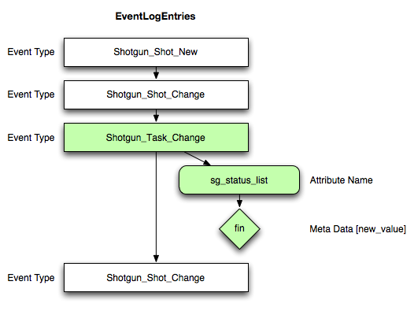

#  Event Framework
This software was originaly developed by [Patrick Boucher](http://www.patrickboucher.com) with support from [Rodeo Fx](http://rodeofx.com) and Oblique. It is now part of [ Software](http://www.shotgridsoftware.com)'s [open source initiative](https://github.com/shotgunsoftware).

This software is provided under the MIT License that can be found in the LICENSE file or at the [Open Source Initiative](http://www.opensource.org/licenses/mit-license.php) website.

**Content:**

- [Overview](#overview)
- [Advantages of the framework](#advantages-of-the-framework)
- [Writing event driven triggers](#writing-event-driven-triggers)
  - [Example use cases](#example-use-cases)
  - [How event driven triggers work](#how-event-driven-triggers-work)
  - [Polling the EventLog versus triggers](#polling-the-eventlog-versus-triggers)
  - [Event types](#event-types)
  - [Transactions and potentially missing events](#transactions-and-potentially-missing-events)

## Overview

When you want to access the  event stream, the preferred way to do so it to monitor the events table, get any new events, process them and repeat.

A lot of stuff is required for this process to work successfully, stuff that may not have any direct bearing on the business rules that need to be applied.

The role of the framework is to keep any tedious monitoring tasks out of the hands of the business logic implementor.

The framework is a daemon process that runs on a server and monitors the  event stream. When events are found, the daemon hands the events out to a series of registered plugins. Each plugin can process the event as it wishes.

The daemon handles:

- Registering plugins from one or more specified paths.
- Deactivate any crashing plugins.
- Reloading plugins when they change on disk.
- Monitoring the  event stream.
- Remembering the last processed event id and any backlog.
- Starting from the last processed event id on daemon startup.
- Catching any connection errors.
- Logging information to stdout, file or email as required.
- Creating a connection to  that will be used by the callback.
- Handing off events to registered callbacks.

A plugin handles:

- Registering any number of callbacks into the framework.
- Processing a single event when one is provided by the framework.

## Advantages of the framework

- Only deal with a single monitoring mechanism for all scripts, not one per
  script.
- Minimize network and database load (only one monitor that supplies event to
  many event processing plugins).

# Writing event driven triggers

**Note:** For more information about event driven triggers, please see our documentation at [https://github.com/shotgunsoftware/shotgunEvents](https://github.com/shotgunsoftware/shotgunEvents) .

 creates an [event log entry](topicid=SG_Administrator_ar_data_management_ar_event_logs_html) for every action that happens in . You can see these events in your  site, as well as through the  API.

In addition to seeing a detailed history of events in , you can write your own event listener Scripts to poll the EventLog and act on certain events you care about. Your Script can execute other internal Scripts in your pipeline, or it can use the  API and update other information in , or both.

## Example use cases

Here are some examples of using event driven triggers:

*   Automatically set the ‘Animation’ Task status to ’ready to start’ whenever the status for a Shot’s ‘Layout’ Task is marked as ‘final’, so the animator knows to start working on the Shot.
*   Create the appropriate Shot directories on the filesystem whenever a new Shot is created in .
*   Notify the artists assigned to a Shot if it goes ‘on hold’
*   Make a directory read-only when an Asset is finaled.
*   Copy relevant Version (or Take) information to a dailies system when the Version is added to a Review in .
*   Twitter a random quote that begins with the same letter as the third word in a Scene’s description field when the Scene grows to 25 shots.

## How event driven triggers work

Below is a simple diagram of EventLogEntries generated by . Your Script will use the API to get a list of events that have occurred since the last time it asked. It will then look at each event type (e.g., _Task_Change) and see if any of them are ones that you care about.

Once it finds an event that is interesting, it will examine the details of the event even further (e.g., what field was changed, what the value was changed to, etc. At this point you can even use the API to request more information for an entity if you need to).

If the event proves worthy, the Script will then act on the event and execute whatever code you decide needs to be executed whether its using the  API, or something in your pipeline, or both. When there are no more events to look at, it repeats the process and use the API to get a list of events that have occurred since the last time you asked.

## Polling the EventLog versus triggers

 provides a constant stream of event information and you can listen to it all and act only on the events you care about. This provides the following advantages over having  control triggers itself:

*   **Flexible** : Your trigger Scripts can run independent of . This allows your Script to interact both with  and your pipeline in any way you want. You define the rules and actions as you wish without being bound by any constraints.  doesn’t need to know anything about the event triggers you have. All it needs to do is keep generating the EventLogEntries. You control every other aspect of what happens next.
*   **Remote** : Your Scripts can run from anywhere that has network access to the  server. Your Script simply needs API access to run.
*   **Multiplicity** : You can have multiple Scripts running concurrently. Different departments may have different needs and thus be listening for different events. There’s no restriction saying that all triggers be run from the same Script. You may wish to break up your triggers into separate logical Scripts. The polling query is very light and doesn’t have any noticeable impact on performance.
*   **Accountability** : If your Scripts make changes to , they too create their own events, allowing you to see exactly what Scripts made changes.

## Event types

All internal event types follow the format **`Shotgun_[entity_type]_[New|Change|Retirement]`**. Some examples are `Shotgun_Shot_New` and `Shotgun_Asset_Change`. For more information, see the [Event types documentation](https://github.com/shotgunsoftware/shotgunEvents/wiki/Technical_Overview#event-types).

## Transactions and potentially missing events

 executes destructive database queries in transactions and only writes to the EventLog when the transaction is complete. Because of this, it’s possible that you may miss events using the “highest ID” method here. However, the [Event Trigger Framework on our GitHub site](https://github.com/shotgunsoftware/shotgunEvents) has code that should handle these situations.