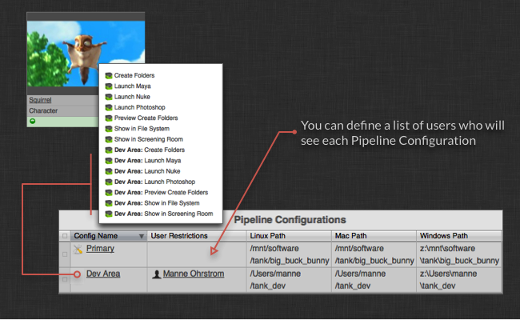
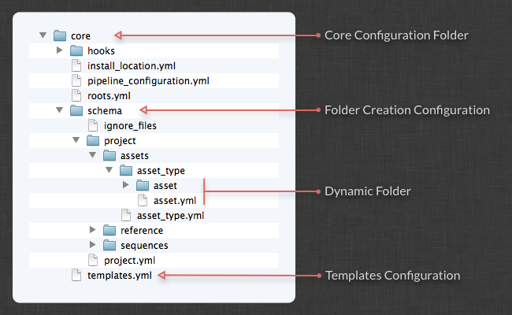
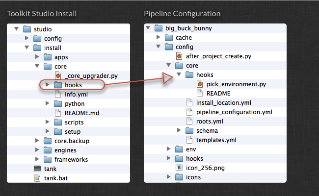
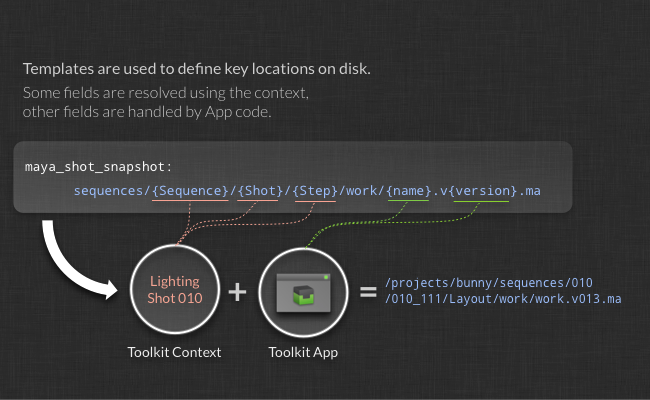
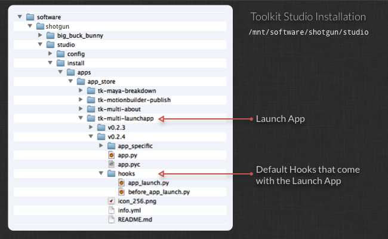

# Advanced Toolkit Administration 
  
This is an introduction to how to administer and configure Toolkit for advanced configurations.

In this topic:
- [Introduction](#introduction)
- [Using the tank command](#using-the-tank-command)
  - [Running in debug mode](#running-in-debug-mode)
  - [Running tank commands via the Tookit API](#running-tank-commands-via-the-tookit-api)
  - [Useful tank commands](#useful-tank-commands)
    - [setup_project](#setup_project)
    - [core](#core)
    - [configurations](#configurations)
    - [updates](#updates)
    - [install_app, install_engine](#install_app,-install_engine)
    - [app_info](#app_info)
    - [folders, preview_folders](#folders,-preview_folders)
    - [shell](#shell)
    - [dump_config](#dump_config)
    [Advanced tank commands](#advanced-tank-commands)
- [The Toolkit Python API](#the-toolkit-python-api)
- [Pipeline Configurations and Sandboxes](#pipeline-configurations-and-sandboxes)
  - [Running the tank command for a sandbox](#running-the-tank-command-for-a-sandbox)
  - [Using the Core API from a sandbox](#using-the-core-api-from-a-sandbox)
  - [Accessing a sandbox](#accessing-a-sandbox)
  - [Localizing a Pipeline Configuration](#localizing-a-pipeline-configuration)
  - [Deleting a cloned configuration](#deleting-a-cloned-configuration)
- [Checking for Updates](#checking-for-updates)
  - [Creating a staging sandbox](#creating-a-staging-sandbox)
- [Configuring how Apps are launched](#configuring-how-apps-are-launched)
- [Creating folders on disk](#creating-folders-on-disk)
  - [Filesystem Locations](#filesystem-locations)
  - [Renaming Toolkit Folders](#renaming-toolkit-folders)
  - [Deferred Creation and User Sandboxes](#deferred-creation-and-user-sandboxes)
- [Configuring Templates](#configuring-templates)
  - [@include syntax in the template file](#@include-syntax-in-the-template-file)
  - [Including external files in your template file](#including-external-files-in-your-template-file)
  - [Folder creation and templates](#folder-creation-and-templates)
- [Hooks](#hooks)
  - [App level hooks](#app-level-hooks)
  - [Core level hooks](#core-level-hooks)
  - [Studio level hooks](#studio-level-hooks)
  - [Project name hook](#project-name-hook)
  - [Connection hook](#connection-hook)
- [Configuring Apps and Engines](#configuring-apps-and-engines)
  - [Each App has a Location setting](#each-app-has-a-location-setting)
  - [Including files](#including-files)
  - [Configuring Template settings - file paths](#configuring-template-settings---file-paths)
  - [Using Hooks to customize App Behaviour](#using-hooks-to-customize-app-behaviour)


  
# Introduction 

Welcome to the  Toolkit Admin guide! This document explains how to work with the  Pipeline Toolkit from an administrative point of view - installing and updating apps, setting up new projects, and managing your studio configuration. The Toolkit is still relatively technical, so we imagine that the person handling the configuration and administration is a sysadmin, pipeline/tools developer or TD. Before we start getting into details, we would recommend that you read through the following document if you haven't already! It covers a number of the basic concepts and gives a brief introduction to configuration management and updates:

[An Introduction to the basic Concepts in  Pipeline Toolkit.](https://developer.shotgridsoftware.com/e95205a8/)

If you are not set up with the  Toolkit yet, you may want to read through the [Integrations User Guide](https://developer.shotgridsoftware.com/d587be80/).

# Using the tank command

When managing the  Toolkit, and using the Toolkit in general, the `tank` command is your friend! The `tank` command lets you run both administrative commands and actual Apps quickly and easily from a command shell.

By default, each new project you create gets its own, independent Core API and also its own `tank` command. Simply navigate to your Project Config location and execute the `tank` command to see all applicable commands for that project:

```
cd /mnt/software//big_buck_bunny
./tank
```
You can use the tank command in many different ways. The basic idea is that you first tell the tank command where you want to operate and then what you want to do. If you don't tell it what you want to do, it will display a list of all the available commands. If you don't tell it where you want to operate, it will try to use your current directory. You can also use the tank command to list things in .

Basic overview of how you can use the tank command:

```python
# Show all tank commands for an asset named 'piano'
> tank Asset piano

# We can also list all assets containing the phrase 'pi'
> tank Asset pi

# We can execute the built-in folder creation command for
# the piano
> tank Asset piano folders

# If the application launcher app is installed, we can launch maya
# and set the work area to the piano
> tank Asset piano launch_maya

# Alternatively, we can specify a path on disk instead of a  entity
> tank /mnt/projects/hero/assets/piano launch_maya

# Or we can change our work directory and run tank like this
> cd /mnt/projects/hero/assets/piano launch_maya
> tank launch_maya
```
## Running in debug mode

Sometimes it can be useful to see what is going on under the hood. You can pass a `--debug` flag to the `tank` command which will enable verbose output and timings, sometimes making it easier to track down problems or understand why something isn't doing what you expected it to.

## Running tank commands via the Tookit API

Most Tank commands are also fully supported to run via the API. This makes it easy to perform toolkit related maintenance operations as part of more extensive scripted workflows. For more information how to do this, see the [Core API Reference](https://developer.shotgridsoftware.com/tk-core/)

## Useful tank commands

Here's a brief list of useful tank commands that you can use when you are administering the  Toolkit.

### setup_project

Command line version of the setup project wizard found in the  Desktop. Sets up a new project with the  Toolkit. This is where you start when you have a project in  and you want to extend this to use the Toolkit. The command will guide you through the process and ask you for various pieces of information, such as which configuration to use and which project to set up.

**Re-run setup_project on the Same Project**

By default, setup_project will only list projects that haven't been set up yet. But, it's often necessary to re-run setup_project on the same project, especially while testing. This can be done by passing the --force flag, which will list all projects, with a note to identify projects that have already been set up before:

```python
> tank setup_project --force

Welcome to SGTK!
For documentation, see https://support.shotgunsoftware.com
- Running setup_project...

force mode: Projects already set up with Toolkit can be set up again.

Welcome to SGTK Project Setup!

Connecting to ...
Connecting to the App Store...

------------------------------------------------------------------
Which configuration would you like to associate with this project?

You can use the configuration from an existing project as a template for this
new project. All settings, apps and folder configuration settings will be
copied over to your new project. The following configurations were found:

   big_buck_bunny: '/mnt/software/sgtk/big_buck_bunny'
   ghosts: '/mnt/software/sgtk/ghosts'
   chasing_perfection: '/mnt/software/sgtk/chasing_perfection'

If you want to use any of the configs listed about for your new project, just
type in its path when prompted below.

You can use the Default Configuration for your new project.  The default
configuration is a good sample config, demonstrating a typical basic setup of
the  Pipeline Toolkit using the latest apps and engines. This will be
used by default if you just hit enter below.

If you have a configuration stored somewhere on disk, you can just enter the
path to this config it will be used for the new project.

[tk-config-default]:
Downloading Config tk-config-default v0.4.15 from the App Store...

This is the 'Default Config' config.

Below are all active projects, including ones that have been set up:
--------------------------------------------------------------------

[ 4] Demo Project
     Fubar is an epic story of an on-going political wa...

[ 5] Big Buck Bunny
Note: This project has already been set up.
     A killer bunny movie

[ 6] The Ghosts of Pere Lachaise
Note: This project has already been set up.
     De Films en Aiguille and ChezEddy present this year...

[ 7] Chasing Perfection
Note: This project has already been set up.
     You've seen the car commercials, the car races, and...

[ 8] What Happened to My Headphones?
     The Ryan Mayeda story

Please type in the id of the project to connect to or ENTER to exit:
```

Toolkit provides you with a project name suggestion as part of the project setup process. If you are happy with the name, you can just press Enter to continue or alternatively type in another name by hand.

If you have a special studio naming convention for projects, it is also possible to control the default value that the setup project process suggests. This is done via an advanced studio level hook - read more about it in the studio level hooks section further down in this document.

### core

Checks for Core API Updates. This will connect to the App Store and see if there is a more recent version of the Core API available. If there is, the command will ask you if you want to update.

Example output from this command:

```python
> tank core

Welcome to Sgtk!
Starting Sgtk for your current directory '/private/tmp'
- Running core...

WARNING: You are potentially about to update the Core API for multiple
projects.

Welcome to the Sgtk update checker!
This script will check if the Sgtk Core API
installed in /mnt/software/sgtk/studio
is up to date.

You are currently running version v0.13.22 of the Sgtk Platform
No need to update the Sgtk Core API at this time!
```

### configurations

Gives an overview of all the configurations for a project. This can be handy when you want to get a breakdown of the current activity for a project.

Example output from this command:

```python
> tank Project Bunny configurations

Welcome to Sgtk!
Will search across all  Projects.
- Found Project Big Buck Bunny
- Starting Sgtk v0.13.22 using configuration
/mnt/software/sgtk/big_buck_bunny.
- Setting the Context to Big Buck Bunny.
- Running configurations...

Fetching data from ...

======================================================================
Available Configurations for Project 'Big Buck Bunny'
======================================================================

Configuration 'Primary' (Public)
-------------------------------------------------------

This is the Project Master Configuration. It will be used whenever this
project is accessed from a studio level sgtk command or API constructor.

Linux Location:  /mnt/software/sgtk/big_buck_bunny
Winows Location: z:\mnt\software\sgtk\big_buck_bunny
Mac Location:    /mnt/software/sgtk/big_buck_bunny

This configuration is using a shared version of the Core API.If you want it to
run its own independent version of the Toolkit Core API, you can run:
> /mnt/software/sgtk/big_buck_bunny/tank localize

If you want to check for app or engine updates, you can run:
> /mnt/software/sgtk/big_buck_bunny/tank updates

If you want to change the location of this configuration, you can run:
> /mnt/software/sgtk/big_buck_bunny/tank move_configuration

This is a public configuration. In , the actions defined in this
configuration will be on all users' menus.

Configuration 'Dev Area' (Private)
-------------------------------------------------------

Linux Location:  /Users/manne/sgtk_dev
Winows Location: z:\Users\manne\sgtk_dev
Mac Location:    /Users/manne/sgtk_dev

This configuration is using a shared version of the Core API.If you want it to
run its own independent version of the Toolkit Core API, you can run:
> /Users/manne/sgtk_dev/tank localize

If you want to check for app or engine updates, you can run:
> /Users/manne/sgtk_dev/tank updates

If you want to change the location of this configuration, you can run:
> /Users/manne/sgtk_dev/tank move_configuration

This is a private configuration. In , only Admin 3 will see the actions
defined in this config. If you want to add additional members to this
configuration, navigate to the SG Pipeline Configuration Page and add
them to the Users field.
```

### updates

This command will go through all the environments associated with the project and check if there are more recent versions of apps or engines available. Depending on how the apps and engines have been installed, this updater may check against a local git repository, Github or the  Toolkit App Store. If a more recent version is detected, you will get asked if you want to update your setup. If any new configuration parameters have been introduced in the new version of the App, you may be prompted for values.

General syntax:

```
> tank updates [environment_name] [engine_name] [app_name]
```

The special keyword ALL can be used to denote all items in a category. Examples:

- Check everything: `tank updates`
- Check the Shot environment: `tank updates Shot`
- Check all maya apps in all environments: `tank updates ALL tk-maya`
- Check all maya apps in the Shot environment: `tank updates Shot tk-maya`
- Make sure the loader app is up to date everywhere: `tank updates ALL ALL tk-multi-loader`
- Make sure the loader app is up to date in maya: `tank updates ALL tk-maya tk-multi-loader`

### install_app, install_engine

Installs a new engine or App in one of the environments associated with the project. You can use this command to install something either from the Toolkit app store or from git.

### app_info

See a breakdown of all the apps and their key configuration settings

### folders, preview_folders

Creates folders on disk for an item.

Example output from this command

```python
Welcome to Sgtk!
Will search across all  Projects.
- Found Asset Squirrel (Project 'Big Buck Bunny')
- Starting Sgtk v0.13.22 using configuration
/mnt/software/sgtk/big_buck_bunny.
- Setting the Context to Asset Squirrel.
- Running folders...

Creating folders, stand by...

The following items were processed:
 - /mnt/projects/big_buck_bunny
 - /mnt/projects/big_buck_bunny/reference
 - /mnt/projects/big_buck_bunny/reference/artwork
 - /mnt/projects/big_buck_bunny/reference/footage
 - /mnt/projects/big_buck_bunny/sequences
 - /mnt/projects/big_buck_bunny/assets
 - /mnt/projects/big_buck_bunny/assets/Character
 - /mnt/projects/big_buck_bunny/assets/Character/Squirrel
 - /mnt/projects/big_buck_bunny/assets/Character/Squirrel/sgtk_overrides.yml
 - /mnt/projects/big_buck_bunny/assets/Character/Squirrel/Art
 - /mnt/projects/big_buck_bunny/assets/Character/Squirrel/Model
 - /mnt/projects/big_buck_bunny/assets/Character/Squirrel/Rig
 - /mnt/projects/big_buck_bunny/assets/Character/Squirrel/Surface
 - /mnt/projects/big_buck_bunny/assets/Character/Squirrel/Art/publish
 - /mnt/projects/big_buck_bunny/assets/Character/Squirrel/Art/publish/elements
 - /mnt/projects/big_buck_bunny/assets/Character/Squirrel/Art/publish/maya
 - /mnt/projects/big_buck_bunny/assets/Character/Squirrel/Art/publish/nuke
 - /mnt/projects/big_buck_bunny/assets/Character/Squirrel/Art/publish/photoshop
 - /mnt/projects/big_buck_bunny/assets/Character/Squirrel/Art/publish/photoshop/jpg
 - /mnt/projects/big_buck_bunny/assets/Character/Squirrel/Art/publish/photoshop/psd
 - /mnt/projects/big_buck_bunny/assets/Character/Squirrel/Art/reference
 - /mnt/projects/big_buck_bunny/assets/Character/Squirrel/Art/reference/artwork
 - /mnt/projects/big_buck_bunny/assets/Character/Squirrel/Art/reference/footage
 - /mnt/projects/big_buck_bunny/assets/Character/Squirrel/Art/review
 - /mnt/projects/big_buck_bunny/assets/Character/Squirrel/Art/work
 - /mnt/projects/big_buck_bunny/assets/Character/Squirrel/Art/work/images
 - /mnt/projects/big_buck_bunny/assets/Character/Squirrel/Art/work/maya
 - /mnt/projects/big_buck_bunny/assets/Character/Squirrel/Art/work/maya/workspace.mel
 - /mnt/projects/big_buck_bunny/assets/Character/Squirrel/Art/work/maya/snapshots
 - /mnt/projects/big_buck_bunny/assets/Character/Squirrel/Art/work/nuke
 - /mnt/projects/big_buck_bunny/assets/Character/Squirrel/Art/work/nuke/snapshots
 - /mnt/projects/big_buck_bunny/assets/Character/Squirrel/Art/work/photoshop
 - /mnt/projects/big_buck_bunny/assets/Character/Squirrel/Art/work/photoshop/snapshots
 - /mnt/projects/big_buck_bunny/assets/Character/Squirrel/Model/publish
 - /mnt/projects/big_buck_bunny/assets/Character/Squirrel/Model/publish/elements
 - /mnt/projects/big_buck_bunny/assets/Character/Squirrel/Model/publish/maya
 - /mnt/projects/big_buck_bunny/assets/Character/Squirrel/Model/publish/nuke
 - /mnt/projects/big_buck_bunny/assets/Character/Squirrel/Model/publish/photoshop
 - /mnt/projects/big_buck_bunny/assets/Character/Squirrel/Model/publish/photoshop/jpg
 - /mnt/projects/big_buck_bunny/assets/Character/Squirrel/Model/publish/photoshop/psd
 - /mnt/projects/big_buck_bunny/assets/Character/Squirrel/Model/reference
 - /mnt/projects/big_buck_bunny/assets/Character/Squirrel/Model/reference/artwork
 - /mnt/projects/big_buck_bunny/assets/Character/Squirrel/Model/reference/footage
 - /mnt/projects/big_buck_bunny/assets/Character/Squirrel/Model/review
 - /mnt/projects/big_buck_bunny/assets/Character/Squirrel/Model/work
 - /mnt/projects/big_buck_bunny/assets/Character/Squirrel/Model/work/images
 - /mnt/projects/big_buck_bunny/assets/Character/Squirrel/Model/work/maya
 - /mnt/projects/big_buck_bunny/assets/Character/Squirrel/Model/work/maya/workspace.mel
 - /mnt/projects/big_buck_bunny/assets/Character/Squirrel/Model/work/maya/snapshots
 - /mnt/projects/big_buck_bunny/assets/Character/Squirrel/Model/work/nuke
 - /mnt/projects/big_buck_bunny/assets/Character/Squirrel/Model/work/nuke/snapshots
 - /mnt/projects/big_buck_bunny/assets/Character/Squirrel/Model/work/photoshop
 - /mnt/projects/big_buck_bunny/assets/Character/Squirrel/Model/work/photoshop/snapshots
 - /mnt/projects/big_buck_bunny/assets/Character/Squirrel/Rig/publish
 - /mnt/projects/big_buck_bunny/assets/Character/Squirrel/Rig/publish/elements
 - /mnt/projects/big_buck_bunny/assets/Character/Squirrel/Rig/publish/maya
 - /mnt/projects/big_buck_bunny/assets/Character/Squirrel/Rig/publish/nuke
 - /mnt/projects/big_buck_bunny/assets/Character/Squirrel/Rig/publish/photoshop
 - /mnt/projects/big_buck_bunny/assets/Character/Squirrel/Rig/publish/photoshop/jpg
 - /mnt/projects/big_buck_bunny/assets/Character/Squirrel/Rig/publish/photoshop/psd
 - /mnt/projects/big_buck_bunny/assets/Character/Squirrel/Rig/reference
 - /mnt/projects/big_buck_bunny/assets/Character/Squirrel/Rig/reference/artwork
 - /mnt/projects/big_buck_bunny/assets/Character/Squirrel/Rig/reference/footage
 - /mnt/projects/big_buck_bunny/assets/Character/Squirrel/Rig/review
 - /mnt/projects/big_buck_bunny/assets/Character/Squirrel/Rig/work
 - /mnt/projects/big_buck_bunny/assets/Character/Squirrel/Rig/work/images
 - /mnt/projects/big_buck_bunny/assets/Character/Squirrel/Rig/work/maya
 - /mnt/projects/big_buck_bunny/assets/Character/Squirrel/Rig/work/maya/workspace.mel
 - /mnt/projects/big_buck_bunny/assets/Character/Squirrel/Rig/work/maya/snapshots
 - /mnt/projects/big_buck_bunny/assets/Character/Squirrel/Rig/work/nuke
 - /mnt/projects/big_buck_bunny/assets/Character/Squirrel/Rig/work/nuke/snapshots
 - /mnt/projects/big_buck_bunny/assets/Character/Squirrel/Rig/work/photoshop
 - /mnt/projects/big_buck_bunny/assets/Character/Squirrel/Rig/work/photoshop/snapshots
 - /mnt/projects/big_buck_bunny/assets/Character/Squirrel/Surface/publish
 - /mnt/projects/big_buck_bunny/assets/Character/Squirrel/Surface/publish/elements
 - /mnt/projects/big_buck_bunny/assets/Character/Squirrel/Surface/publish/maya
 - /mnt/projects/big_buck_bunny/assets/Character/Squirrel/Surface/publish/nuke
 - /mnt/projects/big_buck_bunny/assets/Character/Squirrel/Surface/publish/photoshop
 - /mnt/projects/big_buck_bunny/assets/Character/Squirrel/Surface/publish/photoshop/jpg
 - /mnt/projects/big_buck_bunny/assets/Character/Squirrel/Surface/publish/photoshop/psd
 - /mnt/projects/big_buck_bunny/assets/Character/Squirrel/Surface/reference
 - /mnt/projects/big_buck_bunny/assets/Character/Squirrel/Surface/reference/artwork
 - /mnt/projects/big_buck_bunny/assets/Character/Squirrel/Surface/reference/footage
 - /mnt/projects/big_buck_bunny/assets/Character/Squirrel/Surface/review
 - /mnt/projects/big_buck_bunny/assets/Character/Squirrel/Surface/work
 - /mnt/projects/big_buck_bunny/assets/Character/Squirrel/Surface/work/images
 - /mnt/projects/big_buck_bunny/assets/Character/Squirrel/Surface/work/maya
 - /mnt/projects/big_buck_bunny/assets/Character/Squirrel/Surface/work/maya/workspace.mel
 - /mnt/projects/big_buck_bunny/assets/Character/Squirrel/Surface/work/maya/snapshots
 - /mnt/projects/big_buck_bunny/assets/Character/Squirrel/Surface/work/nuke
 - /mnt/projects/big_buck_bunny/assets/Character/Squirrel/Surface/work/nuke/snapshots
 - /mnt/projects/big_buck_bunny/assets/Character/Squirrel/Surface/work/photoshop
 - /mnt/projects/big_buck_bunny/assets/Character/Squirrel/Surface/work/photoshop/snapshots

In total, 93 folders were processed.
```
### shell

Starts an interactive Python shell in your currently selected context. Sets up handy references to pre-initialized APIs, context, and engine objects. You can use `./tank shell` to try out Toolkit and  API code examples. The tank executable is located in the **Pipeline Configuration root** on your local machine, and looks something like:

```
> cd /my_tank_configs/project_foobar
```

Example output from this command:

```python
Welcome to SGTK!
For documentation, see https://support.shotgunsoftware.com
You are running a tank command associated with  Project 'Chasing the
Light'. Only items associated with this project will be considered.
- Found Shot moo87 (Project 'Chasing the Light')
- Starting the SG pipeline toolkit v0.15.14.
- Setting the Context to Shot moo87.
- Started Shell Engine version v0.3.3
- Environment: /mnt/software/tank/chasing_the_light/config/env/shot.yml.
- Running shell...

Welcome to SG Pipeline Toolkit Python!
2.7.1 (r271:86832, Jul 31 2011, 19:30:53)
[GCC 4.2.1 (Based on Apple Inc. build 5658) (LLVM build 2335.15.00)]
Running on darwin

- A tk API handle is available via the tk variable
- A Shotgun API handle is available via the Shotgun variable
- Your current context is stored in the context variable
- The shell engine can be accessed via the engine variable
>>>
>>> tk
<Sgtk Core vHEAD@0x105f66990 Config /mnt/software/tank/chasing_the_light>
>>>
>>> context
<Sgtk Context:   Project: {'type': 'Project', 'id': 88, 'name': 'Chasing the Light'}
  Entity: {'type': 'Shot', 'id': 1184, 'name': 'moo87'}
  Step: None
  Task: None
  User: {'type': 'HumanUser', 'id': 42, 'name': 'Manne \xc3\x96hrstr\xc3\xb6m'}
  Additional Entities: []>
>>>
>>> Shotgun
<tank_vendor.Shotgun_api3.Shotgun.Shotgun object at 0x105fb2990>
>>>
>>> engine
<Sgtk Engine 0x105feead0: tk-shell, env: shot>
>>>
```

In the example above, `./tank` is starting a Python shell for you and setting up a few variables that you'll need. This obviates a bit of groundwork on your part, such as setting up authentication and user sessions and starting the connection to your  site, by providing these handles and contexts in the above variables:

- The `tk` variable has a handle that will let you access the [Toolkit API](https://developer.shotgridsoftware.com/tk-core/core.html?highlight=context#the-toolkit-core-api).
- The `` variable has a handle to the [ API](https://developer.shotgridsoftware.com/python-api/) that's already connected to your site and is ready to query the database and other things in your [ site].
- The context variable reads your current context (Project, Shot, Asset, Pipeline Step, User, etc.). [Here is an example of an active context](https://developer.shotgridsoftware.com/tk-core/core.html?highlight=context#sgtk.Context). In this example, a context instance is used to collect a set of key fields describing the current context. We sometimes refer to the context as the current work area. Typically this would be the current Shot or Asset that someone is working on. You can see in this example that the Project is "Chasing the Light", the id is 1184, and the Shot is "moo87". There are no Pipeline Steps or Tasks assigned, but the user is Manne. You may need to know this information when writing scripts for the Toolkit API, and everything is available in this handy context variable:

```python
<Sgtk Context:   Project: {'type': 'Project', 'id': 88, 'name': 'Chasing the Light'}
     Entity: {'type': 'Shot', 'id': 1184, 'name': 'moo87'}
     Step: None
     Task: None
     User: {'type': 'HumanUser', 'id': 42, 'name': 'Manne \xc3\x96hrstr\xc3\xb6m'}
     Additional Entities: []>
```

The `engine` variable points to the currently running instance of the [shell engine](https://developer.shotgridsoftware.com/2ad59ee8/).

### dump_config

Available in core `v0.18`.

Dumps an existing environment configuration to `STDOUT` or to another file. Has the ability to dump a full or sparse representation of the config. A full representation includes default values for all settings, while a sparse representation only includes values that differ from the setting's default. The output of the command by default includes comments for each setting that note the manifest where the default value can be found and the default value if it differs from what is in the configuration. The command does not allow dumping an environment config to an existing file as a safety precaution.

Usage:

```
./tank dump_config env_name [--sparse | --full] [--no_debug-comments] [--file=/path/to/output/file.yml]
```

Example output from this command:

```python
> ./tank dump_config shot_step --sparse --file=/tmp/shot_step.yml

Welcome to SGTK!
For documentation, see https://support.shotgunsoftware.com
Starting toolkit for path '/Shotgun/configs/sparse34913'
- The path is not associated with any SG object.
- Falling back on default project settings.
- Running as user 'Toolkit'
- Using configuration 'Primary' and Core HEAD
- Setting the Context to sparse34913.
- Running command dump_config...

----------------------------------------------------------------------
Command: Dump config
----------------------------------------------------------------------

Dumping config...
```

Running the above command will write a sparse copy of the current project's `shot_step` environment file to `/tmp/shot_step.yml`.

To exclude the additional debug comments, use the `--no_debug_comments` flag.

### Advanced tank commands

Here's a brief list of advanced tank commands that you can use when you are administering the  Toolkit.

- `tank share_core` - When new projects are created, these are often created in a state where each project maintains its own independent copy of the core API. This command allows you to take the core for such a project and move it out into a separate location on disk. This makes it possible to create a shared core, where several projects share a single copy of the Core API.

- `tank attach_to_core` - When new projects are created, these are often created in a state where each project maintains its own independent copy of the core API. This command allows you to attach the configuration to an existing core API installation rather than having it maintain its own embedded version of the Core API

- `tank localize` - This command will download the Core API to a particular pipeline configuration location. This is useful if you want to test a new version of the Core API inside a Toolkit staging area. This process is described in detail further down in this document.

- `tank clear_cache` - Clears some of the Toolkit's caches. This can be useful if menu items aren't showing up inside  for some reason.

- `tank validate` - Validate the project configuration

- `tank cache_apps` - Ensure that all required app, engine and framework versions exist on disk.

- `tank switch_app` - Useful for development. Switches an app from app store mode to local or git mode or vice versa.

- `tank push_configuration` - Push the configuration contained in the current pipeline configuration to another pipeline configuration.

# The Toolkit Python API

If you are launching applications using the  Desktop, the `tank` command or using , Toolkit will automatically get added to the `PYTHONPATH` and initialize. Sometimes it is useful to manually source and run the Toolkit API. This can be done by adding the Toolkit Core API to the pythonpath and then importing it.

In each project configuration, there is a `python` folder located inside your `project_config_root/install/core/python`. Just add that location to your Python path and you can import the `sgtk` API:

```python
import sgtk

# create a Sgtk API object for a  entity
tk = sgtk.sgtk_from_entity("Shot", 123)

# Create a Sgtk API object based on a file system location
tk = sgtk.sgtk_from_path("/mnt/projects/hero/assets/chair")
```

# Pipeline Configurations and Sandboxes

A Pipeline Configuration has the same basic structure as the studio installation. Most importantly, it contains a both a `tank` command and a Toolkit API inside of `install/core/python`. The reason the API and the tank command is duplicated across each configuration is to make it easy to do development and to do work outside of the production configuration.

When a new project is set up in the  Toolkit, the project setup creates a ***Primary Pipeline Configuration*** for the project. This is always called 'Primary' and represents the main configuration for the project. You can see the configuration represented inside of  in the form of a Pipeline Configuration entity for the project. When you are doing development or are making changes to the configuration, you typically don't work in the Primary configuration - if you accidentally break something, everyone working on the project will be affected. Instead, you can clone the configuration inside of . You now have your own parallel configuration where you can make changes without anyone else being affected.

## Running the tank command for a sandbox

If you use the studio level `tank` command to run an app, it will always use the Primary configuration for a project. So if you just type in `tank Shot ABC123 launch_maya`, the  Toolkit will find the project that shot ABC123 belongs to, find its primary pipeline configuration and use those configuration settings when it launches maya. If you instead want to use the experimental configuration in your development sandbox you instead use the specific tank command inside the dev sandbox to launch maya: `~/sgtk_dev_sandbox/tank Shot ABC123 launch_maya`. The Toolkit will now use the config in the dev sandbox instead of the Primary configuration for the project.

## Using the Core API from a sandbox

Similarly, if you want run the Toolkit API from inside your pipeline configuration and not from the studio install location, you can add your dev sandbox to the `PYTHONPATH` rather than the studio python API.

## Accessing a sandbox

Inside , it is a lot simpler. Each Pipeline Configuration for a Project has a list of users that can see that Configuration. By leaving the field blank, everyone will see the configuration.

  
  
When you clone a configuration (which you can do by right clicking on it in ), you will automatically be associated with that configuration, effectively granting you exclusive visibility to the configuration. If you are developing new tools in Maya and want an artist to test them out, simply add the artist to your pipeline configuration dev sandbox and they can launch maya from your sandbox and will then have access to your work in progress tools.

## Localizing a Pipeline Configuration

By default, a Pipeline Configuration will pick up its code from the  Toolkit Studio install. The Toolkit studio installation will contain a cache of all the app and engine code that the  Toolkit is using and the Toolkit Core API installation. Each Pipeline configuration will share the Core API and the apps cache in the studio location. This is often useful because you can roll out core API updates to all projects at the same time. Simply update the studio location, and all projects will be affected.

Sometimes, however, it is useful to be able to cut off a Pipeline Configuration and make it independent. Examples when this makes sense include:

- You have a project that is about to wrap up and want to freeze updates and make sure nothing is changing.
- You have a pipeline configuration that you want to test a new version of the Toolkit Core API in.
- You are assembling a minimal Toolkit bundle that you will use when working from home.

This process of making a pipeline configuration completely independent from the studio location is called ***localizing*** the Configuration and basically means that the Core API is copied into the Pipeline Configuration. You do this by running the `tank localize` command.

Note that once you have localized a configuration, you cannot necessarily run the studio tank command anymore - the general rule is that once a project has been localized, you need to use its local tank command and Python API.

## Deleting a cloned configuration

If you don't want your cloned configuration or dev area anymore, simply delete the record and then delete the configuration from disk.

# Checking for Updates

Checking if there are any updates to apps or engines is easy! Simply run the `tank updates` command for a project. The  Toolkit will check for updates and ask you if you want to update. If there are any new parameters that don't have default values, the update script will prompt you for values. Each update presents a url link to a release notes page, in case you want to check the details of what has changed. You can exit the process at any point.

Updating the Toolkit Core API is equally easy. Just run the `tank core` command!

## Creating a staging sandbox

While it is often perfectly safe to simply run `tank updates` on your primary configuration, it is sometimes better to test things prior to rolling it out in production. In this case, you just clone the Primary pipeline configuration and run the update commands there. In the case of a Core API upgrade, make sure you localize the sandbox before running the `core` command (see above for more information about localize). Once you have verified that the update works, run it again on the primary configuration. For more detailed information how to do this, see [Managing your configuration](https://developer.shotgridsoftware.com/60762324/).

# Configuring how Apps are launched

A part of the Toolkit configuration that is often necessary to configure right after you have installed it is the app launch configuration. We have tried to make this flexible and configurable, knowing that this is an area where studios often already have customization and tools in place.

When you are launching an application (such as maya or nuke) either from inside of  or using the tank command, you are invoking an app that is responsible for starting up the application and initializing the Toolkit. This app is called `tk-multi-launchapp`.

When you setup a new project with one of the Toolkit starter configurations, it will display instructions how to change the application paths that are used with the Launch App. You are not required to use this app - if you have an alternative system in place that works just as well. The Launcher application typically carries out the following steps:

1. It figures out a context to use. The context represents the current work area. If you are right clicking a task, asset or shot inside , the context is created based on this. If you are using the tank command, it will be something you specify as part of the command line or is picked up from your current directory.

2. It then launches the application based on settings in the app configuration. You can configure the launch app in several ways - the path to the application, the command line arguments to pass, the actual code that executes the application and environment variables that needs setting prior to application launch.

3. It sets the Pythonpath to ensure that the Toolkit API can be initialized later.

4. Once the application has started, the Toolkit API is imported and initialized.

5. Finally, the engine is launched.

**Example: A more hands on example of how the  Toolkit starts up.**

The typical bootstrapping of the Toolkit happens in a couple of phases:

- The main host application is launched. This is anything that has a python interpreter. In its simplest form it is just the CPython interpreter running in a standard shell. It can also be Maya or Nuke or anything else that has a built in embedded Python interpreter.

- The Toolkit Core API is added to the `PYTHONPATH` and imported: `import sgtk`

- Now we need to figure out a context. It can either be a path on disk or a  object. We can now create a Toolkit API instance using a factory method: `tk = sgtk.sgtk_from_path("/mnt/projects/hero/assets/chair01/lighting")`. Alternatively, we can use a  Entity: `tk = sgtk.sgtk_from_entity("Shot", 123)`. When using an entity, the above code will connect to , resolve the pipeline configuration for that shot, locate the pipeline configuration on disk and load up basic settings for Sgtk such as the file system templates. No apps or engines are loaded at this point. In the case of a path lookup, it will use the file system to locate the pipeline configuration.

- Now we create a context object to represent the current work area. This can also be done either from an entity or a path: `ctx = tk.context_from_entity("Shot", 123)` or `ctx = tk.context_from_path("/mnt/projects/hero/assets/chair01/lighting")`

- Finally we start the engine. Assuming we are inside of Maya, running these commands in Maya's python interpreter, we would do this: `sgtk.platform.start_engine('tk-maya', tk, ctx)`. This would do the following:

  - Run the pick environment hook for the context. The pick environment hook will return the environment to use. The environment contains a list of all apps to load and their configrations.

  - Once the environment file has been determined, the engine is loaded into memory. This will dynamically load the engine base object and execute its init method. Once the engine is loaded, all apps are loaded the same way. Typically, as part of this, the engine will register a "" menu somewhere in the application and each app will register a series of commands with the engine. These commands become the entry points for execution later on: a user clicks something on the  menu and that triggers the app execution.

A complete example would look something along these lines:

```python
# starting up sgtk when your context is based on a path
import sgtk
path = "/mnt/projects/hero/assets/chair01/lighting"
# create a sgtk api handle
tk = sgtk.sgtk_from_path(path)
# create a context object
ctx = tk.context_from_path(path)
# start the tank engine
sgtk.platform.start_engine('tk-maya', tk, ctx)

# starting up sgtk when your context is based on a  object
import sgtk
entity_type = "Shot"
entity_id = 123
# create a sgtk api handle
tk = sgtk.sgtk_from_entity(entity_type, entity_id)
# create a context object
ctx = tk.context_from_entity(entity_type, entity_id)
# start the sgtk engine
sgtk.platform.start_engine('tk-maya', tk, ctx)
```

# Creating folders on disk

One key part of the Toolkit Configuration is the file system configuration. The  Toolkit can help create folders on disk in a consistent fashion and the creation process is driven from . Below is an overview of the core folder inside a configuration:

  

Setting up a folder configuration is relatively easy. The configuration is basically a template folder structure that you create, with some configuration files to indicate that a folder should be representing for example an asset or a shot. When you configure you file system structure, you can always use the ***folder preview*** functionality to get a listing of what will be created. This command is available both in  and in the tank command.

Start by outlining your scaffold using normal folders. If you have a level of dynamic folders in your scaffold, for example representing assets, shots or pipeline steps, just ignore that for the moment. Once you are happy with the result, add dynamic functionality step by step to each dynamic folder. This is done by adding a yml file that has the same name as the folder.

Inside the yaml file, use a special syntax to define how a folder is created. The  Toolkit supports a number of different dynamic behaviours, but the normal one is a dynamic node that represents a  entity. In this case, the configuration file could look something like this:

```python
# the type of dynamic content
type: "Shotgun_entity"

# the Shotgun field to use for the folder name
name: "{code}_{sg_prefix}"

# the Shotgun entity type to connect to
entity_type: "Asset"

# Shotgun filters to apply when getting the list of items
# this should be a list of dicts, each dict containing
# three fields: path, relation and values
# (this is std Shotgun API syntax)
# any values starting with $ are resolved into path objects
filters:
    - { "path": "project", "relation": "is", "values": [ "$project" ] }
    - { "path": "sg_asset_type", "relation": "is", "values": [ "$asset_type"] }

```

This will inform that that the dynamic folder should create folders named using two  fields on the Asset entity. Using standard  API query syntax, we also define constraints based on parent folders; only consider assets for the current project and asset type.

For a full reference of what types of nodes are supported, please [see the reference documentation](https://developer.shotgridsoftware.com/82ff76f7/).

## Filesystem Locations

When folders are created on disk via the Toolkit folder creation system, these folders are also stored and tracked in . Folders are represented as **Filesystem Location** entities in  which can be found under the administrator menu. Normally, this data is tracked behind the scenes by Toolkit and nothing that users need to look at. These Filesystem Location entities are used by Toolkit to sync and track folders on disk and can be used to recreate folder structure on disk just the way it was created when the folder creation was initially running. The Filesystem Location entity data is in turn primarily used when trying to figure out which  Entity is associated with a particular path on disk.

For performance reasons, the contents of the Filesystem Location table is cached on a user's local machine. This is in order to speed up folder/entity lookups. For expert users, the location of this cache can be customized by modifying the `cache_location` core hook. The cached local folder representation is synchronized whenever folders are created on disk and when applications are launched.

## Renaming Toolkit Folders

When you run the Toolkit folder creation, a connection is established between an entity in  and a folder on disk. Toolkit uses its folder schema configuration to generate a series of folders on disk and each of these folders are registered as a `Filesystem Location` entity in . One way to think about this is that  data (e.g. Shot and Asset names) and configuration is "baked" out into actual folders on disk and in .

Once folders have been created, you can no longer freely change the name of an entity in . If you try to rename an entity and then launch Toolkit, an error message will appear. This is to avoid losing track of the folders which are associated with a particular entity.

In order to rename a Toolkit folder, do the following:

- First rename the entity (Asset or Shot) in .
- Unregister any registered folders by running the `tank unregister_folders` command. This will remove any filesystem location entities in  tracking the relationship between the Entity and locations on disk. Note that this command does not affect any content on disk, but merely the `Filesystem Location` entities in  which point at the locations on disk. For example, if you want to unregister folders for an asset named Plant, execute the command `tank Asset Plant unregister_folders`. You will be presented with an overview of which folders will be unregistered and you will be asked to confirm the operation.
- After unregistering the folders, you have essentially "reset" the asset. No folders are now associated with the asset and by running the folder creation in  with the new name, new folders on disk will be created.
- Lastly, move any data across from the previous location on disk to the new location. Take care to ensure that any links between files are updated to point to the new location as well.

## Deferred Creation and User Sandboxes

It is also possible to set up the Toolkit folder creation so that it runs in two phases: One phase whenever someone runs the folder creation command, one phase just before an application is launched. This is a behaviour that is built into the Toolkit Application Launcher (which is simply calling a standard API method to carry out the folder creation). With deferred folder creation you can handle the following use cases:

- If you have multiple different content creation applications in your pipeline and don't want to include a complete folder scaffold for every single one of them until they are actually needed, you can set up the folder creation so that each content creation app has its own deferred subtree in the config. When a production person or admin creates folders for the Shot, it will stop just before it starts creating work areas for maya, nuke, mari etc. Then, when an application is launched these folders are created just before the application starts up.
- If you want to create user based sandboxes in the file system, these will need to be created immediately prior to the work taking place. With deferred folder creation, you can add a special user node that makes this process easy. In the templates config, you then refer the to user node as HumanUser since this is the way the  API denotes it.

For more information about deferred creation, please [see the reference documentation](https://developer.shotgridsoftware.com/82ff76f7/).

# Configuring Templates

Once you have created the file system structure it is time to configure a set of file system locations based on the folder structure above. These locations are called templates and are an integral part of the  Toolkit. The template file contains three parts: a keys section, where you define what each field means, a paths section where you can define template paths and a strings section where you can define string expressions. There are two syntaxes you can use in your file - one simple form that you can use for configs that have a single storage root and an advanced syntax that you can use for multi-root configs.

**Example: Single Root Template Format**

```yml
# The keys section contains the definitions for all the different keys that are being
# used in the Toolkit. A key is a magic token that is replaced by a value at runtime, for example
# {Shot}. The section below tells the Toolkit which data types and formats to expect for each key.
keys:
    Sequence:
        type: str
    Shot:
        type: str
    Step:
        type: str
    sg_asset_type:
        type: str
    Asset:
        type: str
    name:
        type: str
        filter_by: alphanumeric
    iteration:
        type: int
    version:
        type: int
        format_spec: '03'
    version_four:
       type: int
       format_spec: '04'
       alias: version
    timestamp:
        type: str
    width:
        type: int
    height:
        type: int
    channel:
        type: str
        filter_by: alphanumeric
    SEQ:
        type: sequence
        format_spec: '04'
    eye:
        type: str

# The paths section contains all the the key locations where files are to be stored
# by the Toolkit Apps. Each path is made up of several keys (like {version} or {shot}) and
# these are defined in the keys section above.
#
# Toolkit apps use these paths as part of their configuration to define where on disk
# different files should go.
paths:

    ##########################################################################################
    # Shot pipeline / maya

    shot_root: 'sequences/{Sequence}/{Shot}/{Step}'

    # define the location of a work area
    shot_work_area_maya: '@shot_root/work/maya'

    # define the location of a publish area
    shot_publish_area_maya: '@shot_root/publish/maya'

    # The location of WIP files
    maya_shot_work: '@shot_root/work/maya/{name}.v{version}.ma'

    # The location of backups of WIP files
    maya_shot_snapshot: '@shot_root/work/maya/snapshots/{name}.v{version}.{timestamp}.ma'

    # The location of published maya files
    maya_shot_publish: '@shot_root/publish/maya/{name}.v{version}.ma'

    ##########################################################################################
    # Asset pipeline / maya

    asset_root: 'assets/{sg_asset_type}/{Asset}/{Step}'

    # define the location of a work area
    asset_work_area_maya: '@asset_root/work/maya'

    # define the location of a publish area
    asset_publish_area_maya: '@asset_root/publish/maya'

    # The location of WIP files
    maya_asset_work: '@asset_root/work/maya/{name}.v{version}.ma'

    # The location of backups of WIP files
    maya_asset_snapshot: '@asset_root/work/maya/snapshots/{name}.v{version}.{timestamp}.ma'

    # The location of published maya files
    maya_asset_publish: '@asset_root/publish/maya/{name}.v{version}.ma'

# The strings section is similar to the paths section - but rather than defining paths
# on disk, it contains a list of strings. Strings are typically used when you want to be
# able to configure the way data is written to  - it may be the name field for a
# review version or the formatting of a publish.
strings:

    nuke_shot_version_name: '{Shot}_{name}_{channel}_v{version}.{iteration}'
    nuke_asset_version_name: '{Asset}_{name}_{channel}_v{version}.{iteration}'
```

**Example: Multi Root Template Format**

```yml
#
# The keys section contains the definitions for all the different keys that are being
# used in the Toolkit. A key is a magic token that is replaced by a value at runtime, for example
# {Shot}. The section below tells the Toolkit which data types and formats to expect for each key.
#
keys:
    Sequence:
        type: str
    Shot:
        type: str
    Step:
        type: str
    sg_asset_type:
        type: str
    Asset:
        type: str
    name:
        type: str
        filter_by: alphanumeric
    iteration:
        type: int
    version:
        type: int
        format_spec: '03'
    version_four:
       type: int
       format_spec: '04'
       alias: version
    timestamp:
        type: str
    width:
        type: int
    height:
        type: int
    channel:
        type: str
        filter_by: alphanumeric
    SEQ:
        type: sequence
        format_spec: '04'
    eye:
        type: str

# The paths section contains all the the key locations where files are to be stored
# by the Toolkit Apps. Each path is made up of several keys (like {version} or {shot}) and
# these are defined in the keys section above.
# Toolkit apps use these paths as part of their configuration to define where on disk
# different files should go.
paths:

    ##########################################################################################
    # Shot pipeline / Maya

    shot_root: 'sequences/{Sequence}/{Shot}/{Step}'

    # define the location of a work area
    shot_work_area_maya:
      definition: '@shot_root/work/maya'
      root_name: primary

    # define the location of a publish area
    shot_publish_area_maya:
      definition: '@shot_root/publish/maya'
      root_name: primary

    # The location of WIP files
    maya_shot_work:
      definition: '@shot_root/work/maya/{name}.v{version}.ma'
      root_name: primary

    # The location of backups of WIP files
    maya_shot_snapshot:
      definition: '@shot_root/work/maya/snapshots/{name}.v{version}.{timestamp}.ma'
      root_name: primary

    # The location of published maya files
    maya_shot_publish:
      definition: '@shot_root/publish/maya/{name}.v{version}.ma'
      root_name: primary

    ##########################################################################################
    # Asset pipeline / Maya

    asset_root: 'assets/{sg_asset_type}/{Asset}/{Step}'

    # define the location of a work area
    asset_work_area_maya:
      definition: '@asset_root/work/maya'
      root_name: secondary

    # define the location of a publish area
    asset_publish_area_maya:
      definition: '@asset_root/publish/maya'
      root_name: secondary

    # The location of WIP files
    maya_asset_work:
      definition: '@asset_root/work/maya/{name}.v{version}.ma'
      root_name: secondary

    # The location of backups of WIP files
    maya_asset_snapshot:
      definition: '@asset_root/work/maya/snapshots/{name}.v{version}.{timestamp}.ma'
      root_name: secondary

    # The location of published maya files
    maya_asset_publish:
      definition: '@asset_root/publish/maya/{name}.v{version}.ma'
      root_name: secondary

# The strings section is similar to the paths section - but rather than defining paths
# on disk, it contains a list of strings. Strings are typically used when you want to be
# able to configure the way data is written to  - it may be the name field for a
# review version or the formatting of a publish.

strings:

    # when a review version in  is created inside of nuke, this is the
    # name that is being given to it (the code field)
    nuke_shot_version_name: '{Shot}_{name}_{channel}_v{version}.{iteration}'
    nuke_asset_version_name: '{Asset}_{name}_{channel}_v{version}.{iteration}'
```

There are a number of configuration options available for the templates file - you can find a [complete reference here](https://developer.shotgridsoftware.com/82ff76f7/).

## @include syntax in the template file

To cut down on repetition in the templates file, you can reuse fields:

```yml
paths:
    asset_root: 'assets/{sg_asset_type}/{Asset}/{Step}'
    maya_asset_work: '@asset_root/work/maya/@maya_asset_file'

strings:
    maya_asset_file: '{name}.v{version}.ma'
```

You can also split the templates across multiple files and include files in other files. For full details, see the [reference documentation](https://developer.shotgridsoftware.com/82ff76f7/).


## Including external files in your template file

Just like you can split up your environment configuration into multiple files and then including files into other files, you can manage the templates file this way. This can be useful if you for example are setting up a global configuration that is shared across multiple projects.

You include additional files in your `templates.yml` file by using one of the include syntaxes:

```yml
# single include using a path local to the location of the current file
include: './include_file.yml'
# multiple incudes, processed in order
includes: ['./include_file_1.yml', './include_file_2.yml']
# you can also use absolute paths when including things:
include:
# files that are not recognized are skipped, so you can put paths for
# windows and linux next to each other for multi platform support:
includes: ['/foo/bar/hello.yml', 'z:\foo\bar\hello.yml']
# you can use environment variables inside of full paths too
includes: ['$STUDIO_ROOT/foo/bar/hello.yml', '%STUDIO_ROOT%\foo\bar\hello.yml']
```

An included file needs to have the same structure as the main templates.yml file, meaning that it needs to contain a `paths`, `keys` and a `strings` section. When toolkit processes includes, it will read them in recursively in a top-down, depth first order, adding data separately into three `paths`, `keys` and `paths` "buckets". If a value already exists in a bucket during this process, it will be overwritten. Once all includes have been processed, the entire configuration is validated.

Here's a quick example. Here is the main `templates.yml` file:

```yml
include: ./global_defs.yml
keys:
    name:
        type: str
        filter_by: alphanumeric
    version:
        type: int
        format_spec: "03"
paths:
    maya_shot_work: '@shot_root/work/maya/{name}.v{version}.ma'
```
And here is the contents of the included file `global_defs.yml`:

```yml
keys:
    Sequence:
        type: str
    Shot:
        type: str
    Step:
        type: str
paths:
    shot_root: sequences/{Sequence}/{Shot}/{Step}
```

It is recommended good practice (but may not always be appropriate) to keep the keys and the paths together, so that each file contains all the pieces it needs. This generally makes things easier to maintain.

## Folder creation and templates

When you create a template that refers to folders created by the folder creation system, you need to specify the fields using ' API' style notation! This a subtle detail which can be easily missed. The example above is a good illustration of this. In the folder creation, we have set up a configuration which first groups items by their asset type and then by their asset name. For example:

```
/mnt/projects/my_project/assets/character/Hero
```

We then want to create a template in the Toolkit that matches this path. In order for the  Toolkit to be able to match up the template with the path and the context, the fields need to be named the same way you would name them if you were using the  API - the asset type folder level needs to be called `sg_asset_type` since this is the field name for this field in , and the asset level folder needs to be called `Asset` (with a capital A) since this is how you refer to the asset entity type when using the  API.

# Hooks

Hooks are flexible pieces of the toolkit configuration. Normally, when you configure an app, engine or the core API, you specify a collection of parameters to define the behaviour of something. However, sometimes this is not powerful enough and this is where hooks come into play. Hooks are small chunks of Python code that you can use to customize an aspect of an app, engine or indeed the core. We have tried to design the hooks to be light weight and atomic. There are three different levels at which hooks appear in Toolkit. Read more about each level in the sections below.

## App level hooks

Each Toolkit app (and engine for that matter) comes with a collection of settings, some of which can be hooks. Each app carries a collection of default hooks which will be automatically used unless you specifically override them. Hooks are typically used to customize something very application specific. For example, for a Toolkit which loads images into Maya, the UI code and all the interaction logic is inside the app, but the little piece of business logic which actually loads the image into maya is inside a hook. This makes it possible for a studio to customize the behaviour; the default hook may simple create a standard texture node in maya, but a studio which wants to use a different node type can override the hook and thereby easily change the behaviour of the entire app - without having to rewrite any of the code!

When customizing an app hook, you typically copy the default hook from inside the hooks folder in the app into your project's hooks folder. Next, you need to update the app settings inside the environment file so that it will read your new hook and not the default one. Your custom hook will automatically inherit from the default hook provided by the app, making it easy to add tweaks and small adjustments yet keep most of the business logic in the default hook. For more information about hook inheritance, please see the [environment configuration reference](https://developer.shotgridsoftware.com/6d10dedf/.

## Core level hooks

Core hooks makes it possible to override system wide behaviour in toolkit. Core level hooks are all overridden per project, so each project needs to set up individually with overrides. (If you keep re-using the same configuration when you set up new projects, this is generally straight forward).

The Core configuration area contains a special `hooks` folder. This folder is where you can put your own implementations of certain core hooks. Core hooks are similar to the hooks that you find in apps - it is a way to extract a code snippet from the Toolkit and be able to customize it. The core API allows you to override a number of different core behaviours, including file system I/O, folder creation and validation of file system structure.

  

By default, the Toolkit will pick up the core hooks it needs from with the API folder itself. If you want to customize the behaviour, take the hook file and copy it into the `config/core/hooks` area in your configuration. Then modify the code.

For a list of what core hooks are available, have a look at the hooks folder inside the Core API. Each hook contains extensive documentation about what it does and how it can be modified.

## Studio level hooks

There are also a couple of very special hooks which we call studio level hooks. These hooks are global and will affect everything. These hooks control aspects of Toolkit which sits outside of any specific project.

## Project name hook

The project setup process will prompt you for a 'disk name' for your project and suggest a name based on the project name in , but with spaces and other non-file system friendly replaced with underscores. The disk name will be the name of the folder under which the project data and configuration is stored.

It is possible to use slashes when specifying the disk name. This will produce a project root point which spans over several folders in depth and can sometimes be useful if the studio is organizing its projects based on for example discipline (commercials, vfx, etc) or if the sheer volume of projects in a studio is so large that a single level in the file system would make it difficult to overview. Note that you should always use forward slashes ('/'). Toolkit will make the necessary adjustments on Windows.

In conjunction with the multi-level folders described above, it is also possible to customize the name that Toolkit suggests as part of the setup process. This is done in a special studio-level hook. If you want to customize this behaviour, create a file named `project_name.py` inside of the studio API location, in the `config/core` folder. This folder should already contain files such as `install_location.yml`, `app_store.yml` and `shotgun.yml`.

The `project_name.py` hook file can for example look like this:

```python
from tank import Hook
import os

class ProjectName(Hook):

    def execute(self, sg, project_id, **kwargs):
        """
        Gets executed when the setup_project command needs a disk name preview.
        """

        # example: create a name based on both the sg_type field and the name field

        sg_data = sg.find_one("Project", [["id", "is", project_id]], ["name", "sg_type"])

        # create a name, for example vfx/project_x or commercials/project_y
        name = "%s/%s" % ( sg_data["sg_type"], sg_data["name"] )

        # perform basic replacements
        return name.replace("_", "/").replace(" ", "/")
```

## Connection hook

Toolkit stores connection settings so that it can connect to its associated  instance. Sometimes it may be useful to control these connection settings in a dynamic fashion. In this case, create a hook file named `sg_connection.py` inside of the studio API location, in the `config/core` folder. This folder should already contain files such as `install_location.yml`, `app_store.yml` and `shotgun.yml`.

This hook that is called after  connection settings have been read in from the `shotgun.yml` and `app_store.yml` configuration files. It makes it easy to modify connection settings procedurally, for example set up a proxy server which depends on some external environment variable.

The following three parameters are passed to the hook:

- `config_data` is a dictionary containing the settings in the  config file that has been read in. It typically contains the keys `host`, `api_script`, `api_key` and `http_proxy`.

- `user` is the user profile which the connection information is associated with. This is an expert setting and is almost always set to `defualt`.

- `cfg_path` is the path to the configuration file from which the `config_data` was loaded.

The hook needs to return a dictionary on the same form as config_data.

If you are customizing proxy settings, note that the proxy string returned should be on the same form as is expected by the  API constructor, e.g. 123.123.123.123, 123.123.123.123:8888 or username:pass@123.123.123.123:8888.

Below is an example implementation that can be used as a starting point:

```python
from tank import Hook
import os

class CustomShotunConnection(Hook):
    """
    Allows for post processing of  connection data prior to connection
    """
    def execute(self, config_data, user, cfg_path, **kwargs):

        # explicitly set the proxy server setting
        config_data["http_proxy"] = "123.123.123.123"
        return config_data
```

# Configuring Apps and Engines

Now that we have a templates file set up that defines all the key locations on disk, we can start deciding which apps and engines to include in our configuration. As explained in other parts of the introductory documentation, the apps and engines configuration is broken down into series of ***environments***. Environments are essentially alternative configurations - and this is useful since you most likely need to provide a different suite of apps, configured differently, for example shot work and asset work. For a more complex pipeline, you may want to break it down further in departments, so that modeling have a different setup than rigging. This is all handled via environments.

The environment file defines a number of possible engines, and depending on the application you are running, one of these sections will be used. For example, if you are running maya, you tell the Toolkit to launch the 'tk-maya' engine. The  Toolkit will first determine which environment to use (based on the current work area) and then look for a `tk-maya` engine inside this environment. When it finds it, it will load in all the apps defined for this section.

Each app has a number of settings that can be configured. When you install or upgrade an app, the  Toolkit will ask you to configure any setting that doesn't have a default value. The Toolkit Apps are often designed to be reusable, so depending on how you set it up, it can be used in many different ways and workflows. You can even have the same app defined several times in the same environment, for example you may want to have two publishers appear on the maya menu - one for a rig publish and one for a model publish - both using the same publishing app but with different configurations.

**Example: An environment file**

```yml
include: ./includes/app_launchers.yml

engines:

  # 3dsmax engine
  tk-3dsmax:
    debug_logging: false
    location: {name: tk-3dsmax, type: app_store, version: v0.2.6}

    # all the registered apps for this engine
    apps:

      tk-multi-about:
        location: {name: tk-multi-about, type: app_store, version: v0.1.8}

      tk-multi-loader-texture:
        dependency_mode: false
        hook_add_file_to_scene: default
        location: {name: tk-multi-loader, type: app_store, version: v0.2.6}
        menu_name: Load Texture...
        publish_filters: []
        sg_entity_types:
          Asset: []
        single_select: true
        tank_types: [Diffuse Texture, Specular Texture]

      tk-multi-publish:
        display_name: Publish
        hook_copy_file: default
        hook_post_publish: default
        hook_primary_pre_publish: default
        hook_primary_publish: default
        hook_scan_scene: default
        hook_secondary_pre_publish: default
        hook_secondary_publish: default
        hook_thumbnail: default
        location: {name: tk-multi-publish, type: app_store, version: v0.2.5}
        primary_description: Publish and version up the current 3ds Max scene
        primary_display_name: 3ds Max Publish
        primary_icon: icons/publish_3dsmax_main.png
        primary_publish_template: max_shot_publish
        primary_scene_item_type: work_file
        primary_tank_type: 3dsmax Scene
        secondary_outputs: []
        template_work: max_shot_work

      tk-multi-screeningroom: '@launch_screeningroom'

      tk-multi-snapshot:
        hook_copy_file: default
        hook_scene_operation: default
        hook_thumbnail: default
        location: {name: tk-multi-snapshot, type: app_store, version: v0.1.15}
        template_snapshot: max_shot_snapshot
        template_work: max_shot_work

      tk-multi-workfiles:
        hook_copy_file: default
        hook_scene_operation: default
        location: {name: tk-multi-workfiles, type: app_store, version: v0.2.5}
        sg_entity_types: [Shot, Asset]
        template_publish: max_shot_publish
        template_publish_area: shot_publish_area_max
        template_work: max_shot_work
        template_work_area: shot_work_area_max

  # the maya engine
  tk-maya:
    debug_logging: false
    location: {name: tk-maya, type: app_store, version: v0.2.7}
    menu_favourites:
    - {app_instance: tk-multi-workfiles, name: File Manager...}
    - {app_instance: tk-multi-snapshot, name: Snapshot...}
    - {app_instance: tk-multi-workfiles, name: Save As...}
    - {app_instance: tk-multi-publish, name: Publish...}
    template_project: shot_work_area_maya

    # all the registered apps for this engine
    apps:

      tk-maya-breakdown:
        hook_multi_update: default
        hook_scan_scene: default
        location: {name: tk-maya-breakdown, type: app_store, version: v0.2.7}

      tk-multi-about:
        location: {name: tk-multi-about, type: app_store, version: v0.1.8}

      tk-multi-loader-1:
        dependency_mode: false
        hook_add_file_to_scene: default
        location: {name: tk-multi-loader, type: app_store, version: v0.2.6}
        menu_name: Load Assets...
        publish_filters: []
        sg_entity_types:
          Asset: []
        single_select: true
        tank_types: [Maya Model, Maya Rig]

      tk-multi-loader-2:
        dependency_mode: false
        hook_add_file_to_scene: default
        location: {name: tk-multi-loader, type: app_store, version: v0.2.6}
        menu_name: Load Shots...
        publish_filters: []
        sg_entity_types:
          Shot: []
        single_select: true
        tank_types: [Maya Anim, Maya Lighting, Maya Scene]

      tk-multi-publish:
        display_name: Publish
        hook_copy_file: default
        hook_post_publish: default
        hook_primary_pre_publish: default
        hook_primary_publish: default
        hook_scan_scene: default
        hook_secondary_pre_publish: default
        hook_secondary_publish: default
        hook_thumbnail: default
        location: {name: tk-multi-publish, type: app_store, version: v0.2.5}
        primary_description: Publish and version up the current Maya scene
        primary_display_name: Maya Publish
        primary_icon: icons/publish_maya_main.png
        primary_publish_template: maya_shot_publish
        primary_scene_item_type: work_file
        primary_tank_type: Maya Scene
        secondary_outputs: []
        template_work: maya_shot_work

      tk-multi-screeningroom: '@launch_screeningroom'

      tk-multi-setframerange:
        location: {name: tk-multi-setframerange, type: app_store, version: v0.1.2}
        sg_in_frame_field: sg_cut_in
        sg_out_frame_field: sg_cut_out

      tk-multi-snapshot:
        hook_copy_file: default
        hook_scene_operation: default
        hook_thumbnail: default
        location: {name: tk-multi-snapshot, type: app_store, version: v0.1.15}
        template_snapshot: maya_shot_snapshot
        template_work: maya_shot_work

      tk-multi-workfiles:
        hook_copy_file: default
        hook_scene_operation: default
        location: {name: tk-multi-workfiles, type: app_store, version: v0.2.5}
        sg_entity_types: [Shot, Asset]
        template_publish: maya_shot_publish
        template_publish_area: shot_publish_area_maya
        template_work: maya_shot_work
        template_work_area: shot_work_area_maya
```

## Each App has a Location setting

Each item in the environment file has a special `location` token. This token defines where the Toolkit should pick up the app code from and how it should check for new versions of the app. For example, a location token may be defined like this:

```
location: {name: tk-multi-setframerange, type: app_store, version: v0.1.2}
```

The type indicates that this app comes from the app store and that a particular version is being used. When you run the update check, the  Toolkit will connect to the app store and check if there is a version more recent than `v0.1.2` available and if this is the case, ask you if you want to upgrade. The Toolkit supports a couple of different location types, including git and github, so you can build your own apps, use git to track them and when you create a new tag in git, the update will detect this handle it correctly in the upgrades check. For detailed information, [see the reference documentation](https://developer.shotgridsoftware.com/6d10dedf/).

## Including files

You can include external files into your environment files. This is often useful when you try to centralize settings or manage overrides:

- You can organize your configuration so that you manage all the file paths to applications (maya, nuke) in one place even though you launch maya from multiple environments.

- Apps that are used with the same settings in many environments can be defined in a single place.

- You could maintain a 'central' pipeline configuration that is shared across multiple projects, and when this is updated, all projects will benefit from the update. Each project could then potentially override or extend the central config that is included if they need a particular behaviour.

- You can include files from your context as overrides, meaning that you could reconfigure settings parameters on a per-shot or per-asset basis. This is illustrated in our default config, where you can set override the paths to maya, nuke, etc. on a per shot or asset basis.

- If you use environment variables in full paths, these will be automatically expanded. Note that on linux, they must be on the `$ENV_VAR` form and not on the `${ENV_VAR}` form as this will confuse the include parser. Example: includes: `['$STUDIO_ROOT/foo/bar/hello.yml'`, `'%STUDIO_ROOT%\foo\bar\hello.yml']`.

**Example: Shot specific overrides for app launch**

Imagine you have the following environment file for the shell engine:

```yml
include: ./includes/app_launchers.yml

engines:
  tk-shell:
    debug_logging: false
    location: {name: tk-shell, type: app_store, version: v0.3.0}

    apps:
        tk-multi-launch3dsmax: '@launch_3dsmax'
        tk-multi-launchmaya: '@launch_maya'
        tk-multi-launchmotionbuilder: '@launch_motionbuilder'
        tk-multi-launchnuke: '@launch_nuke'
        tk-multi-launchphotoshop: '@launch_photoshop'
```

Each of those apps are references, defined in the `app_launchers` include file. This file contains the actual app configurations for each of the apps and looks like this:

```yml
includes:

    # first include the configuration's global settings for application paths
    - ./paths.yml

    # now include overrides - these will be loaded if they are found
    - sequences/{Sequence}/{Shot}/sgtk_overrides.yml
    - assets/{sg_asset_type}/{Asset}/sgtk_overrides.yml

launch_3dsmax:
  engine: tk-3dsmax
  extra: {}
  hook_app_launch: default
  hook_before_app_launch: default
  linux_args: ''
  linux_path: ''
  location: {name: tk-multi-launchapp, type: app_store, version: v0.2.4}
  mac_args: ''
  mac_path: ''
  menu_name: Launch 3DSMax
  windows_args: ''
  windows_path: '@3dsmax_windows'

launch_maya:
  engine: tk-maya
  extra: {}
  hook_app_launch: default
  hook_before_app_launch: default
  linux_args: ''
  linux_path: '@maya_linux'
  location: {name: tk-multi-launchapp, type: app_store, version: v0.2.4}
  mac_args: ''
  mac_path: '@maya_mac'
  menu_name: Launch Maya
  windows_args: ''
  windows_path: '@maya_windows'
```

The above file does not contain any actual paths to maya, nuke etc. Instead, these are defined in a separate file, `paths.yml`:

```yml
# maya
maya_windows: 'C:\Program Files\Autodesk\Maya2012\bin\maya.exe'
maya_mac: /Applications/Autodesk/maya2012/Maya.app
maya_linux: maya

# nuke
nuke_mac: /Applications/Nuke6.3v8/Nuke6.3v8.app
nuke_windows: 'C:\Program Files\Nuke6.3v8\Nuke6.3.exe'
nuke_linux: Nuke6.3
```

Note how the `app_launchers` file first includes the above file, but then also includes `sequences/{Sequence}/{Shot}/sgtk_overrides.yml`. This is a context specific file path, just like a template, so it will try to resolve the path against the current context. If it manages to resolve it, it will look for the path and load it in. This means that you can create a `sgtk_overrides.yml` in the shot location and override the application paths for a specific shot only:

```yml
# maya
maya_windows: 'C:\Program Files\Autodesk\Maya2012\bin\special_maya.exe'
```

Here we are using a special version of Maya for windows. The rest of the paths will be the original paths defined in the `paths.yml` file.

For more details on how the includes work, see the [reference documentation](https://developer.shotgridsoftware.com/82ff76f7/).

## Configuring Template settings - file paths

An important type of setting that many Apps use is the `template` setting. Apps needing to specify a file system location will use these settings. Apps are developed to be generic or flexible, designed to work with any file system structure or naming convention. The templates are the key piece which makes it possible for and app to be independent of the underlying file system. For more information about this, see [the concepts introduction](https://developer.shotgridsoftware.com/e95205a8/).

When configuring apps and are coming across a template setting, you will need to specify a template that contains the right set of fields. Fields can be either required or optional, with required being fields that have to be included in the template and optional meaning that a field can be part of the template, however the app will also work if that field is not defined in the template.

  

When an app runs, it will create paths from the template that you specify in the configuration. These paths are created based on the current context plus a set of fields provided by the app logic. This means that if your template contains any fields that are not part of the context nor part of the optional or required fields for the app, the app doesn't know how to set a value for that field and hence wont work. This situation is prevented by the Toolkit validating the configuration at startup.

When a template setting is validated, the Toolkit will first check the context - and compare the fields given by the context against the fields in the template. If the list of fields once the context has been compared isn't matching the required/optional parameter definition for the app, a validation error will be raised.

**Practical Example: The snapshot app**

Here's a practical example of how this works. Let's have a look at one of the Toolkit apps, the **snapshot app**:

This app uses a number of template settings. Here's one of those settings, as defined in the app settings breakdown:

- **Settings name**: template_snapshot
- **Type**: template
- **Required Template Keys**: version
- **Optional Template Keys**: name, timestamp, increment
- **Description**: A reference to a template which defines the location where snapshot backups will be stored on disk.

In addition to the fields provided by the context at runtime, this template setting requires a template that contains a `version` field. It can also contain optional `name`, `timestamp` or `increment` fields, but not any other fields. For example:

Imagine you start up Maya for a Task on a Shot. The context will then contain the following fields:

- The current project is set.
- The current entity (e.g. the Shot) is set.
- The current step is set.
- The current task is set.

When the engine starts up, it will validate the configuration. Here's some examples of what would happen with different settings for the `template_snapshot` field above:

- The template `sequences/{Sequence}/{Shot}/{Step}/work/maya/{name}.v{version}.ma` would be valid to use with the snapshot `template_snapshot` setting:

  - `Sequence`, `Shot` and `Step` are populated by the context. Note that because the context knows what the current Shot is, it can automatically figure out what the current Sequence is (since this is a parent folder in the file system).
  - There is a `version` field in the template which the App setting requires
  - There is a `name` field, something that is optional.
  - There are no other fields.

- The template `assets/{Asset}/work/maya/{name}.v{version}.ma` would be invalid because the (Shot) context does not know how to resolve the `Asset` field.

- The template `sequences/{Sequence}/{Shot}/{Step}/work/maya/{name}.ma` would be invalid because the required `version` field is missing.

- The template `sequences/{Sequence}/{Shot}/{Step}/work/maya/{name}.v{version}.{extension}` would be invalid because the field `extension` is unknown and the app does not know how to populate it.

## Using Hooks to customize App Behaviour

Another type of setting that apps use frequently is the `hook` settings type. A hook is a piece of code that the app will run as part of its normal execution. Hooks makes it possible to do very flexible customization of apps and means that some of the business logic of the app can be separated out from the actual app code.

For example, imagine a breakdown app that needs to scan the scene for various references and file inputs. For maya, we can provide a default behaviour that handles the standard reference nodes that maya provides, but what if a studio is using a custom type of reference node? Of course the studio could always take the app and fork it in github, but that's a pretty drastic action given that all they really want to change is to add their custom node type to the code that scans the scene for reference nodes.

Instead, the breakdown could implement the scene scanning code snippet as a hook. This means that it is effectively a setting, a part of the app configuration. It will come with a default value, which will handle the plain-vanilla maya case, so it will work out of the box, but it is also easy for someone to configure the  Toolkit to change this behaviour completely if they wish.

When an App is installed, the hook settings will all show up in the configuration as default. This means that the app will use the built in hook implementation that comes with the App. For example, here's the launcher app configuration as an example:

```yml
launch_maya:
  engine: tk-maya
  extra: {}
  hook_app_launch: default
  hook_before_app_launch: default
  linux_args: ''
  linux_path: '@maya_linux'
  location: {name: tk-multi-launchapp, type: app_store, version: v0.2.4}
  mac_args: ''
  mac_path: '@maya_mac'
  menu_name: Launch Maya
  windows_args: ''
  windows_path: '@maya_windows'
```

We can see that there are two hooks here, `hook_app_launch` and `hook_before_app_launch`, both using the default app implementation. These hooks have been created to allow studios to customize the launch process, set environment variables etc.

  

In order to customize these hooks, first you need to find their original implementation. Each App has a hooks folder in which any hooks will be registered. Now grab the hook you wish to customize and ***copy the hook into the hooks folder in your configuration***. Make the necessary code changes.

Now the environment configuration still has the hook set to `default` and as long as it has that, it will pick up the default hook that comes with the app and nothing else. In order to pick up your new settings, change default to the name of the python hook file you have inside the configuration hooks folder.

**Example: How to customize a hook**

Here's a quick rundown of how to customize the `hook_before_app_launch` hook for an app launcher.

1. Copy the default hook implementation. See the image above for the location of the default hook that comes with the app. Now copy this file into your configuration area, in the hooks folder. For example, if your Pipeline Configuration is located in `/mnt/software/sgtk/big_buck_bunny`, you want to copy the file to `/mnt/software/sgtk/big_buck_bunny/config/hooks/before_app_launch.py`

2. Make the necessary changes to the python code.

3. Finally, update the environment configuration to use your new code:

```yml
yaml launch_maya: engine: tk-maya extra: {} hook_app_launch: default hook_before_app_launch: before_app_launch # <-- uses custom hook! linux_args: '' linux_path: '@maya_linux' location: {name: tk-multi-launchapp, type: app_store, version: v0.2.4} mac_args: '' mac_path: '@maya_mac' menu_name: Launch Maya windows_args: '' windows_path: '@maya_windows'
```

The next time you run the launch app, your code will be executed instead of the default hook code.