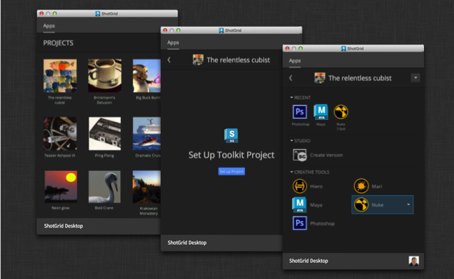
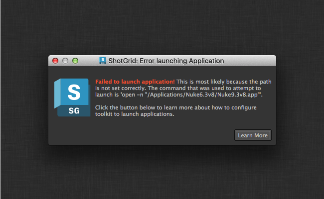
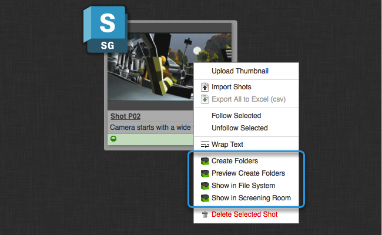
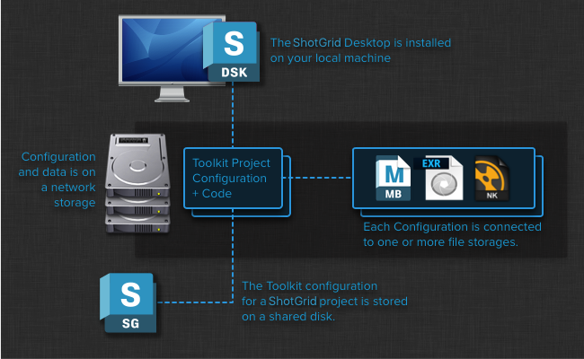

  
# Beyond your first project  
  
Here, we explain where to go once you have got your first project up and running using the  Desktop. It covers useful common questions and topics and lists useful documentation resources.    
  
_Please note that this document describes functionality only available if you have taken control over a Toolkit configuration. For details, see the  [ Integrations User Guide](https://support.shotgunsoftware.com/hc/en-us/articles/115000068574-Integrations-User-Guide#Getting%20Started%20with%20Shotgun%20Desktop)._
  
# Welcome to Toolkit  
  
Welcome to Toolkit! If you are reading this, it probably means that you have managed to successfully install your first  Pipeline Toolkit Project using the  Desktop.  
  
  
  
At this stage, we are hoping you are up and running and have something looking like the screenshot above, a project page with several application launchers. At this stage, try opening Maya, Nuke or any of the other Applications. You should find a  menu with further functionality for managing files and assets.  
  
So where do you go from here? Toolkit offers a lot of flexibility in terms of its configuration and how it works. This document tries to cover some of the next steps that we recommend that you carry out once you are up and running with your first project using the  Desktop.  
  
# Basic Configuration  
  
This section contains a collection of tweaks and useful things to configure. If you have just set up your very first Toolkit project, there are most likely a number of little tweaks and adjustments you need to do to get everything up and running properly. This section tries to explain these various steps. Please note that some of these things involve editing configuration files and going "under the hood" at the moment. If you have any questions about anything, don't heistate to reach out to our support on  `support@shotgunsoftware.com`!  
  
## Setting up Application Paths  
  
Once you have set up your first project and click one of the launch buttons to launch Maya, Motionbuilder or Nuke, it is possible that you see an error message looking something like this:  
  
  
  
In the toolkit project configuration, we store paths to the various executables that you can launch. If you are seeing the above message, it probably means that those paths are not matching your studio setup. You may also find that the wrong version of the application is being launched; for example, our default configuration may have a path to maya 2015 but your studio is running maya 2014. In this case, you also need to change the paths.  
  
In our default configurations, these paths are all stored in a single file called  `paths.yml`. In order to change a path, locate your project configuration on disk and then navigate into the config folder until you find the  `paths.yml` file:  
  
  
  
Open this file and make the necessary changes to the paths. Once you have saved the file, you need to leave the project inside of  desktop and then click back into it. (but no need to restart the entire application).  
  
**Further Reading**  
  
For more information about applications, check out the following topics:  
   
 [> The toolkit application launcher](https://support.shotgunsoftware.com/hc/en-us/articles/219032968)  

 [> Passing Command line Arguments](https://support.shotgunsoftware.com/hc/en-us/articles/219032968#Use%20Command%20Line%20Arguments%20at%20Launch)    

  
##  Integration  
  
Toolkit integrates with  and extends the traditional interface by adding special toolkit action menu items to various parts of the UI:  
  
  
  
This offers a way to launch Toolkit applications or custom tools that operate on data directly from . You can learn more about integrating with your  site in  [the Browser Integration section of the Admin Guide](https://support.shotgunsoftware.com/hc/en-us/articles/115000067493-Integrations-Admin-Guide#Browser%20Integration).  
  
## Adding Publishes to the  UI  
  
Once you have toolkit installed, it usually makes sense to make some minor adjustments to the  UI layouts. The  Pipeline Toolkit creates  _Publish Entities_ when you publish a file, so it is handy to add a  _Publishes Tab_ to key Assets such as Shot and Asset. To do this, make sure that you are logged in as an admin user. Start by navigating to an Asset or Shot and enter into  _Design Mode_:  
  
  
  
Now click the little menu triangle on one of the tabs, and select the  _Add New Tab_ action. This will bring up a Dialog UI. Call the tab  _Publishes_ and make sure that it is associated with  _Published File_ Entities:  
  
  
  
Now click  _Save_ to save your changes. You are all set!  
  
Note:  will choose a couple of default fields to pull in when you create a new tab. You may want to add a couple of extra fields for publishes. This is done by clicking the little plus button in the top-right hand corner of the spreadsheet you can see under your new publishes tab. We recommend that you add the following fields:  
  
-   **Description** - Holds a description of the changes in this publish  
-   **Created By** - The user who created the publish  
-   **Date Created** - When the publish was made  
  
If you make changes to your layouts, don't forget to save the page afterwards!  
  
## Multiple Operating Systems  
  
In some cases, you may be seeing a message popping up, informing that you  **Python cannot be found** with a link to this section of the documentation.  
  
Toolkit executes its scripts and functionality using a language called  [Python](https://www.python.org/). The  Desktop comes with a complete Python installation built in, so normally you never need to worry about this. When you set up a new Toolkit project using the  Desktop, the project will be set up by default to use the Python that comes bundled with the  Desktop. However, sometimes you may explicitly have to tell Toolkit which Python you want it to use. This can happen in if you for example:  
  
- Use an older version of the  Desktop which doesn't set up all Python defaults automatically.  
- If you have installed the  Desktop in a non-standard location on disk.  
- If you a running a manual or more complex Toolkit project setup.  
  
The path to Python is stored in configuration files which you can manually edit:  
  
  
  
In order to find the right file, first navigate to your project configuration. In there, find the tree files starting with  `interpreter_`. These contain the paths to the python interpreter for Linux, Windows and Mac ("Darwin"). These files contain the location of Python for each of the three operating systems. You now need to go in and manually add the python locations for any operating system you wish you use.  
  
If the files are blank, this indicates that you are using an older version of the  Desktop. If this is the case, simply try to update the blank files with the default Python paths. They are as follows:  
  
- Macosx (Darwin):  `/Applications/Shotgun.app/Contents/Frameworks/Python/bin/python`  
- Windows:  `C:\Program Files\Shotgun\Python\python.exe`  
- Linux:  `/opt/Shotgun/Python/bin/python`  
  
If you rather have installed the  Desktop in a non-standard location or intend to use a custom python location, please ensure that the paths in the files point to a valid Python installation. It needs to be v2.6 or above (but not Python 3!). If you want to execute UI based applications and tools, please make sure that the Python you specify has either PyQt or PySide installed and is linked up to a QT v4.6 or higher.  
  
Please also note that in order to run Toolkit on multiple operating systems, you need to specify the paths to all your desired platforms when you are running the project setup wizard. If you haven't done this, and want to add an additional operating system to a storage path or configuration location, just drop us a line on  `support@shotgunsoftware.com` and we'll be happy to walk through the steps.  
  
# Next Steps  
  
Hopefully at this point you now have the default  setup working for a  project (or test project). Applications are launching, Context menu actions and publishes are showing up in  and things are working on all your desired operating system platforms.  
  
This next section is all about what to do next -- the process of starting to take that default configuration and adjust it to work more like the rest of your studio pipeline. Toolkit is flexible and highly configurable, and we have lots of documentation. But before you get started, to see it all in action, we recommend spending a couple of minutes checking out our various walkthrough videos. These show the  Pipeline Toolkit in action, how it works inside applications such as Maya and Nuke. It also goes through basic concepts such as publishing, version control, loading etc.  
  
 [>  Pipeline Toolkit video collection](https://support.shotgunsoftware.com/hc/en-us/articles/219040678)  
  
## The anatomy of a Toolkit Project  
  
When you create a new Toolkit project, you end up with a couple of key locations.  
  
  
  
- The  Desktop and its configuration is installed on your local machine. (If you want, it is possible to relocate both the application and the configuration to a shared storage).  
- The data area where the Toolkit project will store textures, files, renders etc. This is normally on a shared storage, because you want to share this data with other users, however there are exceptions to this rule; user work areas can be stored on local (user only) storage, and integrations such as our perforce integration uses an external system to help distribute content.  
- The toolkit configuration is a fully self contained bundle, including code, apps, core API etc. This is normally stored on a shared storage so that the configuration is easily accessible by all users.  
  
Your Project configuration on disk contains a couple of different items.  
  
  
  
In the following sections we'll walk through the various parts of the project configuration folder.  
  
### Command line access  
  
As well as using the  Desktop, you can also access Toolkit via a terminal or shell. Each project that you create on disk comes with a special  `tank` command which gives you command line based access to a lot of functionality, including starting up an API session and launching applications.  
  
If you navigate to your project configuration, you can see a  `tank` and a  `tank.bat` command in the root of the configuration. Running these commands without any options will give you a list of all the commands that are supported in your current configuration, including the following useful commands:  
  
- `tank shell` - Start an interactive python shell with tk api access  
- `tank core` - Check if there are any core API updates available for this project  
- `tank updates` - Check if any of the apps or engines in this configuration has got any updates available  
  
For more details on what you can do with the  `tank` command, please see the in-depth technical documentation:  
  
 [> How to administer Toolkit.](https://support.shotgunsoftware.com/hc/en-us/articles/219033178)  
  
### Key Configuration Files  
  
The  `config` folder contains a couple of key configuration files.  
  
  
  
Toolkit comes with a folder creation system which tries to automatically create folders on disk to make sure that when you start up an application, all the necessary structure on disk exists and has been prepared on beforehand! The configuration for this can be found in the  `schema` folder indicated above.  
  
Hand in hand with this goes the Toolkit  _template system_ which makes it easy to define the various paths to files that you can configure; your publishes, work files, renders etc. This is stored in the  `templates.yml` file above.  
  
Together, these two parts of the project configuration makes it possible to adjust the various Apps that toolkit use to write out data to locations on disk which make sense are are understood by your existing pipeline. Read more about this in our advanced documentation:  

 [> Folder Configuration](https://support.shotgunsoftware.com/hc/en-us/articles/219033178#Creating%20folders%20on%20disk%20with%20Sgtk)  

 [> File system templates](https://support.shotgunsoftware.com/hc/en-us/articles/219033178#Configuring%20Templates)  
  
A toolkit configuration is essentially made up of a collection of configured  **apps and engines**. This configuration is located in the  `env` folder. If the file system configuration files discussed above define  _where_ resources should be located on disk, the environment configuration with its apps and engines define  _what_ the pipeline is supposed to do.  

 [> The official Toolkit App and Engine listing.](https://support.shotgunsoftware.com/hc/en-us/articles/219039798)  
  
### Core API platform  
  
Each project configuration uses a collection of Apps and Engines. The configuration for these apps and engines are stored in the  `env` folder inside the configuration. Toolkit will then automatically download and manage the various versions of the code needed to run these apps and engines. The code is placed inside the  `install`folder.  
  
The configuration, apps and engines are all running on top of the Toolkit Core platform. For new projects, this is also stored inside the  `install` folder. Essentially, a project configuration is fully self contained - all the necessary pieces required to run toolkit are in a single place. This also means that each project is independent and updating one project will not break another.  
  
Tech Notes: Using a shared Toolkit Core (Click to expand)  
  
### Further reading  
  
We also have a more technical document that goes through the high level concepts in the  Pipeline Toolkit and explains 'bigger picture' things. Once you have a good grasp of what Toolkit does out of the box, we recommend that you move on to this document to get a deeper undestanding of how Toolkit could be adjusted to suit your particular studio needs.  
  
 [> An introduction to the high level concepts in the Shotgun Pipeline Toolkit.](https://support.shotgunsoftware.com/hc/en-us/articles/219040648)  
  
## The pipeline Toolkit Community  
  
A part of Toolkit is its community of pipeline engineers and TDs! We are on a mission to create a vibrant, code sharing community where we all can help evolve Toolkit together to become a powerful and flexible pipeline environment.  
  
If you have any questions, or want to read through existing posts and conversations, please visit our  [public forums section](https://support.shotgunsoftware.com/hc/en-us/community/topics/200682428-Pipeline-Toolkit-Common-Questions-and-Answers).  
  
## Our Support Team  
  
Lastly, if you have any questions, ideas or concerns, never hesitate to contact us directly! We try be be practical and hands on with support and if you for example have found a bug, we can often push a bug fix update quickly to you via our app store. Just drop us a line on  `support@shotgunsoftware.com` and we'll be happy to help!
