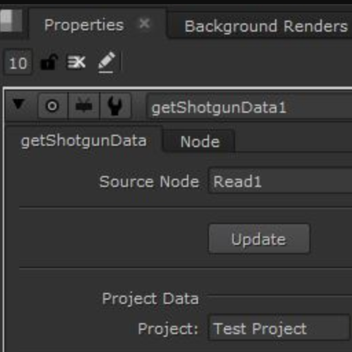
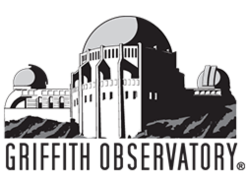

# Community Shared Integrations

Here are projects that people in the Toolkit community have been gracious enough to share. They aren't written by us at  and we can't vouch for them, but we'll definitely answer any questions we can about them. If you have a project you want added to the list, please visit our [support site](https://knowledge.autodesk.com/contact-support) for help.

### Engines

----------

| Integration | Engine | Information |
|:-----------:|:------:| ----------- |
| |  **tk-katana**  | Project URL: [https://github.com/robblau/tk-katana](https://github.com/robblau/tk-katana)   Project Contributor:  [Lightchaser Animation](https://github.com/LightChaserAnimationStudio)   Project Maintainer:    Project Description: A  Engine for Foundry's Katana   |
| | **tk-unreal** | Project URL: [https://docs.unrealengine.com/4.26/en-US/ProductionPipelines/UsingUnrealEnginewithAutodeskShotgun/](https://docs.unrealengine.com/4.26/en-US/ProductionPipelines/UsingUnrealEnginewithAutodeskShotgun/)   Project Contributor:  [Epic Games](https://epicgames.com/)   Project Maintainer:   Project Description: A  Engine for  [Unreal Engine](https://www.unrealengine.com/en-US/) |
| |  **tk-substancepainter** | Project URL:  [https://github.com/diegogarciahuerta/tk-substancepainter](https://github.com/diegogarciahuerta/tk-substancepainter)   Project Contributor:  [Factor64](https://www.factor64.com/)   Project Maintainer: [Diego Garcia Huerta](https://www.linkedin.com/in/diegogh/)   Project Description: A  Engine for Adobe's Substance Painter |
| |  **tk-substancedesigner**  | Project URL:  [https://github.com/diegogarciahuerta/tk-substancedesigner](https://github.com/diegogarciahuerta/tk-substancedesigner)     Project Contributor:  [Factor64](https://www.factor64.com/)     Project Maintainer: [Diego Garcia Huerta](https://www.linkedin.com/in/diegogh/)     Project Description: A  Engine for Adobe's Substance Designer     More info:  [ Community Forums](https://community.shotgridsoftware.com/t/substance-designer-shotgun-toolkit-engine-released/9944)|
| |  **tk-modo**  | Project URL: [https://github.com/tremolo/tk-modo](https://github.com/tremolo/tk-modo)     Project Contributor: Lutz Pälike and  [Walking The Dog](https://www.walkingthedog.be/)     Project Maintainer:     Project Description: A  Engine for Foundry's Modo |
| |  **tk-clarisse** | Project URL:  [https://github.com/diegogarciahuerta/tk-clarisse](https://github.com/diegogarciahuerta/tk-clarisse)   Project Contributor:  [Factor64](https://www.factor64.com/)   Project Maintainer:  [Diego Garcia Huerta](https://www.linkedin.com/in/diegogh/)   Project Description: A  Engine for  [Clarisse iFX](https://www.isotropix.com/products), a fully interactive CG toolset for set-dressing, look development, lighting and rendering. |
| |  **tk-natron** | Project URL:  [https://github.com/diegogarciahuerta/tk-natron](https://github.com/diegogarciahuerta/tk-natron)   Project Contributor:  [Factor64](https://www.factor64.com/)   Project Maintainer:  [Diego Garcia Huerta](https://www.linkedin.com/in/diegogh/)   Project Description: A  Engine for  [Natron](https://natrongithub.github.io/), a free and open-source node-based software application. |
| |  **tk-harmony** | Project URL:  [https://github.com/diegogarciahuerta/tk-harmony](https://github.com/diegogarciahuerta/tk-harmony)   Project Contributor:  [Factor64](https://www.factor64.com/)   Project Maintainer:  [Diego Garcia Huerta](https://www.linkedin.com/in/diegogh/)   Project Description: A  Engine for  [Toon Boom Harmony](https://www.toonboom.com/products/harmony), industry leading production animation software.|
| |  **tk-cinema** | Project URL:  [https://github.com/mikedatsik/tk-cinema](https://github.com/mikedatsik/tk-cinema)   Project Contributor: Mykhailo Datsyk   Project Maintainer: Mykhailo Datsyk   Project Description: A  Engine for  [Maxon Cinema 4D](https://www.maxon.net/en-us/products/cinema-4d/overview/), a designer-friendly toolset for modeling, animation, and rendering.   More Information:  [ Community Forums](https://community.shotgridsoftware.com/t/shotgun-toolkit-engine-for-maxon-cinema-4d/6437)| 
| |  **tk-krita** | Project URL:  [https://github.com/diegogarciahuerta/tk-krita](https://github.com/diegogarciahuerta/tk-krita)   Project Contributor: [Factor64](https://www.factor64.com/)   Project Maintainer: [Diego Garcia Huerta](https://www.linkedin.com/in/diegogh/)   Project Description: A  Engine for  [Krita](https://krita.org/en/), a free and open-source raster graphics editor designed primarily for digital painting and 2D animation.   More Information: [ Community Forums](https://community.shotgridsoftware.com/t/krita-shotgun-toolkit-engine-released/8724) |
| |  **tk-blender** | Project URL:  [https://github.com/diegogarciahuerta/tk-blender](https://github.com/diegogarciahuerta/tk-blender)   Project Contributor: [Factor64](https://www.factor64.com/)   Project Maintainer: [Diego Garcia Huerta](https://www.linkedin.com/in/diegogh/)   Project Description: A  Engine for  [Blender](https://www.blender.org/), a free and open-source 3D computer graphics software toolset used for creating animated films, visual effects, art, 3D printed models, motion graphics, interactive 3D applications, virtual reality and computer games.   More Information: [ Community Forums](https://community.shotgridsoftware.com/t/blender-shotgun-toolkit-engine-released/10773)|

### Apps

----------

| Integration | Engine | Information |
|:-----------:|:------:| ----------- |
| | **tk-maya-playblast** | Project URL:  [https://github.com/basestudio/tk-maya-playblast](https://github.com/basestudio/tk-maya-playblast)     Project Contributor: [BASE Studio](https://github.com/basestudio)     Project Maintainer:     Project Description: App to publish playblasts from Maya. See [https://goo.gl/5oJTv0](https://goo.gl/5oJTv0)|
| | **tk-multi-renderfarm**  | Project URL: [https://github.com/baitstudio/tk-multi-renderfarm](https://github.com/baitstudio/tk-multi-renderfarm)     Project Contributor: [Bait Studio](https://www.baitstudio.com/)     Project Maintainer:     Project Description: App to submit work to the farm. See [https://goo.gl/ew6mkD](https://goo.gl/ew6mkD) |
| | **tk-shotgun-publishrenders**  | Project URL: [https://github.com/janimation/tk-shotgun-publishrenders](https://github.com/janimation/tk-shotgun-publishrenders)     Project Contributor:     Project Maintainer:  [Dave Sisk](mailto:dave@janimation.com)     Project Description: This app searches the directory structure of a project to find existing published files or file sequences, then registers them in  as published files if the published file objects don't already exist. |
| | **nuke-getShotgunData**  | Project URL: [https://github.com/RicardoMusch/nuke-getShotgunData](https://github.com/RicardoMusch/nuke-getShotgunData)     Project Contributor:  [Ricardo Musch](https://www.ricardo-musch.com/)     Project Maintainer: Ricardo Musch     Project Description: Getting  data into nuke text nodes can be a bit of a pain. This node can be used to pipe that info into slates, burn-ins, or anywhere else.  |
| | **sb-shotgun-schema-introspection**  | Project URL: [https://github.com/scottb08/sb-shotgun-schema-introspection](https://github.com/scottb08/sb-shotgun-schema-introspection)     Project Contributor:  [Scott Ballard](https://www.linkedin.com/in/scottballard/)     Project Maintainer: Scott Ballard     Project Description: This is a simple Toolkit app that allows  and Toolkit developers to quickly navigate and inspect the  entities, fields and the underlying schema. |
| | **foto-multi-namingconvention**  | Project URL: [https://github.com/scottb08/foto-multi-namingconvention](https://github.com/scottb08/foto-multi-namingconvention)     Project Contributor:  [Griffith Observatory](https://www.griffithobservatory.org/)     Project Maintainer: [Scott Ballard](https://www.linkedin.com/in/scottballard/)     Project Description: This is a simple Toolkit app that allows  and Toolkit developers to quickly navigate and inspect the  entities, fields and the underlying schema. |
| | **tk-cpenv**  | Project URL: [https://github.com/cpenv/tk-cpenv](https://github.com/cpenv/tk-cpenv)     Project Contributor:  [Dan Bradham](https://github.com/danbradham)     Project Maintainer: [Dan Bradham](https://github.com/danbradham)     Project Description: This app adds support for  [cpenv](https://github.com/cpenv/cpenv), a tool that uses modules to manage software plugins, project dependencies and environment variables.     More Information: [ Community Forums](https://community.shotgridsoftware.com/t/rez-support/7350/7) |
| | **rtm-tk-hiero-shotgunDropper**  | Project URL: [https://github.com/RicardoMusch/rtm-tk-hiero-shotgunDropper](https://github.com/RicardoMusch/rtm-tk-hiero-shotgunDropper)   Project Contributor:  [Ricardo Musch](https://www.ricardo-musch.com/)   Project Maintainer: Ricardo Musch   Project Description: This app allows you to drop Versions and playlists from  into Hiero.   More Information: [ Community Forums](https://community.shotgridsoftware.com/t/release-shotgundropper-for-hiero/4183) |
