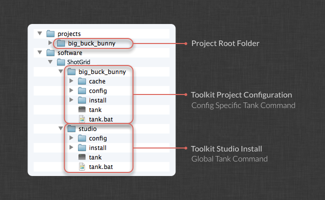

# Configuration Staging and Rollout

This document explains best practices for how to safely roll out changes to your production pipeline. It explains how you can create a staging sandbox, which is a copy of your production configuration, update this sandbox and do testing and then finally push your changes to the production config.  

_Please note that this document describes functionality only available if you have taken control over a Toolkit configuration. For the default setup, please see  [ Integrations Admin Guide](https://developer.shotgridsoftware.com/8085533c/)._

# Introduction

This document outlines how to manage your Toolkit configuration. Toolkit contains several utilities and tools that lets you safely manage your configuration and test upgrades and changes in a safe and sandboxed environment before rolling them out to the entire production.

In this document, we'll describe how to:

-   Safely upgrade the Toolkit Core API.
-   Upgrading your Apps and Engines.
-   Various ways to manage your config across multiple projects.
-   Go through Toolkit's  _Clone_  and  _Push_  functionality that allows you to safely test upgrades and changes without disrupting production.
-   How to work with  `git`  source control and Toolkit.

# Basics of configuration management

Each Toolkit Project has one or more configurations associated with it. The configuration contains all the settings that the project needs, including file system locations (templates), engines apps, etc. In Toolkit, each project is independently configurable. This means that different projects can live side-by-side safely, and upgrading one project will not affect another.

If you are working with a large number of projects, this may become cumbersome and we offer several ways to make this process easy, safe and streamlined.

In , each project has a number of  **Pipeline Configurations**. When a project is first set up with Toolkit, a Pipeline Configuration called  `primary`  is created. The pipeline configuration entity in  points at a location on disk where the Toolkit configuration can be found.

During the course of a project, you often need to make changes to the configuration. This can be tweaks to the configuration, or perhaps you need to add additional apps or engines. We also release new app versions frequently and we recommend that you use the latest versions if possible.

While it is possible to upgrade your  _primary_  project configuration straight away, this can be risky; since this configuration is used by everybody on the project, introducing a problem will affect everyone. A better approach is to create an isolated version of the configuration that a select group of people have access to. In this safe environment, upgrades, configuration changes and development can happen without impacting the rest of the production. Once the changes have been tested, they can be safely and confidently pushed to the primary configuration.

This process is called  _cloning_  and means that you make a personal copy of the primary configuration that only you (and other people you invite) have access to the clone. In here you can make changes safely and once you are happy you can push these changes back to the primary configuration.

## Cloning your Configuration

Once you have set up Toolkit and configured a project, the setup will look something like this:



There is a  _studio_  install which holds the Core API for all projects. This  _studio_  location also contains a  `tank` command and a Toolkit Python API you can use to access any of your Toolkit-enabled  projects.

In addition to this, there is a configuration folder for each project. This folder contains all the settings for that project. It also contains a  `tank`  command (and a Python API) which specifically operates on this configuration. When you are using this `tank` command or API code, you can strictly only operate on this configuration.

When a new project is set up, a  _Primary_  configuration is created. This is the configuration that Toolkit will use by default for the project. In addition to the primary configuration, you can create additional configurations for a project. These can exist in parallel and are useful if you for example want to privately test some modifications, upgrade some apps or do development without impacting the entire team. Additional configurations are created by a process called  _cloning_, a process where a configuration is copied to a new location.

Once you have cloned your configuration, your setup may look something like this:


In addition to the studio level  `tank`  command and your primary project configuration  `tank`  command, you now have a new pipeline configuration which has its own  `tank`  command. If you run this  `tank`  command, you will operate exclusively on the configuration located in the staging sandbox. So if you want to test out some new things in Maya, you can simply navigate to your cloned sandbox, run  `./tank Shot xyz launch_maya`  and the  menu which appears in Maya will reflect the configuration inside of your staging sandbox rather than your Primary configuration.

Note that the studio level  `tank`  command always uses the Primary config, so the only way to access a cloned configuration is by navigating to its location and using the  `tank`  command that is located in that folder. In , you can assign a specific set of users to a pipeline configuration entry, and any users that are associated with a configuration will now see menu entries appear in addition to those coming from the Primary config:


### Creating a Cloned Configuration

In order to create a staging sandbox where you can safely test your upgrades, navigate to the pipeline configurations for your project in  and right click on the Primary configuration. An option to clone your configuration will appear:


Once you click it, you'll be presented with a dialog where you specify the path on disk where you want this new configuration to be located. If you are running a multi OS setup, make sure to put in paths for all relevant platforms.


When you press ok, Toolkit will copy the configuration across and set up the clone. It will also associate your  user with this configuration, so as soon as you have created your clone, you will see new menu items appearing inside .

### Pushing changes from your staging sandbox to Primary

Once you have applied the relevant updates and run any testing that you deem is necessary, you can push back your changes into the production configuration by executing the  `tank push_configuration`  command. This will transfer all the changes you have made in your staging sandbox to your Primary configuration.

Please note that your current configuration is moved to a backup location when you run the `push_configuration` command. If you accidentally push or if there is a problem with the push, you can roll back simply by taking the content in the backup folder and copying into the config folder.

By default, this command will copy a collection of files into the  `config`  folder in the target pipeline configuration. If you are using unix and would like a more atomic update, you can add a  `--symlink`  flag to the  `push_configuration`  command. This will turn the  `config`  folder in the target pipeline configuration into a symbolic link which makes it easier to upgrade without running the risk of having configuration mismatches in currently running sessions.

### Refreshing an old cloned configuration

If you have a old dev or staging sandbox set up, but it is out of date and you need to sync its contents with the latest production configuration, you do this by running the  `push_configuration`  command for the primary configuration:
```shell
tank push_configuration

Welcome to the  Pipeline Toolkit!
For documentation, see https://support.shotgunsoftware.com
Starting Toolkit for your current directory '/tmp'
- Using configuration 'Primary' and Core v0.14.52
- Setting the Context to Empty Context.
- Running command push_configuration...

----------------------------------------------------------------------
Command: Push configuration
----------------------------------------------------------------------

This command will push the configuration in the current pipeline configuration
('Primary') to another pipeline configuration in the project.

Your existing configuration will be backed up.

The following pipeline configurations are available to push to:
 - [324] Staging Sandbox (/my/staging/sandbox)

Please type in the id of the configuration to push to (ENTER to exit): 324
Hold on, pushing config...
Checking if there are any apps that need downloading...
Push Complete!

Your old configuration has been backed up into the following folder:
/my/staging/sandbox/config.bak.20140108_093218
```
Note how we are pushing from the primary project config to the staging sandbox. We do this by running the  _primary_  configuration's `tank` command. If you have multiple sandboxes set up, it is also possible to push data between those.

### Deleting a cloned configuration

If you want to delete a cloned configuration, simply delete the entry in  and remove the folder from disk.

## Getting latest apps and engines

Inside your staging sandbox (or in any other config), you can run the  `tank updates`  command in order to check if there are any app updates available. This command has got rudimentary filters that you can use if you only want to check certain areas of your configuration:

```shell
----------------------------------------------------------------------
Command: Updates
----------------------------------------------------------------------

This command will go through your current configuration and check if there are
any updates available. If there are updates, you will be asked if you want to
perform an upgrade. If settings has been added to the new version that you are
installing, you may be prompted to specified values for these.

Running this command with no parameters will check all environments, engines
and app. This may take a long time. You can also run the updater on a subset
of your installed apps and engines.

General syntax:
> tank updates [environment_name] [engine_name] [app_name]

The special keyword ALL can be used to denote all items in a category.

Examples:

Check everything:
> tank updates

Check the Shot environment:
> tank updates Shot

Check all maya apps in all environments:
> tank updates ALL tk-maya

Check all maya apps in the Shot environment:
> tank updates Shot tk-maya

Make sure the loader app is up to date everywhere:
> tank updates ALL ALL tk-multi-loader

Make sure the loader app is up to date in maya:
> tank updates ALL tk-maya tk-multi-loader
```
## Upgrading the Toolkit Core API

This section explains how you can use a clone staging sandbox configuration to safely upgrade the Toolkit Core API. If you haven't got a staging sandbox prepared yet, just follow the instructions in the previous section!

If your staging sandbox was cloned from a pipeline configuration using a  [shared studio Core API](https://developer.shotgridsoftware.com/b12f2510/#how-do-i-update-my-pipeline-configuration-to-use-an-existing-shared-core), you'll want to update your sandbox to use it's own unique Core API code. This is called "localizing" the core and can be done by navigating to your staging sandbox and running  `tank localize`. This command will copy the Core API from the studio install, into your sandbox, making it possible to run and test a different version of the Core API later on.

_The default behavior in Toolkit is to localize the core by default. If you haven't explicitly created a shared studio core previously, it's safe to assume your core is localized already._
```shell
cd /my/staging/sandbox
./tank localize

Welcome to the  Pipeline Toolkit!
For documentation, see https://support.shotgunsoftware.com
Starting Toolkit for your current directory '/my/staging/sandbox'
- Using configuration 'Staging Sandbox' and Core v0.14.52
- Setting the Context to Empty Context.
- Running command localize...

----------------------------------------------------------------------
Command: Localize
----------------------------------------------------------------------

This will copy the Core API in /mnt/software/shotgun/studio into the Pipeline
configuration /my/staging/sandbox.

Do you want to proceed [yn]y

Localizing Core: /mnt/software/shotgun/studio/install/core -> /my/staging/sandbox/install/core
Copying Core Configuration Files...
Localizing Apps: /mnt/software/shotgun/studio/install/apps -> /my/staging/sandbox/install/apps
Localizing Engines: /mnt/software/shotgun/studio/install/engines -> /my/staging/sandbox/install/engines
Localizing Frameworks: /mnt/software/shotgun/studio/install/frameworks -> /my/staging/sandbox/install/frameworks
The Core API was successfully localized.

Localize complete! This pipeline configuration now has an independent API. 
If you upgrade the API for this configuration (using the 'tank core' command), 
no other configurations or projects will be affected.
```
Now we are no longer sharing the Core API with the studio location but are running our own, independent version. We can now go ahead and perform a standard Core API upgrade, again using our local tank command:
```shell
cd /my/staging/sandbox
./tank core
```
Toolkit will check if there is a new version available and offer you to download and install it.

Once you have updated the Core API, make sure to test the installation. Launch some apps, either using the `tank` command in the sandbox or using the special menu entries in . Do a basic run-through of your pipeline and perform the tests you deem necessary.

Finally, once you are happy, it is time to go ahead and update the studio version of the Core API. Note that in the typical Toolkit setup, the Core API is shared between all projects, so by running the `tank core` command from your studio location  `tank`  command, you are updating the Core API for all projects.

# Managing the Project Lifecycle

Each Toolkit project contains an independent configuration which holds all the settings for that project. If you are managing a lot of projects, this means that you need to manage a lot of configurations. For this reason, Toolkit contains a number of different tools and ways to handle configurations, both for individual projects and for the studio lifecycle and configuration evolution. This section outlines some of those best practices and shows practical steps for how to set up your config.

Depending on the needs of your studio, different levels of complexity may be relevant. Toolkit offers three different approaches and we'll explain each one of them in detail:

-   The most straightforward approach is to copy the config from the previous project when you set up a new project. This is good if you are a small studio and don't have a large number of projects.
-   If you have a higher project turnover and if you run more than one project in parallel, the next level of integration that we recommend involves `git` version control. Toolkit has native support for git and once you are up and running with a git-based workflow you have a single configuration for your studio and are tracking all the changes you are making to that configuration over time. Each project can safely pull in configuration changes as and when they need to.
-   If you are running a large-scale facility, it may be worth considering a setup where a single configuration is directly connected to all the currently-active projects in the studio. A single change to this configuration will have an immediate impact on all the projects.

In the following sections we'll describe the different approaches in detail.

## Inheriting the config from your previous project

This is the simplest approach to configuration management. For the very first time you set up a project with Toolkit, you download our default configuration. You then set up that first project to match your pipeline settings, filesystem locations, etc. When the project is running, you run commands such as `tank updates` to update the app versions you are running.

When your second project comes around, you don't want to start with the default config again - instead, during the project setup phase, pick the config from your first project as the starter for your new project. This means that all the changes, tweaks and improvements you did for the first project will be taken advantage of in the second project as well. For the third project, use the second project's config etc.


This is a very simple way to gradually evolve the configuration over time. Changes and improvements will flow from project to project in an ad hoc fashion. The first time you run the `setup_project` command, just hit enter when the setup process prompts for the configuration to use. This will download and install the default configuration.  

For your second project, you will be presented with a list of paths to configurations for previous projects. Choose one of these paths and enter that when the setup process prompts for a config. This will copy that configuration to the new project:
```
Welcome to the  Pipeline Toolkit!
For documentation, see https://support.shotgunsoftware.com
- Running command setup_project...

----------------------------------------------------------------------
Command: Setup project
----------------------------------------------------------------------

Welcome to the  Pipeline Toolkit Project Setup!

Connecting to ...
Connecting to the App Store...

------------------------------------------------------------------
Which configuration would you like to associate with this project?

You can use the configuration from an existing project as a template for this
new project. All settings, apps and folder configuration settings will be
copied over to your new project. The following configurations were found:

   My very first project: '/mnt/software/shotgun/first_project/config'

If you want to use any of the configs listed about for your new project, just
type in its path when prompted below.

You can use the Default Configuration for your new project.  The default
configuration is a good sample config, demonstrating a typical basic setup of
the  Pipeline Toolkit using the latest apps and engines. This will be
used by default if you just hit enter below.

If you have a configuration stored somewhere on disk, you can enter the path
to this config and it will be used for the new project.

You can also enter an url pointing to a git repository. Toolkit will then
clone this repository and base the config on its content.

[tk-config-default]: /mnt/software/shotgun/first_project/config
```
## A studio configuration in git source control

Limitations with the first approach include the fact that the projects are not connected to each other. If you have 10 projects and you all need to update them because a critical bug fix has been released, you would have to manually go through each project and run the  `tank updates`  command.

One way to resolve this is to create a master configuration and store it in git source control. Whenever you create a new project, simply type in the path to this git repository in the setup project dialog and Toolkit will clone it for you. Now all the projects are connected to the same "studio master" config. If you have made some good changes to a project configuration, you can commit them and push them to the studio master. Other projects can then easily pull these down. You also retain a history of all your changes via git.

    What is Git?


The basic idea is that you set up a git repository which holds the git configuration. Whenever you run `tank setup_project`, you specify the git url to this repository (for example  `username@someserver.com:/studio_config.git`) and the setup process will clone the repository so that the new project becomes a repository connected to the main studio repository. Once they are connected you can push and pull changes, and work in branches for finer granularity.

### Setting up your studio config repository

Before you do anything else, you need to create a studio config repository. This section shows how to take an existing toolkit configuration and creating a git repository from that.

First, you need to go to your git server and create a repository. This process may be different depending on your setup. If you are using something like GitHub, you would start a web browser and navigate to github.com. If you have access to the server you may do something like  `git init --bare`. In our example, we assume that the git repository you create is called  `username@someserver.com:/studio_config.git`.

Now move the  `config`  folder of the project you want to use to seed your repo with into a  `config.bak`  location:
```shell
cd /project_configs/studio_config
mv config config.bak
```
Clone your initialized git repository into the  `config`  location of your project that you want to base the studio config on. Once you have run the clone command, you will have an empty  `config folder`  which is also a git repository:
```shell
cd /project_configs/studio_config
git clone username@someserver.com:/studio_config.git config
```
Copy all the files from your `config.bak` location back into the `config` folder. Once done, you can delete the empty `config.bak` folder. Your config files are now inside the git repository and we need to add them, commit them and push them to the server. But before doing that, we need to do some house keeping to handle some Toolkit system files correctly. In the  `config`  folder, create a  `.gitignore`  file and add the following lines to it:
```shell
install_location.yml
pipeline_configuration.yml
```

Now git will ignore those two system files. We can go ahead and add the rest of the files in the configuration, commit them and push them to the studio repository.

```shell
git add --all
git commit -am "initial commit of our studio config!"
git push
```
### Creating a new project from git

When you create a new project, simply specify a valid git url when the setup process prompts you to enter the path to the configuration to use. Following our example above, we would enter `username@someserver.com:/studio_config.git`. As part of the project setup process, Toolkit will clone this repository into the `config` folder of your new project configuration. This means that you can later on go into this config folder and run git commands. Note that any cloned pipeline configurations will also clone the git repository and will work seamlessly.

### Making changes to a project

Whenever you have made changes to your primary config, you can simply go to your `config` folder and then run `git diff`, `git commit` and `git push`. This would push your changes to the studio configuration that you cloned your project config from.

### Updating a project to have the latest version

Alternatively, if you have updated your studio level config with some changes and you want to pull those down to your project, just go to your `config` folder and run a `git pull`.  **Important**: Note that once you have done this, make sure you run a `tank cache_apps` to ensure that all the app versions that your changed config requires are present in the system!

### Advanced git usage: Branches

The default behavior in Toolkit is a simple clone operation when a new project is created. The project will be using the git `master` branch. For a more advanced setup, if you for example want to keep certain configuration changes for a project private and don't share them with other projects, you can set up a git branch after the project has been created. You then commit to this branch. The changes you want to push to the studio configuration can be merged with the local master branch for the project and then pushed.

### Advanced git usage: Batch deployment

Since Toolkit keeps a list of all the different configurations for a  site via its pipeline configuration entity, it is possible to iterate over this list and execute a `git pull` command for each of the items, effectively running a batch update on all projects. This functionality is not currently part of Toolkit out of the box, but can be scripted using Python and the  Python API.

## A global configuration using includes

The git based approach above handles independent project configurations which are connected via git: Updates are not automatically reflected across projects but will have to be pulled and pushed.

For a fully centralized configuration, where the configuration truly resides in one place and where a single change immediately reflects a group of projects, you will need to make use of the  `@include`  functionality in the Toolkit configuration. This makes it possible to create references so that each project configuration points at a central location where the actual configuration is being kept.


The  `@include`  syntax allows you to chain together multiple files. For example, if you have a file  `/tmp/stuff.yml`, which contains the following content:
```
# paths to maya
maya_windows: 'C:\Program  Files\Autodesk\Maya2012\bin\maya.exe'
maya_mac: '/Applications/Autodesk/maya2012/Maya.app'
maya_linux: 'maya'

# a configured toolkit app
file_manager:
  allow_task_creation: true
  file_extensions: []
  hook_copy_file: default
  hook_filter_publishes: default
  hook_filter_work_files: default
  hook_scene_operation: default
  launch_at_startup: false
  launch_change_work_area_at_startup: false
  location: {name: tk-multi-workfiles, type: app_store, version: v0.4.8}
  saveas_default_name: scene
  saveas_prefer_version_up: false
  sg_entity_type_filters: {}
  sg_entity_types: [Shot, Asset]
  task_extra_display_fields: []
  template_publish: null
  template_publish_area: null
  template_work: null
  template_work_area: null
```
As you can see above, you can create include definitions at several different levels - in the case above, we have an app definition and three strings values. These can then be referenced from an environment file:
```
includes: ['/tmp/stuff.yml']

engines:

  tk-maya:

    # First all our app definitions
    apps: 
        # normally, we would have the entire set of configuration parameters at this point.
        # because we are using an include, we can reference an entire sub-section of configuration
        # using the @ keyword: 
        tk-multi-workfiles: '@file_manager'

        # alternatively, for simple values, we can use them as parameter values for apps: 
        tk-maya-launcher:
          mac_path: '@maya_mac'
          linux_path: '@maya_linux'
          windows_path: '@maya_windows'
          location: {name: tk-multi-launchapp, type: app_store, version: v0.2.19}

    # and after the apps section follows specific configuration options for the engine
    location: {name: tk-maya, type: app_store, version: v0.4.1}
    menu_favourites:
    - {app_instance: tk-multi-workfiles, name:  File Manager...}
    template_project: null
    use_sgtk_as_menu_name: false
```
Furthermore, you can read in several include files, one after the other. If the same include definition exists in two different files, the most recently read file will take precedence. We could extend our example environment above:
```
includes: 

    # first include a global config file which contains all the studio level app definitions
    - '/studio/configurations/studio_apps.yml'

    # now we can include an include containing overrides, for example based on project type.
    # if the global config contains an entry named file_manager and the vfx_apps.yml contains
    # the same, the vfx_apps definition will be used.
    - '/studio/configurations/vfx_apps.yml'

engines:

  tk-maya:    
    apps: 
        tk-multi-workfiles: '@file_manager'

    location: {name: tk-maya, type: app_store, version: v0.4.1}
    use_sgtk_as_menu_name: false
```
With the approach just shown, it is possible to have a set of studio defaults which can be overridden by project type defaults which in turn can be overridden by specific project settings. You can either do it on the app level, as shown in the example above, or an engine level, as shown in the next section.

### Best practices when setting up a global config

There are several ways to set up a global configuration. Our recommended best practices approach for setting this up breaks the configuration down on a per engine basis. Each environment file is completely empty and references engines (and apps) defined in separate files. This makes it easy to tweak and reconfigure things - one engine at a time.

Each of these include files are in a standard form, named after the engine. For example, if you have a Maya engine, an include file would contain just the engine and its apps. Its top level entry would simply be named  `maya`:
```yaml
maya:
    apps:
      tk-maya-breakdown:
        hook_multi_update: default
        hook_scan_scene: default
        location: {name: tk-maya-breakdown, type: app_store, version: v0.2.13}
      tk-multi-loader2:
        action_mappings:
          Maya Scene: [reference, import]
          Photoshop Image: [texture_node]
          Rendered Image: [texture_node]
        actions_hook: '{self}/tk-maya_actions.py'
        entities:
        - caption: Assets
          entity_type: Asset
          filters:
          - [project, is, '{context.project}']
          hierarchy: [sg_asset_type, code]
        filter_publishes_hook: '{self}/filter_publishes.py'
        location: {name: tk-multi-loader2, type: app_store, version: v1.0.6}
        menu_name: Load
        publish_filters: []
        title_name: Loader
      [... additional app entries here ...]

    debug_logging: true
    location: {name: tk-maya, type: app_store, version: v0.3.10}
    menu_favourites:
    - {app_instance: tk-multi-workfiles, name:  File Manager...}
    - {app_instance: tk-multi-snapshot, name: Snapshot...}
    - {app_instance: tk-multi-workfiles, name:  Save As...}
    - {app_instance: tk-multi-publish, name: Publish...}
    template_project: shot_work_area_maya
    use_sgtk_as_menu_name: false

# each include file has a framworks section containing all the frameworks needed for
# all apps in the file
frameworks:
  tk-framework-shotgunutils_v1.x.x:
    location: {name: tk-framework-shotgunutils, type: app_store, version: v1.0.8}
```
In your studio, you most likely don't have a single maya setup, but may have a number of different ones for different departments and types of things. We recommend that you set up a maya include file for each of these ones, organized in a file hierarchy. Each of these files has a top level  `maya`  entry just like the file above.


Now each project will contain a number of environments. Each of these environment files will be a list of engine includes, linking that specific environment to a collection of engine and app setups. You can set up one (or several) default project configurations for your studio, all containing includes like this, thereby ensuring that the actual app and engine payload is completely contained within the include files and therefore global. If you make a change to your global include files, all projects will be affected. With this setup, your environment files will then be on the following form:
```yaml
includes:     
    - '/studio/configurations/maya/asset.yml'
    - '/studio/configurations/nuke/asset.yml'
    - '/studio/configurations/houdini/generic.yml'

engines:
  tk-maya: '@maya'
  tk-nuke: '@nuke'
  tk-houdini: '@houdini'

# we don't need any frameworks here because there are no apps or engines defined
frameworks: null
```
If you wanted to break out of the above setup and start defining some project specific entries, you would simply replace  `@maya`  with a series of app and engine definitions in the environment file itself.

### Managing a global configuration

Managing a global configuration is more involved than managing a normal one. Because you have effectively combined a number of projects into a single file structure, running the  `tank updates`  command from any project and choosing to update an app version will affect all other projects, so proceed with some caution here.

Furthermore, the standard clone workflow won't work out of the box, since what you are cloning is the project configuration, which now only contains includes.

For safe testing and maintenance, we recommend storing the global configuration in source control (e.g.  `git`) and do updates in a separate test area with a special test project. Once the quality control passes, commit the changes and pull them down into the actual global configuration.
