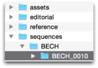
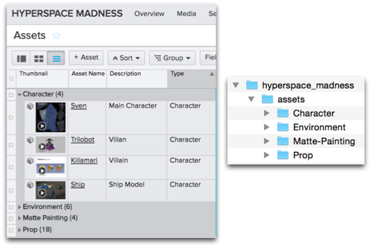
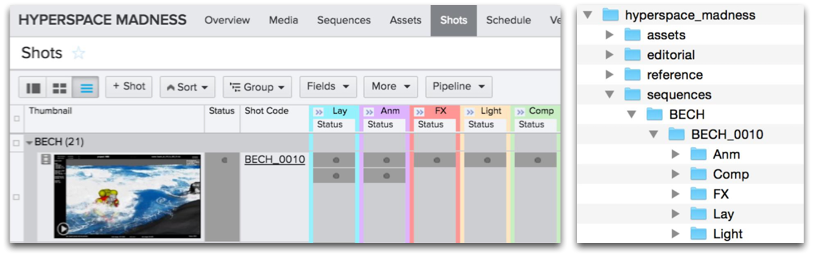
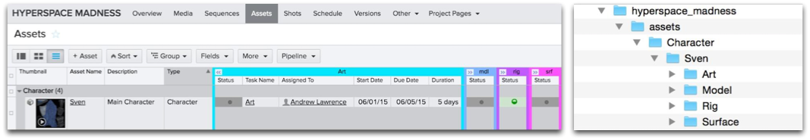
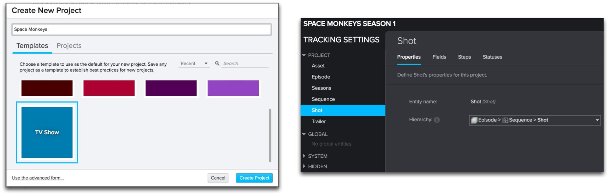
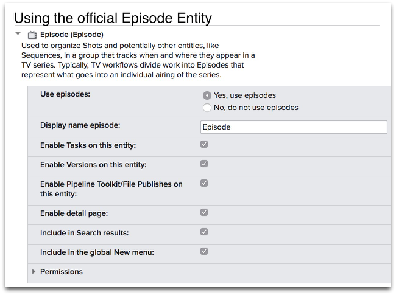
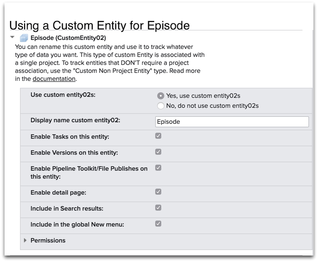

# File System Configuration Reference

In this topic:
- [Introduction](#introduction)
- [Part 1 - Folder Creation Syntax](#part-1---folder-creation-syntax)
  - [Query Folders](#query-folders)
  - [Multiple folders](#multiple-folders)
  - [Create With Parent Folder](#create-with-parent-folder)
  - [Optional fields](#optional-fields)
  - [Regular expression token matching](#regular-expression-token-matching)
  - [Examples](#examples)
  - [List Field Folders](#list-field-folders)
  - [Pipeline Step Folder](#pipeline-step-folder)
    - [Different file system layouts for different pipeline steps](#different-file-system-layouts-for-different-pipeline-steps)
  - [Advanced - Specifying a parent](#advanced---specifying-a-parent)
  - [Task Folder](#task-folder)
    - [Advanced - Specify a parent](#advanced---specify-a-parent)
  - [Workspaces and Deferred Folder Creation](#workspaces-and-deferred-folder-creation)
  - [Current User Folder](#current-user-folder)
  - [Static folders](#static-folders)
  - [Symbolic Links](#symbolic-links)
  - [Ignoring files and folders](#ignoring-files-and-folders)
  - [Customizing IO and Permissions](#customizing-io-and-permissions)
    - [Data passed to the hook](#data-passed-to-the-hook)
    - [Passing your own folder creation directives to the hook](#passing-your-own-folder-creation-directives-to-the-hook)
    - [Adding custom configuration to static folders](#adding-custom-configuration-to-static-folders)
  - [Simple customization of how folders are created](#simple-customization-of-how-folders-are-created)
- [Part 2 - Configuring File System Templates](#part-2---configuring-file-system-templates)
  - [The Keys Section](#the-keys-section)
    - [Example - An alphanumeric name](#example---an-alphanumeric-name)
    - [Example - Version number](#example---version-number)
    - [Example - A stereo eye](#example---a-stereo-eye)
    - [Example - Image sequences](#example---image-sequences)
    - [Example - Two fields both named version via an alias](#example---two-fields-both-named-version-via-an-alias)
    - [Example - Timestamp](#example---timestamp)
    - [Example - mappings](#example---mappings)
    - [Example - String field with two valid values](#example---string-field-with-two-valid-values)
    - [Example - Disallowing a value](#example---disallowing-a-value)
    - [Example - Subsets of strings](#example---subsets-of-strings)
  - [The Paths Section](#the-paths-section)
  - [The Strings Section](#the-strings-section)
  - [Using Optional Keys in Templates](#using-optional-keys-in-templates)
- [Advanced questions and troubleshooting](#advanced-questions-and-troubleshooting)
  - [How can I add a new entity type to my file structure?](#how-can-i-add-a-new-entity-type-to-my-file-structure)
    - [Fields required for the Episode > Sequence > Shot hierarchy](#fields-required-for-the-episode--sequence--shot-hierarchy)
      - [Episode](#episode)
      - [Sequence](#sequence)
      - [Shot](#shot)
      - [Episodes](#episodes)
      - [Toolkit template definitions](#toolkit-template-definitions)
  - [How can I set up a branch in my structure?](#how-can-i-set-up-a-branch-in-my-structure)
  - [How can I create a custom Pipeline Step using a custom entity?](#how-can-i-create-a-custom-pipeline-step-using-a-custom-entity)


This document is a complete reference of the file system centric configurations in the  Pipeline Toolkit. It outlines how the template system works and which options are available. It also shows all the different parameters you can include in the folder creation configuration.  
_Please note that this document describes functionality only available if you have taken control over a Toolkit configuration. For details, see  [ Integrations Admin Guide](https://developer.shotgridsoftware.com/8085533c/)._

# Introduction

This document explains how to configure the part of Toolkit's configuration related to your file system, including examples. Toolkit handles a lot of files and directories, and you can leverage Toolkit's configuration as a way of expressing how paths are put together and what they mean. The file system is typically accessed in two different and completely separate ways:

**Folder Creation:** After an object has been created in , folders on disk need to be created before work can begin. This can be as simple as having a folder on disk representing the Shot, or can be more complex-for example setting up a user specific work sandbox so that each user that works on the shot will work in a separate area on disk.
    
- Toolkit automates folder creation when you launch an application (for example you launch Maya for shot BECH_0010), Toolkit ensures that folders exist prior to launching Maya. If folders do not exist, they are created on the fly. Folders can also be created using API methods, using the  [tank command in the shell](https://developer.shotgridsoftware.com/425b1da4/#useful-tank-commands)  and via the  [Create Folders menu in ShotGrid](https://developer.shotgridsoftware.com/c3b662a6/). A special set of configuration files drives this folder creation process and this is outlined in  [Part 1](#part-1---folder-creation-syntax)  of the document below.

**Opening and Saving Work:** While working, files need to be opened from and saved into standardized locations on disk. These file locations typically exist within the folder structure created prior to work beginning.
    
- Once a folder structure has been established, we can use that structure to identify key locations on disk. These locations are called  [Templates](#part-2---configuring-file-system-templates). For example, you can define a template called  `maya_shot_publish`  to refer to published Maya files for Shots.  [Toolkit apps](https://developer.shotgridsoftware.com/f8596e35/)  will then use this template-a publish app may use it to control where it should be writing its files, while a  [Workfiles App](https://developer.shotgridsoftware.com/9a736ee3/)  may use the template to understand where to open files from. Inside Toolkit's environment configuration, you can control which templates each app uses. All the key file locations used by Toolkit are therefore defined in a single template file and are easy to overview.

# Part 1 - Folder Creation Syntax

The folder configuration maps entities in  to locations on disk. Rather than using a single configuration file, the configuration is in the form of a "mini file system" which acts as a template for each unit that is configured-this is called the **schema configuration**. Folders and files will be copied across from this "mini file system" to their target location when Toolkit's folder creation executes. It is possible to create dynamic behavior. For example, a folder can represent a Shot in , and you can control the naming of that folder. More specifically, you can pull the name of that folder from several  fields and then perform character conversions before the folder is created.


The above image shows a schema configuration. When you run the Toolkit folder creation, a connection is established between an entity in  and a folder on disk. Toolkit uses this folder schema configuration to generate a series of folders on disk and each of these folders are registered as a  [`Filesystem Location`](https://developer.shotgridsoftware.com/cbbf99a4/)  entity in . One way to think about this is that  data (e.g., Shot and Asset names) and the configuration is "baked" out into actual folders on disk and in . Configurations always start with a folder named "project". This will always represent the connected project in  and will be replaced with the Toolkit name for the project. Below this level are static folders. The folder creator will automatically create the **sequences**folder, for example.

Digging further inside the sequences folder, there is a **sequence** folder and a **sequence.yml** file. Whenever Toolkit detects a YAML file with the same name as a folder, it will read the contents of the YAML file and add the desired dynamic behavior. In this case, the **sequence.yml** file contains the structure underneath the project folder, which consists of three types of items:

1. **Normal folders and files:** these are simply copied across to the target location.
2. **A folder with a YAML file** (having the same name as the folder): this represents dynamic content. For example, there may be a **shot** and **shot.yml** and when folders are created, this **shot** folder is the template used to generate a number of folders-one folder per shot.
3. **A file named name.symlink.yml** which will generate a symbolic link as folders are being processed.  [Symbolic links are covered later in this document](#symbolic-links).

The dynamic configuration setup expressed in the YAML files currently supports the following modes:

- **[ Query folders:](#shotgun-query-folders)** Dynamic folder names based on a  Database Query. For example, this mode can be used to create a folder for every Shot in a project.
    
- **[ List Field folders:](#shotgun-list-field-folders)** Dynamic folder names based on a  List Field. For example, this mode can be used to create a folder for every value in the  List field "Asset Type", found on the Asset Entity in .
    
- **[Deferred folders:](#workspaces-and-deferred-folder-creation)** Only executed when a second folder creation pass is requested via the create folders method of the Toolkit API, usually when an application (such as Maya) is launched. Typically, this method is executed by Toolkit's various application launchers just prior to starting up an application.
    
- **[Current User Folders:](#current-user-folder)** A special folder, which represents the current user.
    

Let's dive deeper into these modes.

## Query Folders

For a dynamic folder which corresponds to a  query, use the following syntax in your YAML file:

    # the type of dynamic content
    type: shotgun_entity
    
    # the  entity type to connect to
    entity_type: Asset
    
    # the  field to use for the folder name
    name: code
    
    #  filters to apply when getting the list of items
    # this should be a list of dicts, each dict containing
    # three fields: path, relation and values
    # (this is std  API syntax)
    # any values starting with $ are resolved into path objects
    filters: [ { "path": "project", "relation": "is", "values": [ "$project" ] } ] 

-   Set the value of dynamic content **type** field to be **shotgun_entity**.
-   The **entity_type** field should be set to the  entity from which we want to pull data from (e.g., "Asset", "Shot", "Sequence", "CustomEntity02", etc).
-   The **name** field is the name that should be given to each folder based on the data in .
    
- You can use a single field, like in the example above (e.g.,  `name: code`).
- You can use multiple fields in brackets (e.g.,  `name:`  `"{asset_type}_{code}"`).
- If you want to include fields from other linked entities, you can use the standard  dot syntax (e.g.,  `name: "{sg_sequence.Sequence.code}_{code}"`).
-   The **filters** field is a  Query. It follows the  [ API syntax](http://developer.shotgridsoftware.com/python-api/reference.html)  relatively closely. It is a list of dictionaries, and each dictionary needs to have the keys  _path_,  _relation_, and  _values_. Valid values for $syntax are any ancestor folder that has a corresponding  entity (e.g.,  `"$project"`  for the Project and  `"$sequence"`  if you have a sequence.yml higher up the directory hierarchy). For  entity links, you can use the $syntax (e.g.,  `{ "path": "project", "relation": "is", "values": [ "$project" ] }`) to refer to a parent folder in the configuration-this is explained more in depth in the  [examples below](#examples).
    

## Multiple folders

Include a slash in your name definition in order to create an expression which creates multiple folders at once:

    # the type of dynamic content
    type: shotgun_entity
    
    # the  entity type to connect to
    entity_type: Asset
    
    # the  field to use for the folder name
    name: "{sg_asset_type}/{code}"
    
    #  filters to apply when getting the list of items
    # this should be a list of dicts, each dict containing
    # three fields: path, relation and values
    # (this is std  API syntax)
    # any values starting with $ are resolved into path objects
    filters: [ { "path": "project", "relation": "is", "values": [ "$project" ] } ] 

When creating a file system template (see for a Part 2 of this document for details) for this kind of path, the  _last_folder will represent the  entity. The example above could for example be expressed with the following template

    asset_step_folder: assets/{asset_type}/{Asset}/{Step}

`{asset_type}`  and  `{Asset}`  are both defined as string template keys and the  `{Asset}`  token will be used in context calculations when determining the context for a given path.

## Create With Parent Folder

In , there is nesting within  data structures. This nesting can be referred to as a Parent to Child relationship, and vice versa. For instance, Sequences are typically parents to Shots in the file system, and likewise, Shots are typically Children to Sequences.




A shotgun_entity type folder supports an optional flag to control whether the folder creation process tries to recurse down into it when a parent is created, so that the child will also be created. Flags are settings that can only have certain fixed values, in this case "true" or "false". To add this flag, use this example:

    # recurse down from parent folder
    create_with_parent: true 

As mentioned, this setting is optional and set to false by default. If you set it to true, Toolkit create folders for any child entity it finds. To continue with our example, if you want Shots to be created whenever their parent Sequence is created, set  `create_with_parent`  to  `true`  for the Shot.



## Optional fields

Typically, when you define the folder name (e.g.,  `{code}_{sg_extra_field}`), Toolkit requires all fields to have values in . For example, if the  `sg_extra_field`  is blank, an error message will be generated. If you have a field that is sometimes populated and sometimes not, you can mark it as optional. This means that Toolkit will include the field if it has a value, and exclude it if the value is blank-without error.

You define optional fields using square brackets, like:  `{code}[_{sg_extra_field}]`. This will generate the following folder names:

-   If the  `code`  is BECH_0010 and the  `sg_extra_field`  is extra, the folder name will be  `BECH_0010_extra`.


-   If the  `code`  is BECH_0010 and the  `sg_extra_field`  is blank, the folder name will be  `BECH_0010`.





## Regular expression token matching

Toolkit supports the extraction of parts of a  field name using regular expressions. This makes it possible to create simple expressions where a value in  can drive the folder creation. For example, if all assets in  are named with a three letter prefix followed by an underscore (e.g  `AAT_Boulder7`), this can split into two filesystem folder levels, e.g.  `AAT/Boulder7`:

    # the type of dynamic content
    type: shotgun_entity
    
    # the  entity type to connect to
    entity_type: Asset
    
    # Extract parts of the name using regular expressions
    name: "{code:^([^_]+)}/{code^[^_]+_(.*)}"
    
    #  filters to apply when getting the list of items
    # this should be a list of dicts, each dict containing
    # three fields: path, relation and values
    # (this is std  API syntax)
    # any values starting with $ are resolved into path objects
    filters: [ { "path": "project", "relation": "is", "values": [ "$project" ] } ]

The syntax is similar to the  `subset`  tokens in the Template system; Simply add a colon after the  field name, then followed by a regular expression. Any groups (e.g. sections surrounded by  `()`s) defined in the regular expression will be used to extract values. If there are multiple groups in the regex, these will be concatenated together. For example, the following expression would extract the intials for the user who created an object:  `{created_by.HumanUser.code:^([A-Z])[a-z]* ([A-Z])[a-z]*}`

## Examples

Below are a collection of examples showing how to use the filters syntax.

To **find all shots which belong to the current project and are in progress**, use the syntax below. Note that the  Shot entity has a link field called project which connects a shot to a project. We want to make sure that we only create folders for the shots that are associated with the current project. Since there is a project level higher up in the configuration file system, we can refer to this via the $syntax and Toolkit will automatically create to this  entity link reference. Remember, valid values for $syntax are any ancestor folder that has a corresponding  entity (e.g.,  `"$project"`  for the Project and  `"$sequence"`  if you have a sequence.yml higher up the directory hierarchy).

    entity_type: Shot
    filters:
        - { "path": "project", "relation": "is", "values": [ "$project" ] }
        - { "path": "status", "relation": "is", "values": [ "ip" ] }

If you have a Sequence folder higher up the tree and want to **create folders for all Shots which belong to that Sequence**, you can create the following filters:

    entity_type: Shot
    filters:
        - { "path": "project", "relation": "is", "values": [ "$project" ] }
        - { "path": "sg_sequence", "relation": "is", "values": [ "$sequence" ] }

To **find all assets** use this syntax:

    entity_type: Asset
    filters: [ { "path": "project", "relation": "is", "values": [ "$project" ] } ]

## List Field Folders

[ list field](https://help.autodesk.com/view/SGSUB/ENU/?guid=SG_Administrator_ar_data_management_ar_field_types_html)  folders are useful if you want to create one folder for every asset type in , for instance. Asset types are list fields in , and this folder config type makes it possible to define a layer in the file system that reflects those asset type listings.





When you want a dynamic folder which corresponds to all the items in a  list field, use the following syntax in your YAML file:

    # the type of dynamic content
    type: "shotgun_list_field"
    
    # the  entity type to connect to
    entity_type: "Asset"
    
    # only create for values which are used in this project.
    # this is optional and will be set to false if not specified.
    skip_unused: false
    
    # by default, list fields are only created if they are needed by a child entity node
    # by setting the create_with_parent parameter to true you ensure that list field
    # nodes are always created
    create_with_parent: false
    
    # the  field to use for the folder name
    field_name: "{sg_asset_type}_type"

-   Set value of dynamic content **type** field to be  `shotgun_list_field`.
-   The  `entity_type`  field should be set to the  entity from which we want to pull data (for instance, "Asset", "Sequence", "Shot", etc.).
-   The  `field_name`  field should be set to the  field from which the data is pulled from and must be a  [list type field](https://help.autodesk.com/view/SGSUB/ENU/?guid=SG_Administrator_ar_data_management_ar_field_types_html). You can use expressions if you want to add static text alongside the dynamic content.`field_name: "{sg_asset_type}_type"`  This example expression includes text as well as a template key.
    
-   The optional  `skip_unused`  parameter will prevent the creation of directories for list type field values which are not used (as covered under the  [Optional Fields](#optional-fields)  section above).  
    
-   The optional  `create_with_parent`  parameter forces the creation of the list_field node, even if there isn't a child entity level node that is currently being processed (see  [Create With Parent Folder](#create-with-parent-folder)  section above).
    

## Pipeline Step Folder

The Pipeline Step folder represents a  [Pipeline Step](https://help.autodesk.com/view/SGSUB/ENU/?guid=SG_Producer_pr_scheduling_tasks_pr_tasks_pipeline_steps_html)  in . Pipeline Steps are also referred to as Steps.



    # the type of dynamic content
    type: "shotgun_step"
    
    # the  field to use for the folder name. This field needs to come from a step entity.
    name: "short_name"

You can use name expressions here, just like you can with the  [ entity described above](#list-field-folders). The node will look at its parent, grandparent, etc., until a  entity folder configuration is found. This entity folder will be associated with the Step and the type of the entity will be used to determine which Steps to create.



By default, the Step folder will try to create all the relevant Steps for a particular entity automatically. For example, if the folder creation is triggered for a shot which has five Steps (Layout, Animation, FX, Lighting, Compositing), Step folders will automatically be created for those five Steps (Layout, Animation, FX, Lighting, Compositing).

You can, however, turn this off by using the following syntax:

    # recurse down from parent folder
    create_with_parent: false

Adding this setting to the configuration means that no Step folders will be created when a Shot folder is created. Instead, Step folders will be created only when you run the folder creation on a Task. This can be useful if you want to configure user sandboxes and other structures which are created just before work starts.

### Different file system layouts for different pipeline steps

Imagine you want to have one folder structure for Lighting and Comp and one for everything else. If you want to have different file system layouts for different Pipeline Steps, you can achieve this by adding a  `filter`  clause to your config. This filter allows you to scope which Pipeline Steps will be covered by a particular Step's configuration. In our example, you can create two configuration files:  `step_lightcomp.yml`  and  `step.yml`. In the first one, you would add the following filter:

    filters: [ { "path": "short_name", "relation": "in", "values": [ "Light", "Comp"  ] } ] 

The above syntax will only be used when Step folders of the type  `Light`  or  `Comp`  are being created. For the other file, we want to create a rule for everything else:

    filters: [ { "path": "short_name", "relation": "not_in", "values": [ "Light", "Comp"  ] } ]

Now you can define separate sub structures in each of these folders.

## Advanced - Specifying a parent

As part of the folder creation, Toolkit needs to associate a Pipeline Step with an entity (e.g., "Shot", "Asset", etc). Toolkit does this by default by looking up the folder tree and picking the first  entity folder it finds. For example, if you have the hierarchy  `Sequence > Shot > Step`, the Step folder will automatically be associated with the Shot, which is typically what you want.

However, if you have a hierarchy with entities below your primary entity, for example  `Sequence > Shot > Department > Step`, Toolkit will, by default, associate the Step with the Department level, which is not desired. In this case, we need to explicitly tell Toolkit where to look. We can do this by adding the following to the Step configuration:

    associated_entity_type: Shot

## Task Folder

The Task folder represents a  [Task](https://help.autodesk.com/view/SGSUB/ENU/?guid=SG_Producer_pr_scheduling_tasks_pr_my_tasks_html)  in . By default, the Task folder will not will not be created with its parent. For example, if the folder creation is triggered for a Shot which has a Task node associated, the Task folders will not be created automatically. Instead, Task folders will only be created when the folder creation is executed for the Task (e.g., launching a Task from ).



    # the type of dynamic content
    type: "shotgun_task"
    
    # the  field to use for the folder name. This field needs to come from a task entity.
    name: "content" 
    
You can, however, turn on creation so that Tasks are created with their parent entity by using the following syntax:
    
    # recurse down from parent folder
    create_with_parent: true

Similar to a Step, you can also optionally supply a  `filter`  parameter if you want to filter which Tasks your folder configuration should operate on.

Once again, you can use name expressions, just like you can with the  [ entity described above](#list-field-folders), where static text can be used alongside dynamic content so that you can create a name that has both dynamic and static context.

`name: "task_{content}"`

The node will look at its parent, grandparent etc., until a  entity folder configuration is found. This entity folder will be associated with the task and will be used to determine which task folders to create.

### Advanced - Specify a parent

As part of the folder creation, Toolkit needs to associate a Task with an entity (e.g., a Shot, an Asset, etc.). Toolkit does this by default by looking up the folder tree and picking the first  entity folder it finds. For example, if you have the hierarchy  `Sequence > Shot > Task`, the Task folder will automatically be associated with the Shot, which is typically what you want.

However, if you have a hierarchy with entities below your primary entity (e.g., below Shot), like  `Sequence > Shot > Department > Task,`  Toolkit would by default associate the Task with the department level, which is not desired. In this case, we need to explicitly tell Toolkit where to look, similarly to how we updated this with Steps in the  [previous section](#create-with-parent-folder). We can do this by adding the following to the Task configuration:

`associated_entity_type: Shot` 

## Workspaces and Deferred Folder Creation

Deferred folder creation means that creation will only be executed when a second folder creation pass is requested via the optional  `engine`  parameter in the create folders method of the Toolkit API. Typically, this method is executed by Toolkit's various application launchers just prior to starting up an application. Most folder types support a deferred flag, which is  `false`  by default. To make deferred folder creation  `true`, you can add this flag:

    # only create this folder when tk.create_filesystem_structure is
    # called with tk-maya, tk-nuke or any-custom-string.
    defer_creation: ["tk-maya", "tk-nuke", "any-custom-string]
    
    # create this folder when any application launches, but not when normal folder
    # creation runs
    defer_creation: true

This flag makes it possible to split the folder creation in half-one part that runs in a first "global" pass and a second pass that runs at a later point. Typically, the second pass is associated with the engine launching (although it does not happen automatically since the default is  `false`) and allows for a user to create folders just before engine startup. This allows for two primary workflows:

1. **Workspaces:** Application specific folder setups. Folders can be created just before an application launches.
2.  A common workflow for this is to have a Pipeline Step that might require Houdini, Maya, and another Engine, depending on what the shot requires and how an Artist chooses to tackle it. The Artist can create maya/, houdini/, and other directories for that Pipeline Step initially, but if the Artist on a given shot only ever works in Maya, empty folders for Houdini and any other Engine are unnecessary. So, if you defer the folder creation to happen at the time of the launch of individual engines, then if an Artist never uses Houdini, the houdini/ folder will not be created for that shot.
3. **User folders:** A user folder is created just before application launch. The user folder config construct (described above) is deferred by default.
4.  This can happen so that instead of basing a user folder on the assigned user in , you can create a folder for the current user whenever they launch an Engine. For instance, if you start working on a shot, and you launch Maya, a username folder will be created for you (based on your username in ), and you will not interfere with anyone else's work.

_Tip: If you prefer a normal, static folder to be created when an application (like Maya) launches, just create a config YAML file named the same as the folder and add the following:_

    # type of content
    type: "static"
    
    # only create this folder for maya
    defer_creation: "tk-maya"
    
    # type of content
    type: "static"
    
    # only create this folder when tk.create_filesystem_structure is
    # called with any-custom-string.
    defer_creation: "any-custom-string" 


## Current User Folder

The current user folder is a special construct that lets you set up work areas for different users. A common scenario is if you have multiple artists from a department working on the same shot. User folders can be used so that artists can store their workfiles in their own directories and be able to filter just for their files in the  [Workfiles App](https://developer.shotgridsoftware.com/9a736ee3/). In this case, the configuration file needs to include the following options:

    # the type of dynamic content
    type: "user_workspace"
    
    name: "login"

-   Set value of **type** field to be  `user_workspace`.
-   The **name** field is the name that should be given to a user folder. It must consist of a combination of fields fetched from People in  (`HumanUser`  in ).
-   You can use a single field, like in the example above (e.g.,  `name: login`).
-   You can use multiple fields in brackets (e.g.,  `name: "{firstname}_{lastname}"`).
-   If you want to include fields from other linked entities, you can use the standard  dot syntax (e.g.,  `name: "{sg_group.Group.code}_{login}"`).

The current user folder is created as a deferred folder by default, meaning that it will only be executed when a second folder creation pass is requested via the optional  `engine`  parameter in the create folders method of the Toolkit API.

## Static folders

Static folders (and files) are the most simple type. You can drop them into the configuration structure, and they will automatically get copied across when the folder creation process executes.  [Here are some examples of static folders](https://github.com/shotgunsoftware/tk-config-default/tree/master/core/schema/project)  (https://github.com/shotgunsoftware/tk-config-default/tree/master/core/schema/project) in the default configuration (note that static folders do not have a corresponding YAML file).

Often, you will not need to go beyond this for static folders; however, Toolkit does support some more advanced functionality for static folders. It is possible to define dynamic conditions to determine if a static folder should get created. For example, you may want to have special static folders that only get created for Pipeline Steps of the Editorial type. In this case, you need to add a YAML configuration file next to the static folder and give it the same name, with the extension "yml". Then, use the following syntax:

    # the type of dynamic content
    type: "static"

    # pick one of the  folders that are above this folder
    # in the folder hierarchy. In this case it is a parent folder
    # named step that we want to look at when deciding if this
    # static folder should be created or not.
    constrain_by_entity: "$step"
    
    # we can now define constraints for this step. Constraints are simple
    #  queries, following the same syntax as the other  filters
    # shown in previous sections.
    
    # In our example, if the parent step matches the constraints given
    # in the filter below, the static folder will be created. If not,
    # it (and its children) will be ignored by the folder creation process.
    constraints:
        - { "path": "short_name", "relation": "is", "values": [ "edit" ] } 

By default, static folders will automatically get created together with their parent folder. There may be cases where this is not desirable, and in those cases you can add a special flag to indicate that the static folder should not be created together with its parent:

    # do not recurse down automatically
    create_with_parent: false

## Symbolic Links

You can create symbolic links (symlink) as part of the dynamic folder creation. If you want to create a symbolic link with the name  `artwork`, create a file in your schema configuration named  `artwork.symlink.yml`. This will be identified by the system as a symbolic link request and will not be copied across, but will instead be processed.

The  `artwork.symlink.yml`  file must, at the very least, contain a  `target`  key:

    # Example of a .symlink.yml file
    
    # A target parameter is required.
    target: "../Stuff/$Project/$Shot"
    
    # Additional parameters will be passed to the hook as metadata
    # so you can for example include permission hints or other stuff
    # that you may need for advanced customization
    additional_param1: abc
    additional_param2: def 

If the target parameter contains  `$EntityType`  tokens such as  `$Asset`,  `$Shot`, or  `$Project`, these will attempt to be resolved with the name of the folder representing that entity (Asset, Shot, Project, etc.). Toolkit will look up the filesystem tree for these values and if they are not defined higher up in the tree, an error will be reported.

List fields, such as asset type on assets, are expressed with a syntax that includes the entity type, e.g.  `$Asset.sg_asset_type`. For example:

    # Example of a .symlink.yml file
    
    # A target parameter is required.
    target: "../renders/$Project/$Asset.sg_asset_type/$Asset"

Symlink creation happens (like all input/output, or I/O) inside the folder processing hook. A special  `symlink`action is passed from the system into the hook, and you will get the name of the symlink, the fully resolved target, and all the YAML metadata contained within the definition file along with this request. For our  `artwork`example above, we create the folder under the Shot like this:

  
     {'action': 'symlink',
      'path': '/mnt/projects/chasing_the_light/Sequences/AA/AA001/artwork'
      'target': '../Stuff/chasing_the_light/AA001',
      'metadata': {'target': '../Stuff/$Project/$Shot', 'additional_param1': 'abc', 'additional_param2': 'def'}
      }


## Ignoring files and folders

Files that are placed in the schema scaffold will be copied across into the target area as part of the folder creation. This copy process is handled by a core hook, so for example, permissions handling can be customized for a project or studio.

{% include info title="Note" content="There are more details on this kind of handling in the  [Customizing I/O and Permissions section](#simple-customization-of-how-folders-are-created)Customizing I/O and Permissions section under Simple Customization. We have a  [process_folder_creation core hook](https://github.com/shotgunsoftware/tk-core/blob/master/hooks/process_folder_creation.py#L62-L71)  (https://github.com/shotgunsoftware/tk-core/blob/master/hooks/process_folder_creation.py#L62-L71) that handles a lot of folder setup. You can add chmod calls into this hook (and/or set permissions as you mkdir), thereby setting permissions for the folders you are creating." %}

Sometimes it can be useful to exclude certain files and folders from being copied across as part of the folder creation. For example, if you store your folder creation configs in Git or SVN, you will have  `.git`  and  `.svn`folders that you will not want to copy to each Shot or Asset folder. If there are files which you do not want to have copied, a file named  `ignore_files`  can be placed in the  `config/core/schema`  folder inside the project configuration. This file should contain glob-style patterns to define files not to copy. Each pattern should be on a separate line:

    # This is a good example of a standard ignore_files file
    
    .svn                # no svn temp files to be copied across at folder creation time
    .git                # no git temp files to be copied across at folder creation time
    .DS_Store           # no mac temp files to be copied across at folder creation time


You can also use wildcards. For example, if you need to exclude all files with the TMP extension, just add a *.tmp line to the file.

    # This is a good example of a standard ignore_files file
    
    .svn                # no svn temp files to be copied across at folder creation time
    .git                # no git temp files to be copied across at folder creation time
    *.tmp           # no files with tmp extension to be copied across at folder creation time

## Customizing IO and Permissions

Shot and Asset folders often need to be created with special permissions and parameters. Sometimes this is as simple as setting permission bits during the folder creation, and sometimes it may be as complex as sending a remote request to a special folder creation server that will create the folders with the appropriate credentials, groups, and permissions.

It is also common that folders on different levels in the file system tree need to have different permissions; a work area folder is typically writeable for everybody, whereas a shot folder may have much stricter permissions.

Toolkit allows for customization of the folder creation via a single hook. This is a core hook and it is named  `process_folder_creation.py`. As the folder creation API call is traversing the folder configuration and deciding which folders should be created, it builds up a list of items that could be created. These items can be both files and folders. As the final step of the folder creation, this list is passed to a hook to handle the actual folder processing. You can examine the default  [process_folder_creation core hook here](https://github.com/shotgunsoftware/tk-core/blob/master/hooks/process_folder_creation.py#L62-L71)(https://github.com/shotgunsoftware/tk-core/blob/master/hooks/process_folder_creation.py#L62-L71).

### Data passed to the hook

The folder creation hook is executed just once for each folder creation request. All the folder creation data is passed in a list to the hook and the hook typically loops over this and creates the folders according to the parameters passed from the Core API.

The data in the list is always a depth first recursion, starting with the top level folders and files and then traversing deeper and deeper. Here is an example of what the data passed to the hook may look like:

```python
    [
    
     {'action': 'entity_folder',
      'entity': {'id': 88, 'name': 'Chasing the Light', 'type': 'Project'},
      'metadata': {'root_name': 'primary', 'type': 'project'},
      'path': '/mnt/projects/chasing_the_light'},
    
     {'action': 'folder',
      'metadata': {'type': 'static'},
      'path': '/mnt/projects/chasing_the_light/sequences'},
    
     {'action': 'entity_folder',
      'entity': {'id': 32, 'name': 'aa2', 'type': 'Sequence'},
      'metadata': {'entity_type': 'Sequence',
                   'filters': [{'path': 'project',
                                'relation': 'is',
                                'values': [<tank.folder.folder_types.FilterExpressionToken object at 0x10ca04c90>]}],
                   'name': 'code',
                   'type': 'shotgun_entity'},
      'path': '/mnt/projects/chasing_the_light/sequences/aa2'},
    
     {'action': 'entity_folder',
      'entity': {'id': 1184, 'name': 'moo87', 'type': 'Shot'},
      'metadata': {'entity_type': 'Shot',
                   'filters': [{'path': 'sg_sequence',
                                'relation': 'is',
                                'values': [<tank.folder.folder_types.FilterExpressionToken object at 0x10ca04b10>]}],
                   'name': 'code',
                   'type': 'shotgun_entity'},
      'path': '/mnt/projects/chasing_the_light/sequences/aa2/moo87'},
    
     {'action': 'copy',
      'metadata': {'entity_type': 'Shot',
                   'filters': [{'path': 'sg_sequence',
                                'relation': 'is',
                                'values': [<tank.folder.folder_types.FilterExpressionToken object at 0x10ca04b10>]}],
                   'name': 'code',
                   'type': 'shotgun_entity'},
      'source_path': '/mnt/software/tank/chasing_the_light/config/core/schema/project/sequences/sequence/shot/sgtk_overrides.yml',
      'target_path': '/mnt/projects/chasing_the_light/sequences/aa2/moo87/sgtk_overrides.yml'},
    
     {'action': 'create_file',
      'metadata': {'entity_type': 'Shot',
                   'filters': [{'path': 'sg_sequence',
                                'relation': 'is',
                                'values': [<tank.folder.folder_types.FilterExpressionToken object at 0x10ca04b10>]}],
                   'name': 'code',
                   'type': 'shotgun_entity'},
      'content': 'foo bar',
      'target_path': '/mnt/projects/chasing_the_light/sequences/aa2/moo87/automatic_content.txt'},
    
     {'action': 'symlink',
      'path': '/mnt/projects/chasing_the_light/Sequences/AA/AA001/artwork'
      'target': '../Stuff/chasing_the_light/AA001',
      'metadata': {'target': '../Stuff/$Project/$Shot', 'additional_param1': 'abc', 'additional_param2': 'def'}
      },
    
    ]
```

The data is a list of dictionaries. Each dictionary has a key called  `action`. This key denotes the type of I/O item that is requested. If you are implementing the folder creation hook, you need to add support for the following different actions:

-   `entity_folder`: A folder on disk which is associated with a  entity.
-   `folder`: A folder on disk.
-   `copy`: A file that needs to be copied from a source location to a target location.
-   `create_file`:- A file that needs to be created on disk.
-   `symlink`: A symbolic link should be created.

Each of the actions have a different set of dictionary keys. For example, the  `entity_folder`  action has an  `entity key`  which contains the details of the entity that it is connected to. The  `create_file`  has a  `source_path`  and a  `target_path`  key which inform the hook which file to copy and where.

All  `actions`  also have a key called  `metadata`. This key represents the YAML configuration data that comes from the associated configuration file in the schema setup. You can see in the example above how the  `metadata`  key for a  folder contains all the filter and naming information that is set up within the schema configuration. For example, here is the metadata for the Shot folder in the example above:

```python
    {'action': 'entity_folder',
      'entity': {'id': 1184, 'name': 'moo87', 'type': 'Shot'},
      'metadata': {'entity_type': 'Shot',
                   'filters': [{'path': 'sg_sequence',
                                'relation': 'is',
                                'values': [<tank.folder.folder_types.FilterExpressionToken object at 0x10ca04b10>]}],
                   'name': 'code',
                   'type': 'shotgun_entity'},
      'path': '/mnt/projects/chasing_the_light/sequences/aa2/moo87'} 
```

...which corresponds to the  `shot.yml`  schema configuration file:

    # Copyright (c) 2013  Software Inc.
    #
    # CONFIDENTIAL AND PROPRIETARY
    #
    # This work is provided "AS IS" and subject to the  Pipeline Toolkit
    # Source Code License included in this distribution package. See LICENSE.
    # By accessing, using, copying or modifying this work you indicate your
    # agreement to the  Pipeline Toolkit Source Code License. All rights
    # not expressly granted therein are reserved by  Software Inc.
    
    # the type of dynamic content
    type: "shotgun_entity"
    
    # the  field to use for the folder name
    name: "code"
    
    # the  entity type to connect to
    entity_type: "Shot"
    
    #  filters to apply when getting the list of items
    # this should be a list of dicts, each dict containing
    # three fields: path, relation and values
    # (this is std  API syntax)
    # any values starting with $ are resolved into path objects
    filters: [ { "path": "sg_sequence", "relation": "is", "values": [ "$sequence" ] } ] 

_Note that the dynamic token  `$sequence`  has been resolved into an actual object at runtime._

### Passing your own folder creation directives to the hook

In addition to the various configuration directives required by Toolkit, you can also define your own configuration items as part of the schema configuration. These are passed into the hook via the  `metadata`  key described above, and can be used to drive folder creation.

For example, if you had the following structure in your schema setup:

    # the type of dynamic content
    type: "shotgun_entity"
    
    # the  field to use for the folder name
    name: "code"
    
    # the  entity type to connect to
    entity_type: "Shot"
    
    #  filters to apply when getting the list of items
    filters: [ { "path": "sg_sequence", "relation": "is", "values": [ "$sequence" ] } ]
    
    # user settings
    studio_permissions_level: "admin" 

...the data passed via the folder creation hook would be:

```python
    {'action': 'entity_folder',
      'entity': {'id': 1184, 'name': 'moo87', 'type': 'Shot'},
      'metadata': {'entity_type': 'Shot',
                   'filters': [{'path': 'sg_sequence',
                                'relation': 'is',
                                'values': [<tank.folder.folder_types.FilterExpressionToken object at 0x10ca04b10>]}],
                   'name': 'code',
                   'type': 'shotgun_entity',
                   'studio_permissions_level': 'admin'},
      'path': '/mnt/projects/chasing_the_light/sequences/aa2/moo87'} 
```

Now the special parameter  `studio_permissions_level`  is passed into the hook and you can use that, for example, to control file permissions. You can also pass arbitrarily complex data structures using this method. A typical usecase for this would be to control permissions at a very detailed level.

### Adding custom configuration to static folders

Typically, when you create a folder inside the folder schema configuration, and it does not have a corresponding YAML file, Toolkit will assume that it is a static folder and will simply create it.

If you would like to associate custom configuration metadata with a static folder, you have to create a YAML configuration file with the  `static`  type. For example, let's say you have a static  `assets`  folder just under the project root and would like to group together assets and add custom configuration metadata. To achieve this, create the following  `assets.yml`  file:

    type: static
    studio_permissions_level: "admin"

The configuration data passed to the hook will then contain the following:

    {'action': 'folder',
     'metadata': {'studio_permissions_level': 'admin', 'type': 'static'},
     'path': '/mnt/projects/chasing_the_light/assets'},

Again, arbitrarily complex data can be passed from the YAML configuration file into the hook in this way.

## Simple customization of how folders are created

A simple folder creation hook could look something like this:

```python
    class ProcessFolderCreation(Hook):
    
        def execute(self, items, preview_mode, **kwargs):
            """
     The default implementation creates folders recursively using open permissions.
    
     This hook should return a list of created items.
    
     Items is a list of dictionaries. Each dictionary can be of the following type:
    
     Standard Folder
     ---------------
     This represents a standard folder in the file system which is not associated
     with anything in . It contains the following keys:
    
     * "action": "folder"
     * "metadata": The configuration yaml data for this item
     * "path": path on disk to the item
    
     Entity Folder
     -------------
     This represents a folder in the file system which is associated with a
      entity. It contains the following keys:
    
     * "action": "entity_folder"
     * "metadata": The configuration yaml data for this item
     * "path": path on disk to the item
     * "entity":  entity link dict with keys type, id and name.
    
     File Copy
     ---------
     This represents a file copy operation which should be carried out.
     It contains the following keys:
    
     * "action": "copy"
     * "metadata": The configuration yaml data associated with the directory level
     on which this object exists.
     * "source_path": location of the file that should be copied
     * "target_path": target location to where the file should be copied.
    
     File Creation
     -------------
     This is similar to the file copy, but instead of a source path, a chunk
     of data is specified. It contains the following keys:
    
     * "action": "create_file"
     * "metadata": The configuration yaml data associated with the directory level
     on which this object exists.
     * "content": file content
     * "target_path": target location to where the file should be copied.
    
     """
    
            # set the umask so that we get true permissions
            old_umask = os.umask(0)
            folders = []
            try:
    
                # loop through our list of items
                for i in items:
    
                    action = i.get("action")
    
                    if action == "entity_folder" or action == "folder":
                        # folder creation
                        path = i.get("path")
                        if not os.path.exists(path):
                            if not preview_mode:
                                # create the folder using open permissions
                                os.makedirs(path, 0777)
                            folders.append(path)
    
                    elif action == "copy":
                        # a file copy
                        source_path = i.get("source_path")
                        target_path = i.get("target_path")
                        if not os.path.exists(target_path):
                            if not preview_mode:
                                # do a standard file copy
                                shutil.copy(source_path, target_path)
                                # set permissions to open
                                os.chmod(target_path, 0666)
                            folders.append(target_path)
    
                    elif action == "create_file":
                        # create a new file based on content
                        path = i.get("path")
                        parent_folder = os.path.dirname(path)
                        content = i.get("content")
                        if not os.path.exists(parent_folder) and not preview_mode:
                            os.makedirs(parent_folder, 0777)
                        if not os.path.exists(path):
                            if not preview_mode:
                                # create the file
                                fp = open(path, "wb")
                                fp.write(content)
                                fp.close()
                                # and set permissions to open
                                os.chmod(path, 0666)
                            folders.append(path)
    
                    else:
                        raise Exception("Unknown folder hook action '%s'" % action)
    
            finally:
                # reset umask
                os.umask(old_umask)
    
            return folders 
```

# Part 2 - Configuring File System Templates

The Toolkit templates file is one of the hubs of the Toolkit configuration. There is always one of these files per project and it resides inside the **config/core** folder inside your pipeline configuration.


This file contains definitions for  _templates_  and their  _keys_.

A **key** is a dynamic field we defined. It can be a name, a version number, a screen resolution, a shot name etc. Keys are configured with types, so we can define that a key should be a string or an int for example. They are also formatted, so we can define that a string should only contain alpha numeric characters, or that all integers should be padded with eight zeroes.

A **template** is a dynamic path. An example of a template is  `shots/{shot}/publish/{name}.{version}.ma`. This template could for represent maya publishes for a shot - the bracketed fields are keys.

The templates file is divided into three sections: keys, paths and strings.

## The Keys Section

Keys define what values are acceptable for fields. In the template config file keys are defined in the form:

    key_name:
       type: key_type
       option: option_value
       option: option_value 

Key type is either  `str`,  `int`, or  `sequence`. Str keys are keys whose values are strings, int keys are keys whose values are integers, and sequence keys are keys whose values are sequences of integers.

In addition to specifying the type, you can also specify additional options. The following options exist:

-   `default: default_value`  - Value used if no value was supplied. This can happen if you are using the Toolkit API and trying to resolve a set of field values into a path for example.
    
-   `choices: [choice1, choice2, etc]`  - An enumeration of possible values for this key.
    
-   `exclusions: [bad1, bad2, etc]`  - An enumeration of forbidden values for this key. If key is of type sequence, frame spec values cannot be invalidated with this setting.
    
-   `length: 12`  - This key needs to be of an exact length.
    
-   `alias: new_name`  - Provides a name which will be used by templates using this key rather than the key_name. For example if you have two concepts of a version number, one is four zero padded because that is how the client wants it, and one is three zero padded because that how it is handled internally - in this case you really want both keys named "version" but this is not really possible since key names need to be unique. In this case you can create an alias. See one of the examples below for more information.
    
-   `filter_by: alphanumeric`  - Only works for keys of type string. If this option is specified, only strings containing alphanumeric values (typically a-z, A-Z and 0-9 for ascii strings but may include other characters if your input data is unicode) will be considered valid values.
    
-   `filter_by: alpha`  - Only works for keys of type string. If this option is specified, only strings containing alpha values (typically a-z, A-Z for ascii strings but may include other characters if your input data is unicode) will be considered valid values.
    
-   `filter_by: '^[0-9]{4}_[a-z]{3}$'`  - Only works for keys of type string. You can define a regular expression as a validation mask. The above example would for example require the key to have four digits, then an underscore and finally three lower case letters.
    
-   `format_spec: "04"`  - For keys of type int and sequence, this setting means that the int or sequence number will be zero or space padded. Specifying "04" like in the example will result in a four digit long zero padded number (e.g. 0003). Specifying "03" would result in three digit long zero padded number (e.g. 042), etc. Specifying "3" would result in three digit long space padded number (e.g. " 3"). For keys of type timestamp, the format_spec follows the  [strftime and strptime convention](https://docs.python.org/2/library/datetime.html#strftime-strptime-behavior).
    
-   `strict_matching: true`  - Only works for keys of type type int. This settings means that the field will only match numbers that have been properly formatted. For example, given "003" and strict_matching set to true, we would match "002", "12345" and "042", but not "00003" or "2". If you need the matching to be less strict, set strict_matching to false. The default behavior is to strictly match.
    
-   `shotgun_entity_type`  - When used in conjunction with the  `shotgun_field_name`  option, will cause contexts to query  directly for values. This allows using values from fields not seen in the folder structure to be used in file names.
    
-   `shotgun_field_name`  - Only used in conjunction with  `shotgun_entity_type`.
    
-   `abstract`  - Denotes that the field is abstract. Abstract fields are used when a pattern is needed to describe a path - for example image sequences (%04d) or stereo (%V). Abstract fields require a default value.
    
-   `subset`  and  `subset_format`  - Extracts a subset of the given input string and makes that the key value, allowing you to create for example an initials key from a full username or a key that holds the three first letters of every shot name.
    

For technical details about template keys, see the  [API reference](http://developer.shotgridsoftware.com/tk-core/core.html#template-system).

### Example - An alphanumeric name

A name that defaults to "comp" and that is alphanumeric:

    name:
        type: str
        default: "comp"
        filter_by: alphanumeric
    
    nuke_shot_work: sequences/{Sequence}/{Shot}/{Step}/work/nuke/{name}.v{version}.nk 

### Example - Version number

A version number that would match numbers such as 002, 102, 034, 12341

    version:
        type: int
        format_spec: "03" 

A version number that would match numbers such as 002, 102, 034, 12341, but also 0002, 2 and 0102

    version:
        type: int
        format_spec: "03"
        strict_matching: false 

### Example - A stereo eye

A typical stereo eye setup. The eye field is either L or R, but when used in software, it is often referred to in a generic, abstract fashion as %V. Since %V does not really refer to a file name but rather a collection of files, we set the  _abstract_  flag. Abstract fields need to have a default value that is pulled in whenever the abstract representation is being requested.

    eye:
        type: str
        choices: ["L", "R", "%V"]
        default: "%V"
        abstract: true
    
    nuke_shot_render_stereo: sequences/{Sequence}/{Shot}/{Step}/work/images/{Shot}_{name}_{eye}_v{version}.{SEQ}.exr

### Example - Image sequences

Image sequences are abstract by definition and they have a default value set to %0Xd unless otherwise specified. The below sequence spec would identify frame numbers such as 0001, 1234 and 12345.

    SEQ:
        type: sequence
        format_spec: "04"
    
    nuke_shot_render_stereo: sequences/{Sequence}/{Shot}/{Step}/work/images/{Shot}_{name}_{channel}_{eye}_v{version}.{SEQ}.exr 

### Example - Two fields both named version via an alias

Two definitions of version number that can both be used by code that expects a key which is named "version". This is useful if you have two Toolkit apps that both need a  _version_  field but you want these version field to be formatted differently.

    nuke_version:
        type: int
        format_spec: "03"
        alias: version
    maya_version:
        type: int
        format_spec: "04"
        alias: version
    
    # nuke versions are using numbers on the form 003, 004, 005
    # the nuke publish app requires a field called {version}
    # however {nuke_version} is a valid replacement for {version}
    # because it has an alias defined
    nuke_shot_work: sequences/{Sequence}/{Shot}/{Step}/work/nuke/{name}.v{nuke_version}.nk
    
    # maya versions are using numbers on the form 0004, 0005, 0006
    maya_shot_work: sequences/{Sequence}/{Shot}/{Step}/work/maya/{name}.v{maya_version}.ma 

### Example - Timestamp

A timestamp that defaults to the current local time and is formatted as YYYY-MM-DD-HH-MM-SS.

    now:
        type: timestamp
        format_spec: "%Y-%m-%d-%H-%M-%S"
        default: now 

A timestamp that defaults to the current utc time and is formatted as YYYY.MM.DD.

    year_month_day:
        type: timestamp
        format_spec: "%Y.%m.%d"
        default: utc_now 

A timestamp that defaults to 9:00:00 and is formatted as HH-MM-SS.

    nine_am_time:
        type: timestamp
        format_spec: "%H-%M-%S"
        default: "09-00-00" 

### Example - mappings

This is useful when you would like to to add  fields to a file name, for example. Let's say we would like to include the user name in a file name- we'd use the following definition:

    current_user_name:
        type: str
        shotgun_entity_type: HumanUser
        shotgun_field_name: login
    
    nuke_shot_work: sequences/{Sequence}/{Shot}/{Step}/work/nuke/{current_user_name}_{name}.v{version}.nk

When a Toolkit app populates all the context fields (via the  `context.as_template_fields()`  method, it will populate the higher level fields  `Shot`,  `Sequence`  and  `Step`  automatically. It will also scan through all fields which have  `shotgun_entity_type`  defined (like our  `current_user_name`  field above). If the  Entity is defined in the context, it will be able to automatically resolve the value. The current user is always tracked in the context, and in the above example, it would also be possible to pull data from fields on Shot, Sequence and Step since these are defined as part of the higher level path and therefore part of the context. However, trying to refer to an Asset entity in a field wouldn't work in the above example since Toolkit would have no way of knowing which asset in  to pull the data from.

### Example - String field with two valid values

Often times a studio will have a project that needs to save out ASCII and Binary Maya files. In this scenario, a string value with two valid values looks like:

    maya_file_extension:
        type: str
        choices: ["ma", "mb"] 



    maya_shot_work:  '@shot_root/work/maya/{name}.v{version}.ma'
    maya_shot_snapshot:  '@shot_root/work/maya/snapshots/{name}.v{version}.{timestamp}.ma'
    maya_shot_publish:  '@shot_root/publish/maya/{name}.v{version}.ma'

If  you  instead  end  them  with  .mb,  then  the  apps  will  save  out  as  Maya  binary:

    maya_shot_work:  '@shot_root/work/maya/{name}.v{version}.mb'
    maya_shot_snapshot:  '@shot_root/work/maya/snapshots/{name}.v{version}.{timestamp}.mb'
    maya_shot_publish:  '@shot_root/publish/maya/{name}.v{version}.mb' 

Check out  [The Paths Section](#the-paths-section)  below for more details.

### Example - Disallowing a value

A string field for which the value "assets" is not allowed. This is useful if you for example have two a folder which contains folders for all the sequences for a project alongside with a single "assets" folder where all the assets are kept:

    project
     |--- sequence1
     |--- sequence2
     |--- sequence3
     \--- assets 

In order for Toolkit to correctly understand that the assets folder is not just another sequence, we can define that "assets" is not a valid value for the sequence template.

    sequence:
        type: str
        exclusions: ["assets"] 

The exclusions field above allows us to define two templates that both correctly resolves:

    sequence_work_area: {sequence}/{shot}/work
    asset_work_area: assets/{asset}/work 

### Example - Subsets of strings

The following example extends a previous example and shows how to prefix filenames with a user's initials.

    user_initials:
        type: str
        shotgun_entity_type: HumanUser
        shotgun_field_name: login
        subset: '([A-Z])[a-z]*  ([A-Z])[a-z]*'
        subset_format: '{0}{1}'

    nuke_shot_work: sequences/{Sequence}/{Shot}/{Step}/work/nuke/{user_initials}_{name}.v{version}.nk 

## The Paths Section

The Paths section specifies where work will be saved. All paths consist of at least a name and a definition, where the definition is a combination of key names in brackets interspersed with non-key values representing a path. For example, a definition for a shot work file might look like:

    shot_work: sequences/{Sequence}/{Shot}/{Step}/work/{Shot}.v{version}.ma 

With Sequence, Shot, Step and version being keys defined in the same template file.

{% include info title="Note" content="If a string key's name matches the entity type of a dynamic schema folder that has an associated ShotGrid entity, then that folder name will be substituted in for the token. For example, if you are using a {Sequence} template key of type 'string' like the above snippet, and in your schema, you have a dynamic folder named 'sequence', and in its corresponding  `sequence.yml`  file, it's defined to be of type  `shotgun_entity`, and is connected to the 'Sequence' entity type in ShotGrid. Toolkit will recognize that your template key corresponds to this dynamic folder's entity type (in that they are both Sequence). So, Toolkit will take the resulting folder name (i.e., the name of the specific sequence in question), and substitutes that in for the template key." %}

This form is required if any optional attributes need to be defined. Currently, the only optional attribute is  `root_name`, which can be used to specify a project root for a path in a project that has multiple roots.  [Multiple roots](https://developer.shotgridsoftware.com/9ea9dd4e/)  are used when you'd like to add a new storage root to store some of your project files.

`root_name: name_of_project_root`

For example, it may look like this:

    shot_work:
      definition: sequences/{Sequence}/{Shot}/{Step}/work/{Shot}.v{version}.ma
      root_name: primary 

You need to use the above format if you want to use another storage root than the primary one. In this example, using this simple format implies that you are using the primary root for all entries.

## The Strings Section

Strings are similar to paths in that they must include a name and definition, which can be supplied in the simple form:

    string_name: string_definition

String definitions are templates consisting of key names and other values which together resolve to a string rather than a file system path. An example might the name used in  for a publish:

    maya_publish_sg_name: "Maya  publish,  {name},  v{version}"

With name and version as key names defined in the same file.

## Using Optional Keys in Templates

Optional keys in templates are useful for a number of reasons. One common case is when  `{SEQ}`  is optional for rendered images. In this example, there can be a set of exrs that that are comprised of frame numbers, like  `/path/to/render/shot.101.exr`  (and 102, 103, etc), while you are also able to use the same template for quicktime movies, like  `/path/to/render/shot.qt`. Another more common case is when you are rendering stereo images. If you are in a studio where the convention is:  `left eye: file.LFT.exr, right eye: file.RGT.exr, stereo image: file.exr?`, you can make  `{eye}`  optional.

Optional sections can be defined using square brackets:

    shot_work: sequences/{Shot}/work/{Shot}.[v{version}.]ma 

The optional section must contain at least one key. If the path is resolved with no value for the key(s) in an optional section, the path will resolve as if that section did not exist in the definition. The example above can be thought of as two templates baked into a single definition:

    shot_work: sequences/{Shot}/work/{Shot}.v{version}.ma
    shot_work: sequences/{Shot}/work/{Shot}.ma 

As you pass in a dictionary of fields, Toolkit will choose the right version of the template depending on the values:

    >>> template = tk.templates["shot_work"]
    >>> template.apply_fields({"Shot":"ABC_123", "version": 12}
    /project/sequences/ABC_123/work/ABC_123.v12.ma
    >>> template.apply_fields({"Shot":"ABC_123"}
    /project/sequences/ABC_123/work/ABC_123.ma 

# Advanced questions and troubleshooting

## How can I add a new entity type to my file structure?

Let's say you have been working on feature animations and shorts on your  site, and now you have been awarded episodic work. Let's walk through how you can incorporate an episodic workflow to Toolkit. The first thing to do is to set up your hierarchy in  for episodic work following the instructions  [here](https://help.autodesk.com/view/SGSUB/ENU/?guid=SG_Administrator_ar_get_started_ar_episode_entity_html).





**Additional Reference:**

-   [How does the Episode entity work?](https://help.autodesk.com/view/SGSUB/ENU/?guid=SG_Administrator_ar_get_started_ar_episode_entity_html)
-   [Customizing an entity's hierarchy](https://help.autodesk.com/view/SGSUB/ENU/?guid=SG_Administrator_ar_site_configuration_ar_customizing_hierarchy_html)


### Fields required for the Episode > Sequence > Shot hierarchy

[You can choose to use any Custom Entity](https://help.autodesk.com/view/SGSUB/ENU/?guid=SG_Administrator_ar_get_started_ar_enabling_custom_entities_html) for `Episode` (Site Preferences > Entities), or you can use the official Episode entity that was made available in  7.0.7.0. If you signed up for  pre-7.0.7.0 (before 2017), the "TV Show" template uses `CustomEntity02` for Episodes. If you decide to use another entity that is not `CustomEntity02` or the official Episode entity, no worries!  and Toolkit are flexible. Let's walk through both cases.

For the purpose of this exercise, we will use Episode (`CustomEntity02`) and the official Episode entity as examples of how to incorporate Episodes with the project hierarchy update (you can use either/or). First, the way to properly set up our Project's **Episode > Sequence > Shot** hierarchy is to ensure the following fields are in :

#### Episode

a) **Using the official Episode entity:** the "Episode" entity may be the entity used when creating a TV Show project from the Project Template.



**OR**

b) **Using a custom entity:** `CustomEntity02`  may be the custom entity used when creating a TV Show project from the Project Template.  _As noted previously, you can enable another custom entity and use it instead of  `CustomEntity02`—just make sure to replace all  `CustomEntity02`'s with the specific one that you have enabled._



#### Sequence

A single entity link called Episode (`sg_episode`) that links to the Episode entity is required.

**Using the official  `Episode`  Entity**

<iframe class="wistia_embed" title="Wistia video player" src="https://fast.wistia.net/embed/iframe/n9q0fx1q9p" name="wistia_embed" width="640" height="400" frameborder="0" scrolling="no" allowfullscreen=""></iframe>

**Using  `CustomEntity02`**

<iframe class="wistia_embed" title="Wistia video player" src="https://fast.wistia.net/embed/iframe/r3xetbj4ff" name="wistia_embed" width="640" height="400" frameborder="0" scrolling="no" allowfullscreen=""></iframe>

#### Shot

A single entity field called Sequence (`sg_sequence`) that links to the Sequence entity. This should already exist as part of the TV Show Project Template in .

**Using the official  `Episode`  Entity**

<iframe class="wistia_embed" title="Wistia video player" src="https://fast.wistia.net/embed/iframe/qcsrn3sy0a" name="wistia_embed" width="640" height="400" frameborder="0" scrolling="no" allowfullscreen=""></iframe>

**Using  `CustomEntity02`**

<iframe class="wistia_embed" title="Wistia video player" src="https://fast.wistia.net/embed/iframe/juebp6yjn8" name="wistia_embed" width="640" height="400" frameborder="0" scrolling="no" allowfullscreen=""></iframe>

### Toolkit schema definition

Let's assume a hierarchy as follows (where the folders in  `{}`s are dynamically named based on their name in ):

    - {project_name}
     - shots
     episode.yml
     - {episode_name}
     sequence.yml
     - {sequence_name}
     shot.yml
     - {shot_name}
     ...
     …


#### Episodes

In your  `config/core/schema/project/shots`  folder, create a folder named  `episode`  with a corresponding  `episode.yml`  file in the same directory with the following content:

**Using the official  `Episode`  Entity**

    # the type of dynamic content
    type: "shotgun_entity"
    
    # the  field to use for the folder name
    name: "code"
    
    # the  entity type to connect to
    entity_type: "Episode"
    
    #  filters to apply when getting the list of items
    # this should be a list of dicts, each dict containing 
    # three fields: path, relation and values
    # (this is std  API syntax)
    # any values starting with $ are resolved into path objects
    filters: [ { "path": "project", "relation": "is", "values": [ "$project" ] } ]

**Using `CustomEntity02`**

    # the type of dynamic content
    type: "shotgun_entity"
    
    # the  field to use for the folder name
    name: "code"
    
    # the  entity type to connect to
    entity_type: "CustomEntity02"
    
    #  filters to apply when getting the list of items
    # this should be a list of dicts, each dict containing 
    # three fields: path, relation and values
    # (this is std  API syntax)
    # any values starting with $ are resolved into path objects
    filters: [ { "path": "project", "relation": "is", "values": [ "$project" ] } ] 

This tells Toolkit to create folders for every Episode in this project.

#### Sequence

In your  `config/core/schema/project/shots/episode`  folder, create a folder named  `sequence`  with a corresponding  `sequence.yml`  file in the same directory with the following content:

    # the type of dynamic content
    type: "shotgun_entity"
    
    # the  field to use for the folder name
    name: "code"
    
    # the  entity type to connect to
    entity_type: "Sequence"
    
    #  filters to apply when getting the list of items
    # this should be a list of dicts, each dict containing 
    # three fields: path, relation and values
    # (this is std  API syntax)
    # any values starting with $ are resolved into path objects
    filters: [ { "path": "sg_episode", "relation": "is", "values": [ "$episode" ] } ]` 

This tells Toolkit to create folders for every Sequence that is linked to the Episode above it in the directory tree.

#### Shots

In your  `config/core/schema/project/shots/episode/sequence`  folder, create a folder named  `shot`  with a corresponding  `shot.yml`  file in the same directory with the following content:

    # the type of dynamic content
    type: "shotgun_entity"
    
    # the  field to use for the folder name
    name: "code"
    
    # the  entity type to connect to
    entity_type: "Shot"
    
    #  filters to apply when getting the list of items
    # this should be a list of dicts, each dict containing 
    # three fields: path, relation and values
    # (this is std  API syntax)
    # any values starting with $ are resolved into path objects
    filters: [ { "path": "sg_sequence", "relation": "is", "values": [ "$sequence" ] } ]` 

This tells Toolkit to create folders for every Shot that is linked to the Sequence above it in the directory tree.

After you've done this, your schema should reflect the following:


#### Toolkit template definitions

In order to tell Toolkit that you are using Episodes in your schema, you need to create a new key in the  [keys section](#the-keys-section)  at the top to define it:

**Using the official  `Episode`  Entity**

    keys:
        ...
        Episode:
            type: str
        ... 

Then, in your template paths below, update the  `shot_root`  template, as well as any other template paths that are in the shot hierarchy, to match your episodic hierarchy by inserting  `{Episode}`  in the proper place to specify the episode in the directory structure:

    ...
        paths:
            shot_root: shots/{Episode}/{Sequence}/{Shot}/{Step}
            … 

**Using  `CustomEntity02`**

    keys:
        ...
        CustomEntity02:
            type: str
        ...

Then, in your template paths below, update the  `shot_root`  template, as well as any other template paths that are in the shot hierarchy, to match your episodic hierarchy by inserting  `{CustomEntity02}`  in the proper place to specify the episode in the directory structure:

    ...
        paths:
            shot_root: shots/{CustomEntity02}/{Sequence}/{Shot}/{Step}
            … 

That's all you need for the basic **Episode > Sequence > Shot** workflow!

## How can I set up a branch in my structure?

This relates to  [Different file system layouts for different Pipeline Steps](#different-file-system-layouts-for-different-pipeline-steps), more specifically, if you are looking to add a branch to your structure. For example, you can have one structure for "Pipeline Step A" and another for all other Pipeline Steps.

Let's say you are adding another kind of  [Asset Type](https://help.autodesk.com/view/SGSUB/ENU/?guid=SG_Administrator_ar_site_configuration_ar_customizing_fields_html)  to your Pipeline, and that new Asset Type is a Vehicle. You want to change the file structure for Vehicles so that it has different folders for different Pipeline Steps; for example, "geoprep" and "lookdev", with additional folders inside each of those Pipeline Step folders. In parallel to this update, the way that you create Assets currently should remain the same. Let's walk through how to update your pipeline to accommodate this new flow.

**Step 1: Modify the schema**

First, modify your schema to reflect the way your folder structure will look with the new Asset Type.

-   Start by creating a new branch in the schema for this new Asset Type: vehicle.
-   At the same level as  `asset/`  and  `asset.yml`, add an  `asset_vehicle/`  folder and  `asset_vehicle.yml`.
-   These YAML files also have a filter setting in them. Modify the filter in your  `asset.yml`  so that it applies to all assets  _except for_  vehicle, and then modify  `asset_vehicle.yml`  to apply  _only to_  assets of type vehicle.  [Here is an example of what those filters look like](#different-file-system-layouts-for-different-pipeline-steps).
-   Now that you have two folders to represent  `asset`  and  `asset_vehicles`, add all the folders underneath  `asset_vehicle`  that you expect to be created for those assets (e.g.,  `geoprep`,  `lookdev`, etc.).
    
-   If you are saving and publishing files for these assets, you'll want to create templates, in  `core/templates.yml`, that describe the file paths for saved and publish files. For example, in addition to  [`maya_asset_work`](https://github.com/shotgunsoftware/tk-config-default/blob/v0.17.3/core/templates.yml#L480), you may create a template called  `maya_asset_work_vehicle`, and its definition will be the templated path where you want to save Maya work files for vehicle assets.
    

**Step 2: Create a new environment file**

At this point, you have a directory structure for the new Asset Type, and you have templates that describe where to save and publish files in the new directory structure. Now, you need to tell Toolkit when to use these new templates. To do this, create a new environment file.

-   Create a copy of  `env/asset_step.yml`  called  `env/asset_vehicle_step.yml`. These two files will be identical, except  `env/asset_vehicle_step.yml`  will use your new templates. Replace any instances of  `maya_asset_work`  with  `maya_asset_work_vehicle`. Do the same for any other vehicle templates you've created.
-   Finally, you'll need to teach Toolkit when to pick your new environment. To do this, modify the  [pick_environment](https://github.com/shotgunsoftware/tk-config-default/blob/master/core/hooks/pick_environment.py)  core hook to return  `asset_vehicle`  or  `asset_vehicle_step`  when the asset in context is of type  `vehicle`  . Now, when you are working with an Asset of this new type (vehicle), Toolkit will know to use its environment configuration, and to therefore save and publish files to its alternate file system structure.

## How can I create a custom Pipeline Step ?

In  7.0.6.0,  [managing Pipeline Steps via the Admin menu](https://help.autodesk.com/view/SGSUB/ENU/?guid=SG_Administrator_ar_site_configuration_ar_configure_pipeline_steps_html#managing-pipeline-steps)  was introduced. With this feature, you can easily add custom fields to Pipeline Steps. **Pro Tip: In most cases, utilizing custom fields on Pipeline Steps helps keep your pipeline more organized than creating a custom entity to manage those Pipeline Steps.**
