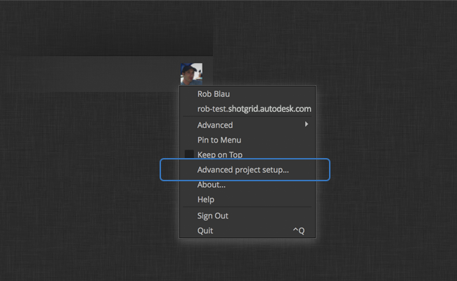
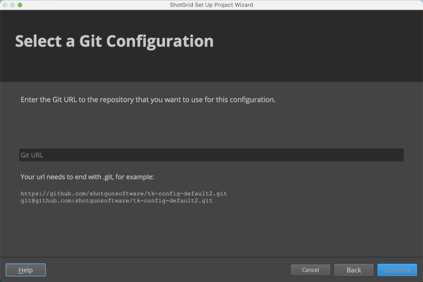
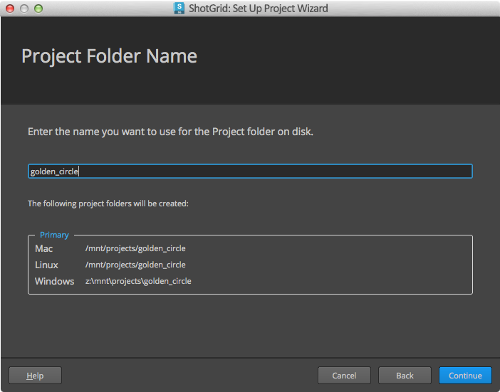

#  Integrations Admin Guide

## Introduction

This document serves as a guide for administrators of  integrations. It's one of three: user, admin, and developer. Our  [User Guide](https://support.shotgunsoftware.com/hc/en-us/articles/115000068574)  is intended for artists who will be the end users of  integrations in their daily workflow, and our  [Developer Guide](https://support.shotgunsoftware.com/hc/en-us/articles/115000067513)  is technical documentation for those writing Python code to extend the functionality. This document falls between those two: it's intended for those who are implementing  integrations for a studio, managing software versions, and making storage decisions for published files.

## Standard Pipeline Configurations

At the heart of any Toolkit setup is the Pipeline Configuration, a set of YAML files that manage everything from installed apps to software versions, and in some cases, even hold the templates for setting up your production directory structure and file names. The Pipeline Configuration is highly customizable, but we offer two starting points.

### The Basic Config

Our out-of-the-box integrations are designed to run without the need to set up or modify any configuration files. When you use our out-of-the-box integrations, there's nothing to administer, but Toolkit uses an implied Pipeline Configuration under the hood, and we call this Pipeline Configuration the Basic Config. The Basic Config makes three Toolkit apps – The Panel, Publisher, and Loader – available in all supported software packages, and looks to your Software Entities in  to determine which software packages to display in  Desktop. The Basic Config does not include filesystem location support. When you use out-of-the-box integrations on a project, your copy of the Basic Config is auto-updated whenever you launch Desktop, so you'll always have the latest version of our integrations. You can  [subscribe to release notes here](https://support.shotgunsoftware.com/hc/en-us/sections/115000020494-Integrations), and  [see the Basic Config in Github here](https://github.com/shotgunsoftware/tk-config-basic/).

### The Default Config

This is the default starting point for our Advanced project setup. It includes  [filesystem location support](https://support.shotgunsoftware.com/hc/en-us/articles/219039868-Integrations-File-System-Reference)  and a wider array of Toolkit apps and engines.

You can  [see the Default Config in Github here](https://github.com/shotgunsoftware/tk-config-default2). For a detailed description of the Default Config's structure, see the  `config/env/README.md`  file in your Pipeline Configuration, or  [view it here in Github](https://github.com/shotgunsoftware/tk-config-default2/blob/master/env/README.md).

If you're familiar with the old structure of the Default Config, take a look at the  [Default Config Update FAQ](https://support.shotgunsoftware.com/hc/en-us/community/posts/115003376154-Default-Configuration-Update-FAQ).



## The Publisher

The Publisher is designed to ease the transition between the out-of-the-box workflow and the full pipeline configuration. In the out-of-the-box setup, files are published in place, which avoids the need to define templates or filesystem schema. Once a project has gone through the advanced setup and has a full Pipeline Configuration, the same publish plugins will recognize the introduction of templates to the app settings and begin copying files to their designated publish location prior to publishing. Studios can therefore introduce template-based settings on a per-environment or per-DCC basis as needed for projects with full configurations. The Default Config comes fully configured for template-based workflows and is a good reference to see how templates can be configured for the Publish app. See the  [tk-multi-publish2.yml file](https://github.com/shotgunsoftware/tk-config-default2/blob/master/env/includes/settings/tk-multi-publish2.yml)  in the Default Config in Github for more info.

For details on writing plugins for the Publisher, see the  [Publisher section of our Developer Guide](https://support.shotgunsoftware.com/hc/en-us/articles/115000067513-Integrations-Developer-Guide#Publisher).

## Configuring software launches

It’s simple to rely on ’s auto-detection of host applications on your system: just launch  Desktop, choose a project, and Desktop will display launchers for all supported software packages that it finds in standard application directories. But we also offer robust tools for more fine-grained management of the software in your studio. You can restrict application visibility to specific projects, groups, or even individual users. You can specify Versions, deactivate a given software package across your site, and group software packages together. All of this is managed through Software entities in .

When you create a new  site, it will have a set of default Software entities—one for each supported host application. You can modify these and add your own to manage the software that shows up in Desktop exactly how you want it.

To see your Software entities in , open the Admin menu by clicking on the profile icon in the upper right corner of the screen, and choose  `Software`.

The Software entity has the following fields:

-   **Software Name:**  The display name of the Software in Desktop.
-   **Thumbnail:**  Uploaded image file for Desktop icon.
-   **Status:**  Controls whether or not the Software is available.
-   **Engine:**  The name of the integration for the content creation tool.
-   **Products:**  For Software packages that include variants (e.g., Houdini vs. Houdini FX), you can specify a comma separated list here. Valid only in auto-detect mode, not manual mode.
-   **Versions:**  Specific versions of the software to display. You can specify a comma separated list here. Valid only in auto-detect mode, not manual mode.
-   **Group:**  Entities with the same value for the  `Group`  field will be grouped under a single icon in Desktop and a single menu in . For example, you could create an FX group that includes Houdini and Nuke.
-   **Group Default**: When one member of a group has  `Group Default`  checked, clicking the icon or menu item for the group will launch this software.
-   **Projects:**  A way to restrict software to certain projects.
-   **User Restrictions:**  A way to restrict software to certain users or groups.
-   **Linux/Mac/Windows Path:**  Use these fields to explicitly specify an OS-specific path to software.
-   **Linux/Mac/Windows Args:**  Commandline args to append to the command when launching the Software.

We can learn a lot about how these fields work together by demonstrating some ways of using them.

### Example: Grouping versions of the same application, auto-detect

Say you have three versions of Maya on your filesystem: Maya 2016, Maya 2017, and Maya 2018. You want to make all of these available to your artists, but you want them to be grouped under a single icon in Desktop.

If these three versions of Maya are installed in the standard location on your filesystem, then this will all happen automatically. When you select a project in Desktop, it will scan the standard applications directory on the local machine, and will find the three versions. Since you already have a Maya software entity in , with no specific versions or paths specified, it will display all versions it finds in Desktop.


A few things to note here:

-   When  auto-detects your software, a single Software entity generates the menu items for all versions.
-   None of the Path fields have values specified. The Software entity is in auto-detect mode, so the App is assumed to be in the standard location.

These will show up in Desktop as you see here: one icon for Maya, with a drop-down listing all the available versions. If you click on the icon itself, you’ll launch the latest version of Maya.

### Example: Grouping versions of the same application, manual mode

It’s perfectly fine to store Maya in a non-standard location in your studio. You’ll just need to create your own Software entities, and specify paths to let  know where to find your software. Your setup may look like this:


Some notes here:

-   Unlike in auto-detect mode, here you have a Software entity for each version of a given software package.
-   In order to group them together, use the  `Group`  and  `Group Default`  fields. Software entities that share the same value for  `Group`  will be grouped in Desktop in a dropdown under a single icon, which uses the  `Group`  value as its name.
-   When you click on that icon itself, you’ll launch the software within the group with  `Group Default`checked.
-   **When you specify a value for  _any_  of Linux Path, Mac Path, or Windows Path on a Software entity, that entity will shift to Manual mode.**  Unlike auto-detect mode, where the software  _would_  show up in Desktop when a path field is empty, in manual mode, a software package will  _only_  show up on a given operating system if a path is specified for it and the file exists at the specified path.
-   In this example, none of the three Maya versions would show up in Desktop on Windows because no  `Windows Path`  has been specified.

### Example: Restrict by users or groups

Now, say with that last example that we’re not ready to make Maya 2018 available to all users just yet. But we do want TDs, Devs, and our QA engineer, Tessa Tester, to be able to access it. We can achieve this with the  `User Restrictions`  field. Here’s an example:


We made a couple changes from the last example:

-   The group default is now Maya 2017. We want that to be the production version, so with that box checked, clicking the icon for Maya will now go to this version.
-   We’ve added a few values to the  `User Restrictions`  field: It can take both users and groups, and we’ve added our Dev and TD groups, as well as the user Tessa Tester. Now, only those people will see Maya 2018 in Desktop.

### Example: Restrict software versions by project

Sometimes you want to do more complex version management across projects in your studio. You may have a project in a crunch to deliver, which you want to lock off from new versions of software, while at the same time, its sequel may just be starting up and able to evaluate newer versions. In this case, you may have your Software entities set up like this:


A few important things to note:

-   We’ve removed the  `Group`  and  `Group Default`  values here, as only one Maya version will ever show up in Desktop for a given environment.
-   We’ve set the  `Software Name`  for all three versions to “Maya”. This way, on every project, users will have an icon with the same name, but it will point to different versions depending on what’s configured here.
-   We’ve set Maya 2016’s  `Status`  field to  `Disabled`. We are no longer using this version in our studio, and this field toggles global visibility across all projects.
-   We’ve specified values for  `Projects`  for Maya 2017 and Maya 2018. This  `Projects`  field acts as a restriction. Maya 2017 will  _only_  show up in the Chicken Planet project, and Maya 2018 will only show up in Chicken Planet II.
-   Note that once you’ve specified a value for  `Projects`  for a Software entity, that Software will only show up in the projects you've specified. So, if you have other projects in your studio in addition to the Chicken Planet series, you’ll need to specify software for them explicitly.

### Example: Add your own Software

There are several reasons you might add a new software entity in addition to those that  Desktop has auto-detected on your system:

-   You want to make an application for which there is no engine available to your users through Desktop.
-   You have in-house software, or third-party software that we don’t have an integration for, for which you’ve written your own engine.
-   Your software doesn’t live in a standard location, so you want to point  to it manually. (This case was described in the “Grouping versions of the same Application, Manual mode” example above.)

In these cases, you can add your own Software entities. You'll need to have a value for the  `Software Name`field. If you're using an in-house engine for your software, specify the engine name in the  `Engine`  field. Some studios may want to include apps in Desktop that don’t have  integrations, as a convenience for artists. Your artists can launch the app straight from Desktop. You can even use all of the settings above to manage versions and usage restrictions. In this case, leave the  `Engine`  field empty, but you'll need to specify a value for at least one of  `Mac Path`,  `Linux Path`, and  `Windows Path`.

## Configuring published file path resolution

When you publish a file, the Publisher creates a PublishedFile entity in , which includes a  [File/Link](https://support.shotgunsoftware.com/hc/en-us/articles/219031008-Field-types)  field called  `Path`. Later on, a different user may try to load this file into their own work session using the Loader. The Loader uses complex logic to resolve a valid local path to the PublishedFile across operating systems.

The way in which the Loader attempts to resolve the publish data into a path depends on whether the the publish is associated with a local file link or a  `file://`  URL.

### Resolving local file links

Local file links are generated automatically at publish time if the path you are publishing matches any local storage defined in the  Site Preferences. If the publish is a local file link, its local operating system representation will be used. Read more about local file links  [here](https://support.shotgunsoftware.com/hc/en-us/articles/219030938-Linking-to-local-files).

If a local storage doesn’t define a path for the operating system you are currently using, you can use an environment variable to specify your local storage root. The name of the environment variable should take the form of  `SHOTGUN_PATH_<WINDOWS|MAC|LINUX>_<STORAGENAME>`. So, if you wanted to define a path on a Mac for a storage root called "Renders", you'd create a  `SHOTGUN_PATH_MAC_RENDERS`  environment variable. Let's go deeper with that example:

-   Say your  site has a storage root called "Renders", with the following paths specified:
-   Linux path:  `/studio/renders/`
-   Windows path:  `S:\renders\`
-   Mac path:  `<blank>`
    
-   You are on a Mac.
    
-   You want to load a publish with the path  `/studio/renders/sq100/sh001/bg/bg.001.exr`  into your session.

The Loader can parse the path and deduce that  `/studio/renders/`  is the storage root part of it, but no storage root is defined for Mac. So, it will look for a  `SHOTGUN_PATH_MAC_RENDERS`  environment variable, and if it finds one, it will replace  `/studio/renders`  in the path with its value.

**Note:**  If you define a  `SHOTGUN_PATH_MAC_RENDERS`  environment variable, and the local storage Renders  _does_have Mac path set, the local storage value will be used and a warning will be logged.

**Note:**  If no storage can be resolved for the current operating system, a  `PublishPathNotDefinedError`  is raised.

### Resolving file URLs

The Loader also supports the resolution of  `file://`  URLs. At publish time, if the path you are publishing does not match any of your site's local storages, the path is saved as a  `file://`  URL. Contrary to local file links, these paths are not stored in a multi-OS representation, but are just defined for the operating system where they were created.

If you are trying to resolve a  `file://`  URL on a different operating system from the one where where the URL was created, the Loader will attempt to resolve it into a valid path using a series of approaches:

-   First, it will look for the three environment variables  `SHOTGUN_PATH_WINDOWS`,  `SHOTGUN_PATH_MAC`, and  `SHOTGUN_PATH_LINUX`. If these are defined, the method will attempt to translate the path this way. For example, if you are trying to resolve  `file:///prod/proj_x/assets/bush/file.txt`  on Windows, you could set up  `SHOTGUN_PATH_WINDOWS=P:\prod`  and  `SHOTGUN_PATH_LINUX=/prod`  in order to hint the way the path should be resolved.
-   If you want to use more than one set of environment variables, in order to represent multiple storages, this is possible by extending the above variable name syntax with a suffix:
-   If you have a storage for renders, you could for example define  `SHOTGUN_PATH_LINUX_RENDERS`,  `SHOTGUN_PATH_MAC_RENDERS`, and  `SHOTGUN_PATH_WINDOWS_RENDERS`  in order to provide a translation mechanism for all  `file://`  URLs published that refer to data inside your render storage.
-   Then, if you also have a storage for editorial data, you could define  `SHOTGUN_PATH_LINUX_EDITORIAL`,  `SHOTGUN_PATH_MAC_EDITORIAL`, and  `SHOTGUN_PATH_WINDOWS_EDITORIAL`, in order to provide a translation mechanism for your editorial storage roots.

Once you have standardized on these environment variables, you could consider converting them into a  local storage. Once they are defined in the  preferences, they will be automatically picked up and no environment variables will be needed.

-   In addition to the above, all local storages defined in the  preferences will be handled the same way.
-   If a local storage has been defined, but an operating system is missing, this can be supplied via an environment variable. For example, if there is a local storage named  `Renders`  that is defined on Linux and Windows, you can extend to support mac by creating an environment variable named  `SHOTGUN_PATH_MAC_RENDERS`. The general syntax for this is  `SHOTGUN_PATH_<WINDOWS|MAC|LINUX>_<STORAGENAME>`.
-   If no root matches, the file path will be returned as is.

Here's an example:

Say you've published the file  `/projects/some/file.txt`  on Linux, and a  publish with the URL  `file:///projects/some/file.txt`  was generated. In your studio, the Linux path  `/projects`  equates to  `Q:\projects`  on Windows, and hence you expect the full path to be translated to  `Q:\projects\some\file.txt`.

All of the following setups would handle this:

-   A general environment-based override:
-   `SHOTGUN_PATH_LINUX=/projects`
-   `SHOTGUN_PATH_WINDOWS=Q:\projects`
-   `SHOTGUN_PATH_MAC=/projects`
    
-   A  local storage called “Projects”, set up with:
    
-   Linux Path:  `/projects`
-   Windows Path:  `Q:\projects`
-   Mac Path:  `/projects`
    
-   A  local storage called “Projects”, augmented with an environment variable:
    
-   Linux Path:  `/projects`
-   `Windows Path:``
-   `Mac Path:`/projects`
-   `SHOTGUN_PATH_WINDOWS_PROJECTS=Q:\projects`

**Note:**  If you have a local storage  `Renders`  defined in  with  `Linux path`  set, and also a  `SHOTGUN_PATH_LINUX_RENDERS`  environment variable defined, the storage will take precedence, the environment variable will be ignored, and a warning will be logged. Generally speaking, local storage definitions always take precedence over environment variables.

### Advanced configuration

For information on the underlying method that performs the resolution of PublishedFile paths, take a look at our  [developer reference docs](http://developer.shotgridsoftware.com/tk-core/utils.html#sgtk.util.resolve_publish_path).

If you are using Advanced Project Setup, you can add support beyond local file links and  `file://`  URLs by customizing the  `resolve_publish`  core hook. Possible customizations include:

-   Publishes with associated uploaded files could be automatically downloaded into an appropriate cache location by the core hook and the path would be be returned.
-   Custom URL schemes (such as  `perforce://`) could be resolved into local paths.

## Browser Integration

Browser integration for  Toolkit refers to access to Toolkit apps and launchers by way of right-click context menus in the  web application. These menus, an example of which is shown above, contain actions configured for various entity types. In the case where you have multiple pipeline configurations for a project, the actions are organized by pipeline configuration. Browser integration allows you to launch content creation software like Maya or Nuke that is aware of your  context, right from the browser.


### A Brief History of Browser Integration

Over the years,  Toolkit’s browser integration has taken several forms. As technologies and security requirements have progressed, so has the approach to implementing browser integration.

**Java Applet (deprecated)**

The first implementation consisted of a Java applet that provided access to the local desktop from the  web application. As Java applets became recognized as an exploitable security risk, they fell out of favor, necessitating its deprecation.

**Browser Plugin (deprecated)**

Replacing the deprecated Java applet was a browser plugin making use of NPAPI to access the local desktop from the  web application. As NPAPI also became known as a security risk, the major web browsers began blocking its use. This necessitated deprecating the browser plugin.

**Websockets v1 via  Desktop (legacy)**

Hosting a websocket server within the  Desktop app was, and still is, the approach to communicating with the local desktop from the  web application. The first implementation of this websocket server’s RPC API made use of the same underlying technology developed for the Java applet and browser plugin before it. When the server received a request from , the tank command from the associated project’s pipeline configuration was used to get the list of commands to show in the action menu.

**Websockets v2 via  Desktop**

The second iteration of the websocket server’s RPC API changes the underlying mechanism used to get, cache, and execute Toolkit actions. This implementation addresses a number of performance issues related to the earlier browser integration implementations, improves the visual organization of the action menus, and adds support for  [out-of-the-box  Integrations](https://support.shotgunsoftware.com/hc/en-us/articles/115000068574-User-Guide#Getting%20started%20with%20Shotgun%20Desktop), which work without explicitly configuring Toolkit. This is the current implementation of browser integration.

### Configuration

To control what actions are presented to the user for each entity type, you modify YAML environment files in your project’s pipeline configuration. There are a few things to understand and consider when first attempting customization.

**Which engine configuration?**

The Toolkit engine that manages Toolkit actions within the  web app is  `tk-shotgun`, so it’s this engine’s configuration that controls what shows up in the action menus.


In the above example from  [tk-config-basic](https://github.com/shotgunsoftware/tk-config-basic/), there are two apps configured that will result in a number of engine commands turned into menu actions. Toolkit apps will register commands that are to be included in the action menu, including launcher commands for each software package found on the local system that correspond to the list of  [Software entities](https://support.shotgunsoftware.com/hc/en-us/articles/115000067493#Configuring%20software%20launches)  in the  site. The result is the list of menu actions shown here:


The browser integration code found installations of Houdini, Maya, Nuke, and Photoshop on the user's system, which resulted in menu actions for launching each of those integrations. Note that in a given environment configuration file, the  _engine_  for a Software entity needs to be present in order for that Software's launcher to show up for entities of that environment. So, in this example, the  `tk-houdini`,  `tk-maya`,  `tk-nuke`, and  `tk-photoshopcc`  engines must all be present in the file from which this snippet was taken. If you wanted to remove, for example, Maya from the list of launchers on this entity, you could just remove the  `tk-maya`  engine block from the environment config file.

In addition to these launchers, the Publish app’s “Publish…” command is included in the menu.

**Which YML file?**

You can take one of two paths: making use of the primary environment configuration (`config/env/*.yml`), as controlled by the config’s  [pick_environment.py core hook](https://github.com/shotgunsoftware/tk-core/blob/master/hooks/pick_environment.py), or the legacy approach employed by  [tk-config-default](https://github.com/shotgunsoftware/tk-config-default/), which uses  `config/env/shotgun_<entity_type>.yml`  files.

In the case where the standard environment files are used, browser integration uses the  `pick_environment`core hook to determine which environment configuration file to use for a given entity’s action menu. In the simplest case, the environment corresponds to the entity type. For example, if you right-click on a Shot, the resulting action menu will be configured by the  `tk-shotgun`  block in  `config/env/shot.yml`. You can customize the  `pick_environment`  hook to use more complex logic. Should there be no  `tk-shotgun`  engine configured in the standard environment file, a fallback occurs if a  `shotgun_<entity_type>.yml`  file exists. This allows browser integration to work with legacy configurations that make use of the entity-specific environment files.

**_Tip: Removing Software from the Browser Launchers with tk-config-default2_**

Updating the configuration for launching software from the  browser varies from tk-config-default to tk-config-default2.

With tk-config-default2, updates should be applied to config/env/includes/settings/[`tk-shotgun.yml`](https://github.com/shotgunsoftware/tk-config-default2/blob/v1.1.10/env/includes/settings/tk-shotgun.yml), whereas in tk-config-default, they were done in config/env/`shotgun_task.yml`.

As an example, let’s remove Mari from the list of options when launching from an Asset through the browser.

First, navigate to  [`config/env/asset.yml`](https://github.com/shotgunsoftware/tk-config-default2/blob/v1.1.10/env/asset.yml#L47)  and notice how the  `tk-shotgun`  engine engine block is pointing to  [`@settings.tk-shotgun.asset`](https://github.com/shotgunsoftware/tk-config-default2/blob/v1.1.10/env/asset.yml#L47). The  `@`  symbol signifies that the value for the configuration is coming from an included file. This means you'll need to go to your  [env/includes/settings/`tk-shotgun.yml`](https://github.com/shotgunsoftware/tk-config-default2/blob/v1.1.10/env/includes/settings/tk-shotgun.yml)  to make the update.

While in your  `env/includes/settings/tk-shotgun.yml`, notice how each block is per Entity. So, for instance, Asset first:
```
<a name="asset"></a>
# asset
settings.tk-shotgun.asset:
  apps:
    tk-multi-launchapp: "@settings.tk-multi-launchapp"
    tk-multi-launchmari: "@settings.tk-multi-launchapp.mari"
    tk-multi-launchmotionbuilder: "@settings.tk-multi-launchapp.motionbuilder"
    tk-multi-publish2: "@settings.tk-multi-publish2.standalone"
    tk-multi-screeningroom: "@settings.tk-multi-screeningroom.rv"
    tk-shotgun-folders: "@settings.tk-shotgun-folders"
    tk-shotgun-launchfolder: "@settings.tk-shotgun-launchfolder"
  location: "@engines.tk-shotgun.location"
  ```

To remove Mari from the list of options on an Asset in the browser, remove the Mari line ([`tk-multi-launchmari: "@settings.tk-multi-launchapp.mari"`](https://github.com/shotgunsoftware/tk-config-default2/blob/master/env/includes/settings/tk-shotgun.yml#L29)):

```
<a name="asset"></a>
# asset
settings.tk-shotgun.asset:
  apps:
    tk-multi-launchapp: "@settings.tk-multi-launchapp"
    tk-multi-launchmotionbuilder: "@settings.tk-multi-launchapp.motionbuilder"
    tk-multi-publish2: "@settings.tk-multi-publish2.standalone"
    tk-multi-screeningroom: "@settings.tk-multi-screeningroom.rv"
    tk-shotgun-folders: "@settings.tk-shotgun-folders"
    tk-shotgun-launchfolder: "@settings.tk-shotgun-launchfolder"
  location: "@engines.tk-shotgun.location"
```

Then, follow the same instructions for each entity (like Shot) from which you'd like to remove the ability to launch a particular software in the  browser. Note that once you save the file, you may need to wait a minute and hard-refresh the browser for it to take effect.

### Caching

Browser integration has a robust caching mechanism, which allows menu actions to be shown to the user as quickly as possible. This is necessary because the process of bootstrapping Toolkit and getting a list of engine commands can be time consuming.

**When is the cache invalidated?**

The websocket server’s RPC API looks at two things to determine whether the cached data is still valid: YAML file modification times, and the contents of the site’s Software entities. If one of the environment YAML files in a given config has been modified since the cache data was written, the requisite data is recached and fresh data returned to the  web application. Similarly, if any field on any Software entity in  has been modified since the data was cached, Toolkit is bootstrapped and new data is cached.

**Where is the cache file on disk?**

The cache file location is dependent upon the operating system.`

```
OS X: ~/Library/Caches/Shotgun/<site_name>/site.basic.desktop/tk-desktop
Windows: %APPDATA%\Shotgun\<site_name>\site.basic.desktop\tk-desktop
Linux: ~/.shotgun\<site_name>\site.basic.desktop\tk-desktop
```

### Hook Methods

A  `browser_integration.py`  hook is included in  `tk-framework-desktopserver`, which provides the following hook methods:

-   `get_cache_key`: This method determines the cache entry's key for the given configuration URI, project entity, and entity type. The default implementation combines the configuration URI and entity type.
-   `get_site_state_data`: This method can be used to include additional queried data from  into the hash that's used to test the validity of cached data. By default, the state of all Software entities that exist on the site are used, but if additional data should be included in the hash, that can be implemented in this hook method.
-   `process_commands`: This method provides a place to customize or alter the commands that are to be returned to the  web application. The data structure provided to the method is a list of dictionaries, with each dictionary representing a single menu action. Data can be altered, filtered out, or added into the list as is necessary and will be reflected in the menu requesting Toolkit actions immediately.

### Logs

Logs for browser integration can be found in Toolkit’s  [standard log location](https://developer.shotgridsoftware.com/38c5c024/). The relevant log files are  `tk-desktop.log`  and  `tk-shotgun.log`. In addition, if you are using Google Chrome, some relevant log output is sometimes available in the developer console within the browser.

### Troubleshooting

The complex nature of communicating from a web application with the local desktop means that there are possible points of failure along the way. Below are a few such situations and some suggestions of first steps to take when you encounter them.

**“Open or install  Desktop…” shown in the action menu**


This likely means one of three things:

1.   Desktop is not currently running on the local machine. It seems obvious, but it is definitely worth double checking.
    
2.  Chrome or the Python websocket server has refused the connection, resulting in the  web application being unable to communicate with  Desktop. This situation is most likely related to the self-signed certificates that allow the connection to proceed when requested. Regenerating these certificates from scratch often resolves the issue, and can be triggered from  Desktop, as shown below.
    


1.   Desktop’s websocket server failed to start on launch. This situation is likely limited to situations where a bad release of the websocket server has gone out to the public, which should be exceedingly rare. In this situation, logging will be present in  [tk-desktop.log](https://developer.shotgridsoftware.com/38c5c024/)  explaining the error, which can be  [sent to ’s support team](https://support.shotgunsoftware.com/hc/en-us/requests/new).

**No actions are shown in the action menu**


This is indicative of a configuration problem if actions were expected for this entity type. Some possible issues:

1.  The  `tk-shotgun`  engine is configured in the correct environment YAML file, but there are no apps present in that configuration. In this case, it’s likely that the intention was for no actions to be present for this entity type.
    
2.  The  `tk-shotgun`  engine is configured in the correct environment YML file, and apps are present, but actions still do not appear in the menu. This is likely due to apps failing to initialize. In this case, there will be information in  [tk-shotgun.log and tk-desktop.log](https://developer.shotgridsoftware.com/38c5c024/)  describing the problems.
    
3.  The environment that corresponds to this entity type does not contain configuration for  `tk-shotgun`. The end result here is the same as #1 on this list. In this case, you can look at the pipeline configuration’s  `pick_environment`  hook to determine which environment is being loaded for this entity type, and the configuration of  `tk-shotgun`  can be verified there.
    
4.  There is an empty list of menu actions cached on disk. To force the cache to be regenerated, there are a few options:
    
    -   Update the modification time of a YAML file in your project's configuration. This will trigger a recache of menu actions when they are next requested by . Worth noting is that this will trigger a recache for  _all_  users working in the project.
    -   Update the value of a field in any of the Software entities on your  site. The behavior here is the same as the above option concerning YAML file modification time, but will invalidate cached data for all users in  _all_  projects on your  site. Software entities are non-project entities, which means they're shared across all projects. If data in any of the Software entities is altered, all projects are impacted.
    -   The cache file can be deleted on the host suffering from the problem. It is typically safe to remove the cache, and since it is stored locally on each host, it will only cause data to be recached from scratch on that one system. The cache is stored in the following SQLite file within your  cache location:  `<site-name>/site.basic.desktop/tk-desktop/shotgun_engine_commands_v1.sqlite`

**“Toolkit: Retrieving actions…” is never replaced with menu actions**


There are a few possibilities for this one:

1.  The websocket server has not yet finished caching actions. If this is the first time actions are being retrieved after a significant update to the project’s config, the process can take some time to complete. Wait longer, and observe the contents of  `tk-desktop.log`  to see if processing is still occurring.
    
2.  The websocket server has failed to respond and never will. This situation should be rare, but if it becomes obvious that there is no additional processing occurring as a result of the request for actions, as seen in  `tk-desktop.log`,  [contact Shotgun support](https://support.shotgunsoftware.com/hc/en-us/requests/new), providing relevant log data.
    
3.  The user is working in more than one  site. With  Desktop authenticated against a single site, requesting menu actions from a second  site results in the user being queried about restarting  Desktop and logging into the new site. If that request is ignored, the second site will never receive a list of menu actions.
    

## Toolkit Configuration File

If your studio is using a proxy server, if you want to pre-populate the initial login screen with some values, or if you want to tweak how the browser-based application launcher integrates with  Desktop, there is a special configuration file called  `toolkit.ini`.  Desktop does not require this file in order to run; it’s only needed if you need to configure its behavior. Toolkit looks for the file in multiple locations, in the following order:

1.  An environment variable named  `SGTK_PREFERENCES_LOCATION`  that points to a file path.
2.  Inside the  Toolkit preferences folder: (Note that this file does not exist by default in these locations; you must create it.)
    -   Windows:  `%APPDATA%\Shotgun\Preferences\toolkit.ini`
    -   macOS:  `~/Library/Preferences/Shotgun/toolkit.ini`
    -   Linux:  `~/.shotgun/preferences/toolkit.ini`

The  `SGTK_PREFERENCES_LOCATION`  environment variable option allows you to store your configuration file somewhere else on your computer or on your network. Please note that  `toolkit.ini`  is the current standard file name. If you were using  `config.ini`, check below in the  _“Legacy Locations”_  section.

You can see a documented example of a configuration file  [here](https://raw.githubusercontent.com/shotgunsoftware/tk-framework-desktopstartup/master/config.ini.example).

Please note that this example file is called  `config.ini`  but it can be just renamed to  `toolkit.ini`

Please also note that you can use environment variables as well as hard coded values in this file, so that you could, for example, pick up the default user name to suggest to a user via the USERNAME variable that exists on Windows.

  

**Legacy Locations (DEPRECATED)**

Although  `toolkit.ini`  is the current standard file name, we previously used a  `config.ini`  file for same purpose. The contents of  `toolkit.ini`  and  `config.ini`  are the same. The  `config.ini`  will be searched for using the following deprecated locations:

1.  An environment variable named  `SGTK_DESKTOP_CONFIG_LOCATION`  that points to a file.
2.  In the following paths:
    -   Windows:  `%APPDATA%\Shotgun\desktop\config\config.ini`
    -   macOS:  `~/Library/Caches/Shotgun/desktop/config/config.ini`
    -   Linux:  `~/shotgun/desktop/config/config.ini`

**Proxy Configuration**

If your studio is accessing the internet through a proxy, you’ll need to tell Toolkit to use this proxy when it accesses the Internet. Do so by specifying your proxy as the value of the  `http_proxy`  setting:

`http_proxy: <proxy_server_address>`

**Running  Desktop with a locally hosted site**

If your  site URL does not end with  `shotgunstudio.com` or `shotgrid.autodesk.com`, it means that you are running a local  site. In this case, it is possible that your site has not yet been fully prepared for  integrations and the  team may need to go in and do some small adjustments before you can get going! In this case,  [please submit a ticket](https://support.shotgunsoftware.com/hc/en-us/requests/new)  and we'll help sort you out.

**Connecting to the app store with a locally hosted site**

If you are using a local  site with access to the Internet through a proxy, you might want to set an HTTP proxy for accessing the app store, but not the local  website. To do this, simply add the following line to  `toolkit.ini`:

`app_store_http_proxy: <proxy_server_address>`

where  `<proxy_server_address>`  is a string that follows the convention documented  [in our developer docs.](http://developer.shotgridsoftware.com/python-api/reference.html?highlight=reference%20methods#shotgun-methods)

If you need to override this setting on a per-project basis, you can do so in  `config/core/shotgun.yml`  in your project’s Pipeline Configuration.

## Offline Usage Scenarios

In general use,  Desktop automatically checks for updates for the Desktop app itself, the tk-desktop engine, and the basic configuration at launch time. However, there are cases where you might want to run integrations while offline or on machines that are completely disconnected from the Internet. The following section describes how to address each of these scenarios.

###  Create

The approaches to resolving offline usage scenarios outlined in this document also apply to the integration features provided by  [ Create](https://support.shotgunsoftware.com/hc/en-us/articles/360012554734). The various environment variables used to tailor the behavior of  Toolkit, such as  `SHOTGUN_BUNDLE_CACHE_FALLBACK_PATHS`, apply when using  Create in the same ways as  Desktop.

### Running integrations while offline

_Scenario: I want to run  integrations, but I am not connected to the Internet. We have a local  install._

**Solution**

-   If you can temporarily connect to the internet, just download  Desktop. It comes prepackaged with a set of  [integrations](https://support.shotgunsoftware.com/hc/en-us/articles/115000068574-User-Guide#Introduction), and pre-bundled with all the apps and engines needed for the  integrations for all supported DCCs. When you start it up, it will automatically try to look for upgrades, but if it cannot connect to the  App Store, it will simply run the most recent version that exists locally.

**Good to know**

-   Some Toolkit operations (such as registering a Publish) require access to your  site. So, this solution only works for locally hosted sites.
-   Updates are downloaded to your local machine.
-   If you switch between being connected and disconnected, Desktop, as well as in-app integrations like those inside Maya and Nuke, will download upgrades at startup whenever they are connected.

### Managing updates via manual download

_Scenario: Our artist workstations are disconnected from the internet, so we cannot use the auto-updates in Desktop. We still want to get updates, but we have to download them via a single online machine and manually transfer them to artists or into a centralized location._

**Solution**

-   Run  Desktop on a workstation connected to the internet. When it starts up, the latest upgrades are automatically downloaded at launch time.
-   Option 1: Shared Desktop bundle
-   Copy the  [bundle cache](https://developer.shotgridsoftware.com/7c9867c0/)  to a shared location where all machines can access it.
-   Set the  `SHOTGUN_BUNDLE_CACHE_FALLBACK_PATHS`  environment variable on offline machines to point to this location.
-   When Desktop starts up on offline machines, they will pick up the latest upgrades that are available in the bundle cache.
-   Option 2: Local deployment
-   Distribute the updated bundle cache to the correct bundle cache location on each local machine.

**Good to know**

-   With Option 1, the Toolkit code will be loaded from the location defined in  `SHOTGUN_BUNDLE_CACHE_FALLBACK_PATHS`. If this location is on a shared storage, make sure that it is performant enough to load many small files.
-   For Windows setups, this is often not the case. Here we would instead recommend Option 2.

## Locking off updates

While Desktop’s auto-updates are handy for making sure you always have the latest, sometimes you’ll want to freeze a project, or even your whole site, locking it to a specific version and preventing any updates.

### Freezing updates for a single project

_Scenario: My project is about to wrap and I would like to freeze it so that no  integration updates are automatically downloaded._

**Solution**

-   Determine the version you want to lock your project to.  [You can find the integration releases here.](https://support.shotgunsoftware.com/hc/en-us/sections/115000020494-Integrations)
-   In , create a Pipeline Configuration entity for the project you want to lock down, with the following fields populated (In this example, we are locking down the config to use v1.0.36 of the integrations):
-   Name:  `Primary`
-   Project: The project you want to lock down
-   Plugin ids:  `basic.*`
-   Descriptor:  `sgtk:descriptor:app_store?name=tk-config-basic&version=v1.0.36`
    
-   Anyone starting  Desktop on the project will now always use v1.0.36. Any new users starting to work on the project will also get v1.0.36.
    


**Good to know**

-   Updates are downloaded to your local machine.
-   The next time a user launches Desktop while connected to the Internet,  `v1.0.36`  of the basic config, and all of its related code, will be downloaded to their machine.
-   `basic.*`  means that all plugins in the basic configuration will pick up this override. If, for example, you wanted to freeze the Nuke and Maya integrations only, you could specify  `basic.maya, basic.nuke`.
-   To test, you can create a duplicate of this Pipeline Configuration entity, and add your username to the  `User Restrictions`  field. This will restrict the entity such that it's only available to you and won't impact other users. You can then launch Maya or some other software from this duplicate configuration and confirm that it’s running the expected integrations versions.

**Known issues**

-   The Flame integration is namespaced  `basic.flame`, and so is implied to be part of  `basic.*`. However, the Flame integration isn't actually included in the basic config. So, if you are using Flame for a project and implement this override, the Flame integration will stop working.
-   The solution would be to create an additional Pipeline Configuration override specifically for flame:
-   Name:  `Primary`
-   Project: The project you want to lock down (or None for all projects)
-   Plugin ids:  `basic.flame`
-   Descriptor:  `sgtk:descriptor:app_store?name=tk-config-flameplugin`

### Freezing updates for your site

_Scenario: I don’t want any updates. I want full control over what is being downloaded and used in all projects in my studio._

**Solution**

-   Follow the steps in the above example, but leave the  `Project`  field blank. With no override in the  `Project`  field, this Pipeline Configuration entity will apply to all projects, including the “site” project, i.e., the site configuration that is used by Desktop outside of any project.


**Good to know**

-   This is the workflow to use if you want to “lock down the site config”. This would lock down everything, and you can then proceed with the advanced project setup via the Desktop menu.
-   If you lock down your entire site to use, for example,  `v1.2.3`, you can still lock down an individual project to use another config.

**Known issues**

-   Flame would be affected by this. See the ‘Known Issues’ section of the above scenario for a solution.

### Freezing updates for all but one project

_Scenario: I’d like to lock down all projects in our site, except for our test project, which we still want to allow to auto-update._


**Solution**

-   Freeze updates for your site as described in the above section.
-   Configure the exception project’s Pipeline Configuration entity to have the following field values:
-   Name:  `Primary`
-   Project: The project you want  _not_  to lock down
-   Plugin ids:  `basic.*`
-   Descriptor:  `sgtk:descriptor:app_store?name=tk-config-basic`

**Good to know**

-   Note that you’ve omitted the version number from the Descriptor field for the project. This will mean that the project is tracking the latest release of the basic config.

### Safely Upgrading a locked off site

-   Scenario: We’re locked down to v1.0.0, and we’d like to upgrade to v2.0.0, but first I want to test out the new version before deploying it to the studio.*

**Solution**

-   Duplicate the Pipeline Configuration entity in  by right-clicking on it and selecting "Duplicate Selected".
-   Name the cloned config “update test”, and assign yourself to the User Restrictions field.
-   You will now begin to use this Pipeline Configuration.
-   Change the descriptor to point to the version you wish to test.
-   You can invite any users you want to partake in testing by adding them to the User Restrictions field.
-   Once you are happy with testing, simply update the main Pipeline Configuration to use that version.
-   Once users restart Desktop or DCCs, the update will be picked up.

## Taking over a Pipeline Configuration

Without setting up any configurations, you get a basic set of  integrations out-of-the-box, and this document covers the kinds of administration you can do with these out-of-the-box integrations. This basic setup is built on top of 's Toolkit platform, which supports much richer customization. Within Desktop, the Toolkit Project Setup Wizard will lead you through the process of creating a full, customizable Pipeline Configuration for your project.

Each section below explains in detail each of the steps of the Wizard with examples and suggestions of sensible default values in case you are not sure how to set things up.

#### Launching the setup wizard from Desktop



Once you have navigated to a project there will be an "Advanced Project Setup..." menu item in the user menu in the bottom right hand of Desktop. Click on this menu item to launch the Toolkit Setup Wizard.

#### Select a configuration type


When you start configuring a new project, the first thing to decide is  _which configuration template to use_. A configuration template is essentially the complete project configuration with all settings, file system templates, apps and logic needed to run the project.

-   If this is your very first project, head over to the  defaults to get you started.
-   If you already have configured projects and configurations for previous projects, you can easily reuse these by basing your new project on an existing project
-   For advanced workflows, you can use external configurations or configs stored in git repositories.

#### Default configuration templates


This is the place to go if you want to start from scratch. The default configuration contain all the latest apps and engines set up with a default file structure and file naming convention.

Once you have installed the default configuration, you can manually tweak the configuration files and customize it to fit the specific needs of your pipeline. Once you have got a project up and running, you can base your next project on this configuration.

##### The Default Configuration

This is the default Toolkit VFX configuration and usually a great starting point when you start setting things up. It comes with 3dsmax, Flame, Houdini, Nuke, Mari, Maya, Motionbuilder, and Photoshop set up and contains a simple, straight forward folder setup on disk.

The configuration contains a number of different pieces:

-   A file system setup
-   A set of templates to identify key locations on disk
-   A set of preconfigured engines and apps which are chained together into a workflow.

**File System Overview**

The standard config handles Assets and Shots in . It breaks things down per Pipeline Step. A pipeline step is similar to a department. Each pipeline step contains work and publish areas for the various supported applications. The Shot structure looks like this:


**Applications and workflows**

The config contains the following components:

-   Maya, Mari, Nuke, 3dsmax, Flame, Houdini, Photoshop, and Motionbuilder support
-    Application Launchers
-   Publishing, Snapshotting, and Version Control
-   A Nuke custom Write Node
-    integration
-   A number of other tools and utilities

In addition to the apps above, you can easily install additional apps and engines once the config has been installed.

#### Basing your new project on an existing project


This is a quick and convenient way to get up and running with a new project with all the defaults and settings that you had in a previous project. Toolkit will simply copy across the configuration from your old setup to the new project. This is a simple and pragmatic way to evolve your configuration - each new project is based on an older project.

For more ways and documentation on how to evolve and maintain your pipeline configuration, see here:

[Managing your project configuration](https://support.shotgunsoftware.com/hc/en-us/articles/219033168#Inheriting%20the%20config%20from%20your%20previous%20project)

#### Using a configuration template from git



Use this option if you want to keep your project's configuration connected to source control. Specify a url to a remote git or github repository and the setup process will clone it for you. Note that this is not just github, but works with any git repository. Just make sure that the path to the repository ends with  `.git`, and Toolkit will try to process it as a git setup. Because your project configuration is a git repository, you can commit and push any changes you make to your master repository and beyond that to other projects. Using a github based configuration makes it easy to keep multiple Toolkit projects in sync. You can read more about it here:

[Managing your project configuration](https://support.shotgunsoftware.com/hc/en-us/articles/219033168#A%20studio%20configuration%20in%20git%20source%20control)

Please note that if you are running on Windows, you need to have git installed on your machine and accessible in your  `PATH`. On Linux and Mac OS X, it is usually installed by default.

#### Browsing for a configuration template


Use this option if you have a configuration on disk, either as a folder or zipped up as a zip file. This can be useful if someone has emailed a configuration to you or if you keep a master config on disk which you are basing all your projects on. This is usually an expert option and we recommend either using a config from another project or one of our app store default configs.

#### Setting up a storage

Each Toolkit project writes all its files and data to one or more shared storage locations on disk. For example, a configuration may require one storage where it keeps textures, one where it keeps renders and one where it stores scene files. Normally, these storages are controlled from within the  Site Preferences, under the  _File Management_  tab.

The Toolkit Setup wizard will ask you to map each storage root required by the configuration to a local storage in .


The required root is listed on the left with its description (as defined in the configuration's  `roots.yml`  file). On the right, a list of existing  local storages is listed. You must select a storage for each required root and enter a path for the current OS if one does not already exist in .

You can also add paths for other operating systems that have not been defined. Existing paths are locked to ensure you don't accidentally affect other projects that may be relying on that storage path. The mapping page in the wizard will ensure that you've mapped each required root and that each mapping is valid.

You can create a new local storage in the wizard as well by selecting the  `+New`  item at the end of the storage selection list. You will be prompted for a local storage name and path for the current OS.

Once the project is being set up, Toolkit will create a folder for each new project in each of the storage locations. For example, if your primary storage location is  `/mnt/projects`, a project called  _The Edwardian Cry_  would end up in  `/mnt/projects/the_edwardian_cry`. And if the config is using more than just the primary storage, each of the storages would end up with an  `the_edwardian_cry`  folder.

Your primary storage location is typically something like  `/mnt/projects`  or  `\\studio\projects`  and is typically a location where you are already storing project data, grouped by projects. It is almost always on a shared network storage.

#### Choosing a project folder name



Now it is time to choose a disk name for your project. This folder will be created in all the different storages which are needed by the configuration. You can see a quick preview in the UI - for most configurations this will only preview the primary storage, but if you are using a multi root config, additional storages will show up too. Toolkit will suggest a default project name based on the name in . Feel free to adjust it in order to create what is right for your setup.

#### Selecting a configuration location


Lastly, please decide where to put your configuration files on disk. Toolkit will suggest a location based on previous projects, so that they all end up in the same place on disk.

The configuration normally resides on a shared storage or disk, so that it can be accessed by all users in the studio who needs it. If you are planning on using more than one operating system for this project, make sure to enter all the necessary paths. All paths should represent the same location on disk. Often, the path can be the same on Mac OS X and Linux but will be different on Windows.

If this is your first project, you typically want to identify a shared area on disk where you store all your future pipeline configurations. This is typically a location where you store software or software settings shared across the studio. This could be something like  `/mnt/software/shotgun`. It may vary depending on your studio network and file naming conventions.

When you set up your first configuration, set it up with paths for all the platforms you use in your studio. This will make it easier later on to create an environment which is accessible from all machines. As a hypothetical example, if your project name is  _Golden Circle_  you may type in the following three paths:
```
linux:   /mnt/software/shotgun/golden_circle
macosx:  /servers/production/software/shotgun/golden_circle
windows: \\prod\software\shotgun\golden_circle
```

#### What can I do once I have a configuration?

Once you are up and running with your first configuration, please navigate to our 'next steps' documentation to learn more about how to configure and adjust Toolkit to better suite your studio needs:

[Beyond your first project](https://support.shotgunsoftware.com/hc/en-us/articles/219040688)

You can also learn more in our  [Advanced Project Setup documentation](https://support.shotgunsoftware.com/hc/en-us/articles/219039808-Index-of-Documentation).

## Advanced functionality

### Silent installs

If you are on a Windows network, you can use the argument "/S" to force the .exe  Desktop installer to do a silent install. Then you can push a copy of the shortcut to the executable to the startup folder.
