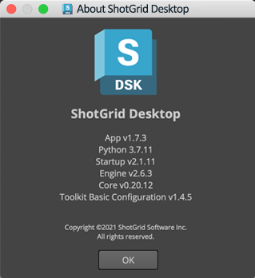

# Offline usage and Disabling auto updates

- [Auto updates](#auto-updates)
    - [What parts auto update?](#what-parts-auto-update)
    - [What doesn't auto update?](#what-doesnt-auto-update)
- [Running the integrations offline](#running-the-integrations-offline)
    - [Initial Setup](#initial-setup)
    - [Managing updates](#managing-updates)
- [Disabling auto updates](#disabling-auto-updates)
    - [Disabling updates for all but one project](#disabling-updates-for-all-but-one-project)
    - [Upgrading](#upgrading)

## Auto updates
### What parts auto update?

By default Shotgun Desktop will automatically check for updates, and install them to the local machine if it finds any.

It checks for updates on two components:

- `tk-framework-desktopstartup` - A frame work which aids the launch of Shotgun Desktop.
- `tk-config-basic` - The default site config.

The configuration acts as a manifest for the versions of the apps, engines, frameworks, and core version that should be used by Shotgun Desktop.
By updating the config, you are potentially updating any of these components as well.
Any updates that are found are downloaded and stored in the user's local cache, rather than modifying the original Shotgun Desktop installed files.

Shotgun Create as an application has it's own update mechanism separate from Shotgun Desktop which is not covered here.
However the integration features provided in Shotgun Create work in a similar way, and will also auto update `tk-config-basic` into the same user cache.

### What doesn't auto update?

If you have taken over a site configuration, then it won't check for newer `tk-config-basic` updates but more on that further down.
Also any projects that aren't using the default site configuration (I.e. a project where the Toolkit advanced setup wizard has been run on it.), will not have their configuration auto updated.

## Running the integrations offline

### Initial Setup

If your studio has restricted internet access or no internet access then you will need to ensure that you have all the required parts cached locally.
You will still need one machine that can connect to the internet in order to download Shotgun Create or Shotgun Desktop.

Shotgun Desktop comes prepackaged with all the dependencies required to run the basic integrations. 
Whilst Shotgun Create also comes bundled with the dependencies, it requires you to follow the steps mentioned in [Managing updates](#managing-updates). 
When you start either of them up, it will automatically try to look for updates, but if it cannot connect to the Shotgun App Store, it will simply run the most recent version that exists locally.

It is recommended that you follow the "Managing updates" steps bellow after installing Shotgun Desktop, as the components bundled with the installer may not be the latest.





### Managing updates

To update the `tk-framework-desktopstartup` component, you will need to [download the latest version](https://github.com/shotgunsoftware/tk-framework-desktopstartup/releases), and set the environment variable
`SGTK_DESKTOP_STARTUP_LOCATION` to point to its location on disk, (This only applies to Shotgun Desktop.) 

For the `tk-config-basic` component it's a bit more tricky, due to all its dependencies.

1. Run Shotgun Desktop or Shotgun Create on a workstation connected to the internet. When it starts up, the latest upgrades will be automatically downloaded.
(Ensure `SHOTGUN_DISABLE_APPSTORE_ACCESS` is not set on this machine.)
2. Copy the bundle cache to a shared location where all machines can access it.
3. Set the `SHOTGUN_BUNDLE_CACHE_FALLBACK_PATHS` environment variable on offline machines to point to this location.
4. When Shotgun Desktop or Shotgun Create starts up on offline machines, they will pick up the latest upgrades that are available in the bundle cache.



## Disabling auto updates



Follow these steps to disable automatic updates for the integrations.

1. Determine the version you want to stay at. You can find the integration releases [here](https://support.shotgunsoftware.com/hc/en-us/sections/115000020494-Integrations).
2. In Shotgun, create a Pipeline Configuration entity either on a project or on a global page, with the following fields populated (In this example, we are locking down the config to use v1.0.36 of the integrations):
   - Name: `Primary`
   - Project: Leave empty if you want updates disabled for all projects, or pick a specific project if you only want to lock down a single project.
   - Plugin ids: `basic.*`
   - Descriptor: `sgtk:descriptor:app_store?name=tk-config-basic&version=v1.0.36`
   
3. Start Shotgun Desktop, and if you left the project field empty then Shotgun Desktop will have switched over to using this version if it wasn't already doing so.

    

    If you set a project, then only that project will be affected and you won't see a change in the Shotgun Desktop about window. 
4. [Optional] To lock the version of `tk-framework-desktopstartup` you will need to [download the latest version](https://github.com/shotgunsoftware/tk-framework-desktopstartup/releases), and set the environment variable
`SGTK_DESKTOP_STARTUP_LOCATION` to point to its location on disk, (This only applies to Shotgun Desktop.)

It's The majority for the functionality is controlled by the config which can be locked down with the previous steps, however as mentioned in the "what parts auto update?" section, the 
 component is also updated and that is handled seperately from the config. This also only applies to Shotgun Desktop.

#### Good to know

- You don't need to download the release of the configuration manually, Shotgun Desktop will handle this when it launches or you enter the project.
- `basic.*` means that all plugins in the basic configuration will pick up this override. If, for example, you wanted to freeze the Nuke and Maya integrations only, you could specify `basic.maya`, `basic.nuke`.
- To test, you can create a duplicate of this Pipeline Configuration entity, and add your username to the `User Restrictions` field. This will restrict the entity such that it's only available to you and won't impact other users. You can then launch Maya or some other software from this duplicate configuration and confirm that it’s running the expected integrations versions.
- Leaving the project field blank is what we call a site configuration. Shotgun Desktop uses the site configuration, as it operates outside of projects. When you select a project in Shotgun Desktop it then loads the project configuration as well. 

- The Flame integration is namespaced `basic.flame`, and so is implied to be part of `basic.*`. 
However, the Flame integration isn't actually included in the basic config. So, if you are using Flame for a project and implement this override, the Flame integration will stop working.
The solution would be to create an additional Pipeline Configuration override specifically for flame:
    - Name: `Primary`
    - Project: The project you want to lock down (or None for all projects)
    - Plugin ids: `basic.flame`
    - Descriptor: `sgtk:descriptor:app_store?name=tk-config-flameplugin`

### Disabling updates for all but one project

If you have disabled updates on all projects as mentioned in the example above, but would like to enable updates on a specific project
You can

1. Disabling updates for your site as described in the above section.
2. Configure the exception project’s Pipeline Configuration entity to have the following field values:
    - Name: `Primary`
    - Project: The project you want not to lock down
    - Plugin ids: `basic.*`
    - Descriptor: `sgtk:descriptor:app_store?name=tk-config-basic`
    
    With the version number omitted from the Descriptor field, the project is now tracking the latest release of the basic config.

### Upgrading

When it comes to updating your configuration, you may wish to test out the newer version before rolling it out to all your users.

1. Duplicate the Pipeline Configuration entity in Shotgun by right-clicking on it and selecting **"Duplicate Selected"**.
2. Name the cloned config “update test”, and assign yourself to the User Restrictions field.
3. You will now begin to use this Pipeline Configuration.
4. Change the descriptor to point to the version you wish to test.
4. You can invite any users you want to partake in testing by adding them to the `User Restrictions` field.
5. Once you are happy with testing, simply update the main Pipeline Configuration to use that version.
6. Once users restart Shotgun Desktop and relaunch any currently open software with the Shotgun integration running, the update will be picked up.