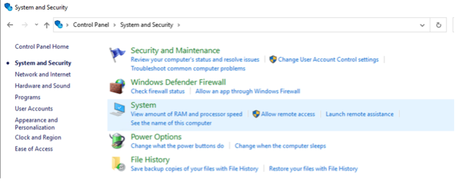
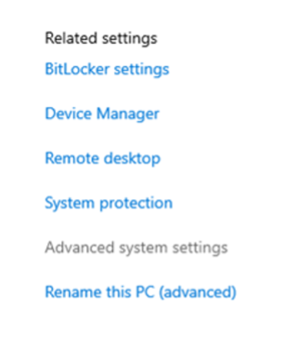
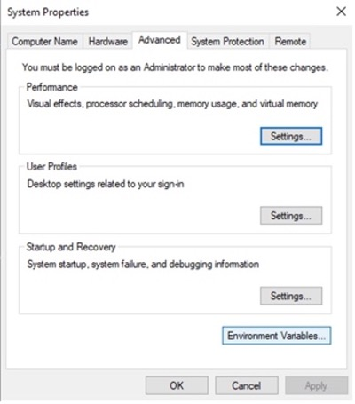
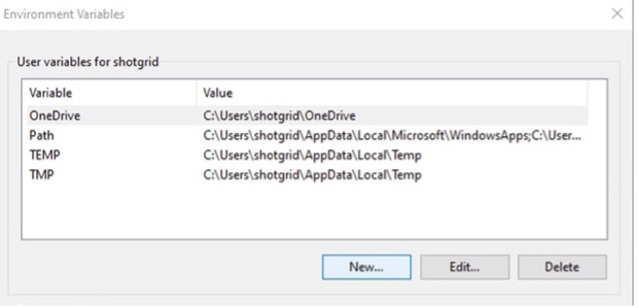
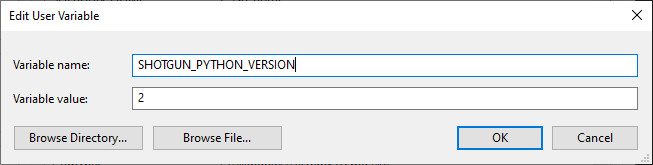
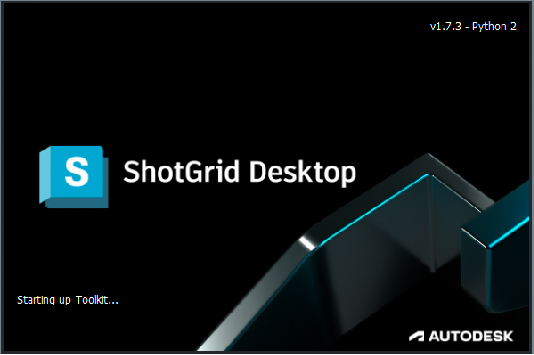

# Set Python 2 as the default Python version in  Desktop



- [Windows](#windows)
- [MacOS](#macos)
- [CentOS 7](#centos-7)

## Windows

### Manually Set the `SHOTGUN_PYTHON_VERSION` environment to 2 on Windows

- On the Windows taskbar, right-click the Windows icon and select **System**, navigate through the **Control Panel/System and Security/System**. 



- Once there, select **Advanced system settings**.



- Next, select **Environment Variables** in System Properties.



- In the **Environment Variables** window, you can add/edit your paths by selecting **New...**. 



- For the **Variable name**, add `SHOTGUN_PYTHON_VERSION`, and set the **Variable value** to `2`. 



- Restart the  Desktop application. Now, you should see that the Python version has been updated to run Python 2. 


## MacOS

### Set the `SHOTGUN_PYTHON_VERSION` environment to 2 on MacOS

- Create a properties file under `~/Library/LaunchAgents/` named `my.startup.plist`  

```
$ vi my.startup.plist
```

- Add the following to `my.startup.plist` and **save**:

```
<?xml version="1.0" encoding="UTF-8"?> 
<!DOCTYPE plist PUBLIC "-//Apple//DTD PLIST 1.0//EN" "http://www.apple.com/DTDs/PropertyList-1.0.dtd"> 
<plist version="1.0"> 
<dict> 
  <key>Label</key> 
  <string>my.startup</string> 
  <key>ProgramArguments</key> 
  <array> 
    <string>sh</string> 
    <string>-c</string> 
    <string>launchctl setenv SHOTGUN_PYTHON_VERSION 2</string> 
  </array> 
  <key>RunAtLoad</key> 
  <true/> 
</dict> 
</plist>
```

- After rebooting your Mac, the new environment variable will remain active.

- Restart the  Desktop application. Now, you should see that the Python version has been updated to run Python 2. 



## CentOS 7

### Set the `SHOTGUN_PYTHON_VERSION` environment to 2 on CentOS 7

- Add the following to your `~/.bashrc` file: 

```
export SHOTGUN_PYTHON_VERSION="2"
```

- Reboot your OS by running:  

```
$ sudo reboot 
```

- Restart the  Desktop application. Now, you should see that the Python version has been updated to run Python 2. 


