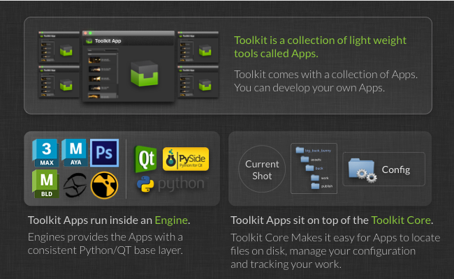
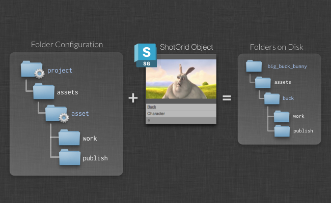
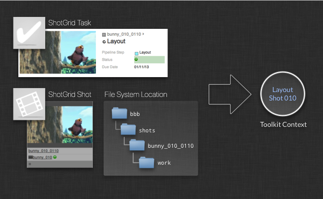
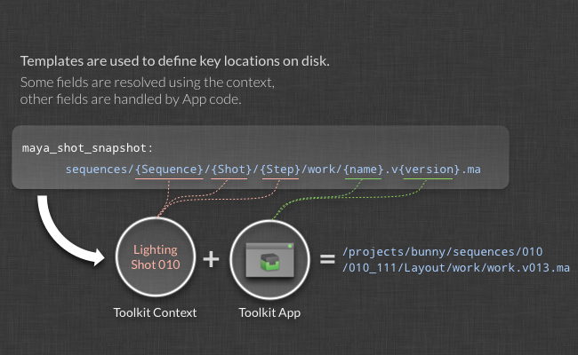
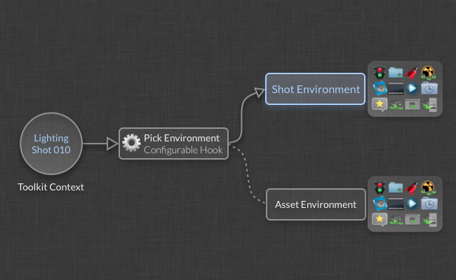
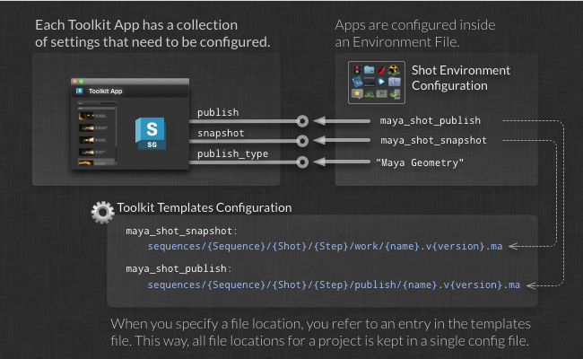
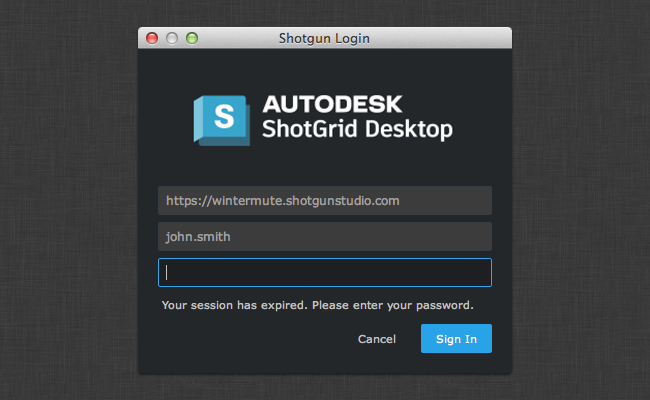

# An Overview of Toolkit


# An overview of the different Concepts in the  Pipeline Toolkit.

Here, we cover the main concepts in detail: How apps and Engines work, how the toolkit is launched and manages the current context (work area), how folders are created on disk etc. We recommend that anyone involved in configuration or development start here.  
_Please note that this document describes functionality only available if you have taken control over a Toolkit configuration. For details, see the  [ Integrations Admin Guide](https://support.shotgunsoftware.com/hc/en-us/articles/115000067493)._

# Introduction

Want to learn more about the  Pipeline Toolkit? You have come to the right place! This document explains some of the key features in more depth. With explanations, examples and small demos, we show what the  Toolkit is all about. This document is a good starting point if you want to familiarize yourself with our Toolkit or if you want to understand how the Toolkit could add value to your studio. After you have read it, you'll have a good grasp of some of the key concepts and how they work in practice.



Below is a brief description of the  Pipeline Toolkit (Sgtk):

-   Sgtk is a  _Pipeline Toolkit_  based on the  platform - it makes it easier to write and install tools for a studio.
-   Sgtk is file system based - it helps you organize where things are stored on disk, so that what you have on disk is nicely structured.
-   Sgtk is an assistant - it does not try to take over or abstract the data in your pipeline, but rather is there to provide artists with compelling tools to make finding information easier and avoid making mistakes.
-   Sgtk is helping you to share - By storing all its publishes in , the Toolkit makes it easy to share updates and work that is going on across a production.

In the following sections, we will be looking in depth at the  Pipeline Toolkit and how it works.

# Projects and Configurations

In the  Pipeline Toolkit, everything is project centric. A project typically starts its life cycle inside of , goes through a bidding and a pre-production phase. Once a project is ready for the content creation phase, the Toolkit can be set up for that project.


When you set up a new project, you use a  _template configuration_. This is a pre-defined config containing engines and apps, file system configuration and other settings. If you are just starting with the Toolkit, you can use our example configuration as a starting point for your exploration. If you have already been using the Toolkit on another project, we suggest that you take that configuration and use that as the starting point for your new project. That way, you will be evolving a studio configuration and it will be refined with each new project. Of course, you can also maintain a studio configuration separately and use this as a template for all new projects.

Each configuration defines a number of  _storage points_. For the standard sample configuration,  `tk-config-default`, we define a single storage point called  _primary_. This means that all your production data will be under a single file system project root. You can also set up configs with more than a single file system root. We call these  _multi-root configurations_. Examples when you need multi-root configurations include having a separate storage for renders, a separate storage for editorial etc. Each of these storage points need to exist as a  _Local File Storage_  in  - these can be set up in the Site Preferences, under the  _File Management_  tab.

The  Toolkit will install the actual project configuration in any location you like, typically this will go into a  _software install_area on disk and not into the project data area itself. (and don't worry, you can always move it later if you are not happy with the location!).

## Let your studio configuration evolve

When you set up a new project, you can base it off an existing project. The  Toolkit will then copy the configuration folder from that project to your new project. This means that your new project will get exactly the same versions of apps and engines, the same settings and the same customization as the project you are basing it on. This can be useful if you want to  _evolve your pipeline_  and take advantage of improvements and tweaks that have happened as part of an existing production.

Alternatively, you can just take the configuration folder from a project when you are happy with that project's setup and save it in a central location somewhere. This config can then be used as a studio template and each time you create a new project, you can base it off this config. If you want, you can even source control this studio template config using for example git, and tracking how the pipeline configuration template evolves over time becomes simple and transparent. Whenever you want to update it, just copy the config from one of your projects and commit the changes.

For detailed information about configuration management, check out our detailed docs:


[> Managing your project configuration.](https://support.shotgunsoftware.com/hc/en-us/articles/219033168)

## Each Project has a Pipeline Configuration

Whenever you set up  Toolkit for a project, a pipeline configuration is created. This configuration contains all the settings and files needed for the project. The configuration has a dedicated  `tank`  command which you can run in a shell if you want to address the project directly (there is also a global tank command that works with all projects). In , the Pipeline Configuration has been registered as a special Pipeline Configuration Entity to make it easy to keep track of where your project configurations reside on disk.

In addition to the master config that is created when the project is set up, you can create additional configurations for a project. This is often useful if you want to make changes to the configuration without affecting everyone on the project. If you want to do this, you can navigate to a pipeline configuration in , right click it and choose to clone it. This will create a new pipeline configuration for a project, based on another one, and using the new configuration you can safely test out for example a new app without affecting other users.

Please note that the main configuration for a project needs to be named  `Primary`. If you rename, modify or delete it, things may not work as expected. The Pipeline Configurations stored in  are not intended to be manipulated by hand but rather through various specific  `tank`  administration commands and are therefore read-only by default.

Example:  [How to clone a configuration](https://support.shotgunsoftware.com/hc/en-us/articles/219033168-Configuration-staging-and-rollout#Cloning%20your%20Configuration)

## Checking for updates

Similar to other App stores out there, the  Toolkit app store constantly gets new versions for apps and engines. These new versions may contain important bug fixes, or interesting new features. Upgrading your apps and engines is completely optional. It is normally a quick process and the upgrade scripts will always prompt you before making any changes. Likewise, it is straight forward to roll back, should you have accidentally installed a unsatisfactory version.

A single command handles the upgrade process. Simply run the  `tank`  command located in your project configuration folder and add an  `updates`  parameter:
```
> /software/shotgun/bug_buck_bunny/tank updates
```

Running this command with no parameters will check all environments, engines and app. This may take a long time. You can also run the updater on a subset of your installed apps and engines.

General syntax:
```
> tank updates [environment_name] [engine_name] [app_name]
```
The special keyword ALL can be used to denote all items in a category. Examples:

-   Check everything:  `tank updates`
-   Check the Shot environment:  `tank updates Shot`
-   Check all maya apps in all environments:  `tank updates ALL tk-maya`
-   Check all maya apps in the Shot environment:  `tank updates Shot tk-maya`
-   Make sure the loader app is up to date everywhere:  `tank updates ALL ALL tk-multi-loader`
-   Make sure the loader app is up to date in maya:  `tank updates ALL tk-maya tk-multi-loader`

In addition to checking the app store, this script checks all other registered locations too, so it may query your local git, a Github repository, a file on disk and the app store, depending on where you have deployed your apps.

Please note that a new version of an app may introduce changes to the app configuration. For example, there may be a new feature which requires a new configuration parameter. In that case, the tank upgrade script will prompt you to type in values for these parameters.

## Checking for updates to the Core API

Sometimes we release new versions of the Toolkit Core API. A separate command is used to update the Core API. In this case, the command is  `tank core`.

# Creating folders on disk

Once the  Pipeline Toolkit has been set up for your project, you can use our Toolkit to help you create a consistent folder structure. This folder structure is configured by creating a file system template as part of the pipeline configuration on disk. In this folder structure, some of the paths will be dynamic - for example, you may have a folder called  `asset`, that represents a  asset. These dynamic folders can be connected to  queries and many other things.



 Toolkit provides a number of different dynamic folder types that handle different setups and scenarios. You can use the standard  API query syntax when you set up your folder creation, so you could for example organize your file system so that assets with different asset types end up in different folders on the file system. For a detailed walkthrough of how this works, see the admin guide:

[> Administering the  Pipeline Toolkit](https://support.shotgunsoftware.com/hc/en-us/articles/219033178)

The  Pipeline Toolkit folder creation happens in two passes - a direct pass, which can be run by anyone at any time, and a deferred pass, which is typically run by the artist just before application launch. This deferred pass is completely automatic and can be used to set up application specific folders and user sandboxes.

# The Current Context

Once the file system structure has been created, the  Toolkit knows the relationship between a folder on disk and the  object that the folder came from. This is important, because it allows the Toolkit to easily associate an object in  with a folder or disk, or file, when publishing, loading or resolving paths. It also relates to what we call the  _context_  or sometimes  _the current work area_. The context object is part of the Toolkit Core and tracks the current thing that is being worked on. It is a central mechanism when the Toolkit resolves file system paths (which will be described further down in this document).



The context can be created either from a  object such as a Task, Asset or Shot, or from a path on disk. When apps are running, they can always access the context, and this makes it easy to construct apps that have no knowledge of the file system naming convention or whether the App is used in an Asset or Shot pipeline. This is all handled by the Toolkit Core API and the context.

# File System Template

The Toolkit Core contains a system for handling file paths. It is called the  _Templates System_. Since the  Toolkit is file system based, Apps will need to resolve file paths whenever they need to read or write data from disk. Apps are file system structure agnostic - meaning that they don't know how the file system is organized. The template system handles all this for them.

At the heart of the template system, there is a  _Templates Configuration File_. This file contains all the important file system locations for a project. A  _Template_  looks something like this:

```
maya_shot_publish: 'shots/{Shot}/{Step}/pub/{name}.v{version}.ma'
```
It basically defines a path which contains certain dynamic fields. Each field can be configured with validation and typing, so you can, for example, define that the  `{version}`  field in the template above is an integer padded with three zeros (e.g.  `001`,  `012`,  `132`). Whenever and App needs to write or read something from disk, a template is added to the templates file to describe that location. Since Apps often are set up to form a pipeline, the output template of one App (e.g. a publishing app) is often the input template of another app (e.g. a loading app). This is why all the file system locations are kept in a single file.

The template API lets you jump between a list of field values and paths:
```
# get a template object from the API
>>> template_obj = sgtk.templates["maya_shot_publish"]
<Sgtk Template maya_asset_project: shots/{Shot}/{Step}/pub/{name}.v{version}.ma>

# we can use the template object to turn a path into a set of fields...
>>> path = '/projects/bbb/shots/001_002/comp/pub/main_scene.v003.ma'
>>> fields = template_obj.get_fields(path)

{'Shot': '001_002',
 'Step': 'comp',
 'name': 'main_scene',
 'version': 3}

# alternatively, we can take a fields dictionary and make a path
>>> template_obj.apply_fields(fields)
'/projects/bbb/shots/001_002/comp/pub/main_scene.v003.ma'
```
Note how the above path and template has two different types of fields: The  `Shot`  and  `Step`  fields are high-level fields with equivalent objects in  (a Shot and a Pipeline Step) where the  `name`  and the  `version`  fields are very specific to this particular type of template (in this case a publish path.). If we wanted to describe a publish path for an asset rather than a shot, we would still have a  `name`  and a  `version`  field, since this is needed for all publishes, regardless of what type of data it is - however, we would not have a  `Shot`  and a  `Step`  field. Instead, we may have an  `Asset`  and a  `Step`  field, where the asset field would be associated with an asset in .

When we develop an app that does Publishing, we obviously don't want to have a separate App that does Shot publishing and one that does Asset publishing. Instead, we want a single Publishing app that can handle any publish scenario, regardless if it is a Sequence, Shot, Asset or Whatever.



This is where the  _Toolkit Context_  comes in. Essentially, the Toolkit Context allows us to split the template fields into two distinct groups (as mentioned above); the Context fields (`Shot`,  `Step`,  `Asset`  etc) are fields that we want to ensure are resolved outside of the App - in such a way that the App Code will not have to have code that specifically handles concepts such as Shots and Assets. Instead, the App should only populate the fields that are directly associated with the particular  _business logic_  of the App. In our example with a publish app, the business logic consists of the  `name`  and the  `version`  fields. As the figure above illustrates, the  Toolkit therefore splits the field resolve into two distinct phases: Some fields are populated by the context and some fields are populated by the business logic inside the App. This way, Apps can be designed that are not tied to a particular file system layout. We believe this is an important aspect of building good pipeline tools.

The App Code that would deal with the path resolve would typically look something like this:
```
# start with an empty fields dictionary
fields = {}

# first let the context populate all its fields
fields.update( self.context.as_template_fields( publish_template_obj ) )
# fields is now {'Shot': '001_002', 'Step': 'comp' }

# now the app can add its business logic
fields["name"] = "main_scene"
fields["version"] = 234

# and finally the app can produce the path it needs in
# order to save out the file
path = publish_template_obj.apply_fields(fields)
```
For more details of how you can configure and use the Templates API, see the following:

[> File System Configuration Reference](https://support.shotgunsoftware.com/hc/en-us/articles/219039868)

[> Core API Reference](https://support.shotgunsoftware.com/hc/en-us/articles/219039848)

# Choosing which Engines and Apps to Run

Another important role that the Toolkit Core plays is in deciding  _which Apps should be presented to a user_. If you are working on Character Rigging and start up Maya, you probably want a different collection of Apps than if you are doing lighting on a shot. Furthermore, the Apps can be configured differently depending on how you want them to operate, so a review App for rigging may be generating a turntable whereas the same review App is doing a playblast using the shot camera when an animator runs it.

In order to allow for this flexibility, a  Toolkit project configuration contains a collection of  _environments_. An environment is a configuration file that defines a collection of apps and engines, and all their configuration parameters.
```
Example: What does an environment file look like?
```
When the Toolkit starts up, it needs to decide  _which_  environment to initialize. This is done via a piece of Python code called a  _hook_, where you can add your own business logic. The  _context_  object (the current work area) is passed in to this piece of code, and this is often what is used in order to determine which environment to use.



This makes it possible to configure separate collections of apps for different parts of the pipeline. Furthermore, you can also update them independently and even have different supervisors managing them separately.
```
Example: What does the Pick Environment Hook look like?
```
## Environments in the Default Configuration

To give you a practical example of how environments work and can be structured, let's take a look at the environment that comes with the default configuration.

The default configuration comes with the following environments:

-   `project.yml`  - Apps and Engines to run when the context only contains a project.
-   `shot_and_asset.yml`  - Apps and Engines to run when the context contains a shot or an asset.
-   `shot_step.yml`  - Apps ane Engines when the context contains a Shot and a Pipeline Step.
-   `asset_step.yml`  - Apps and Engines when the context contains an Asset and a Pipeline Step.

The default config has organized its file system based on pipeline steps. This means that under for example a Shot location, you can find folders for Modeling, Rigging etc. Essentially, there is one folder for each pipeline step you work on. Each of these folders have its own work areas and publish areas on disk. This means that for example a publish template may look like this:
```
maya_shot_publish: 'sequences/{Sequence}/{Shot}/{Step}/pub/{name}.v{version}.ma'
```
In order to use this template, the context needs to contain both an entity (a Shot in this case) and a Pipeline Step. For Shot 1122, parented under Sequence ABC and pipeline step Modeling, the above template would resolve to  `sequences/ABC/1122/Modeling/...`. This means that a context that for example contains a Shot but not a Pipeline Step is not enough to populate the above template. You cannot launch Maya for a Shot-only context and use the above template - in order for it to be functional, a Step is required.

This leads us to the environment breakdown shown above. Because the file system structure defined in the default configuration is centered around steps, all the main apps need to run in a context which has a step defined. We define two such environemnts in the default config: the  `asset_step.yml`  file and the  `shot_step.yml`  file. Each of these files contain engines for a number of DCCs - Maya, Nuke, 3dsmax, Motionbuilder, Photoshop to mention a few. When you for example launch maya from a shot task inside of , the pick environment hook will choose the  `shot_step`  environment, start maya and load up the maya app configuration.

It can also be useful to launch Maya directly from a Shot object inside of . More importantly, it can be really useful to be able to type in a console  `tank Shot 1122 launch_maya`. This is where the  `shot_and_asset`  environment comes in. When you load maya with a context which contains a shot (or asset) but no pipeline step, it will load this environment. But since the file system structure is all organized per pipeline step, it is not really possible to do any loading or publishing if we only have the shot. Maya instead launches with a bare configuration, only containing the  _Work Files_  app. This app let's you choose a task to work on and then switches the context to this task. Once you have picked a task, the Toolkit switches the context and restarts the engine for you and will load up the  `shot_step`  environment with the full range of apps.

Similarly, the  `project`  environment is a catch-all fallback, also just containing the Work Files app. This makes it possible to launch maya (or other apps) from pretty much anywhere inside the project and it will initialize the Toolkit in a minimal state, allowing you to jump to a valid work area using the Work Files App.

## Environments in  - Populating the Context Menu

Apart from the dynamic environments explained above, automatically selected by the  Pipeline Toolkit depending on the context, the Toolkit also comes with a set of special  _ environments_. These environments control which apps show up on the context menus inside of . All of these environment files are named on the form  `shotgun_entitytype.yml`, for example  `shotgun_shot.yml`,  `shotgun_asset.yml`. Whatever apps you define in these environments will show up on the context menu for that entity type in .

# Configuring Apps

Each App has number of configuration parameters that need to be specified. When you install or upgrade an app, the Toolkit makes sure that you have specified all the required settings. Settings are typically automatically documented - head over to the App Listings Section of the documentation to see some examples:

[> All the Apps, Engines and Configs we currently provide with the  Pipeline Toolkit.](https://support.shotgunsoftware.com/hc/en-us/articles/219039798)

Simple setting values such as strings or ints are specified directly in the environment config. Templates are different. Since the  Toolkit wants to keep all templates in a single place, the environment file merely points to templates defined in the templates file. Each App will require different fields to be present in the templates that it uses in its configuration. For example, in our previous example, an example Publish App was using a template with the fields  `name`  and  `version`  when creating its output files on disk. The App would therefore have a configuration setting which requires a template containing the fields  `name`and  `version`.



If you would try to configure the app using a template that has more than the context fields,  `name`  and  `version`, the App Code would not know how to populate these additional fields, and therefore would not be able to generate a path from that template. Similarly, if you provided a template that was missing one of the fields (for example  `version`), it would lead to confusing results - in our case, version numbers would not be written out of the app. Therefore, the Toolkit will validate the configuration at startup to make sure that the necessary fields are provided for all templates. The  Toolkit also supports several ways of using default values and optional fields. For a complete reference, check the following links:

[> Apps and Engines Configuration Reference](https://support.shotgunsoftware.com/hc/en-us/articles/219039878)

[> File System Configuration Reference](https://support.shotgunsoftware.com/hc/en-us/articles/219039868)

## Hooks

In addition to app settings using templates, the  Pipeline Toolkit also supports a concept called Hooks. Hooks are small snippets of Python code, effectively allowing you to customize parts of the App Code as part of your configuration. Here's how it works and why it is useful:

Apps are powerful because they can be reused across multiple engines and projects. But Apps tend to need some small snippets of engine specific code. For example, if we are building a loader app which should work both in Nuke and Maya, there will need to be code that handles the  _actual file load_  - and this code will have to be different in Nuke and Maya, since their APIs are totally different. Furthermore, it would be great if it would be possible to use this app with Any Engine! Also, different studios may have different ways to load items into a scene - someone may need to support a custom Maya reference node where other studios may just do an import.

This situation is handled in the Toolkit using a  _Hook_. The hook is a customizable piece of code. The App comes with a default hook which contains a base level implementation, meaning that the App will work fine out of the box. However, if you want to customize the behaviour, you can copy that hook file into your configuration, and Toolkit will use that code instead.

[> Read more about how to work with hooks in the Admin guide.](https://support.shotgunsoftware.com/hc/en-us/articles/219033178)

# Running from  and the Shell

Once the  Toolkit is installed, you can access it from several primary entry points:

-    Actions will appear on the right-click menus inside of 
-   Launch icons will appear for the project in the  Desktop app
-   You can use the  `tank`  command in a console.
-   The Toolkit Python API is available both inside applications and in the shell.

Running the Toolkit from within  is a common way of starting applications and carrying out tasks. The  Toolkit will use the  [ Browser Plugin](https://github.com/shotgunsoftware/browser-plugin)  to communicate with the Toolkit install that is local on your machine and use a local Python to execute a  engine and apps. This means that you can run local operations such as folder creation right from inside of . You can also execute QT UI based apps from inside of .

You can also access the  Toolkit from the command shell. Each project configuration comes with its own tank command. Simply navigate to your project configuration root and execute the  `./tank`  command from there.

Lastly, you can simply add the Toolkit API to the  `PYTHONPATH`  and import it. Using the API is straight forward and if you, for example, want to start up the  Pipeline Toolkit inside of Maya manually, or as part of an existing studio launch system, instead of using the Launch App facility, all you need to execute is a couple of simple commands.

# Publishing to 

When you want to share files that you are working on with others, you can publish them. What this means is that a publish record is created inside of .


The details of exactly what this means in terms of the data management (where on disk things are saved, what the file contains etc) is left to the App doing the actual work. The Toolkit API provides App Developers with Methods to easily create publishes inside of  and link these up to the right objects to ensure that  can go ahead and push notifications to all the right people. We also provide a default Publish app that is meant to be versatile and highly configurable, but this is by no means the only way to implement version control using the  Toolkit. Because Sgtk is a pipeline toolkit, you could build your own custom version control and publishing system using the Toolkit if this is desirable. As a starting point, however, we recommend our Publish App:

[> The Default Multi Publish App.](https://support.shotgunsoftware.com/hc/en-us/articles/219032998)

# Building Reusable Apps

The  Pipeline Toolkit is not just a collection of Apps and Engines. It is also a framework that you can use to develop your own Tools and Technology! We have included a lot of features to make the  Toolkit a rich studio development platform. With the Toolkit as a foundation, you can focus on the problem at hand rather than building the underlying pipeline stack. We have tried to make it easy for developers to build, evaluate and release software without accidentally breaking the pipeline for artists.

-   The Engines ensure that apps can be written in Python and QT (PySide/PyQt) regardless of the underlying foundation. This means that some engines are very simple (Nuke for example, where Nuke already contains PySide and Python) and some engines are more complex (Photoshop for example which doesn't have Python support). This means that there is a straight forward, consistent way to develop tools for the studio. In our experience, python and PyQt/PySide is often found being the development environment studios use and many TDs are familiar with it.
    
-   The engine layer also means that Apps can be written once and then be deployed in multiple environments. We have developed the standard App Suite as  _Multi Apps_, meaning that the same App is used in all engines. There will inevitably be specific code that needs to be tailored to work with the specific API that each DCC application exposes, but this is typically contained in one or more hooks, making it easy to reuse an app. Another consequence of being able to create multi apps like this is that when a new engine is being developed, all the standard apps can be easily configured to work with that new engine.
    
-   Via Pipeline Configurations and Cloning, it is easy to create a development sandbox, allowing developers to do development on a production without interfering with the day to day production activity. Once the tools are ready to be deployed, the main project configuration can be easily updated and the tool is rolled out to all artists.
    
-   Since Apps run inside an engine, it is easy to reload them. Instead of having to restart Nuke or Maya every time you want to test a new code change, simply hit the reload button in Toolkit and the latest code is loaded in.
    

For an more extensive introduction to App Development, see the following documents:

[> An Introduction to the Toolkit App Development.](https://support.shotgunsoftware.com/hc/en-us/articles/219033158)

[> The Toolkit API Reference](https://support.shotgunsoftware.com/hc/en-us/articles/219039858)

[> Apps and Engines Configuration Reference](https://support.shotgunsoftware.com/hc/en-us/articles/219039878)

# Security and Authentication

When you run the  pipeline Toolkit, it will connect to  on a regular basis in order to carry out certain operations. It may be when you publish a new render or when you browse for an item that you want to load into your scene. At this point, Toolkit will need to log in to , either to read or write data, meaning that it will need to make sure the current user is authenticated so that a connection with the  server can be established.

With Toolkit core versions prior to v0.16, this was handled automatically by using a single  API script user to handle all Toolkit operations. With Core v0.16, Toolkit instead defaults to a mode where it requests a login and password for each user, making the interaction experience similar to how the rest of  works.



Toolkit uses session tokens for authentication. These are unique identifiers which are generated by the  server. Whenever a  API request comes in from Toolkit, this session token is passed along so that the server can validate it and grant access to the request. These session tokens time out after a certain period of inactivity, usually 24 hours, and whenever this happens, the user is typically prompted to enter their password again in order for Toolkit to retrieve a new session token.

In a pipeline, it is not uncommon to encounter situations where it is hard or even impossible to prompt the user for a password. For these use cases, Toolkit provides several ways to run completely "headless" or to completely customize the process around authentication. The following section outlines how the Toolkit security model works and how it can be customized.

## Upgrading to Core v0.16

Prior to v0.16, all authentication would be handled via a configuration file called  `shotgun.yml`, which would contain  script credentials, allowing all users to access  in the same way, without needing to log in. Core v0.16 still supports this behavior, however defaults to prompting users for their username and password, giving Toolkit a more fine grained control over its users and avoid storing script credentials in a global location.

**Core v0.16 is fully backwards compatible**  and whenever it encounters a Toolkit project with script credentials specified in the  `shotgun.yml`  file, it will use these for its authentication purposes. This means that when you update to Toolkit Core v0.16, existing projects won't be affected by the new authentication features.

An existing  `shotgun.yml`  file typically looks something like this:
```yaml
#  Pipeline Toolkit configuration file
# this file was automatically created

host: https://mysite.shotgunstudio.com
api_key: abcdefghijklmnopqrstuvwxyz01234567890ABCDE
api_script: Toolkit
http_proxy: null

# End of file.
```
If the  `api_script`  and  `api_key`  lines are removed, Toolkit will start prompting the user for a login and password. When new projects are set up in v0.16, they will automatically use this form:
```yaml
# Core v0.16 example which doesn't store script
# credentials in a file but instead prompts each
# user to individually log in

host: https://mysite.shotgunstudio.com
http_proxy: null

# End of file.
```
-   If you want to enable an existing project to run with the new authentication features introduced in Core v0.16, simply locate its  `shotgun.yml`  file (typically located in  `config/core`  in your configuration folder) and comment out the  `api_key`  and  `api_script`  keys.
    
-   Conversely, if you create a new project and you want to to use the automatic authentication model previously used in Toolkit, just update  `shotgun.yml`  with valid script credentials.
    
-   **Please note that commenting out the  `api_key`  and  `api_script`  fields for an existing project means that the config will no longer work with cores prior to v0.16.**  Before doing so, please make sure that all users working on that project have upgraded to Core v0.16.
    
-   Note for advanced users and similar to the above: If you are running  Desktop v1.0.x, please do not manually remove the  `api_key`  and  `api_script`  fields from the local site configuration that the  Desktop uses. While the older v1.0.x version of the  Desktop is able to handle  _projects_  that don't have script credentials stored in their  `shotgun.yml`  files, it still requires its site config file to have those fields present. In order to completely eradicate hard coded credentials from your pipeline, you need to update to the latest version of the  Desktop.
    
-   If you are using a shared core for your projects, the  `shotgun.yml`  file is found in the core configuration location rather than the project configuration. If this is the case, any changes you make will affect all projects using that core.
    
-   **No user login matching**  - Previously, every user would connect to  using the same Script user, meaning that the  connection had no strong concept of which user was actually connecting. Toolkit attempted to identify who the actual current user was by getting the operating system login for the current user (using a hook) and trying to match that against a user in . This behavior still exists in v0.16 as a fallback mechanism, but for all new projects where per-user authentication is enabled, this system login matching logic is no longer needed and won't be used.
    
-   **New permissions**  - Previously, when Toolkit was using a single  `Toolkit`  script user to connect, the  permissions associated with this script user would be the limiting factor for which operations could be carried out within . With new projects where the user instead starts logging in to Toolkit, it will be the user's  permissions that will dictate which operations can be carried out. This may affect the behavior of operations - both in-house tools and customizations, where previously the  `Toolkit`  script user would carry out  operations on behalf of the artist, but now the artist is executing those same operations with her/his own credentials. Potential issues are usually quickly fixed by adjusting the  permissions for the users to ensure that they have permission to carry out all necessary pipeline operations.
    

## Authentication and prompting

As of Toolkit Core v0.16, a couple of different security modes are now supported and these are all documented below.

### Using a global script key

If you don't ever want anyone to be prompted for their login and password, you can specify a global  script key in the  `shotgun.yml`  file. Toolkit will use this for all  operations. This is the security mode that was used by all projects prior to Toolkit Core v0.16. By default, new projects will be created  _without_  this global script key, but you can enable it by adding two  `api_script`  and  `api_key`  options to  `shotgun.yml`. For an example, see the previous documentation section.

### Logging in to Shogun

When running with per-user security enabled,  will need your login and password in order to authenticate you. It remembers this between sessions, however it may occasionally ask you to put in your login and password.

When you log on to Toolkit, your password is sent securely to the  server and a session token will be returned. Toolkit will then use this token to connect and won't ask you for your password again while the token is valid. The token expires after a while, typically after 24 hours of inactivity, and Toolkit will then again prompt you for your password. The prompting for a login and/or password can happen in several different places:

-   When you start up the  Desktop.
    
-   When you run the  `tank`  command in a terminal. There are ways to turn this prompting off - this is documented in the next section.
    
-   When you click on a Toolkit action menu item in the  web application.
    
-   Normally when you launch Maya, Nuke or other DCCs, you won't be prompted for your password. This is because the  Desktop,  web application or  `tank`  command has already refreshed your authentication. However, if you have left Maya or Nuke open and inactive for more than 24 hours, it may show a dialog, asking you to renew your password. This will happen right before Toolkit needs to access .
    

### Running in non-interactive environments

Many times, pipeline code needs to execute in environments where there isn't a UI or user present. Execution of code on a render farm is the classic example. For these use cases, Toolkit provides several ways to provide credentials via the API and command line.

If you are using the  **tank command**, there are several options you can use. You can provide a script name and script key for authentication directly via the  `--script-name`  and  `--script-key`  command line arguments:
```
# never prompt for a username or password
> tank --script-name=headless_launcher --script-key=xxx Shot ABC123 launch_maya
```
If you don't want to provide the details directly on the command line, you can also store them in a file and point the tank command to this file via a  `--credentials-file`  argument:
```
# never prompt for a username or password
> tank --credentials-file=/path/to/script_credentials.yml Shot ABC123 launch_maya
```
This file should be on the following form:
```
script-name: Toolkit
script-key: abcdefghijklmnopqrstuvwxyz01234567890ABCDE
```
This way you can maintain multiple  script users, each with different permission settings, for each of your various pipeline services, thereby ensuring that your processes have limited access only to the  data that they require.

If you are using the  **Toolkit API**  directly, you currently have to write some code in order to ensure that Toolkit get authenticated. The main security api method in the sgtk API is  `sgtk.set_authenticated_user(user)`, which you can use to associate a particular user with a Toolkit core session. The user object that you pass into this method is generated by the  ** Authentication API**  which abstracts the logic around authentication. The sample code below illustrates how to set up a Toolkit Core API session which uses a  script to authenticate:
```python
import sgtk
from tank_vendor.shotgun_authentication import ShotgunAuthenticator

# create an authenticator object. This is the main object which
# handles all authentication
sa = ShotgunAuthenticator()

# Use the authenticator to create a user object. This object
# identifies a  user or script and also wraps around
# a  API instance which is associated with that user.
user = sa.create_script_user(api_script="myscript",
                             api_key="xxxxx",
                             host="https://myhost.shotgunstudio.com")

# tell the Toolkit Core API which user to use
sgtk.set_authenticated_user(user)
```
Once the authenticated user is set in Toolkit, the user object is automatically serialized as part of the built-in  `context`serialization methods. This means that when you for example launch Maya, Nuke or Other DCCs, credentials will be passed from the launch process (typically the  `tank`  command,  Desktop or  web application) into the launched DCC. This makes it very easy to pass valid credentials from one process to another.

For more information about the  Authenticator API, please see the inline code documentation.

## Technical details

### The  Authentication Library

All  related authentication logic has been developed as a standalone Python library which is used by the Toolkit Core and  desktop. It can also be used by other (non-Toolkit) applications which need to handle scenarios where a user is required to log in to . The library wraps around the  API and contains a standardized QT-based  login dialog which will appear when the user needs to authenticate. The  Authentication module handles many common scenarios around  authentication and helps maintain a standardized user experience to ensure users feel secure and comfortable. A summary of the feature set:

-   A standardized QT and command line based user experience around prompting for user name and password
    
-   Default mechanisms for persisting  session tokens across API instances, allowing the API to minimize user disruption.
    
-   A configurable, overridable  _defaults manager_  which allows a client of the API to configure the behavior around default values.
    
-   A  _ Authenticator_  instance sits at the center of the API and acts as a factory for  _ User_  objects. These objects represent a User or Script in .
    
-   The  _ user_  object returned by the authentication library has a  `create_sg_connection()`  method which will create a  API instance associated with that user. In the case of a non-script user, the session token used by the  API instance may become invalid - typically after 24 hours of inactivity - and in this case the  API instance will trap this error and automatically prompt the user to type in their password.
    

For more details, see the inline code documentation of the  Authentication module.

###  authentication and permissions

Whenever a user authenticates with her/his login and password in Toolkit, the  Authentication library will connect to the  server and exchange this information for a session token which will then be used for subsequent requests. The password is not stored anywhere, instead the session token is stored in a file on disk with restrictive file permissions and used whenever authentication is needed. Toolkit will attempt to use this saved session token whenever possible, and only prompt the user whenever the token is no longer valid. This typically happens afters 24 hours of inactivity.

When Toolkit is communicating with  in this fashion, the API session will use the same  permission rules as the user normally has when she/he is logged in to the  web application. Please note that these permissions may be different and often more restrictive than the default  API script permissions, meaning that operations that work when logged in as a script user may fail when logged in as a user and vice versa. If you run into permissions errors, double check your permissions for users and API scripts in the  Permissions editor. You can find this on the administrator menu in the  web application.

### Toolkit serialization

When a DCC such as Maya or Nuke is launched in Toolkit (using the  `tk-multi-launchapp`), the current  `context`  typically is serialized out into a string-based form. The DCC process is then started and usually requested to execute a startup or bootstrap script provided by Toolkit. This script will deserialize the context string into an object, create a new  `tk`  instance and finally start the engine.

As part of this, the user object is also being serialized, meaning that the new process will run with the exact same credentials setup as its parent process. This makes it easy to for example launch different processes for different users or to capture a context on one machine and then execute it on another.

### File locations

Session tokens are stored in the following files:

-   `~/Library/Caches/Shotgun/SITENAME/authentication.yml`  on macosx
-   `~/.Shotgun/SITENAME/authentication.yml`  on Linux
-   `%APPDATA%/Shotgun/SITENAME/authentication.yml`  on Windows

The toolkit authentication library maintains the concept of a current site and a current user, meaning that the library can be used to maintain a single sign-on, where all applications and sessions have access to the same login credentials.

### Multi-threaded environments

When a session token has expired after a period of inactivity, the  authentication library will prompt the user, asking for a password. Just like at login, this password is sent to the  server and exchanged for a new, valid session token.

What happens more practically is that the  API handle returned by the  authentication library  `user_object.create_sg_connection()`  method contains wrapper code to check for session expiry. Whenever this is detected, the user will be prompted to re-authenticate and the operation is retried.

In multi-threaded scenarios, where several worker threads keep  API instances and several threads encounter a session expiry at the same time, the  Authentication library will pause all threads except the first one and use this to prompt the user for a new password. This is to avoid the user being prompted over and over again. Whenever the user is prompted, the QT UI code always executes in the main thread.

# Toolkit technical details and further reading

The  Pipeline Toolkit is written in Python (v2.6+ but not 3.x) and is essentially a series of scripts that are executed on the client machine. The Toolkit works on Linux, Windows and Macosx.

Most asset management systems have a database for storage of metadata. The Toolkit does not have a database of its own, instead it uses the  database for storage and context management. A majority of the operations in the Core API are using the file system to resolve paths and data rather than communicating with .

The Core API is not trying to "run the show" and it is not an "all-or-nothing" deal. Instead, it sits on the side and tries to be a place where scripts and artists can go for advice and assistance. One common approach to asset management is to attempt to gain full control over the file system and data flows in a pipeline. By knowing about everything that is going on in the pipeline, a system can track the content creation and processing in a very precise fashion. However, this approach comes at a cost - taking full ownership often requires that any existing tools would need to be rewritten and it introduces a central point where all the data needs to flow through. While this is sometimes a great approach, the Toolkit does not attempt to take ownership of the data. Instead, the Toolkit tries to understand the data and be a helper that sits on the side. The  Toolkit knows where things should go on disk, and it make it easy for artists and developers to collaborate and to be organized throughout the production process.

You can run the  Toolkit side by side with existing pipeline setups and content tracking systems. As long as they share an understanding of where things are located on disk, the Toolkit should be able to exchange data with them.

For more in-depth information, check out the following documents:

[> All the Apps, Engines and Configs we currently provide with the  Pipeline Toolkit.](https://support.shotgunsoftware.com/hc/en-us/articles/219039798)  
[> How to administer and configure the  Pipeline Toolkit.](https://support.shotgunsoftware.com/hc/en-us/articles/219033178)  
[> Sgtk API Reference](https://support.shotgunsoftware.com/hc/en-us/articles/219039848)  
[> Apps and Engines Configuration Reference](https://support.shotgunsoftware.com/hc/en-us/articles/219039878)  
[> File System Configuration Reference](https://support.shotgunsoftware.com/hc/en-us/articles/219039868)  
[> Platform API Reference](https://support.shotgunsoftware.com/hc/en-us/articles/219039858)  