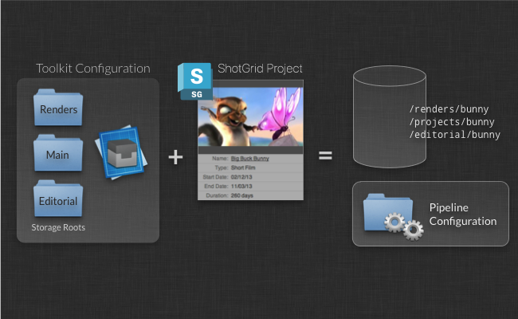
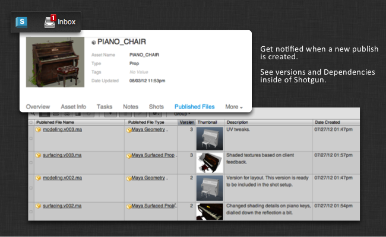

# An Overview of Toolkit


# An overview of the different concepts in the  Pipeline Toolkit.

Here, we cover the main concepts in detail: How apps and Engines work, how Toolkit is launched and manages the current context (work area), how folders are created on disk, etc. We recommend that anyone involved in configuration or development start here.  

_Please note that this document describes functionality only available if you have taken control over a Toolkit configuration. For details, see the  [ Integrations Admin Guide](https://developer.shotgridsoftware.com/8085533c/)._

# Introduction

This document explains some of the key features in more depth. With explanations, examples and small demos, we show what Toolkit is all about. This document is a good starting point if you want to familiarize yourself with Toolkit or if you want to understand how Toolkit could add value to your studio. After you have read it, you'll have a good grasp of some of the key concepts and how they work in practice.


Below is a brief description of Toolkit (SGTK):

-   Toolkit is a  _Pipeline Toolkit_  based on the  platform - it makes it easier to write and install tools for a studio.
-   Toolkit is filesystem based - it helps you organize where things are stored on disk so that what you have on disk is nicely structured.
-   Toolkit is an assistant - it does not try to take over or abstract the data in your pipeline, but rather is there to provide artists with compelling tools to make finding information easier and avoid making mistakes.
-   Toolkit is helping you to share work by storing all of its publishes in . Toolkit makes it easy to share updates and work that is going on across a production.

In the following sections, we will be looking in depth at the Toolkit and how it works.

# Projects and Configurations

In Toolkit, everything is project centric. A project typically starts its lifecycle inside of , goes through a bidding and a pre-production phase, and then once it is ready for the content-creation phase Toolkit can be set up for that project.



When you set up a new project, you use a _template configuration_. This is a predefined config containing engines and apps, filesystem configuration, and other settings. If you are just starting with Toolkit, you can use our example configuration as a starting point for your exploration. If you have already been using Toolkit on another project, we suggest that you take that configuration and use that as the starting point for your new project. That way, you will be evolving a studio configuration and it will be refined with each new project. Of course, you can also maintain a studio configuration separately and use this as a template for all new projects.

Each configuration defines a number of _storage points_. For the standard sample configuration, `tk-config-default`, we define a single storage point called  _primary_. This means that all your production data will be under a single filesystem project root. You can also set up configs with more than a single file system root. We call these _multi-root configurations_. Examples of when you might need multi-root configurations include having a separate storage for renders, a separate storage for editorial, etc. Each of these storage points need to exist as a _Local File Storage_ in , which can be set up in the Site Preferences, under the _File Management_ tab.

Toolkit will install the actual project configuration in any location you like. Typically this will go into a  _software install_ area on disk and not into the project data area itself.

## Let your studio configuration evolve

When you set up a new project, you can base it off of an existing project. Toolkit will then copy the configuration folder from that project to your new project. This means that your new project will get exactly the same versions of apps and engines, the same settings and the same customizations as the project you are basing it on. This can be useful if you want to _evolve your pipeline_ and take advantage of improvements and tweaks that have happened as part of an existing production.

Alternatively, you can just take the configuration folder from a project when you are happy with that project's setup and save it in a central location somewhere. This config can then be used as a studio template and each time you create a new project you can base it off this config. If you want, you can even source control this studio template config using a revision control system, such as git or something similar, and tracking how the pipeline configuration template evolves over time becomes simple and transparent. Whenever you want to update it, just copy the config from one of your projects and commit the changes.

For detailed information about configuration management, check out our detailed docs:

[Managing your project configuration.](https://developer.shotgridsoftware.com/60762324/)

## Each Project has a Pipeline Configuration

Whenever you set up Toolkit for a project, a pipeline configuration is created. This configuration contains all the settings and files needed for the project. The configuration has a dedicated `tank` command which you can run in a shell if you want to address the project directly (there is also a global tank command that works with all projects). In , the Pipeline Configuration has been registered as a special Pipeline Configuration Entity to make it easy to keep track of where your project configurations reside on disk.

In addition to the master config that is created when the project is set up, you can create additional configurations for a project. This is often useful if you want to make changes to the configuration without affecting everyone on the project. If you want to do this, you can navigate to a pipeline configuration in , right click it and choose to clone it. This will create a new pipeline configuration for a project, based on another one, and using the new configuration you can safely test out a new app without affecting other users.

Please note that the main configuration for a project needs to be named `Primary`. If you rename, modify or delete it, things may not work as expected. The Pipeline Configurations stored in  are not intended to be manipulated by hand, but rather through various specific `tank` administration commands.

Example:

[How to clone a configuration](https://developer.shotgridsoftware.com/60762324/#cloning-your-configuration)

## Checking for updates

Similar to other App stores out there, the Toolkit app store constantly gets new versions for apps and engines. These new versions may contain important bug fixes or interesting new features. Upgrading your apps and engines is completely optional. It is normally a quick process and the upgrade scripts will always prompt you before making any changes. Likewise, it is straightforward to roll back should you have accidentally installed an unsatisfactory version.

A single command handles the upgrade process. Simply run the  `tank`  command located in your project configuration folder and add an  `updates`  parameter:

```shell
/software/shotgun/bug_buck_bunny/tank updates
```

Running this command with no parameters will check all environments, engines and app. This may take a long time, but you can also run the updater on a subset of your installed apps and engines.

General syntax:

```shell
tank updates [environment_name] [engine_name] [app_name]
```

The special keyword `ALL` can be used to denote all items in a category.

Examples:
-   Check everything:  `tank updates`
-   Check the Shot environment:  `tank updates Shot`
-   Check all maya apps in all environments:  `tank updates ALL tk-maya`
-   Check all maya apps in the Shot environment:  `tank updates Shot tk-maya`
-   Make sure the loader app is up to date everywhere:  `tank updates ALL ALL tk-multi-loader`
-   Make sure the loader app is up to date in maya:  `tank updates ALL tk-maya tk-multi-loader`

In addition to checking the app store, this script checks all other registered locations too, so it may query your local git, a GitHub repository, a file on disk and the app store, depending on where you have deployed your apps.

Please note that a new version of an app may introduce changes to the app configuration. For example, there may be a new feature which requires a new configuration parameter. In that case, the `tank` upgrade script will prompt you to type in values for these parameters.

## Checking for updates to the Core API

Sometimes we release new versions of the Toolkit Core API. A separate command is used to update the Core API. In this case, the command is `tank core`.

# Creating folders on disk

Once Toolkit has been set up for your project, you can use it to help you create a consistent folder structure. This folder structure is configured by creating a filesystem template as part of the pipeline configuration on disk. In this folder structure, some of the paths will be dynamic - for example, you may have a folder called `asset` that represents a  Asset entity. These dynamic folders can be connected to  queries and many other things.


Toolkit provides a number of different dynamic folder types that handle different setups and scenarios. You can use the standard  API query syntax when you set up your folder creation, so you could organize your filesystem so that assets with different types end up in different folders on the filesystem.

For a detailed walkthrough of how this works, see the admin guide:

[Administering the  Pipeline Toolkit](https://developer.shotgridsoftware.com/425b1da4/)

Toolkit's folder creation happens in two passes: a direct pass, which can be run by anyone at any time, and a deferred pass, which is typically run by the artist just before application launch. This deferred pass is completely automatic and can be used to set up application-specific folders and user sandboxes.

# The Current Context

Once the filesystem structure has been created, Toolkit knows the relationship between a folder on disk and the  object that the folder came from. This is important, because it allows Toolkit to easily associate an object in  with a folder or disk, or file, when publishing, loading or resolving paths. It also relates to what we call the _context_ or sometimes _the current work area_. The context object is part of the Toolkit Core and tracks the current thing that is being worked on. It is a central mechanism when Toolkit resolves filesystem paths.


The context can be created either from a  object, such as a Task, Asset or Shot, or from a path on disk. When apps are running, they can always access the context, and this makes it easy to construct apps that have no knowledge of the filesystem naming conventions or whether the app is used in an Asset or Shot pipeline. This is all handled by the Toolkit Core API and the context.

# Filesystem Templates

The Toolkit Core contains a system for handling file paths. It is called the _Templates System_. Since Toolkit is filesystem based, apps will need to resolve file paths whenever they need to read or write data from disk. Apps are filesystem-structure agnostic, meaning that they don't know how the filesystem is organized. The template system handles all this for them.

At the heart of the template system, there is a _Templates Configuration File_. This file contains all the important filesystem locations for a project. A  _Template_ looks something like this:

```yaml
maya_shot_publish: 'shots/{Shot}/{Step}/pub/{name}.v{version}.ma'
```

It defines a path which contains certain dynamic fields. Each field can be configured with validation and typing, so that, for example, you can define that the `{version}` field in the template above is an integer padded with three zeros (e.g. `001`, `012`, `132`). Whenever and app needs to write or read something from disk, a template is added to the templates file to describe that location. Since apps often are set up to form a pipeline, the output template of one app (e.g. a publishing app) is often the input template of another app (e.g. a loading app). This is why all of the filesystem locations are kept in a single file.

The template API lets you jump between a list of field values and paths:

```python
# get a template object from the API
>>> template_obj = sgtk.templates["maya_shot_publish"]
<SGTK Template maya_asset_project: shots/{Shot}/{Step}/pub/{name}.v{version}.ma>

# we can use the template object to turn a path into a set of fields...
>>> path = '/projects/bbb/shots/001_002/comp/pub/main_scene.v003.ma'
>>> fields = template_obj.get_fields(path)

{'Shot': '001_002',
 'Step': 'comp',
 'name': 'main_scene',
 'version': 3}

# alternatively, we can take a fields dictionary and make a path
>>> template_obj.apply_fields(fields)
'/projects/bbb/shots/001_002/comp/pub/main_scene.v003.ma'
```

Note how the above path and template has two different types of fields. The `Shot` and `Step` fields are high-level fields with equivalent objects in  (a Shot and a Pipeline Step) where the `name` and the `version` fields are very specific to this particular type of template. If we wanted to describe a publish path for an Asset rather than a Shot, we would still have a `name` and a `version` field, since this is needed for all publishes, regardless of what type of data it is. However, we would not have a `Shot` and a `Step` field. Instead, we may have an `Asset` and a `Step` field, where the asset field would be associated with an asset in .

When we develop an app that does publishing, we obviously don't want to have a separate app that does Shot publishing and one that does Asset publishing. Instead, we want a single publishing app that can handle any publish scenario, regardless of whether it is a Sequence, Shot, Asset or whatever.


This is where the _Toolkit Context_ comes into play. The Toolkit Context allows us to split the template fields into two distinct groups: the Context fields (`Shot`, `Step`, `Asset`, etc) are fields that we want to ensure are resolved outside of the app in such a way that the app's logic will not have to have code that specifically handles concepts such as Shots and Assets. Instead, the app should only populate the fields that are directly associated with the particular  _business logic_ of the app. In our example of a publish app, the business logic consists of the `name` and the `version` fields. As the figure above illustrates, Toolkit therefore splits the field resolution into two distinct phases: some fields are populated by the context and some fields are populated by the business logic inside the app. This way, apps can be designed that are not tied to a particular filesystem layout. We believe this is an important aspect of building good pipeline tools.

The App Code that would deal with the path resolve would typically look something like this:

```python
# start with an empty fields dictionary
fields = {}

# first let the context populate all its fields
fields.update( self.context.as_template_fields( publish_template_obj ) )
# fields is now {'Shot': '001_002', 'Step': 'comp' }

# now the app can add its business logic
fields["name"] = "main_scene"
fields["version"] = 234

# and finally the app can produce the path it needs in
# order to save out the file
path = publish_template_obj.apply_fields(fields)
```
For more details of how you can configure and use the Templates API, see the following:

[File System Configuration Reference](https://developer.shotgridsoftware.com/82ff76f7/)

[Core API Reference](https://developer.shotgridsoftware.com/tk-core/core.html#)

# Choosing which Engines and Apps to run

Another important role that the Toolkit Core plays is in deciding _which Apps should be presented to a user_. If you are working on character rigging and start up Maya, you probably want a different collection of apps than if you are doing lighting on a shot. Furthermore, the apps can be configured differently depending on how you want them to operate, so a review app for rigging may be generating a turntable, whereas the same review app is doing a playblast using the shot camera when an animator runs it.

In order to allow for this flexibility, a Toolkit project configuration contains a collection of _environments_. An environment is a configuration file that defines a collection of apps and engines and all their configuration parameters.

When Toolkit starts up, it needs to decide _which_ environment to initialize. This is done via a piece of Python code called a _hook_, where you can add your own business logic. The _context_ object is passed into this piece of code and this is often what is used to determine which environment to use.


This makes it possible to configure separate collections of apps for different parts of the pipeline. Furthermore, you can also update them independently and even have different supervisors managing them separately.

## Environments in the Default Configuration

To give you a practical example of how environments work and can be structured, let's take a look at the environments that come with the default configuration:

-   `project.yml` - Apps and Engines to run when the context only contains a project.
-   `shot_and_asset.yml` - Apps and Engines to run when the context contains a shot or an asset.
-   `shot_step.yml` - Apps ane Engines when the context contains a Shot and a Pipeline Step.
-   `asset_step.yml` - Apps and Engines when the context contains an Asset and a Pipeline Step.

The default config has organized its filesystem based on pipeline steps. This means that under a Shot location, you can find folders for modeling, rigging, etc. Essentially, there is one folder for each pipeline step you work on. Each of these folders have its own work and publish areas on disk. This means that a publish template may look like this:

```yaml
maya_shot_publish: 'sequences/{Sequence}/{Shot}/{Step}/pub/{name}.v{version}.ma'
```

In order to use this template, the context needs to contain both an entity and a Pipeline Step. For Shot `1122`, parented under Sequence `ABC` and pipeline step `Modeling`, the above template would resolve to  `sequences/ABC/1122/Modeling/...`. This means that a context that contains a Shot but not a Pipeline Step is not enough to populate the above template. You cannot launch Maya for a Shot-only context and use the above template. In order for it to be functional, a Step is required.

This leads us to the environment breakdown shown above. Because the filesystem structure defined in the default configuration is centered around steps, all the main apps need to run in a context which has a step defined. We define two such environments in the default config: the `asset_step.yml` file and the `shot_step.yml` file. Each of these files contain engines for a number of DCCs, such as Maya, Nuke, 3dsmax, Motionbuilder, and Photoshop to mention a few. When you launch Maya from a Task inside of , the pick environment hook will choose the `shot_step` environment, start Maya and load up the Maya app configuration.

It can also be useful to launch Maya directly from a Shot object inside of . More importantly, it can be really useful to be able to type in a console `tank Shot 1122 launch_maya`. This is where the `shot` and `asset` environments come in. When you load Maya with a context which contains a Shot or Asset but no Pipeline Step, it will load one of these environments. Since the filesystem structure is all organized per Pipeline Step, it is not really possible to do any loading or publishing if we are missing that information in our context. Maya instead launches with a bare configuration, only containing the _Workfiles_ app. This app lets you choose a Task to work on. Once you have picked a Task, Toolkit switches the context and restarts the engine for you and will load up the `shot_step` environment with the full range of apps.

Similarly, the `project` environment is a catch-all fallback, also just containing the _Workfiles_ app. This makes it possible to launch Maya from pretty much anywhere inside the project and it will initialize Toolkit in a minimal state, allowing you to jump to a valid work area using the _Workfiles_ app.

# Configuring Apps

Each app has number of configuration parameters that need to be specified. When you install or upgrade an app, Toolkit makes sure that you have specified all the required settings.

Simple setting values such as strings or integers are specified directly in the environment config. Templates are different, and since Toolkit wants to keep all templates in a single place, the environment file merely points to templates defined in the templates file. Each app will require different fields to be present in the templates that it uses in its configuration. In our previous example, the publish app was using a template with the fields `name` and `version` when creating its output files on disk. The app would therefore have a configuration setting which requires a template containing the fields `name` and `version`.


If you try to configure the app using a template that has more than the context fields (`name` and `version`), the app would not know how to populate these additional fields and would not be able to generate a path from that template. Similarly, if you provided a template that was missing one of the fields it would lead to confusing results; in our case, version numbers would not be written out of the app. Therefore, Toolkit will validate the configuration at startup to make sure that the necessary fields are provided for all templates. Toolkit also supports several ways of using default values and optional fields.

For a complete reference, check the following links:

[Apps and Engines Configuration Reference](https://developer.shotgridsoftware.com/162eaa4b/)

[File System Configuration Reference](https://developer.shotgridsoftware.com/82ff76f7/)

## Hooks

In addition to app settings using templates, Toolkit also supports a concept called _hooks_. Hooks are small snippets of Python code, allowing you to customize parts of the app as part of your configuration.

Here's how it works and why it is useful:

Apps are powerful because they can be reused across multiple engines and projects. But apps tend to need some small snippets of engine-specific logic. For example, if we are building a loader app which should work both in Nuke and Maya, there will need to be code that handles the _actual file load_ and this code will have to be different in Nuke and Maya. Furthermore, it would be great if it would be possible to use this app with any engine! Different studios may also have different ways to load items into a scene, and someone may need to support a custom Maya reference node where other studios may just do an import.

This situation is handled in Toolkit using a _hook_. The hook is a customizable piece of code. The App comes with a default hook which contains a base level implementation, meaning that the app will work fine right out of the box. However, if you want to customize the behaviour you can copy that hook file into your configuration and Toolkit will use that code instead.

[Read more about how to work with hooks in the Admin guide.](https://developer.shotgridsoftware.com/425b1da4/#hooks)

# Running from  and the Shell

Once Toolkit is installed, you can access it from several primary entry points:

-    Actions will appear on the right-click menus inside of 
-   Launch icons will appear for the project in the  Desktop app
-   You can use the `tank` command in a console.
-   The Toolkit Python API is available both inside applications and in the shell.

Running the Toolkit from within  is a common way of starting applications and carrying out tasks.  will use  Desktop to communicate with the Toolkit install that is local on your machine and use a local Python to execute a Toolkit command. This means that you can run local operations such as folder creation right from inside of .

You can also access Toolkit from a shell. Each project configuration comes with its own `tank` command. Simply navigate to your project configuration root and execute the `./tank` command from there.

Lastly, you can simply add the Toolkit API to the `PYTHONPATH` environment variable and import it. Using the API is straightforward and if you want to start up Toolkit inside of Maya manually or as part of an existing studio launch system instead of using  Desktop, all you need to execute is a couple of simple commands.

# Publishing

When you want to share files that you are working on with others, you can publish them. What this means is that a `PublishedFile` entity is created in  which other users can import using Toolkit's loader app.



The details of exactly what this means in terms of the data management (where on disk things are saved, what the file contains, etc) is left to the app doing the actual work. The Toolkit API provides developers with methods to easily create publishes inside of  and link these up to the right objects to ensure that  can go ahead and push notifications to all the right people. We also provide a default publish app that is meant to be versatile and highly configurable, but this is by no means the only way to implement version control using Toolkit. Because Toolkit is extensible, you could build your own custom version control and publishing system using Toolkit if this is desirable.

As a starting point, however, we recommend our Publish App:

[The Default Multi Publish App.](https://developer.shotgridsoftware.com/tk-multi-publish2/)

# Building Reusable Apps

Toolkit is not just a collection of apps and engines. It is also a framework that you can use to develop your own tools and technologies! We have included a lot of features to make Toolkit a rich studio development platform. With Toolkit as a foundation, you can focus on the problems at hand rather than building the underlying platform yourself. We have tried to make it easy for developers to build, evaluate and release software without accidentally breaking the pipeline for artists.

-   The engines ensure that apps can be written in Python and Qt (PySide/PySide2) regardless of the underlying foundation. This means that some engines are very simple, while some engines are more complex depending on their provided APIs. This means that there is a straightforward, consistent way to develop tools for the studio. In our experience, Python and Qt is often found being the development environment studios use and many TDs are familiar with it. 
-   The engine layer also means that apps can be written once and then be deployed in multiple environments. We have developed the standard app suite as _Multi Apps_, meaning that the same app is used in all engines. There will inevitably be specific code that needs to be tailored to work with the specific API that each DCC application exposes, but this is typically contained in one or more hooks, making it easy to reuse an app. Another consequence of being able to create multi apps like this is that when a new engine is being developed, all the standard apps can be easily configured to work with that new engine.
-   Via Pipeline Configurations and Cloning, it is easy to create a development sandbox, allowing developers to do work on a production without interfering with the day-to-day production activity. Once the tools are ready to be deployed, the main project configuration can be easily updated and the tool is rolled out to all artists.
-   Since apps run inside an engine, it is easy to reload them. Instead of having to restart Nuke or Maya every time you want to test a new code change, simply hit the reload button in Toolkit and the latest code is loaded in.

For an more extensive introduction to App Development, see the following documents:

[An Introduction to the Toolkit App Development.](https://developer.shotgridsoftware.com/2e5ed7bb/)

[The Toolkit API Reference](https://developer.shotgridsoftware.com/tk-core/)

[Apps and Engines Configuration Reference](https://developer.shotgridsoftware.com/162eaa4b/)
