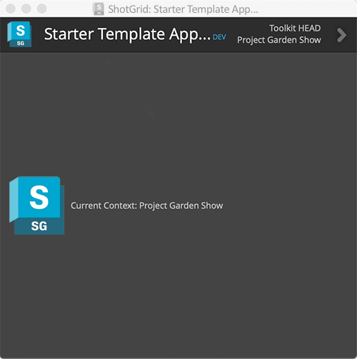
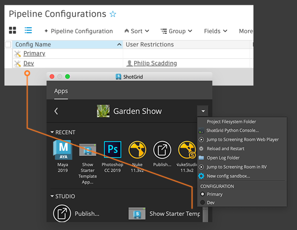

# Developing your own app

## Introduction

This guide outlines what a Toolkit app is, covers how to create one, and explains some basics around app development.
Shotgun Pipeline Toolkit is not only a collection of apps and engines maintained by Shotgun Software, it is also a development platform that makes it easy to quickly build custom pipeline tools!

- [What is a Toolkit app?](#what-is-a-toolkit-app)
- [Creating your own app](#creating-your-own-app)

Steps:
1. [Creating a development sandbox](#part-1---creating-a-development-sandbox)
2. [Forking or downloading the starter app repository](#part-2---forking-or-downloading-the-starter-app-repository)
3. [Adding the app to your config](#part-3---adding-the-app-to-your-config)
4. [Developing the app](#part-4---developing-the-app)
    - [Anatomy of the Template Starter App](#anatomy-of-the-template-starter-app)
    - [Configuration settings](#configuration-settings)
    - [Frameworks](#frameworks)
    - [Reloading your changes](#reloading-your-changes)
5. [Testing](#part-5---testing)
6. [Preparing your first release](#part-6---preparing-your-first-release)

Additional info:
- [Modifying an existing app](#modifying-an-existing-app)
    - [Contributing](#contributing)

## What is a Toolkit app?

A Toolkit app can be defined as follows:

- A tool that is usually run by an end-user, using the Shotgun integrations.
- Apps usually have a graphical user interface with which the user can guide the app's operations, but they don't have to. An app can also be a command registered with the integrations, triggered by the user from the Shotgun menu in the host software.
- They can have an API/public methods in which other processes or apps could interact.
- They can be multi-platform, and software agnostic.
- They can be set up to be configured differently per [environment](https://developer.shotgunsoftware.com/487a9f2c/?title=Environment+Configuration+Reference#what-is-an-environment).
- They can be contextually aware. For example, an app can know the task the user is working on, and act accordingly.
- They can only be run from a Toolkit engine.

Toolkit apps are initialized by Toolkit engines. [Engines](https://developer.shotgunsoftware.com/tk-core/platform.html#engines) are designed to run within a specific software environment, where they then provide an interface from which to run Toolkit apps. The engine abstracts away the complexity of needing to handle the various software environments from the app.
This means the app only needs to focus on providing the functionality to fulfill its purpose and doesn't need to, for example, handle window parenting, keeping track of the user's context, or providing a shortcut for launching itself.

## Creating your own app.
All apps and engines maintained and released by Shotgun Software are open source and you can find them in [GitHub](https://github.com/shotgunsoftware).

This section goes through how to create a new app using our starter template. 
We assume that you are familiar with GitHub and git workflows, but please note that you can do Toolkit development even if you are not using git as your source control solution.


## Part 1: Creating a development sandbox
Before you do anything else, we recommend that you set up a [development sandbox by cloning the project configuration](../getting-started/installing_app.md#clone-the-pipeline-configuration-you-want-to-add-an-app-to) by cloning your project's configuration.
This will result in a separate configuration where you can develop your code and test changes without affecting anyone else on the production. 

## Part 2: Forking or downloading the starter app repository
We provide a [template starter app](https://github.com/shotgunsoftware/tk-multi-starterapp) that you can use as a starting point for your own app.
By using this app you get all the standard Toolkit boilerplate code set up for you, and a basic example GUI.



To use it, you can either fork the git repository and then clone it to your local dev area on disk, 
or if you don't want to use git source control at this stage, you can just download the files from GitHub as a zip file, and unzip them locally (you can always set up a git repository later).
Either way, the goal is to have a local copy of the starter app code so you can start making changes.

## Part 3: Adding the app to your config
We recommend reading the "[Adding an app](../getting-started/installing_app.md)" guide, as it explains in more detail how to add an app to your configuration.

When adding the app to your config, you need to consider where your app will be used, i.e. perhaps only in Nuke or in multiple different software, or standalone from Shotgun Desktop.
You also need to think about the context that your app will depend on.
For example, can your app only run when you know the task the user is working on, or can it run with just the project known?
Knowing this will dictate which environment YAMLs and engines you need to add your app settings to.

If you're not sure right now, it's a good idea to start by adding it to the `tk-shell` engine in the project environment. 
That way you can [run it from your IDE](./sgtk-developer-bootstrapping.md) or via the command line with the tank command if you have a [centralized config](https://developer.shotgunsoftware.com/tk-core/initializing.html#centralized-configurations). This will make it quicker to develop with.

To start, use a [dev descriptor](https://developer.shotgunsoftware.com/tk-core/descriptor.html#pointing-to-a-path-on-disk) for the location of your app.

```yaml
tk-multi-starterapp:
  location:
    type: dev
    path: /path/to/source_code/tk-multi-starterapp
```
This instructs Toolkit to load the app code directly from disk in the given location, which is great for development, where you want to change the code all the time.
Later when you add the app to your production config, you may want to use a different descriptor.

Now you've added the app to an environment; you should be able to go ahead and launch it. How you launch it will depend on the engine and environment you defined it in.

## Part 4: Developing the app

You are now all set to start developing your app!

### Anatomy of the Template Starter App

The [template starter app](https://github.com/shotgunsoftware/tk-multi-starterapp) contains the following basic structure:


- **app.py** - The app entry point and menu registration can be found in the `app.py` file. This is where you typically set up your classes, get things initialized, and get menu items registered.
- **info.yml** - Also known as the manifest file. It defines all the different settings, that this app requires when it is installed, along with their default values if supplied. 
Settings are often useful if you want reusable apps and you don't want to hard code any values in the app itself.
- **python/app/dialog.py** - This contains the logic, event callbacks, etc. that produce the main app window.
- **python/app/ui** - This folder contains the automatically generated UI code and resource file. You don't edit this directly; instead, you edit the Qt UI file in the `resources` folder.
- **resources/** - In the resources folder, the `dialog.ui` file is a Qt Designer file that you can open up and use to rapidly design and define the look and feel of the app. 
Once you have made changes, you have to execute the `build_resources.sh` script, which will convert the UI file to python code and store it as `/python/app/ui/dialog.py`.
- **style.qss** - You can define QSS (Qt style sheets) for your UI in this file.



### Configuration settings
Inside the manifest file, there should be a `configuration` section where you can define app settings.

Defining a setting in the manifest file allows you to configure different setting values for your app in the environment YAML files.
This is useful if your app needs to behave differently depending on the environment it is in.

For example, you may wish to have a setting that defines a template to use when saving a file. 
```yaml
save_template:
    type: template
    default_value: "maya_asset_work"
    description: The template to use when building the path to save the file into
    allows_empty: False
```
Creating a setting for this means you don't have to hard code the template name in your app code, 
and [can instead get the value](https://developer.shotgunsoftware.com/tk-core/platform.html#sgtk.platform.Application.get_setting) 
from the settings defined either by default in the `info.yml` or overridden in the environment YAML file settings.

```python
template = app.get_setting("save_template")
```
This means that you could configure your app to use a different template depending on the environment the app is running in.

You can read more on configuration settings [in the reference documentation](https://developer.shotgunsoftware.com/tk-core/platform.html#the-configuration-section).

### Frameworks

If you know that you will be using frameworks, you can add them to the manifest file.

For example, if you plan to use the Qt Widgets and Shotgun Utils frameworks for your app, add the following to the `info.yml`:

```python
# the frameworks required to run this app
frameworks:
    - {"name": "tk-framework-shotgunutils", "version": "v2.x.x"}
    - {"name": "tk-framework-qtwidgets", "version": "v1.x.x"}
```

#### Minimum required framework versions
If there is a required minimum version for a framework, the minimum_version setting can be used in the `info.yml`:

```python
# the frameworks required to run this app
frameworks:
    - {"name": "tk-framework-shotgunutils", "version": "v2.x.x"}
    - {"name": "tk-framework-qtwidgets", "version": "v1.x.x", "minimum_version": "v1.5.0"}
```

The above will ensure that `v1.5.0` of `tk-framework-qtwidgets` is available for the app to use. 
If it is not, the app will not be loaded at startup time and an error will be printed to the console. 
When the app is updated using `tank updates`, any configured frameworks not meeting their required minimum versions will be automatically updated along with the app.

For more information about frameworks and how they can be useful, check out the following links:

- [The Qt Widgets Framework](https://developer.shotgunsoftware.com/tk-framework-qtwidgets/)
- [The Shotgun utils Framework](https://developer.shotgunsoftware.com/tk-framework-shotgunutils/)

### Reloading your changes

If you are testing your app within software such as Maya, then as soon as you have one or more dev items in your configuration, 
Toolkit will automatically add a **Reload and Restart** option to the Shotgun menu.


Clicking this will reload your configuration and code and then restart your engine. 
This means that you can iterate quickly: start Maya once, and then each time you make code or configuration changes that you want to try out, simply hit the **Reload and Restart** button and your changes will be pulled in. 



## Part 5: Testing
When you want to test your code, you can easily invite other users to your dev sandbox by adding them to the `User Restrictions` field on the `PipelineConfiguration` entity in Shotgun. 
As soon as you have added a user, they will see new entries on their menus inside of Shotgun Create and the browser actions, as well as an option to pick the configuration inside of Shotgun Desktop.





## Part 6: Preparing your first release

In [part three](#part-3---adding-the-app-to-your-config) you set your configuration to point to your app using a dev descriptor.
For released software, you will want to ensure that your app can be accessed by all users and that things are versioned so that they can be upgraded safely and easily.

All apps provided by Shotgun use the Toolkit app store to track updates and releases, and they will have a location tag that looks something like this:

```yaml
location:
   name: tk-multi-setframerange
   type: app_store
   version: v0.1.7
```
This allows Toolkit (for example the `tank updates` command) to check when updates are available, update and maintain configurations in a very safe way. 
Whenever the updates command is run and a new version is available, Toolkit will download the code and place it in a local "bundle cache" on disk and ensure that users have access to it.

There are a few different options for sourcing your app releases.

- [Git](https://developer.shotgunsoftware.com/tk-core/descriptor.html#tracking-against-tags-in-git) and [GitHub](https://developer.shotgunsoftware.com/tk-core/descriptor.html#tracking-against-releases-on-github)
- [Shotgun Uploads](https://developer.shotgunsoftware.com/tk-core/descriptor.html#pointing-at-a-file-attachment-in-shotgun)
- [Local paths](https://developer.shotgunsoftware.com/tk-core/descriptor.html#pointing-to-a-path-on-disk)

In your production config, you add your app and switch to using the descriptor that suits your needs.

### Git-based descriptors

We recommend that you start using source control to make sure that changes are tracked, regardless of if you intend to use a git descriptor.

Toolkit supports git (http://git-scm.com/) out of the box, and when running `tank updates` on a configuration, it can check for the latest release in your git repository and update your configuration, just like with the app store descriptor.

The requirements for this are:

- Your git repo needs to contain just a single app
- Your git repo should have the same structure as the [starter app repository](https://github.com/shotgunsoftware/tk-multi-starterapp).
- You use [Semantic Versioning](http://semver.org) when creating your tags. 
Toolkit will use these version numbers to try to determine which version is the most recent, and by following the convention `vX.Y.Z`.

Once you have created your first tag in git (eg. `v1.0.0`), you could then set up your config to use a git descriptor that points to your tag.
Then you can simply run `tank updates`, and if new tags have been created, you will be prompted if you want to upgrade. 
The workflow is now identical to the one which happens with official app store apps.

{% include warning title="Caution" content="The git descriptor works well with [centralized configs](https://developer.shotgunsoftware.com/tk-core/initializing.html#centralized-configurations), where the caching of apps is usually run by an admin and is stored to a central location where all users can access it. However, if you are using a [distributed config](https://developer.shotgunsoftware.com/tk-core/initializing.html#distributed-configurations), then it may not be as suitable. Your app will be downloaded per user, which means each user will need to have git installed and setup to authenticate with your repo and access the code." %}

## Modifying an existing app
Rather than starting from an empty starter template, it is sometimes necessary to add a minor feature to an existing app, for example, one of Shotgun Software's standard apps. 
When you work with a modified version of an app, you typically want to 'track' against the source app and make sure to regularly pull in changes and bug fixes.

When you do this type of development, you pick up the parent code, then apply some of your changes, then release this to your pipeline. 
Your release effectively consists of the base version of the app PLUS your applied local changes. 
We recommend that you add a version suffix to the existing version number. 
This will work seamlessly with Toolkit and is relatively straight forward. 
The following workflow illustrates how to proceed:

- You fork the parent app and create your own repository. With the fork, you get all the git tags. 
Let's say the latest tag is called `v0.2.12` and the master branch basically equals the contents in this tag.
- You apply your changes and commit to your master branch. You now have `v0.2.12` PLUS your changes. 
When you release this to production you need to create a tag. Name the tag `v0.2.12.1`, to indicate that your code is based on `v0.2.12` and it is the first release.
- Now someone finds a bug in your modifications. Fix the bug and tag up and release `v0.2.12.2`.
- A number of important bug fixes have been released in the parent repository. 
Pull them down to your repository. The most recent tag is now `v0.2.15` due to releases that have happened in the parent repository. 
Now merge your changes with master and test. You now basically have parent app `v0.2.15` merged with your changes. Tag up `v0.2.15.1`.

The tagging scheme outlined above guarantees that the Toolkit updates work correctly and make it easy to quickly see what code each tag in your fork is based on.

### Contributing
We love pull requests! If you feel you have made a change that can benefit others, don't hesitate to feed it back to us as a pull request.
We may then fold it back into the main version of the app.
Alternatively, add a suggestion for a new idea on our [roadmap page](https://www.shotgunsoftware.com/roadmap/).

If you've made an entire app that your willing to share with the community, let us all know on the [forums](https://community.shotgunsoftware.com/)!
