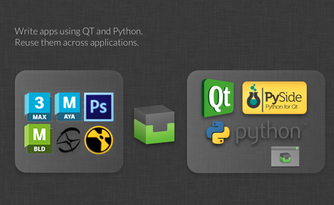

# Integrations Developer Guide

## Panels

See [https://github.com/shotgunsoftware/tk-multi-shotgunpanel/tree/master/hooks](https://github.com/shotgunsoftware/tk-multi-shotgunpanel/tree/master/hooks)  for examples of panel actions.

### Configuring what is being displayed

The values in the detail area and the listings are both configurable through the `shotgun_fields` hook. You can subclass this hook and change the implementation in order to display the exact values you want.

**Templating System**

The hook supports a simple templating language, allowing for great flexibility. It also supports the HTML subset supported by Qt, so you can control color, font size, weight, etc. of your displayed values.

The template language works in the following way:

-    values are enclosed in `{brackets}`, for example `<b>Description:</b> {description}`. When this template is rendered, the `{description}` part will be replaced with the description field value.
    
-   If you want an optional pre- or post-fix for a value which is only shown if the value is not empty, you can use the syntax `{[Prefix]sg_field[suffix]}`. The template `{[Start: ]start_date} {[End: ]end_date}` will render `Start: 12 July 2009 End: 14 July 2012` if both values are populated but `Start: 12 July 2009` if end date isn't set.
    
-   You can define fallbacks in the case some values are not set. For  Versions, the `artist` fields takes precedence over the `created_by` field in order to support a workflow where a producer submits versions on behalf of an artist. In this case, the Version will be created by the producer but the `artist` field will be set to the artist. This, however, is not always the case - in some cases, artist is left blank in pipelines where artists submit their own work. When displaying versions, it is therefore useful to be able to check the `artist` field first, and in case this isn't set, fall back on the `created_by` field. This is done using the `{field1|field2}` syntax, for example: `Created By: {artist|created_by}`. You can combine this with optional fields too, e.g. `{[Created By: ]artist|created_by}`.

This hook contains the following methods:

**Controlling items appearing in lists**

The `get_list_item_definition()` method returns a dictionary that controls the appearance of items in the various listings, given a  entity type. It returns a dictionary with the keys `top_left`, `top_right` and `body`, for example:

```python
{
 "top_left": "<big>{code}</big>",
 "top_right": "{updated_at}",
 "body": "By: {created_by}<br>Description: {description}"
}
```

**Controlling the top detail area**

The `get_main_view_definition()` method returns a dictionary with the keys `title` and `body` given a  entity type. These values controls the appearance of an object in the detail area, for example:

```python
{
 "title": "{type} {code}",
 "body": "By: {created_by}<br>Description: {description}"
}
```

**Controlling the fields shown in the Info tab**

The `get_all_fields()` methods returns a list of fields to display for a given entity when this is rendered in the Info tab.

### Configuring Actions

Actions are little snippets of code that operate on a piece of  data. Examples include:

-   An action that launches RV for a given  Version
-   An action that allows a user to assign herself to a given Task
-   An action that loads a  publish into Maya as a Maya reference.

The actual payload of an action is defined in an  _action hook_. Once you have defined the action logic, you can then map that action to  objects in the app configuration. These action mappings may for example look like this:

```yaml
action_mappings:
  PublishedFile:
  - actions: [reference, import]
    filters: {published_file_type: Maya Scene}
  - actions: [texture_node]
    filters: {published_file_type: Rendered Image}
  Task:
  - actions: [assign_task]
    filters: {}
  Version:
  - actions: [play_in_rv]
    filters: {}
```

In the above example, we use the actions `reference`, `import`, `texture_node`, `assign_task` and `play_in_rv`. We then map the actions to various  objects and conditions. For example, we are requesting the `import` action to appear for all publishes of type Maya Scene.

When an object is loaded into the Panel, the action configuration above is read in and analyzed. A list of suitable actions for the current object is determined and the `generate_actions()` hook method will be executed.  data for the given entity will be passed to the hook at this point so that the hook code can determine if the action can be run for this particular  object. This is a way to allow each hook to run a check prior to being displayed. For example, the `play_in_rv` hook may only be relevant in the case there is media available locally - the action mappings set up in the configuration tells the panel which actions to enable for a given  entity but they may not all be displayed because the `generate_actions()` method may determine that they are not suitable for the given object.

The actions returned from the `generate_actions()` method will be displayed on the actions menu and when a user clicks on it, the `execute_acton()` hook method is called to run the action.

For each application that the panel supports, there is an actions hook which implements suitable actions. For example, with something like Maya, the default hook will implement `reference`, `import` and `texture_node`actions, each carrying out specific Maya commands to bring publishes into the current Maya scene. As with all hooks, it is perfectly possible to override and change these, and it is also possible to create a hook that derives from the built in hook, making it easy to add additional actions to a built-in hook without having to duplicate lots of code.

The panel uses Toolkit's second generation hooks interface, allowing for greater flexibility. This hook format uses an improved syntax. You can see this in the default configuration settings, looking something like this:

```yaml
actions_hook: '{self}/tk-maya_actions.py'
```

The `{self}` keyword tells Toolkit to look in the app's `hooks` folder for the hook. If you are overriding this hook with your implementation, change the value to `{config}/panel/maya_actions.py`. This will tell Toolkit to use a hook called `hooks/panel/maya_actions.py` in your configuration folder.

For more information, please see the hook files that come with the app. The hooks also take advantage of inheritance, meaning that you don't need to override everything in the hook, but can more easily extend or augment the default hook in various ways, making hooks easier to manage.

[Learn more about the second gen hook format here.](https://support.shotgunsoftware.com/hc/en-us/articles/219039878#The%20hook%20data%20type)

By using inheritance in your hook, it would be possible to add additional actions to the default hooks like this:

```python
import sgtk
import os

# toolkit will automatically resolve the base class for you
# this means that you will derive from the default hook that comes with the app
HookBaseClass = sgtk.get_hook_baseclass()

class MyActions(HookBaseClass):

    def generate_actions(self, sg_data, actions, ui_area):
        """
 Returns a list of action instances for a particular object.
 The data returned from this hook will be used to populate the 
 actions menu.

 The mapping between  objects and actions are kept in a different place
 (in the configuration) so at the point when this hook is called, the app
 has already established *which* actions are appropriate for this object.

 This method needs to return detailed data for those actions, in the form of a list
 of dictionaries, each with name, params, caption and description keys.

 Because you are operating on a particular object, you may tailor the output 
 (caption, tooltip etc) to contain custom information suitable for this publish.

 The ui_area parameter is a string and indicates where the publish is to be shown. 

 - If it will be shown in the main browsing area, "main" is passed. 
 - If it will be shown in the details area, "details" is passed.

 :param sg_data:  data dictionary with all the standard publish fields.
 :param actions: List of action strings which have been defined in the app configuration.
 :param ui_area: String denoting the UI Area (see above).
 :returns List of dictionaries, each with keys name, params, caption and description
 """

        # get the actions from the base class first
        action_instances = super(MyActions, self).generate_actions(sg_data, actions, ui_area)

        if "my_new_action" in actions:
            action_instances.append( {"name": "my_new_action",
                                      "params": None,
                                      "caption": "My New Action",
                                      "description": "My New Action."} )

        return action_instances

    def execute_action(self, name, params, sg_data):
        """
 Execute a given action. The data sent to this be method will
 represent one of the actions enumerated by the generate_actions method.

 :param name: Action name string representing one of the items returned by generate_actions.
 :param params: Params data, as specified by generate_actions.
 :param sg_data:  data dictionary with all the standard publish fields.
 :returns: No return value expected.
 """

        if name == "my_new_action":
            # do some stuff here!

        else:
            # call base class implementation
            super(MyActions, self).execute_action(name, params, sg_data)
```

We could then bind this new action to a set of publish types in the configuration:

```yaml
action_mappings:
  PublishedFile:
  - actions: [reference, import, my_new_action]
    filters: {published_file_type: Maya Scene}
  Version:
  - actions: [play_in_rv]
    filters: {}
```

By deriving from the hook as shown above, the custom hook code only need to contain the actual added business logic which makes it easier to maintain and update.

## Publisher

The Publish app is highly customizable by way of hooks that control how items are presented to artists for publishing and how those items are then processed.

The full developer documentation for the publisher app can now be found on the  [Toolkit Developer Site](http://developer.shotgridsoftware.com/tk-multi-publish2).

For more information on how to use the Publish app, see the [User Guide](https://support.shotgunsoftware.com/hc/en-us/articles/115000067513-Integrations-Developer-Guide#User_guide_link). If you are looking for more information about the first generation Publisher, please visit the [classic Publisher docs](https://support.shotgunsoftware.com/hc/en-us/articles/115000067513-Integrations-Developer-Guide#classic_publisher_link).

## Loader

See [https://github.com/shotgunsoftware/tk-multi-loader2/tree/master/hooks](https://github.com/shotgunsoftware/tk-multi-loader2/tree/master/hooks) for examples of load actions.

## Advanced functionality

##  Toolkit makes it easy to develop tools

Did we mention that you can write your own Apps? Each Engine exposes a consistent interface based on Python and PySide, so you can write a single App that works in both Nuke, Photoshop and 3dsmax. With the Core API functionality, there is no need to build a big pipeline stack for the studio - instead focus dev resources on solving production problems. Reusing tools between projects is easy with our Toolkit - if file naming conventions or other requirements are changing, simply reconfigure the app. Roll out tools safely via the Toolkit's built-in Git and Github support and quickly hot-load your code when doing development. Work in your own Dev Sandbox and invite TDs and early adopters to test your code without having to roll it out to everyone on the project.

