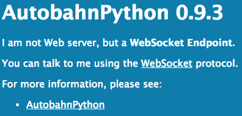
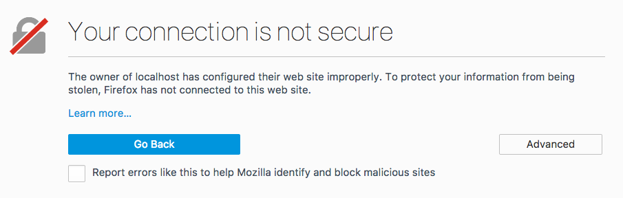
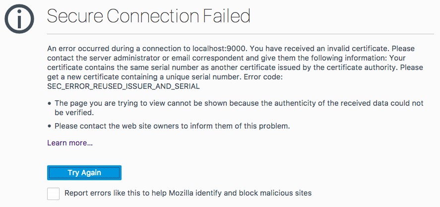
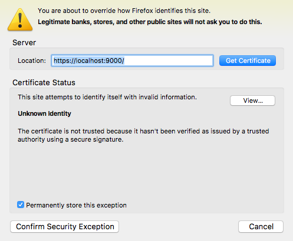
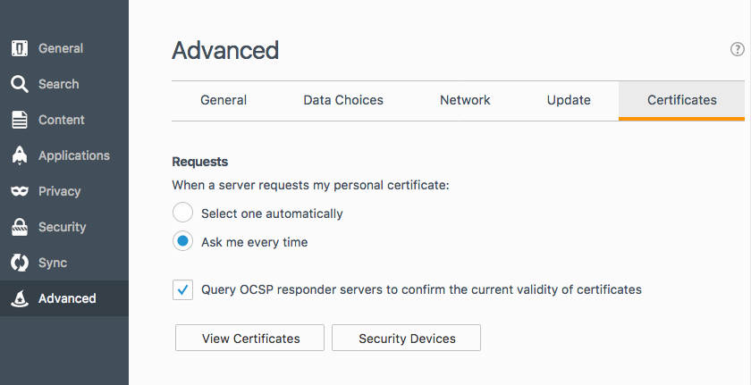
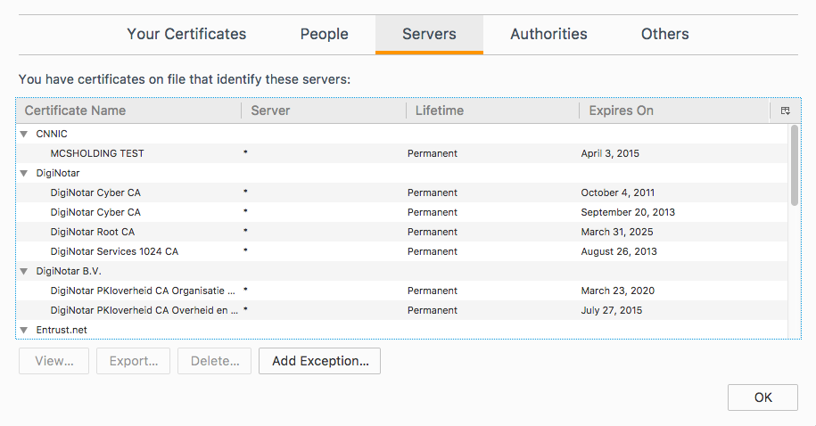

# I can't use local file linking and launch Toolkit applications from Firefox

## Overview

Sometimes in  the action menu will not display the list of Toolkit applications available or will error when using local file linking, even with  Desktop running.
This is a guide to troubleshooting  Desktop's browser integration in Firefox and will hopefully help you get things working. We have a separate guide for [Chrome](./cant-use-file-linking-toolkit-app-chrome.md).

## Diagnosing the issue

### Is  Desktop running?

Yes, we know. You probably already checked. We had to ask. :)

### Are you using firewall software?

Ensure that no firewall software is preventing connections to **localhost** or on port **9000**.

### Is Firefox rejecting the certificate?

You can verify that Firefox accepts the certificate by browsing to https://localhost:9000, which is the address the  website tries to access in order to do local file linking and launch Toolkit applications. You should normally be greeted by this message:

On the other hand, if you are greeted by one of those two messages, it means there was a problem with the certificate registration process:

## How to fix "Your connection is not secure"

You need to add an exception to the Firefox browser so that the certificate is accepted. If you just visited **https://localhost:9000**, the easiest way to add the exception is by clicking on **Advanced**, then click the **Add Exception** button. A dialog will appear.

Click **Get Certificate** and then **Confirm Security Exception**. You can ignore the message about the certificate not being trusted. This is normal as the certificate was generated by  Desktop and not by a certification authority.

You should now be able to access local file linking and launch Toolkit applications from your  site. If you are still experiencing issues after adding the exception, please visit our [support site](https://knowledge.autodesk.com/contact-support) for help.

## How to fix "Secure connection failed"

You need to click on the **Open Menu** button and pick **Preferences**. Then pick **Advanced** on the left hand side, **Certificates** and finally **View Certificates**.

In the **Servers** section, click on any item and start typing `localhost` or simply scroll until you find an entry named **localhost:9000**. Delete it. Then, go to the **Authorities** tab and type `localhost` again. You can once again also scroll until you reach the **Autodesk** section with a **localhost** entry underneath. You can remove the **localhost** entry. Once this is done, click **OK** and restart Firefox. Once Firefox has been restarted, browse to **https://localhost:9000**. You should now be greeted by this message:

At this point, you need to follow the step documented above to add an exception.

If this is not the screen you are getting, please visit our [support site](https://knowledge.autodesk.com/contact-support) for help.