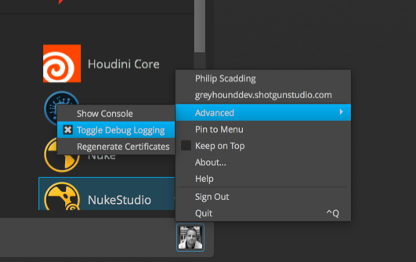
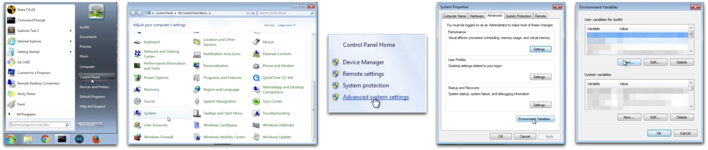

# How do I turn on debug logging?

Sometimes you want to see more logging data than Toolkit tools output by default. You can enable **debug logging** to get more verbose log output, and there are a few methods to do so. 



## Enable debugging through  Desktop

The easiest way to enable debugging is to toggle it on through the  Desktop app. This can be set once you are logged into  Desktop: click on your profile picture in the bottom right of the app, and select **Advanced -> Toggle Debug Logging**. This setting is persistent between sessions, so remember to turn it off when you are finished.



It should also be noted that when this is toggled on, apps launched from  Desktop, or even the Toolkit commands through the browser integration, will also inherit this debug state.

## Setting up an environment variable

### Permanently turning on debug logging
First, you will need to set up a new environment variable: `TK_DEBUG=1`



#### Example using Windows 7

- You can permanently turn on debug logging by navigating to the **Windows icon > Control Panel > System > Advanced system settings > Environment Variables… > New…**




- **Variable name**: `TK_DEBUG`
- **Variable value**: `1`
- Select OK

Now, your environment variable is set up properly and debug logging is turned on.



If you would like to turn debug logging off, you can either:

a. Set the `TK_DEBUG` environment variable value to 0.

b. Delete the `TK_DEBUG` environment variable.

### Checking to see if the environment variable is already set

To see if the environment variable has already been set, open a terminal and execute the following command: `set`

Then, search for `TK_DEBUG=1`.

This will ensure that once you launch Desktop, debug logging will be turned on.

### Temporarily turning on debug logging

If you would like to use debug logging temporarily for a session instead, you can open a terminal and set debug logging with the following command: `set TK_DEBUG=1`

Then, launch the Desktop through your terminal.




## Advanced configuration debug logging options

If you are in an advanced setup, there are a few more options for you. This functionality is only available if you have taken control over a Toolkit configuration.

Every engine has a `debug_logging` setting in the environment file. Turning this on will emit additional debug-level log messages to the default output in your Software (e.g., the script editor in Nuke or Maya). All of the apps running in your engine will emit these debug-level messages so turning this on for the engine will effectively turn it on for all of your apps as well.

This does not output any log messages to a file. We are working on a more standard logging framework that will allow this. The exceptions are [ Desktop](https://support.shotgunsoftware.com/hc/en-us/articles/219039818-Shotgun-Desktop) and the [Photoshop engine](https://support.shotgunsoftware.com/hc/en-us/articles/115000026653-Photoshop-CC), which log output both in a GUI console and to a file.

### Turning on debug logging for an engine in your software

As an example, to turn on debugging output for the Nuke engine in the shot step environment, find the Nuke engine (`tk-nuke`) section in your environment file and update the setting to `debug_logging: true`.

Edit `config/env/shot_step.yml`.

```yaml
engines: 
  ...
  ...
  tk-nuke:
    apps:
      ...
      ...
    compatibility_dialog_min_version: 9
    debug_logging: true
    favourite_directories: []
    location: {name: tk-nuke, type: app_store, version: v0.2.23}
    ...
   ...
```

Save the file and relaunch Nuke in the shot step environment. You will now see the debug output in the script editor window. 

{% include info title="Note" content="If debug logging is enabled via any one of the ShotGrid Desktop checkbox, environment variable, or engine configuration setting, debug logging will be output. Additionally, each of these three is modified independently of the others: the checkbox value a persistent app setting, totally independent of the engine setting or environment variable. This means that while the Desktop checkbox may be unchecked, debug logging might still be enabled by way of one of the other methods." %}

### Turning on debug logging for the tank command

If you’re running the tank command and want to see debug output in your terminal, use the `--debug` option with the command you’re running and this will turn on debug logging for the command.

    ./tank --debug core
    DEBUG [10:11:38 617.835998535]:
    DEBUG [10:11:38 618.768930435]: Running with debug output enabled.
    DEBUG [10:11:38 618.921995163]:
    DEBUG [10:11:38 619.092941284]: Core API resides inside a (localized) pipeline
    configuration.
    DEBUG [10:11:38 619.235992432]: Full command line passed:
    ['/sgtk/software/shotgun/scarlet/install/core/scripts/tank_cmd.py',
    '/sgtk/software/shotgun/scarlet', '--debug', 'core']
    DEBUG [10:11:38 619.364023209]:
    DEBUG [10:11:38 619.463920593]:
    DEBUG [10:11:38 619.575977325]: Code install root:
    /sgtk/software/shotgun/scarlet
    DEBUG [10:11:38 619.678020477]: Pipeline Config Root:
    /sgtk/software/shotgun/scarlet
    DEBUG [10:11:38 619.756937027]:
    DEBUG [10:11:38 619.826078415]:
    DEBUG [10:11:38 619.905948639]:
    DEBUG [10:11:38 619.978904724]: Context items:
    ['/sgtk/software/shotgun/scarlet']
    DEBUG [10:11:38 620.06688118]: Command: core
    DEBUG [10:11:38 620.129108429]: Command Arguments: []
    DEBUG [10:11:38 620.193004608]: Sgtk Pipeline Config Location:
    /sgtk/software/shotgun/scarlet
    DEBUG [10:11:38 620.270967484]: Location of this script (__file__):
    /sgtk/software/shotgun/scarlet/install/core/scripts/tank_cmd.py
    
    Welcome to the Shotgun Pipeline Toolkit!
    For documentation, see https://toolkit.shotgunsoftware.com
    Starting Toolkit for your current path '/sgtk/software/shotgun/scarlet'
    - The path is not associated with any Shotgun object.
    - Falling back on default project settings.
    DEBUG [10:11:39 125.463962555]: Sgtk API and Context resolve complete.
    DEBUG [10:11:39 126.449108124]: Sgtk API: Sgtk Core v0.15.18, config
    /sgtk/software/shotgun/scarlet
    DEBUG [10:11:39 126.588106155]: Context: scarlet
    - Using configuration 'Primary' and Core v0.15.18
    - Setting the Context to scarlet.
    DEBUG [10:11:39 129.276990891]: No need to load up the engine for this
    command.
    - Running command core...
    
    
    ----------------------------------------------------------------------
    Command: Core
    ----------------------------------------------------------------------
    
    
    Welcome to the  Pipeline Toolkit update checker!
    This script will check if the Toolkit Core API installed
    in /sgtk/software/shotgun/scarlet
    is up to date.
    
    
    Please note that when you upgrade the core API, you typically affect more than
    one project. If you want to test a Core API upgrade in isolation prior to
    rolling it out to multiple projects, we recommend creating a special
    *localized* pipeline configuration. For more information about this, please
    see the Toolkit documentation.
    
    
    You are currently running version v0.15.18 of the Shotgun Pipeline Toolkit
    No need to update the Toolkit Core API at this time!
    DEBUG [10:11:39 981.74405098]: Exiting with exit code None

