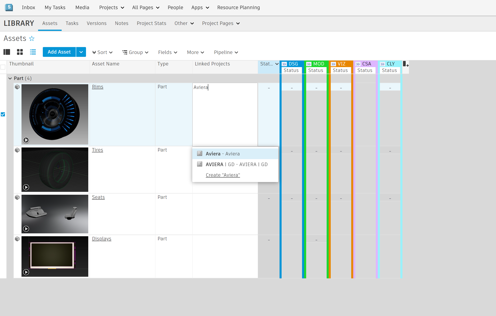
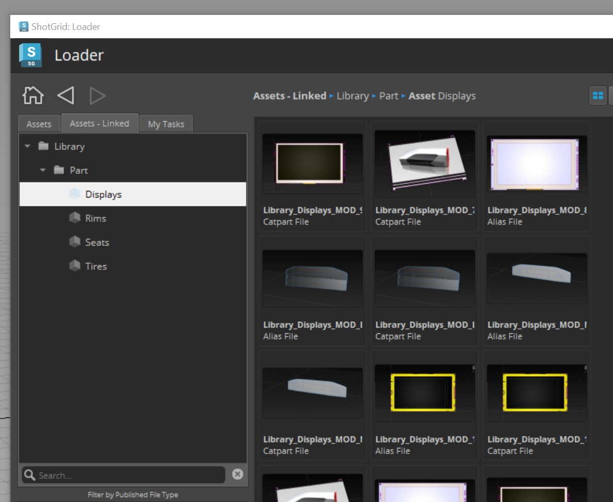

# Cross Project Workflow

## Best Practice

Cross Project workflows in  allow you to re-use, share and work with Assets across multiple Projects. The most common method for re-using Assets is to use a single "Asset Library" project as the source Project. While we still recommend using a singular "Library" project to keep it simple,  also allows you to link Assets across any active Project.

There are two main ways to re-use Assets. The more nimble approach is to re-use a source asset "as is" (Direct Reference). However,  limitations or restrictions may be in place based on Projects and Pipelines—so copying the source Asset over into a project is also an option (Duplicating or Forking). 

* **Direct Reference** - Re-use a source Asset as is. If that asset changes, you can keep your Version or update to the latest Version.
* **Duplicating or Forking** - Import the source Asset from another Project (breaking any connections to the source) to build on it or take control and save to your current Project.

# Cross Project / Library Project Workflow
This tutorial will show you how to use  Toolkit to re-use your Assets across multiple Projects and build up an Asset library that's easily accessible for Artists in your studio. Let's take you through the three main steps to get this up and running.

1. **ShotGrid Assets linked across Projects** - using the "Linked Projects" linked field between Assets and Projects
2. **Loading/referencing assets into scenes** - using a dynamic tab in the Loader
3. **Keep Assets up to date** - using the Scene Breakdown App

## Step 1 - Linking Assets

The first step of re-using assets is telling ShotGrid what other projects you would like to use an Asset in. 

From the source Project that has the original Asset your're looking to use, navigate to the Assets page.
Make sure the "Linked Projects" field is visible on the page, if not you can add it. Then in that field add the project you want to use the asset in.

*See the detailed documentation* [here](https://help.autodesk.com/view/SGSUB/ENU/?guid=SG_Administrator_ar_site_configuration_ar_cross_project_asset_linking_html). 

## Step 2 - Loading Assets
With an Asset properly linked you can have a simple and dynamic tab in Loader to show your studios linked Assets. This helps artist and creative teams easily re-use assets across multiple projects. 

Assuming the asset is properly linked, open your DCC of choice (Maya, Houdini, Alias, etc.), set the context by opening or saving your working scene. Once your scene context is correctly set, launch the Loader from the ShotGrid menu. Here you will see the tab called "Assets - Linked" allowing you to access Published Files for Assets across projects.

*See the detailed instructions to add to this Tab to the Loader in your config [here](https://developer.shotgridsoftware.com/2088a677/).*

From here, you can take advantage of your DCC Loader actions to do things like Import, if you plan to duplicate or fork your asset breaking any link to its source or Reference for an ongoing link to the current version and all subsequent versions of this asset.

## Step 3 - Updating those assets
If you choose to Reference this data and keep it pointing at a source somewhere else, you likely will want to see if the source changes. Maybe a different team is continuing to work on this asset and you need the latest version. 

Using the Scene Breakdown 2 app in your config, you can see all the referenced items currently in your scene. If any of those references gets updated, the scene breakdown will inform you, share the published file notes about what changed, and allow you to update to the latest version or any other version of the published file. 

*Note: The updating of assets only apply's for Advanced Configs. If your studio uses a Basic config you will not have access to this app.*

