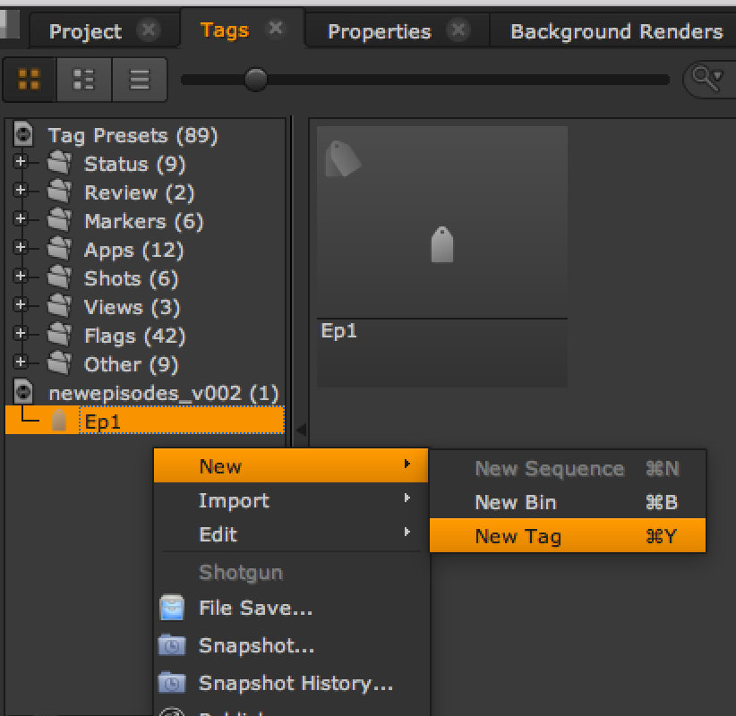
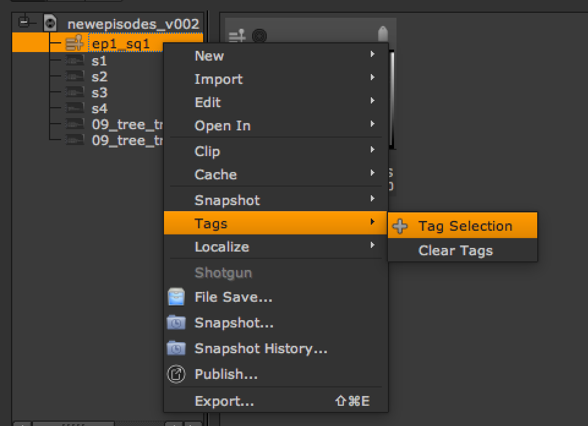
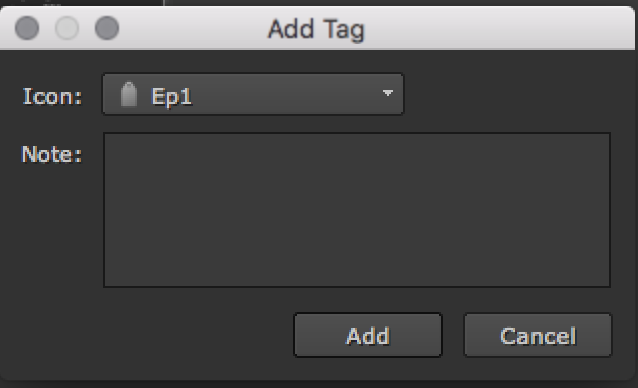
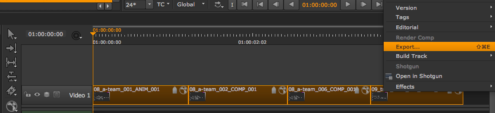

# Episodic workflow with Nuke Studio


## Introduction and prep work


This article explains how to get your episodic workflow up and running with our `tk-hiero-export` app in Nuke Studio or Hiero. Please note there is no one exact method for this, and the approach will vary slightly depending on your desired workflow. For the sake of this example we are going to make the following assumptions:

*   Your goal is to set up a three-tiered hierarchy of `Episode > Sequence > Shot`
*   You will have read and completed the steps in [the file system configuration guide](https://developer.shotgridsoftware.com/82ff76f7/?title=Filesystem+Configuration+Reference) .
*   You will use the `Episode` entity type, (not the `CustomEntity02` —both can work in the same way, it’s just a change of name.)
*   The `Sequence` entity has an entity field called `episode` .
*   You’ll be using Nuke Studio, although the process is the same for Hiero.
*   You will be starting with [a default configuration](https://github.com/shotgunsoftware/tk-config-default2) for your Toolkit project.

There is one more decision to make before you get started, and that is how to resolve the `Episode` . The out-of-the-box  Hiero/Nuke Studio export process creates `Sequence` and `Shot` entities on your  site based upon the contents of your Nuke Studio project. So, unlike working in Maya with Toolkit where we expect you to have already created the Assets and Tasks, in Nuke Studio we don’t expect your `Episodes` `Sequences` or `Shots` to already be created. With that said, you need to decide how to define the `Episode` in Nuke Studio. There are a few possible options here:  

*   Create the Episodes up front in  and configure the Nuke Studio Toolkit integrations to work in the context of an Episode, so that at export time you can get the `Episode` entity from the current scene context.
*   Assume `Episode` entities haven’t already been created and make use of the Nuke Studio’s tagging feature to tag the Sequence with the Episode name and use that to resolve our `Episode` at export time.

There may be other ways that suit your workflow better, such as extracting the episode name from part of the Nuke Studio Sequence or Shot names, e.g., taking the “ep1” bit from a sequence called “ep1_s01”. Or you could use the export app’s [hiero_customize_export_ui.py](http://areadownloads.autodesk.com/wdm/shotgrid/tu-episodic-nuke.zip) hook to add a GUI for linking up exports with Episodes.

For this example we will go with the second option: the Sequence tagging solution.

*Note that this walkthrough is for implementing three layers of hierarchy ( `Episode > Sequence > Shot` ). The process for simply trying to replace the `Sequence` entity type with the `Episodes` entity type ( `Episode > Shot` ) is easier. We cover this scenario briefly near the end of this guide, but it’s still worth reading the rest to get a better understanding.*

## Schema and templates


As mentioned previously, this example assumes that you have [updated your schema and templates](https://developer.shotgridsoftware.com/82ff76f7/?title=Filesystem+Configuration+Reference#how-can-i-add-a-new-entity-type-to-my-file-structure) . Make sure that you have also updated the `hiero_plate_path` and `hiero_render_path` path values in the templates.yml, so that they contain an episode key in the correct part.

## Hooks and settings


In order to get the  Export process to handle our `Episode` correctly, you will need to modify some of the export hooks. In this article we’ll assume you know what [hooks](https://developer.shotgridsoftware.com/312b792f/?title=Developing+frameworks#using-frameworks-from-hooks) are, and are comfortable with overriding the base implementations.

There are two export hooks that will help you enable episodes.

*   `hiero_get_shot.py`
*   `hiero_resolve_custom_strings.py`

NOTE: There is a third hook called `hiero_translate_template.py` . We are not going to use it in this example, however, you will need it if you only wanted to replace Sequences with Episodes and maintain a two layer hierarchy. We’ll cover this a bit more at the end of the article.

Modify the `hiero_get_shot.py` so you can find the Episode, and create an entity for it in  , and modify the `hiero_resolve_custom_strings.py` so that Nuke Studio knows what value to give to the {Episode} key in the path. Here are the steps in more detail:

### 1. Add Episode Field

You now have a new key in your templates called `Episode` , and you need to tell the `tk-hiero-export` app how to resolve this. Modify the `custom_template_fields` in the `<pipeline_configuration>/config/env/includes/settings/tk-hiero-export.yml` file, so that it looks like this:

```
 settings.tk-hiero-export:  
    custom_template_fields: [{keyword: Episode, description: The episode name}]  
 ... 
```

This adds a valid export token named `{Episode}` to the Hiero exporter.

### 2. hiero_get_shot hook

Now you need to tell the export process how to find the Episode name and create the `Episode` in  , using the `hiero_get_shot.py` hook.

The [default version of the hook (hiero_get_shot.py)](http://areadownloads.autodesk.com/wdm/shotgrid/tu-episodic-nuke.zip) will return the `Shot` from  with the same name as the TrackItem. The `Shot` must also be linked to a `Sequence` with the same name as the Nuke Studio sequence item. If the `Sequence` or `Shot` doesn’t exist in  , the hook will create them. You’re adding another level of hierarchy so you need to tell the hook to also create the `Episode` if it doesn’t exist.

And, since the `Sequence` is linked to the `Episode` , you should tie this into the code that looks up the `Sequence` , ( `get_shot_parent()` method).

Create an `hiero_get_shot.py` file in your config’s hooks folder, and add `hook_get_shot: '{config}/hiero_get_shot.py'` to your `tk-hiero-export.yml` settings , so that you now have something like this:

```
 settings.tk-hiero-export:  
    custom_template_fields: [{keyword: Episode, description: The episode name}]  
    hook_get_shot: '{config}/hiero_get_shot.py' 
```

Below is the complete code for the `hiero_get_shot.py` hook. Add this to the hook you created:

```
from sgtk import Hook

class HieroGetShot(Hook):
    """
    Return a    Shot dictionary for the given Hiero items
    """

    def execute(self, task, item, data, **kwargs):
        """
        Takes a hiero.core.TrackItem as input and returns a data dictionary for
        the shot to update the cut info for.
        """

       # get the parent entity for the Shot
       parent = self.get_shot_parent(item.parentSequence(), data, item=item)

       # shot parent field
       parent_field = "sg_sequence"

       # grab shot from   
       sg = self.parent.shotgun
       filter = [
           ["project", "is", self.parent.context.project],
           [parent_field, "is", parent],
           ["code", "is", item.name()],
        ]

       # default the return fields to None to use the python-api default
       fields = kwargs.get("fields", None)
       shots = sg.find("Shot", filter, fields=fields)
       if len(shots) > 1:
           # can not handle multiple shots with the same name
           raise StandardError("Multiple shots named '%s' found", item.name())
       if len(shots) == 0:
           # create shot in {{ akn_product_name_lower }}
           shot_data = {
               "code": item.name(),
               parent_field: parent,
               "project": self.parent.context.project,
           }
           shot = sg.create("Shot", shot_data, return_fields=fields)
           self.parent.log_info("Created Shot in   : %s" % shot_data)
       else:
           shot = shots[0]

       # update the thumbnail for the shot
       upload_thumbnail = kwargs.get("upload_thumbnail", True)
       if upload_thumbnail:
           self.parent.execute_hook(
               "hook_upload_thumbnail",
               entity=shot,
               source=item.source(),
               item=item,
               task=kwargs.get("task")
           )

       return shot

    def get_episode(self, data=None, hiero_sequence=None):
        """
        Return the {{ akn_product_name_lower }} episode for the given Nuke Studio items.
        We define this as any tag linked to the sequence that starts
        with 'Ep'.
        """

       # If we had setup Nuke Studio to work in an episode context, then we could
       # grab the episode directly from the current context. However in this example we are not doing this but here
       # would be the code.
       # return self.parent.context.entity

       # stick a lookup cache on the data object.
       if "epi_cache" not in data:
           data["epi_cache"] = {}

       # find episode name from the tags on the sequence
       nuke_studio_episode = None
       for t in hiero_sequence.tags():
           if t.name().startswith('Ep'):
               nuke_studio_episode = t
               break
       if not nuke_studio_episode:
           raise StandardError("No episode has been assigned to the sequence: %s" % hiero_sequence.name())

       # For performance reasons, lets check if we've already added the episode to the cache and reuse it
       # Its not a necessary step, but it speeds things up if we don't have to check {{ akn_product_name_lower }} for the episode again
       # this session.
       if nuke_studio_episode.guid() in data["epi_cache"]:
           return data["epi_cache"][nuke_studio_episode.guid()]

       # episode not found in cache, grab it from   
       sg = self.parent.shotgun
       filters = [
           ["project", "is", self.parent.context.project],
           ["code", "is", nuke_studio_episode.name()],
       ]
       episodes = sg.find("Episode", filters, ["code"])
       if len(episodes) > 1:
           # can not handle multiple episodes with the same name
           raise StandardError("Multiple episodes named '%s' found" % nuke_studio_episode.name())

       if len(episodes) == 0:
           # no episode has previously been created with this name
           # so we must create it in {{ akn_product_name_lower }}
           epi_data = {
               "code": nuke_studio_episode.name(),
               "project": self.parent.context.project,
           }
           episode = sg.create("Episode", epi_data)
           self.parent.log_info("Created Episode in   : %s" % epi_data)
       else:
           # we found one episode matching this name in {{ akn_product_name_lower }}, so we will resuse it, instead of creating a new one
           episode = episodes[0]

       # update the cache with the results
       data["epi_cache"][nuke_studio_episode.guid()] = episode

       return episode

    def get_shot_parent(self, hiero_sequence, data, **kwargs):
        """
        Given a Hiero sequence and data cache, return the corresponding entity
        in    to serve as the parent for contained Shots.

        :param hiero_sequence: A Hiero sequence object
        :param data: A dictionary with cached parent data.

        .. note:: The data dict is typically the app's `preprocess_data` which maintains the cache across invocations of this hook.        
        
        """ 
        # stick a lookup cache on the data object. 
        if "parent_cache" not in data: 
            data["parent_cache"] = {} 
        
        if hiero_sequence.guid() in data["parent_cache"]: 
            return data["parent_cache"][hiero_sequence.guid()] 
        
        episode = self.get_episode(data, hiero_sequence) 
        
        # parent not found in cache, grab it from    
        
        sg = self.parent.shotgun filter = [ 
            ["project", "is", self.parent.context.project], 
            ["code", "is", hiero_sequence.name()], 
            ["episode", "is", episode], 
            ] 
        
        # the entity type of the parent. 
        par_entity_type = "Sequence" 
        
        parents = sg.find(par_entity_type, filter) 
        if len(parents) > 1: 
            # can not handle multiple parents with the same name 
            raise StandardError( 
                "Multiple %s entities named '%s' found" % (par_entity_type, hiero_sequence.name()) 
                ) 
            
        if len(parents) == 0: 
            # create the parent in {{ akn_product_name_lower }} 
            par_data = { 
                "code": hiero_sequence.name(), 
                "project": self.parent.context.project, 
                "episode": episode, 
                } 
            
            parent = sg.create(par_entity_type, par_data) 
            self.parent.log_info( 
                "Created %s in   : %s" % (par_entity_type, par_data)
                )
        else: 
            parent = parents[0] 
                
        # update the thumbnail for the parent 
        upload_thumbnail = kwargs.get("upload_thumbnail", True) 
        
        if upload_thumbnail: 
            self.parent.execute_hook( 
                "hook_upload_thumbnail", entity=parent, source=hiero_sequence, item=None 
            ) 
            
        # cache the results 
        data["parent_cache"][hiero_sequence.guid()] = parent 
        return parent 
```

#### Getting the Sequence

With the code above, we’ve modified the `get_shot_parent()` method. It now uses the `Episode` returned from the new `get_episode()` method when finding and creating the `Sequence`. When checking for a pre-existing `Sequence` in the  database it now filters by the `episode</code< field`, and when it creates the `Sequence`, it populates the Sequence’s `episode` field with the `Episode` returned from `get_episode()`.


#### Getting the Episode

So how do you get the Episode? The `get_episode()` method code is very similar to the `get_shot_parent()` method but modified to retrieve the `Episode` instead of the `Sequence`.

In this guide you are assigning the episode in Nuke Studio by using Tags. For example, you could create a Tag in Nuke Studio named "Ep01". Then you would apply that Tag to the sequence in Nuke Studio.

At a high level the `get_episode()` method looks at all of the Tags applied to the sequence item in Nuke Studio, and if it encounters one that starts with the string "Ep", it assumes that is the tag defining the Episode name. The method then finds and returns the matching `Episode` from  and creates it if it doesn't yet exist. It also caches this information so it doesn’t have to perform the costly find call again.

*If you wanted to get the episode in a different way, for example from context or by taking the first section of the Sequence or Shot name, then use that logic in this method.*


#### Getting the Shot

The main purpose of the hiero_get_shot hook is to return the Shot data from . You don’t actually need to touch the logic for getting the shot, as you only need to modify how the `Sequence` got its parent. If you want to also link the `Shot` with the `Episode` through a custom field, then you would need to modify the code in the execute method as well. Access the `Episode` from the `Sequence` like `parent[“episode”]` and then link it up to the Shot in the create call.


### 3. Hiero_resolve_custom_strings.py 

The second hook you need to take over is the `hiero_resolve_custom_strings.py`. This is so you can resolve the path for the Nuke Studio exports. Once again you will need to create the hook in the hooks folder and add the setting `hook_resolve_custom_strings: {config}/hiero_resolve_custom_strings.py` to your `tk-hiero-export.yml` file.

The custom key `{Episode}`, which we added in step 1, will be passed to this hook, and the export app expects the resolved folder name to be returned. The hook needs to check if the passed key is `{Episode}`, and if it is, it will reuse the `get_episode()` method in the `hiero_get_shot.py` hook to get the `Episode` entity. Once it has the `Episode`, then the code can extract the name of the episode to generate the folder.

Here is the full code for the hook:

```
from sgtk import Hook


class HieroResolveCustomStrings(Hook):
    """Translates a keyword string into its resolved value for a given task."""
    # cache of shots that have already been pulled from {{ akn_product_name_lower }}
    _sg_lookup_cache = {}

    def execute(self, task, keyword, **kwargs):
        """
        The default implementation of the custom resolver simply looks up
        the keyword from the {{ akn_product_name_lower }} shot dictionary.

        For example, to pull the shot code, you would simply specify 'code'.
        To pull the sequence code you would use 'sg_sequence.Sequence.code'.
        """

        if keyword == "{Episode}":
            episode_entity = self.parent.execute_hook_method(
                "hook_get_shot",
                "get_episode",
                data=self.parent.preprocess_data,
                hiero_sequence=task._item.parentSequence(),
            )
            # hard coded to return the name of the episode
            # if however your folder for the episode in the schema, is not just made up from the code field
            # you need to get it to return what ever string value the folder would normally be created with.
            return episode_entity['code']

        shot_code = task._item.name()

        # grab the shot from the cache, or the get_shot hook if not cached
        sg_shot = self._sg_lookup_cache.get(shot_code)
        if sg_shot is None:
            fields = [ctf['keyword'] for ctf in self.parent.get_setting('custom_template_fields')]
            sg_shot = self.parent.execute_hook(
                "hook_get_shot",
                task=task,
                item=task._item,
                data=self.parent.preprocess_data,
                fields=fields,
                upload_thumbnail=False,
            )

            self._sg_lookup_cache[shot_code] = sg_shot

        self.parent.log_info("_sg_lookup_cache: %s" % (self._sg_lookup_cache))

        if sg_shot is None:
            raise RuntimeError("Could not find shot for custom resolver: %s" % keyword)

        # strip off the leading and trailing curly brackets
        keyword = keyword[1:-1]
        result = sg_shot.get(keyword, "")

        self.parent.log_debug("Custom resolver: %s[%s] -> %s" % (shot_code, keyword, result))
        return result
 
```

Note that if your schema Episode folder name is generated from something other than just the `code` field, then you will need to replicate that name here.

A more correct, but more complicated approach could be to add a `episode_root` template in the templates.yml, and then get the fields from the template. This would mean the returned folder name always matches the schema, even if you change the Episode folder name in the schema. It would look something like this:

```
ctx = tk.context_from_entity("Episode", episode_entity[id])
my_template = tk.templates["episode_root"]
fields = my_template.get_fields(ctx.filesystem_locations[0])
return fields["Episode"]
 
```

## Wrapping up


That should be it! All that’s left to do is test that our changes work correctly.

Having started up Nuke Studio, created a project, and populated it with sequences and footage, you can now test the export process. First, create the Episode tag. Remember you coded the hook to look for tags on the Sequence that start with `Ep` , so you must name the tag `Ep…`



Now add the Tag to the Sequence.

  


Once that is done, export the Shots from your tagged Sequence.

  


Check that the Export Structure hierarchy matches that of our schema. If it does not match, you may need to [refresh the structure](#tip-refresh) .

  
  

Once you click export, it should then create your Episodes, Sequences, and Shots in your  site, as well as the folder structure on disk. If you run into issues along the way, remember to check the Nuke Studio script editor or [  logs (tk-nukestudio.log)](https://developer.shotgunsoftware.com/38c5c024/) for any errors that you might encounter.

That completes this guide. Of course this is just one of the many ways to achieve working with episodes, and it’s up to you to figure out which approach and structure works best for your studio.

## Swapping Sequence for Episode


As briefly mentioned above, if you want to simply swap the default Sequence/Shot hierarchy for Episode/Shot, you can use the Nuke Studio Sequence item as the source of your Episode name.

1. Set up your schema and templates to work with an Episode/Shot structure.

2. Take over the default `hiero_get_shot.py` hook like shown above. However this time, change the `parent_field` variable value to `sg_episode` (make sure you have an episode field on your Shot entity) and the `par_entity_type` `variable value to` `Episode`.

3. Take over the `hiero_translate_template.py` hook and change the mapping in the hook file:  

```
 mapping = {
   "{Episode}": "{sequence}",
   "{Shot}": "{shot}",
   "{name}": "{clip}",
   "{version}": "{tk_version}",
}
 
```

  
The Episode key will get resolved with the Nuke Studio sequence key value.

> **Tip:** <a id="tip-refresh"></a> If you’ve opened your Hiero/Nuke Studio project before making these changes, or you’re testing while making the changes, then it’s possible you will need to reset the export path. Nuke Studio caches the export tree when you open the export dialog, so you will need to rebuild it by pressing the refresh button when you want your changes to the schema to be reloaded.