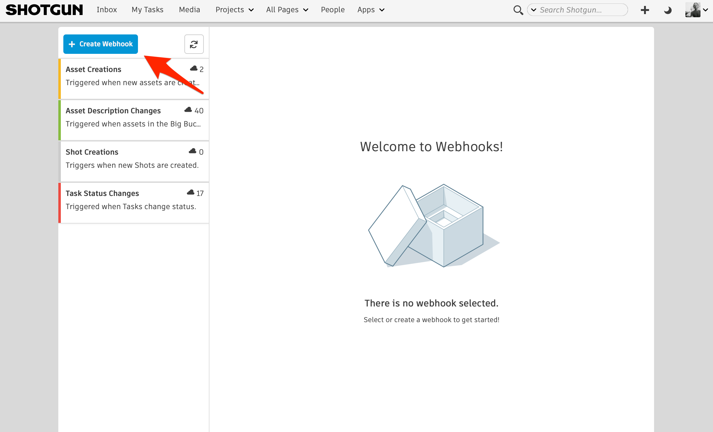
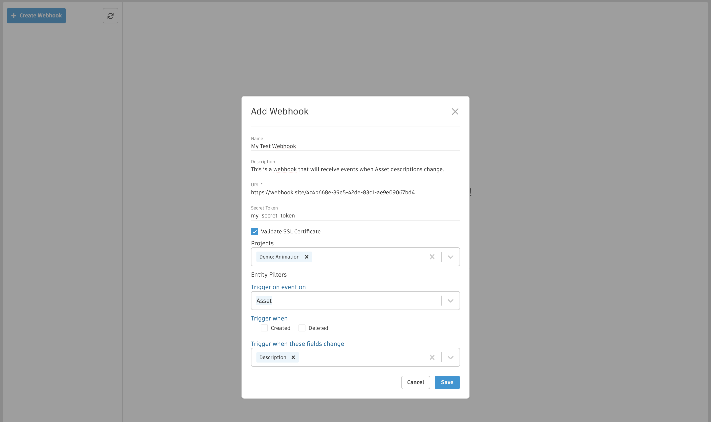
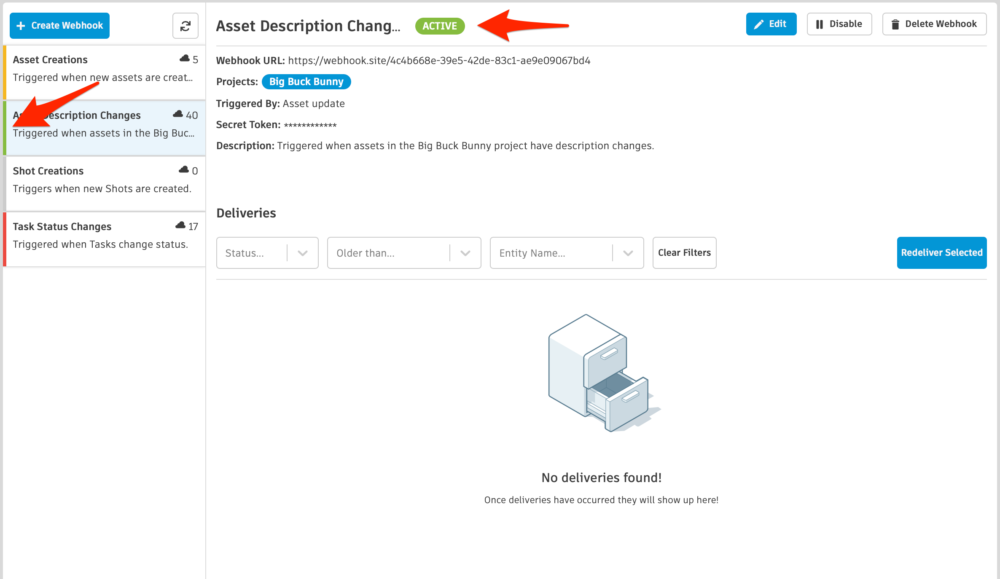
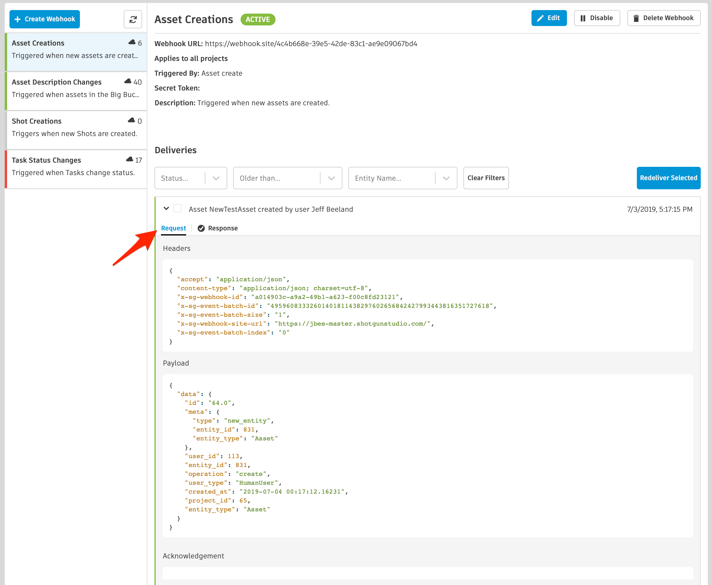

# Webhooks



Webhooks allow a service you control to be notified of events that occur in Shotgun. When you create a webhook, you specify the type of event you are interested in and tell Shotgun what URL to send data to when it is triggered. Once the relevant event happens in Shotgun, a payload of data describing the event will be sent to the webhook’s URL. This allows you to build tight integrations with Shotgun and automate portions of your workflow.

## What are some examples of how to use webhooks?

There are numerous use cases for webhooks. A few that we think are compelling are outlined in this document, but their uses are by no means limited to these few examples.

### Create a directory structure on disk when an entity is created

One workflow that we have seen repeated many times over is the need to create a directory structure on disk when a new entity is created in Shotgun. Why not go ahead and make sure that a new shot is ready for artist work automatically once it is created in Shotgun?

### Automation of status management

When your animation team is finished with their work, why not go ahead and change the status of downstream Tasks in the same Shot to indicate that more work is ready to begin? This way, you can automatically notify the assigned artists in different disciplines that everything is ready to go!

Another great example of how to automate status management would be to trigger a status change on a `Task` entity when a new `Note` is created. This is a good way to indicate to the artist and production teams that a supervisor has requested changes or fixes to the current work after a review session.

## When should webhooks be used instead of the Shotgun event daemon?

Webhooks and the [Shotgun event daemon](https://github.com/shotgunsoftware/shotgunEvents/wiki) offer similar features, but with a few key differences. The event daemon requires that you run, monitor, and maintain your own service. All of your code must be written in Python, and it allows you to initiate your own connections to Shotgun. Webhooks, in contrast, answer connections and can be written in any programming language. They can be hosted in a serverless environment, such as [AWS Lambda](https://aws.amazon.com/lambda/), or can trigger any of the automation platforms available online, such as [Zapier](https://zapier.com) and [IFTTT](https://ifttt.com). If your use case works with webhooks, it should be the preferred solution.

## Creating a webhook

To get started creating a webhook, go to a Webhooks page, then navigate to the button above the webhooks list. Access to webhooks is controlled by the "Advanced -> Show Webhooks" permission. It is enabled for default Admin and Manager roles. 



Next up is to fill out the information required to create the new webhook.



### Secret token

Assigning a secret token to a webhook is optional. If provided, any request sent to the webhook URL will be signed using that token. The token value is sent with the request as a header named `X-SG-SIGNATURE`. The signature is calculated using HMAC with SHA1 and the message signed is the JSON body of the request.

#### Header format

`<algorithm>=<signature>`

#### Why use a secret token?

While not strictly required, providing a secret token causes the payload sent to the webhook URL to be signed. This allows the consumer service to verify that the data originated from the source it expects, and that the payload has not been altered in any way during transit.

#### Signature verification

An example of how to verify the signature of the payload is provided below using Python.

```
>>> import hmac
>>> import hashlib
>>> body | `<json body>'
>>> token | `mytoken'
>>> 'sha1=' + hmac.new(token, body, hashlib.sha1).hexdigest()  == 'sha1=32824e0ea4b3f1ae37ba8d67ec40042f3ff02f6c'
True
```

### Validate SSL certificate

Validation of SSL certificates is an optional feature that will help ensure the security of any connections made to the webhook’s consumer URL. If turned on, when a delivery is made to the webhook’s URL, Shotgun will use OpenSSL’s certificate validation routine to verify the certificate.

## Webhook status

A webhook can have one of several different statuses, indicating its health and ability to continue receiving deliveries.



| Status | Example | Description |
|--------|:-------:|:-----------:|
| Active |  | The webhook is operating in a stable fashion. No deliveries to this webhook's consumer URL have failed to reach their destination in the past 24 hours. |
| Unstable |  | The webhook is operating in an unstable fashion. Some deliveries have failed to reach their destination in the past 24 hours, but not enough to cause Shotgun to consider the webhook to be dead. |
| Failed |  | The webhook is considered to be dead, and no further deliveries will be attempted. This is a result of too many delivery failures in a short period of time, and the system has determined that the webhook should no longer be considered viable. **A webhook is considered failed if it has 10 failed deliveries in the past 24 hours**. |
| Disabled |  | The webhook is in a disabled state, and no further deliveries will be attempted until it is re-enabled. |

## Deliveries

Selecting a webhook in the webhooks list will show all of the deliveries that have been made for that webhook dating back as far as seven days ago.



### Delivery status

A delivery’s status indicates whether it was successfully delivered to the webhook’s URL.


### Delivery details

Deliveries can be expanded to show detailed information about the request sent to the webhook URL and the response to that request.



#### Request Payload

The payload sent to the webhook's URL contains information describing the event that occurred in Shotgun and who triggered it. It is provided in JSON format.



##### Example payload

```json
{
  "data": {
    "id": "95.0",
    "meta": {
      "type": "attribute_change",
      "entity_id": 758,
      "new_value": "This is the newest description ever!!",
      "old_value": "This is the old description!",
      "entity_type": "Asset",
      "attribute_name": "description",
      "field_data_type": "text"
    },
    "user": {
      "id": 113,
      "type": "HumanUser"
    },
    "entity": {
      "id": 758,
      "type": "Asset"
    },
    "project": {
      "id": 65,
      "type": "Project"
    },
    "operation": "update",
    "created_at": "2019-07-12 21:14:36.598835",
    "event_type": "Shotgun_Asset_Change",
    "session_uuid": "07473c00-a4ea-11e9-b3b8-0242ac110006",
    "attribute_name": "description",
    "event_log_entry_id": 248249
  }
}
```

##### Session UUID

Provided as part of the event payload is the `session_uuid` that triggered the event in Shotgun. This value can be provided to [Shotgun's Python API](https://developer.shotgunsoftware.com/python-api/reference.html?highlight=session_uuid#shotgun_api3.shotgun.Shotgun.set_session_uuid), which will cause any open browser session with that session_uuid to display updates for events generated by the API.

### Responding to deliveries

A webhook consumer service must respond to deliveries in order for the system to consider them successfully delivered.



Process time is recorded for each delivery and can be viewed in the Response details tab. 

#### Throttling

Your consumer response times to deliveries will impact webhooks throughput for your site.
Each site is allowed 1 minute of response time per minute. So if all configured consumer endpoints for a site take the full 6 seconds to respond, webhooks deliveries for that site will be throttled to 10 per a minute.

Where a high rate of overall throughput is needed, then consumer endpoints should be designed according to the following model:
 1. Receive the request
 2. Spawn another process/thread to handle it the way you want
 3. Answer an acknowledging 200 immediately

#### Status codes

| Status | Code | Description |
|--------|:----:|:-----------:|
| Success | < 400 | The delivery was received and processed successfully. |
| Error | >= 400 | The delivery was received but was not processed successfully. |
| Redirect | 3xx | The delivery was received, but should be redirected to another URL. |

### Acknowledgements

A delivery can be updated to include an acknowledgement. When a delivery is made, headers are provided as part of the request. Included in those headers is the ID of the delivery record, stored in the `x-sg-delivery-id` key. This ID can be used to update the delivery record to include an acknowledgement using [the Shotgun REST API](https://developer.shotgunsoftware.com/rest-api).



#### Example headers

```json
{
  "accept": "application/json",
  "content-type": "application/json; charset=utf-8",
  "x-sg-webhook-id": "30f279a0-42a6-4cf2-bb5e-6fc550d187c8",
  "x-sg-delivery-id": "dea7a71d-4896-482f-b238-b61820df8b65",
  "x-sg-event-batch-id": "1",
  "x-sg-event-batch-size": "4",
  "x-sg-webhook-site-url": "http://yoursite.shotgunstudio.com/",
  "x-sg-event-batch-index": "3"
}
```

#### What are acknowledgements used for?

Acknowledgements allow for out of band, detailed reporting of success or failure to process a delivery that was successfully received by your webhook's URL. This creates a separation between the status of receiving the delivery from Shotgun and the success or failure to process the event associated with that delivery. In this way, successfully-delivered events can contain additional information useful for debugging purposes. A good example would be a webhook triggered on the creation of an `Asset` entity. If that webhook's responsibility is to create a directory structure on disk for each new `Asset`, the webhook's URL could successfully receive a delivery, but be unable to create the associated directories due to a disk or network outage. It could then update the delivery record with a detailed error message stating that the directory structure was not created, and why.

## Testing webhooks

You can use any of the freely available webhook URL generators online for testing purposes. These services are specifically intended to be used for testing webhooks and other types of HTTP requests. This is a great way to get started learning about webhooks without needing to set up any infrastructure on your own network.

### Using webhook.site

We recommend [webhook.site](https://webhook.site). It provides a unique URL that can be copied and pasted into a webhook, and will show you deliveries made to that address in real time. The page can be customized to respond to deliveries with a specific status code and body, which means you can test delivery success and failure.

The webhook.site service is aggressively rate limited. This means that it is easy to end up in a situation where some deliveries are rejected, resulting in unstable or failed webhooks. When testing, we recommend that you use a known, controllable project environment rather than live data in production.


