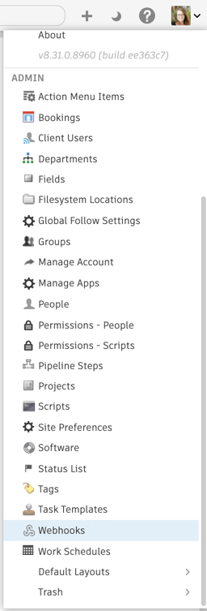
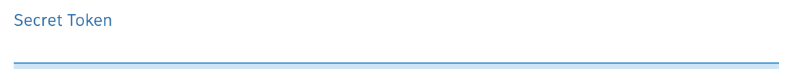
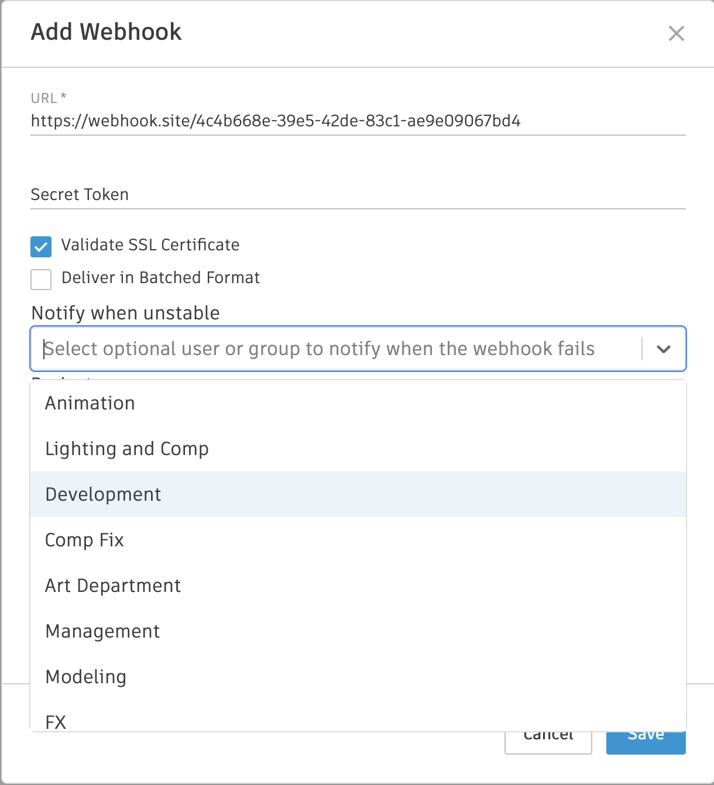

# Webhooks

Webhooks allow a service you control to be notified of events that occur in . When you create a webhook, you specify the type of event you are interested in and tell  what URL to send data to when it is triggered. Once the relevant event happens in , a payload of data describing the event will be sent to the webhook’s URL. This allows you to build tight integrations with  and automate portions of your workflow.

## What are some examples of how to use webhooks?

There are numerous use cases for webhooks. A few that we think are compelling are outlined in this document, but their uses are by no means limited to these few examples.

### Create a directory structure on disk when an entity is created

One workflow that we have seen repeated many times over is the need to create a directory structure on disk when a new entity is created in . Why not go ahead and make sure that a new shot is ready for artist work automatically once it is created in ?

### Automation of status management

When your animation team is finished with their work, why not go ahead and change the status of downstream Tasks in the same Shot to indicate that more work is ready to begin? This way, you can automatically notify the assigned artists in different disciplines that everything is ready to go!

Another great example of how to automate status management would be to trigger a status change on a `Task` entity when a new `Note` is created. This is a good way to indicate to the artist and production teams that a supervisor has requested changes or fixes to the current work after a review session.

## When should webhooks be used instead of the  event daemon?

Webhooks and the [ event daemon](https://github.com/shotgunsoftware/shotgunEvents/wiki) offer similar features, but with a few key differences. The event daemon requires that you run, monitor, and maintain your own service. All of your code must be written in Python, and it allows you to initiate your own connections to . Webhooks, in contrast, answer connections and can be written in any programming language. They can be hosted in a serverless environment, such as [AWS Lambda](https://aws.amazon.com/lambda/), or can trigger any of the automation platforms available online, such as [Zapier](https://zapier.com) and [IFTTT](https://ifttt.com). If your use case works with webhooks, it should be the preferred solution.

## Which events are available for Webhook subscriptions?

Webhooks may be created for Entities that are *in use* for the SG site.  supports Webhooks for two broad event groups:

1. **Entity type lifecycle events**  
  - Events that are created whenever an Entity is created, revived, updated or deleted.
  - The Entity options for Entity Lifecycle Events are limited to those that are available via API calls. 
2. **Custom events**
  - Events that are typically not related to the lifecycle of an entity, but which are created when an event occurs in the  system. 
  - _Example: when a user logs in, logs out, or a user performs a data Import or triggers an Action Menu Item._

You may retrieve the full list of the Entities available for API access using either the  [Python API](https://developer.shotgridsoftware.com/python-api/reference.html#shotgun_api3.shotgun.Shotgun.schema_entity_read) or [Rest API](https://developer.shotgridsoftware.com/rest-api/#shotgrid-rest-api-Access-Schema-data).

### Custom events available for webhook subscriptions

- ClientUser_FailedLogin
- ClientUser_Login
- ClientUser_Logout
- CRS_HumanUser_Thumbnail_Access_By_Client
- CRS_PlaylistShare_Create
- CRS_PlaylistShare_Revoke
- CRS_Preferences_Change
- CRS_Version_Media_Download
- CRS_Version_Thumbnail_Access_By_Client
- SG_RV_Session_Validate_Success
- ShotGrid_Invitation
- ShotGrid_PAT_Added
- ShotGrid_PAT_Exchanged
- ShotGrid_PAT_Removed
- Shotgun_ActionMenuItem_Triggered
- Shotgun_CutSupportDataMigration_data_migration
- Shotgun_CutSupportDataMigration_disable_cutversionconnection
- Shotgun_CutSupportDataMigration_schema_cleanup
- Shotgun_DisplayColumn_Delete
- Shotgun_ImportApp_Complete
- Shotgun_ImportApp_Failed
- Shotgun_ImportApp_Start
- Shotgun_NotesApp_Summary_Email
- Shotgun_Nsx_Support_Ticket
- Shotgun_PageSetting_Change
- Shotgun_PermissionRuleSet_ChangeRule
- Shotgun_PermissionRuleSet_DeleteRule
- Shotgun_PermissionRuleSet_NewRule
- Shotgun_Preferences_Change
- Shotgun_ProjectConfiguration_Update
- Shotgun_Reading_Change
- Shotgun_Review_Tools_Version_View
- Shotgun_User_FailedLogin
- Shotgun_User_Login
- Shotgun_User_Logout
- Shotgun_User_PasswordChange
- Shotgun_ValidationRule_Create
- Shotgun_Webhook_Created
- Shotgun_Webhook_Deleted
- Shotgun_Webhook_Updated

### Excluded events

Webhooks are **not** available for some Entities returned by API schema queries (reference [Python API](https://developer.shotgridsoftware.com/python-api/reference.html#shotgun_api3.shotgun.Shotgun.schema_entity_read), [Rest API](https://developer.shotgridsoftware.com/rest-api/#shotgrid-rest-api-Access-Schema-data). Exclusions include: 
- API Users
- [Event Log Entries](https://help.autodesk.com/view/SGSUB/ENU/?guid=SG_Administrator_ar_data_management_ar_event_logs_html)
- [Connection entities](https://help.autodesk.com/view/SGSUB/ENU/?guid=SG_Administrator_ar_data_management_ar_connection_entities_html) (entities that are used by  internally to create relationships between entities). Connection Entities typically include `Connection` in their name.

## When do entity lifecycle events occur?

 supports subscriptions to Entity lifecycle events when *Created, Updated, Deleted and Revived.*

- **Create events:** generates when a new entity has been created from the Web U, or from an API request 
- **Update events:** generates when any field is updated on an entity after initial creation. When subscribed to an update lifecycle event, A Webhook delivery will occur for any update operation on a field *after initial creation*. **A Webhook delivery will not occur when subscribed to a field update for the initial creation operation of that entity**
- **Delete events:** generates when an entity is logically deleted (moved to the trash)
- **Revive events:** generates when an entity is logically revived (restored from the trash)

## Creating a Webhook

### Creating a Webhook from the Webhooks Page

To get started creating a webhook, go to the **Webhooks** page.



Then, select **Create Webhook**. 




Next, fill out the information required to create your new webhook.


### Creating a Webhook from an Event Log

While on an Event Log Entries Page, right-click on an Event Log Entry record and select **Create Webhook from event**. 


This will open up and pre-populate the Webhook creation form. 


### Secret token

Assigning a secret token to a webhook is optional. When provided, any request sent to the webhook URL will be signed using that token. The token value is sent with the request as a header named `X-SG-SIGNATURE`. The signature is calculated using HMAC with SHA1 and the message signed is the JSON body of the request.



#### Header format

`<algorithm>=<signature>`

#### Why use a secret token?

While not strictly required, providing a secret token causes the payload sent to the webhook URL to be signed. This allows the consumer service to verify that the data originated from the source it expects, and that the payload has not been altered in any way during transit.

#### Signature verification

An example of how to verify the signature of the payload is provided below using Python.

```python
>>> import hmac
>>> import hashlib
>>> body | `<json body>'
>>> token | `mytoken'
>>> 'sha1=' + hmac.new(token, body, hashlib.sha1).hexdigest()  == 'sha1=32824e0ea4b3f1ae37ba8d67ec40042f3ff02f6c'
True
```

### Validate SSL certificate

Validation of SSL certificates is an optional feature that will help ensure the security of any connections made to the webhook’s consumer URL. If turned on, when a delivery is made to the webhook’s URL,  will use OpenSSL’s certificate validation routine to verify the certificate.


### Deliver in Batched Format


[Read more about delivering in batched format here](https://developer.shotgridsoftware.com/e7890fc8/).

### Notify when unstable

**Notify when unstable** allows you to select a person or group to notify when the webhook fails. This setting is optional.



### Filtering by Project and Entity

Selecting specific projects, entities, and fields will minimize traffic to your webhook, which in result will:

- Improve performance
- Reduce resource costs
- Prevent unnecessary backlogs




#### Entity lifecycle Events 

These are standard create/revive/update/delete events for entities like Shots, Assets and Tasks. 


#### Custom Events

Custom events are more events that can be subscribed to—like Client Review Site activity, User Logins, and Permission changes. 


## Webhook status

A webhook can have one of several different statuses, indicating its health and ability to continue receiving deliveries.


| Status | Example | Description |
|--------|:-------:|:-----------:|
| Active |  | The webhook is operating in a stable fashion. No deliveries to this webhook's consumer URL have failed to reach their destination in the past 24 hours. |
| Unstable |  | The webhook is operating in an unstable fashion. Some deliveries have failed to reach their destination in the past 24 hours, but not enough to cause  to consider the webhook to be dead. |
| Failed |  | The webhook is considered to be dead, and no further deliveries will be attempted. This is a result of too many delivery failures in a short period of time, and the system has determined that the webhook should no longer be considered viable. **A webhook is considered failed if it has 100 failed deliveries in the past 24 hours**. |
| Disabled |  | The webhook is in a disabled state, and no further deliveries will be attempted until it is re-enabled. |

## Deliveries

Selecting a webhook from the webhooks list will show all of the deliveries that have been made for that webhook dating back as far as seven days.



### Delivery status

A delivery status indicates whether it was successfully delivered to the webhook’s URL.


### Delivery details

Deliveries can be expanded to show detailed information about the request sent to the webhook URL and the response to that request.


#### Request Payload

The payload sent to the webhook's URL contains information describing the event that occurred in  and who triggered it. It is provided in JSON format.



##### Example payload

```json
{
  "data": {
    "id": "11777.3065.0",
    "meta": {
      "type": "attribute_change",
      "entity_id": 1246,
      "new_value": "*Add fog and mist with depth",
      "old_value": "*Add fog and mist.",
      "entity_type": "Shot",
      "attribute_name": "description",
      "field_data_type": "text"
    },
    "user": {
      "id": 88,
      "type": "HumanUser"
    },
    "entity": {
      "id": 1246,
      "type": "Shot"
    },
    "project": {
      "id": 122,
      "type": "Project"
    },
    "operation": "update",
    "created_at": "2022-02-01 20:53:08.523887",
    "event_type": "Shotgun_Shot_Change",
    "delivery_id": "3a5de4ee-8f05-4eac-b537-611e845352fc",
    "session_uuid": "dd6a1d6a-83a0-11ec-8826-0242ac110006",
    "attribute_name": "description",
    "event_log_entry_id": 545175
  },
  "timestamp": "2022-02-01T20:53:09Z"
}
```

##### Session UUID

Provided as part of the event payload is the `session_uuid` that triggered the event in . This value can be provided to ['s Python API](https://developer.shotgridsoftware.com/python-api/reference.html?highlight=session_uuid#shotgun_api3.shotgun.Shotgun.set_session_uuid), which will cause any open browser session with that session_uuid to display updates for events generated by the API.

#### Response from the Webhook


The Response tab shows details about your webhook's response to the delivery. 

You can see your webhook's response HTTP headers, body, and the measured response time.

A maximum of 100 characters of your webhook's response body are retained. (As noted above, delivery information is retained for review for 7 days and deleted afterwards.)



### Responding to deliveries

A webhook consumer service must respond to deliveries in order for the system to consider them successfully delivered.



Process time is recorded for each delivery and can be viewed in the Response details tab.

#### Throttling

's delivery infrastructure is optimized to deliver a large number of customer Webhooks and has a number of mechanisms in place to ensure optimal performance and reliability for all our customers. When a Webhook delivery is made, we examine the time that it took for the endpoint to respond. This metric, along with information about the volume of deliveries being processed, is combined to determine whether your Webhook endpoint is performing at a sustainable rate.

Your consumer response times to deliveries will impact webhooks throughput for your site.

Each site is allowed 1 minute of response time per minute. If all configured consumer endpoints for a site take the full 6 seconds to respond, webhooks deliveries for that site will be throttled to 10 per a minute.

When a high rate of overall throughput is needed, consumer endpoints should be designed according to the following model:
 1. Receive the request
 2. Spawn another process/thread to handle it the way you want
 3. Answer an acknowledging 200 immediately

Factors that may contribute to poor performance include:
- A poorly configured or under-resourced Webhook consumer endpoint
- Delays in processing the delivery before sending a response

#### Bursts

If your  site is being throttled as a result of short bursts of heavy activity, it will return to normal throughput once the burst of event activity has subsided. The [performance indicators](#performance) will provide insight into which of your configured endpoints are not performing well.

#### Webhooks and geographic considerations

The  Webhook delivery infrastructure is hosted in the AWS US-East (Oregon) region. Optimization for delivery times may be possible by hosting your webhook endpint in a location closer to US-East.

#### Status codes

| Status | Code | Description |
|--------|:----:|:-----------:|
| Success | < 400 | The delivery was received and processed successfully. |
| Error | >= 400 | The delivery was received but was not processed successfully. |
| Redirect | 3xx | The delivery was received but should be redirected to another URL. |

## Performance

### Response Times

When you select a Webhook, you can view the **Current response times**.


#### Slow responses and heavy loads

Slow response times and heavy loads are indicated with a colored badge on each Webhook. You can also sort Webhooks based on response times.


When a Webhook impacted by performance is selected, more information about the impact is visible in a banner.

**Slow Response**
- Issue: 
  - This occurs when the average time to receive a response is > 500ms, impacting the Webhook to respond slowly
- Solution:
  - You will need to optimize your infrastructure since individual event processing has exceeded the 500ms threshold for some events.

**Heavy Load**
- Issue:
  - This occurs when the ratio of time taken to process / event time span (for a set of deliveries) is >10%), impacting the Webhook to consume over 10% of your allocated bandwidth
- Solution:
  - You will need to optimize your infrastructure since the number of events being generated is high relative to the number of events being processed.

**Very Heavy Load**
- Issue:
  - This occurs when the ratio of time taken to process / event time span (for a set of deliveries) is >50%
  - This webhook consumes over 50% of your allocated bandwidth
- Solution: 
  - You will need to optimize your infrastructure since the number of events being generated is very high relative to the number of events being processed and [throttling will initiate](#throttling) when you consume over 100% of your allotted processing bandwidth.

**Note:** 

### Acknowledgements

A delivery can be updated to include an acknowledgement. When a delivery is made, headers are provided as part of the request. Included in those headers is the ID of the delivery record, stored in the `x-sg-delivery-id` key. This ID can be used to update the delivery record to include an acknowledgement using [the  REST API](https://developer.shotgridsoftware.com/rest-api).



#### Example headers

```json
{
  "accept": "application/json",
  "content-type": "application/json; charset=utf-8",
  "x-sg-webhook-id": "30f279a0-42a6-4cf2-bb5e-6fc550d187c8",
  "x-sg-delivery-id": "dea7a71d-4896-482f-b238-b61820df8b65",
  "x-sg-event-batch-id": "1",
  "x-sg-event-batch-size": "4",
  "x-sg-webhook-site-url": "https://yoursite.shotgunstudio.com/",
  "x-sg-event-batch-index": "3"
}
```

#### What are acknowledgements used for?

Acknowledgements allow for out of band, detailed reporting of success or failure to process a delivery that was successfully received by your webhook's URL. This creates a separation between the status of receiving the delivery from  and the success or failure to process the event associated with that delivery. As a result, successfully-delivered events can contain additional information useful for debugging purposes. 

A good example would be a webhook triggered on the creation of an `Asset` entity. If that webhook's responsibility is to create a directory structure on disk for each new `Asset`, the webhook's URL can successfully receive a delivery, but be unable to create the associated directories due to a disk or network outage. Then, it can update the delivery record with a detailed error message stating that the directory structure was not created, and why.

## Testing Webhooks

You can use any of the freely available webhook URL generators online for testing purposes. These services are specifically intended to be used for testing webhooks and other types of HTTP requests. This is a great way to get started learning about webhooks without needing to set up any infrastructure on your own network.

### Using webhook.site

We recommend [webhook.site](https://webhook.site). It provides a unique URL that can be copied and pasted into a webhook and will show you deliveries made to that address in real time. The page can be customized to respond to deliveries with a specific status code and body, which means you can test delivery success and failure. 

The webhook.site service is aggressively rate limited. This means that it is easy to end up in a situation where some deliveries are rejected, resulting in unstable or failed webhooks. When testing, we recommend that you use a known, controllable project environment rather than live data in production.



