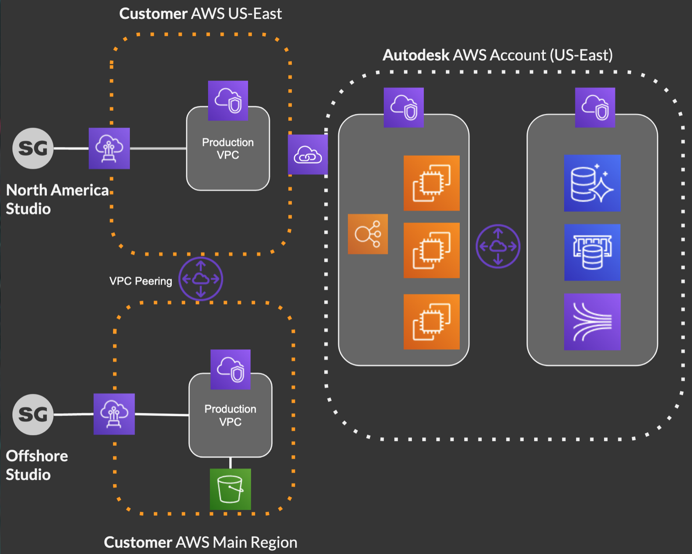

# Planning Your Setup

## Pick your options

Pick which Shotgun Private Cloud options you want to implement:
  * Private S3 Bucket
  * Media Segregation
  * Traffic Segregation

## Choose an AWS Region

Choose an AWS Region for your AWS S3 bucket and VPC.

## Plan the VPC IP ranges

Plan our AWS VPC and subnets IP ranges.

### IP Range Example

| Region | VPC | Subnet 1 | Subnet 2 | Subnet 3 | 
|--------|-----|----------|----------|----------|
| ap-southeast-2 | 10.1.0.0/16 | 10.1.0.0/24 | 10.1.1.0/24 | 10.1.2.0/24 |

### Plan how you will privately access your AWS VPC

  * AWS Direct Connect
  * Other VPN solution
