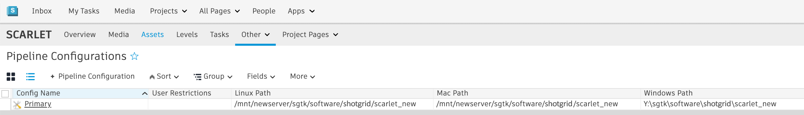

# How do I move my pipeline configuration to a new location?



The easiest way to move your pipeline configuration to a new location is by using the `tank move_configuration` command. This will take care of moving your files, updating , and updating your config files to point to the new location. 

This command is also useful if you are only moving the location for a single operating system, or were not previously using a certain operating system but would like to add it now. Toolkit will detect what needs to be moved or added and what doesn’t, and will show you what it is about to do to allow you to confirm before progressing. 

- [Using the tank move_configuration command](#using-the-tank-move_configuration-command)
- [Manually moving your pipeline configuration](#manually-moving-your-pipeline-configuration)

{% include warning title="Caution" content="If you are moving a configuration that has a localized core, and you have other projects that are using the Toolkit core embedded in this pipeline configuration (i.e. other configurations are using this as a shared core), you'll have to manually update the configuration files in those projects to point to the new location for this pipeline configuration. These files are located in:

- `/path/to/pipeline_configuration/install/core/core_Darwin.cfg`
- `/path/to/pipeline_configuration/install/core/core_Linux.cfg`
- `/path/to/pipeline_configuration/install/core/core_Windows.cfg`" %}

## Using the tank move_configuration command:

        $ cd /sgtk/software/shotgun/scarlet 
        $ ./tank move_configuration

        Welcome to the  Pipeline Toolkit!
        For documentation, see https://toolkit.shotgunsoftware.com
        Starting Toolkit for your current path '/sgtk/software/shotgun/scarlet'
        - The path is not associated with any  object.
        - Falling back on default project settings.
        - Using configuration 'Primary' and Core v0.15.22
        - Setting the Context to Scarlet.
        - Running command move_configuration...

        ----------------------------------------------------------------------
        Command: Move configuration
        ----------------------------------------------------------------------

        Syntax: move_configuration linux_path windows_path mac_path

        This will move the location of the given pipeline configuration.
        You can also use this command to add a new platform to the pipeline
        configuration.

        Current Paths
        --------------------------------------------------------------

        Current Linux Path:   '/mnt/hgfs/sgtk/software/shotgun/scarlet'
        Current Windows Path: 'z:\sgtk\software\shotgun\scarlet'
        Current Mac Path:     '/sgtk/software/shotgun/scarlet'

        You typically need to quote your paths, like this:

        > tank move_configuration "/linux_root/my_config" "p:\configs\my_config"
        "/mac_root/my_config"

        If you want to leave a platform blank, just just empty quotes. For example, if
        you want a configuration which only works on windows, do like this:

        > tank move_configuration "" "p:\configs\my_config" ""
 

### Example:

        $ cd /sgtk/software/shotgun/scarlet 
        $ ./tank move_configuration "/mnt/hgfs/sgtk/software/shotgun/scarlet_new" "z:\sgtk\software\shotgun\scarlet_new" "/sgtk/software/shotgun/scarlet_new"

        Welcome to the  Pipeline Toolkit!
        For documentation, see https://toolkit.shotgunsoftware.com
        Starting toolkit for path '/sgtk/software/shotgun/scarlet'
        - The path is not associated with any  object.
        - Falling back on default project settings.
        - Using configuration 'Primary' and Core v0.15.22
        - Setting the Context to Scarlet.
        - Running command move_configuration...

        ----------------------------------------------------------------------
        Command: Move configuration
        ----------------------------------------------------------------------

        Current Paths
        --------------------------------------------------------------
        Current Linux Path:   '/sgtk/software/shotgun/scarlet'
        Current Windows Path: 'z:\sgtk\software\shotgun\scarlet'
        Current Mac Path:     '/sgtk/software/shotgun/scarlet'

        New Paths
        --------------------------------------------------------------
        New Linux Path:   '/mnt/hgfs/sgtk/software/shotgun/scarlet_new'
        New Windows Path: 'z:\sgtk\software\shotgun\scarlet_new'
        New Mac Path:     '/sgtk/software/shotgun/scarlet_new'

        The configuration will be moved to reflect the specified path changes.

        Note for advanced users: If your configuration is localized and you have other
        projects which are linked to the core API embedded in this configuration,
        these links must be manually updated after the move operation.

        Are you sure you want to move your configuration? [Yes/No] yes
        Copying '/sgtk/software/shotgun/scarlet' -> '/sgtk/software/shotgun/scarlet_new'
        Copying /sgtk/software/shotgun/scarlet/cache...
        Copying /sgtk/software/shotgun/scarlet/config...
        Copying /sgtk/software/shotgun/scarlet/config/core...
        Copying /sgtk/software/shotgun/scarlet/config/core/hooks...
        Copying /sgtk/software/shotgun/scarlet/config/core/schema...
        Copying /sgtk/software/shotgun/scarlet/config/env...
        Copying /sgtk/software/shotgun/scarlet/config/env/includes...
        Copying /sgtk/software/shotgun/scarlet/config/hooks...
        Copying /sgtk/software/shotgun/scarlet/config/icons...
        Copying /sgtk/software/shotgun/scarlet/install...
        Copying /sgtk/software/shotgun/scarlet/install/apps...
        Copying /sgtk/software/shotgun/scarlet/install/apps/app_store...
        Copying /sgtk/software/shotgun/scarlet/install/core...
        Copying /sgtk/software/shotgun/scarlet/install/core/python...
        Copying /sgtk/software/shotgun/scarlet/install/core.backup...
        Copying /sgtk/software/shotgun/scarlet/install/core.backup/20150518_143244...
        Copying /sgtk/software/shotgun/scarlet/install/core.backup/20150518_143940...
        Copying /sgtk/software/shotgun/scarlet/install/engines...
        Copying /sgtk/software/shotgun/scarlet/install/engines/app_store...
        Copying /sgtk/software/shotgun/scarlet/install/frameworks...
        Copying /sgtk/software/shotgun/scarlet/install/frameworks/app_store...
        Updating cached locations in /sgtk/software/shotgun/scarlet_new/config/core/install_location.yml...
        Updating  Configuration Record...
        Deleting original configuration files...

        All done! Your configuration has been successfully moved.
 

## Manually moving your pipeline configuration



If you've already started moving things manually and are stuck, here's a rundown of what you need to change to ensure Toolkit continues to work with your pipeline configuration now in a new location.

1. Move your pipeline configuration files to their new location

        $ mv /sgtk/software/shotgun/scarlet /mnt/newserver/sgtk/software/shotgun/scarlet_new

2. Edit your `install_location.yml`, which helps Toolkit find where the pipeline configuration is located:

        $ vi /mnt/newserver/sgtk/software/shotgun/scarlet_new/config/core/install_location.yml

    Update the paths in this file to point to the new location for your pipeline configuration on all of the applicable platforms. If you're not using a platform, enter an empty string `''`

        #  Pipeline Toolkit configuration file
        # This file was automatically created by setup_project
        # This file reflects the paths in the primary pipeline

        # configuration defined for this project.
        Windows: 'Y:\sgtk\software\shotgun\scarlet_new'
        Darwin: '/mnt/newserver/sgtk/software/shotgun/scarlet_new'
        Linux: ''

        # End of file.

3. Locate the corresponding PipelineConfiguration entity in  for this project and modify the Linux Path, Mac Path, and Windows Path field values to match the changes you made above.

Now your pipeline configuration should work as expected from the new location.

