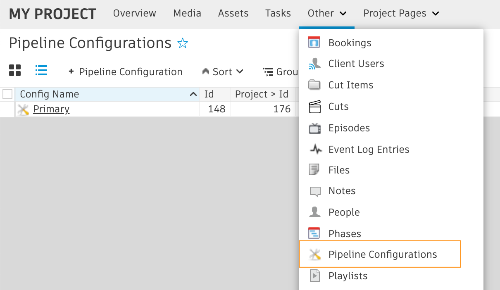
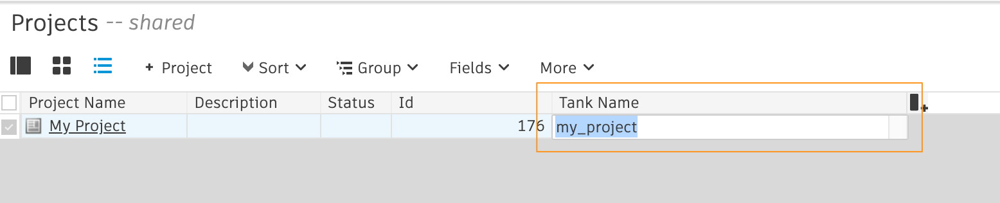

# How do I re-setup a Toolkit project using Shotgun Desktop?

If you’ve already set up a Toolkit configuration for a project and need to start fresh, the Advanced Setup Wizard in Shotgun Desktop will not allow you to re-setup the project unless you’ve removed the previously setup configuration. 

Here are the steps for manually removing those settings:

1. Delete any `PipelineConfiguration` entities linked to your Project in Shotgun..    
2. Set the `Tank Name` field on your `Project` entity in Shotgun to a blank value.    
3. Remove any corresponding pipeline configuration directories on disk..
4. In Shotgun Desktop select the project you wish to set up. *If you were already viewing the project, jump out to the project list view and then back into your project again.*
6. Now you can run the project setup process again.

**Alternate method**

If you are used to using the command line to set up your project with the  `tank setup_project` command then you can add a `--force` argument to the end of the command. This allows you to set up a previously setup project without following the manual steps listed above.
    
    tank setup_project --force"

    