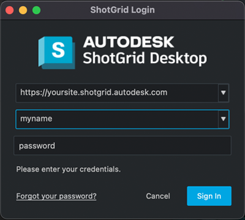

# How do I work with authentication and login credentials in custom scripts?

## Error Message
If you're seeing an error like the one below coming from your script, then it means your script is not authorized to talk to your Shotgun site.

```text
tank.errors.TankError: Missing required script user in config '/path/to/your/project/config/core/shotgun.yml'
```
The error message may appear a bit misleading, as the fallback check for authentication is to check to see if any credentials have been defined in the config's `shotgun.yml` file. However defining credentials in your `shotgun.yml` file is the old method of handling authentication.
You should avoid defining them in the `shotgun.yml` file, and instead use one of the approaches detailed below:


## User-facing scripts
If the script is user facing, you can add this at the beginning, before creating a Sgtk/Tank instance:

```python
# Import Toolkit so we can access to Toolkit specific features.
import sgtk

# Import the ShotgunAuthenticator from the tank_vendor.shotgun_authentication
# module. This class allows you to authenticate either programmatically or, in this
# case, interactively.
from tank_vendor.shotgun_authentication import ShotgunAuthenticator

# Instantiate the CoreDefaultsManager. This allows the ShotgunAuthenticator to
# retrieve the site, proxy and optional script_user credentials from shotgun.yml
cdm = sgtk.util.CoreDefaultsManager()

# Instantiate the authenticator object, passing in the defaults manager.
authenticator = ShotgunAuthenticator(cdm)

# Optionally clear the current user if you've already logged in before.
authenticator.clear_default_user()

# Get an authenticated user. In this scenario, since we've passed in the
# CoreDefaultsManager, the code will first look to see if there is a script_user inside
# shotgun.yml. If there isn't, the user will be prompted for their username,
# password and optional 2-factor authentication code. If a QApplication is
# available, a UI will pop-up. If not, the credentials will be prompted
# on the command line. The user object returned encapsulates the login
# information.
user = authenticator.get_user()

# print "User is '%s'" % user

# Tells Toolkit which user to use for connecting to Shotgun. Note that this should
# always take place before creating a Sgtk instance.
sgtk.set_authenticated_user(user)

#
# Add your app code goes here...
#
# When you are done, you could optionally clear the current user. Doing so
# however, means that the next time the script is run, the user will be prompted
# for his or her credentials again. You should probably avoid doing this in
# order to provide a user experience that is as frictionless as possible.
authenticator.clear_default_user()
```

If `QApplication` is available, you'll get something akin to this:





## Non-user-facing scripts
If the script is not user-facing, like on a render farm or in the event handler, you can add this at the beginning, before creating a Sgtk/Tank instance:

```python
# Import Toolkit so we can access to Toolkit specific features.
import sgtk

# Import the ShotgunAuthenticator from the tank_vendor.shotgun_authentication
# module. This class allows you to authenticate either interactively or, in this
# case, programmatically.
from tank_vendor.shotgun_authentication import ShotgunAuthenticator

# Instantiate the CoreDefaultsManager. This allows the ShotgunAuthenticator to
# retrieve the site, proxy and optional script_user credentials from shotgun.yml
cdm = sgtk.util.CoreDefaultsManager()

# Instantiate the authenticator object, passing in the defaults manager.
authenticator = ShotgunAuthenticator(cdm)

# Create a user programmatically using the script's key.
user = authenticator.create_script_user(
    api_script="Toolkit",
    api_key="4e48f....<use the key from your Shotgun site>"
)

# print "User is '%s'" % user

# Tells Toolkit which user to use for connecting to Shotgun.
sgtk.set_authenticated_user(user)
```


