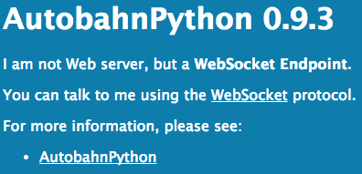
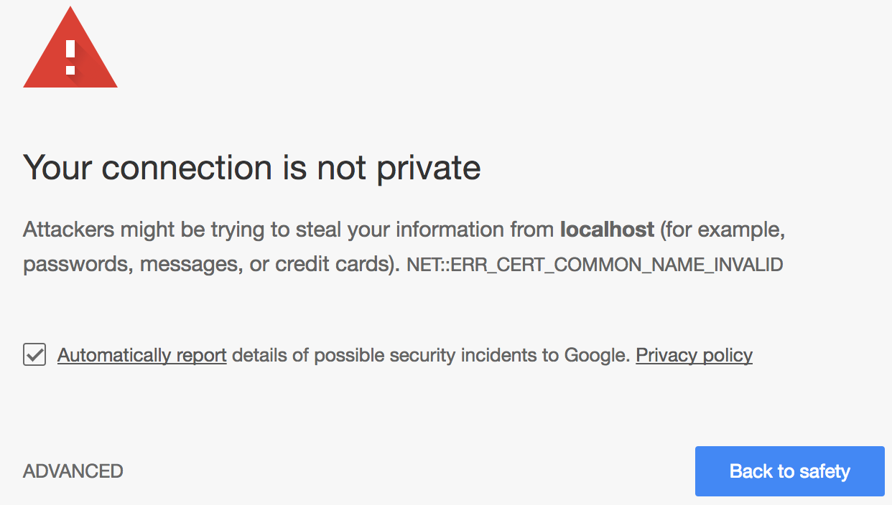
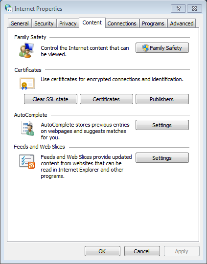

# I can't use local file linking and launch Toolkit applications from Chrome

## Overview

Sometimes in Shotgun the action menu will not display the list of Toolkit applications available or will error when using local file linking, even with Shotgun Desktop running.  This doc is a guide to troubleshooting Shotgun’s connection to Desktop and will hopefully help you get things working.

Diagnosing the issue
How to quickly fix certificate issues
Fixing ERR_CERT_COMMON_NAME_INVALID or ERR_SSL_SERVER_CERT_BAD_FORMAT on all platforms
Fixing ERR_CERT_AUTHORITY_INVALID on Windows

## Diagnosing the issue

### Is Shotgun Desktop running?

Yes, we know. You probably already checked. We had to ask. :)

### Have you restarted Chrome since Shotgun Desktop started?

If you have launched Chrome before allowing the Shotgun Desktop to register the certificate (this happens only the first time you launch the Shotgun Desktop and will not be an issue afterwards), Chrome will use an out of date copy of the certificates and will refuse to connect to the Shotgun Desktop. Closing all tabs will not necessarily close Chrome, so we recommend to type [chrome://restart](chrome://restart/) in the address bar and hit enter. This will ensure that all Chrome related processes will be terminated and Chrome then restarted.

### Are you using firewall software?

Ensure that no firewall software is preventing connections to localhost or on port 9000.

### Is Chrome rejecting the certificate?

You can verify that Chrome accepts the certificate by browsing to https://localhost:9000, which is the address the Shotgun website tries to access in order to do local file linking and launch Toolkit applications. You should normally be greeted by this message:

On the other hand, if you are greeted by one of these messages, it means there was a problem with the certificate registration process: 

## How to quickly fix certificate issues

The easiest way to circumvent those issues is to click **ADVANCED** and **Proceed to localhost (unsafe)**. This will let Chrome know that you are accepting the certificate nonetheless and will allow the Shotgun website to communicate with the Shotgun Desktop application. 





## Fixing NET::ERR_CERT_COMMON_NAME_INVALID and ERR_SSL_SERVER_CERT_BAD_FORMAT on all platforms

Chrome regularly upgrades its security around self-signed certificates and our browser integration is sometimes broken by these updates. Unfortunately, these sort of issues can only be remediated by regenerating the certificates.
certificate_path
To regenerate the certificates, you can pick the **Regenerate Certificates** option under the **Advanced** section of the Shotgun Desktop's user menu. (If you don't see this option, please make sure you update the `tk-desktop` engine to unlock it.) After confirming that you want to regenerate the certificates, a series of dialogs will pop-up just like the first time you've generated the certificates. On Windows and macOS, you will be prompted to update the Windows Certificate Store or the macOS keychain twice: once to remove the old certificate and once to register the new one. On Linux, the registration is done silently. Once this is done, let the Shotgun Desktop restart.

Once the Shotgun Desktop is back up and running, we recommend you restart Chrome by typing [chrome://restart](chrome://restart/) in the address bar to ensure that Chrome is completely shut down and that its certificate cache is cleared.

If your computer is not connected to the Internet and can’t download the updates, please contact support@shotgunsoftware.com.

## Fixing NET::ERR_CERT_AUTHORITY_INVALID on Windows

Under certain circumstances, Windows will report that a certificate has been imported successfully, but will not make it available to applications requiring it. This can be validated by visiting the certificate dialog on Windows. To access it, hit the Windows key and type **Internet Options**. On the **Internet Properties** dialog, switch to the **Content** tab and then click on the **Certificates** button. Finally, click on the **Trusted Root Certification Authorities** and look for **localhost**.

If the entry is missing, there is probably a group policy issue on your Windows domain or local computer. If it is present, we recommend you contact our [support team](support@shotgunsoftware.com).

At this point, we recommend that you communicate with the person who administers the Windows computers for your organization and ask that person about any group policies that could have been set that instructs Windows not to trust self-signed certificates.

## Investigating Group Policy Issues

If your computer is on a domain, the administrator can try out the steps detailed in [this StackExchange post](https://superuser.com/questions/145394/windows-7-will-not-install-a-root-certificate/642812#642812).

If your computer is not on a domain, it is possible the computer has still been locked down by the administrator. For the following steps, you will need a Windows administrator account.

Hit the Windows keys, type **mmc** and hit enter. This will launch the **Microsoft Management Console**. In the application, click on the **File menu** and select **Add\Remove Snap-In**. This will show the **Add or Remove Snap-ins** dialog. On the left-hand side, search for **Group Policy Object Editor** and click **Add >**. A new dialog will appear, which you can dismiss by clicking **Finish**. Finally, click **OK** on the **Add or Remove Snap-ins** dialog.

Finally, on the left-hand side of the main dialog, navigate to **Local Computer Policy/Computer Configuration/Windows Settings/Security Settings/Public Key Policies**. Once selected, double click **Certificate Path Validation Settings** in the central pane.

On the next dialog, make sure that **Define these policy settings** is unchecked. If it is checked, make sure that **Allow user trusted root CAs to be used to validate certificates (recommended)** is checked. Once you're done, click **OK** and the settings will be saved.

At this point, you need to close all Chrome windows and restart Chrome. We recommend doing so with [chrome://restart](chrome://restart) as we did above. This is required for the changes that have been made to take effect. Browsing to the certificates list should now show the **localhost** certificate.

If you still encounter issues using the browser integration after these changes, or if the settings were correct in the first place, please contact our [support team](support@shotgunsoftware.com).

## Troubleshooting on other OSes

If you have issues with the Shotgun Desktop integration on other OSes, please contact our support team so that we can assist you and update this article.