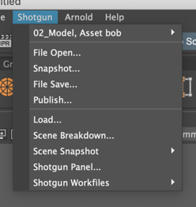

# I've launched Nuke/Maya/etc. from  Desktop, but the  menu is missing entries

The actions that show up in the  menu are contextually configured. That means the list of available actions may be different depending on the context you’re in.
It's possible you may not be seeing the app you're after because you're in the wrong context.

## Example

When you launch an application from [ Desktop](https://developer.shotgridsoftware.com/d587be80/?title=Integrations+User+Guide#getting-started-with-desktop), it puts you in the project environment by default. This environment is managed by the config file in your pipeline configuration located at `config/env/project.yml`. Because most user's work will probably not be done in this environment, it's not configured with many apps for you to work with.

**Default Maya Project actions:**

You can use the [ Workfiles app](https://developer.shotgridsoftware.com/9a736ee3/) to select the Asset, Shot, or Task to work on. This will load up the appropriate new environment for you which will then have more apps enabled with menu items in your  menu.

**Default Maya Asset Task actions:**

If you believe you're in the correct environment and the actions are still not showing, then the next step is to check the relevant [log](where-are-my-log-files.md), and see if there are any errors.
You may need to [enable debug logging](turn-debug-logging-on.md) to get the full output.