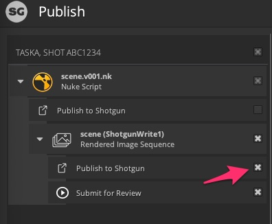
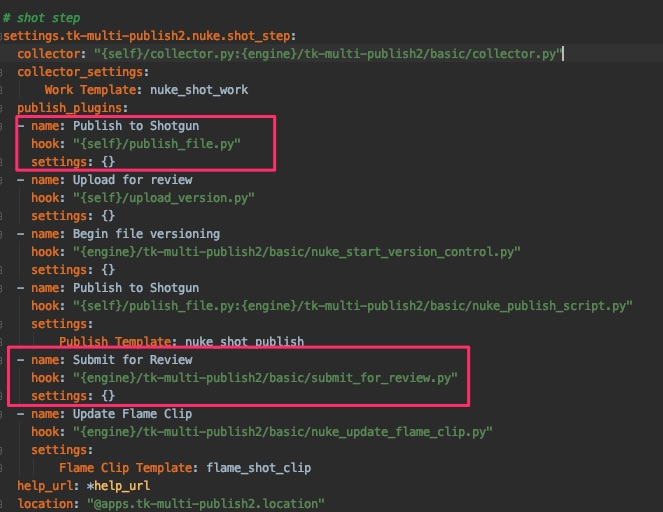
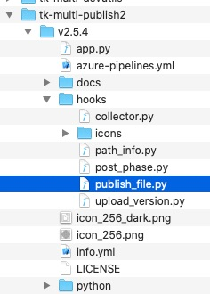
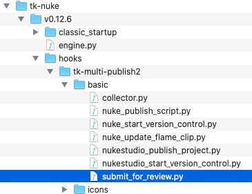

# Exception: Review submission failed. Could not render and submit the review associated sequence.

## Use case:

'Submit for publish' in Nuke has never worked. 

**Question 1:**
What's the best way of navigating up the hereditary stream? I get as far as 'HookBaseClass' then am a bit lost. 

My current problem is getting the submit for review working in Nuke. 

I'm getting this error in Nuke's SG publish GUI:
 

    Traceback (most recent call last):

      File "C:\Users\STEVE\AppData\Roaming\Shotgun\bundle_cache\app_store\tk-multi-publish2\v2.4.1\python\tk_multi_publish2\api\plugins\publish_plugin_instance.py", line 282, in _handle_plugin_error

        yield

      File "C:\Users\STEVE\AppData\Roaming\Shotgun\bundle_cache\app_store\tk-multi-publish2\v2.4.1\python\tk_multi_publish2\api\plugins\publish_plugin_instance.py", line 198, in run_publish

        self._hook_instance.publish(settings, item)

      File "C:\Users\STEVE\AppData\Roaming\Shotgun\bundle_cache\app_store\tk-nuke\v0.12.5\hooks\tk-multi-publish2\basic\submit_for_review.py", line 272, in publish

        raise Exception("Review submission failed. Could not render and "

    Exception: Review submission failed. Could not render and submit the review associated sequence.

Also get this exception:

`'sg_publish_data' was not found in the item's properties. Review Submission for 'path/to/sequences/AB/AB_001/comp/work/images/AB_001_comp_v002_output/AB_001_comp_v002_output.%04d.jpg' failed. This property must be set by a publish plugin that has run before this one.`


So it's looking in 'publish_plugin_instance.py' for:

    
    _handle_plugin_error
        yield

    run_publish
        self._hook_instance.publish(settings, item)

I can find these in my local Appdata folder but not in my main install so I'm assuming that I need to look in 'submit_for_review.py' to get at this problem.

Looking at this file I can see that its using settings and info for the item from higher up the hereditary chain 'HookBaseClass'.

So looking for where the 'sg_publish_data' is set in 'submit_for_review.py' I see line 225:
`sg_publish_data = item.properties.get("sg_publish_data")`

**question 2**
So where upstream is 'item.properties' is being set? I suspect in the nuke collector.py but 'sg_publish_data' is not present in there and is also a child of the 'HookBaseClass'

## How to fix

### The Short Answer:

Assuming you have not added custom code or modified the config too much, you just need to make sure you have `Publish to ` checked on the item that you are  submitting for review

 

### The Long Answer:

First, [here's the documentation for the publisher API](https://developer.shotgunsoftware.com/tk-multi-publish2/). Most of the concepts involved in solving this problem are explained there. But here's the breakdown for your specific problem. Hopefully going through it like this will help you debug future issues as well.

In the above screenshot, under the `ShorgunWrite1` item you see two `plugins`. These correspond to plugins that were defined in the config.

 

These plugins are run in order and act on the same item in memory. To get to the bottom of your problem you want to look at the code for these two plugins. You can figure out where those live by looking at the `hook` settings. 

For the first plugin since we are looking at the settings for `tk-multi-publish2`, `{self}` refers to `tk-multi-publish2`. Therefore
```
{self}/publish_file.py
``` 
can be found under the tk-multi-publish2 app folder:

 

Where the app exists on your file system depends on how `app_locations.yml` is configured, but if you haven't changed anything there, you can find the app in your bundle cache folder. [Here's how to find your cache location](https://developer.shotgunsoftware.com/7c9867c0/) if you need it. 

For the second plugin, the hook path is 
```
{engine}/tk-multi-publish2/basic/submit_for_review.py
```
We are running the `tk-nuke` engine when in Nuke, so to find this publish hook we need to look under `tk-nuke` which again should be in your bundle cache.

 

Now that you know where to find the code you can see that [the first plugin sets the values that are expected to exist in the second plugin](https://github.com/shotgunsoftware/tk-multi-publish2/blob/a83e35dbf1a85eac7c3abd7e7f5509a42a8b8cf1/hooks/publish_file.py#L425). 

The idea for the combination of these two plugins is that you are submitting for review something that is published (and will not change). So the workflow is to publish the source files first, then create a SG Version from them for review. The version is linked to the publish as well. the first plugin does the file publish and stores the information in the item for the second publish to use.  

You mentioned inheritance so I wanted to clarify that as well. I think what you're coming across in the documentation is referring to hook inheritance that is driven by the config and not a python inheritance as I suspect you think it means. 

In the python files you'll see that all the hooks inherit from `HookBaseClass`. But the hook mechanism in the config allows you to essentially treat these base hooks as mixins and combine them to get all the functionality you need while reusing code. You can see an example of this in the `tk-multi-publish2` config:

```
settings.tk-multi-publish2.nuke.shot_step:
  collector: "{self}/collector.py:{engine}/tk-multi-publish2/basic/collector.py"
```

The collector defined here does not exist in any python file. It is actually a combination of the `tk-multi-publish2`'s `collector.py` and `tk-nuke`'s `collector.py`. 

If the quick fix is not enough for you and you need to modify these hooks, checkout the [Customizing Publish Workflows video](https://developer.shotgridsoftware.com/869a6fab/#shotgrid-toolkit-webinar-videos). It's a great place to start.

[See the full thread in the community](https://community.shotgridsoftware.com/t/nuke-submit-for-review-py/10026).

