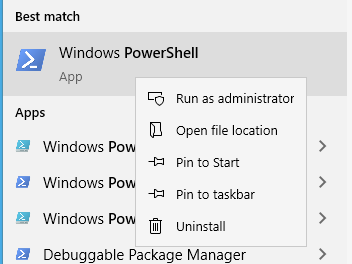
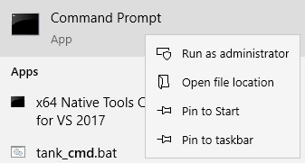

# [SSL: CERTIFICATE_VERIFY_FAILED] certificate verify failed: unable to get local issuer certificate

## Use Case

Users experiencing issues uploading and downloading media from Amazon with the Python API on Windows. This issue manifests itself by the Python API raising the following error message:

```
shotgun_api3.shotgun.ShotgunFileDownloadError: Failed to open https://xxx.shotgunstudio.com/file_serve/attachment/xyz
<urlopen error [SSL: CERTIFICATE_VERIFY_FAILED] certificate verify failed: unable to get local issuer certificate (_ssl.c:1108)>
```
Amazon updated some certificates on their backend. Windows usually refreshes its certificate store when browsing a webpage that requires a new certificate. A standalone Python script running on a computer that doesn’t see regular browsing activity will not retrieve certificate updates, which may cause that computer to be missing quite a few.

## How to fix

If you have GUI access to the machine that has the issue, simply playing back any media that is currently stored on S3 should update your certificate store. This playback solution only works on Chrome, Internet Explorer, Edge or other Chromium based browsers. This playback solution does not work on Firefox or Safari, as these browser do not use Windows’ standard APIs for certificate validation.

For users whom this solution does not work, or if you have a big list of computers to update, like a Deadline render farm, we’re also providing a script that will add the missing certificate to your computer. [Here is a link to a script we’ve shared](https://developer.shotgunsoftware.com/c593f0aa/).

For users of Powershell on Windows 10 or Powershell 3 on Windows 7, you can run the following script as an administrator on the computer to get the new certificate.



```
$cert_url = "https://www.amazontrust.com/repository/AmazonRootCA1.cer"
$cert_file = New-TemporaryFile
Invoke-WebRequest -Uri $cert_url -UseBasicParsing -OutFile $cert_file.FullName
Import-Certificate -FilePath $cert_file.FullName -CertStoreLocation Cert:\LocalMachine\Root
```

If the command worked, you should see this:

```
   PSParentPath: Microsoft.PowerShell.Security\Certificate::LocalMachine\Root

Thumbprint                                Subject
----------                                -------
8DA7F965EC5EFC37910F1C6E59FDC1CC6A6EDE16  CN=Amazon Root CA 1, O=Amazon, C=US
```

This will make the certificate available for all user accounts on the computer it is run on. If you don't have admin access, you can change the last line with:

```
Import-Certificate -FilePath $cert_file.FullName -CertStoreLocation Cert:\CurrentUser\Root
```

and the certificate will be added for the current user only.

If you're old school like me and still rock using `cmd.exe`, you can also use `certutil`. First, you'll need to download the certificate from `https://www.amazontrust.com/repository/AmazonRootCA1.cer` and save it somewhere on your computer.

Then launch the command prompt in administrative mode:



 and execute the following line:

```
certutil -addstore root <path-to-the-cert>
```

This will make the certificate available for all user accounts. If you don't have admin access, you can add `-user` to install the certificate for the current user only like this

```
certutil -user -addstore root <path-to-the-cert>
```

## Related links

[See the full thread in the community](https://community.shotgridsoftware.com/t/certificate-verify-failed-error-on-windows/8860)