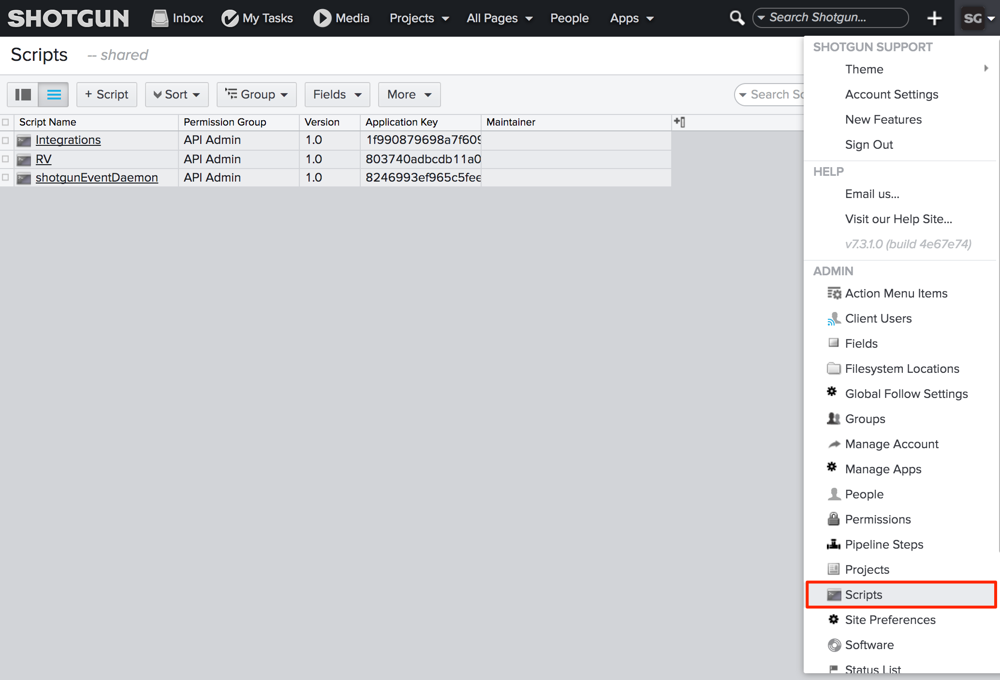
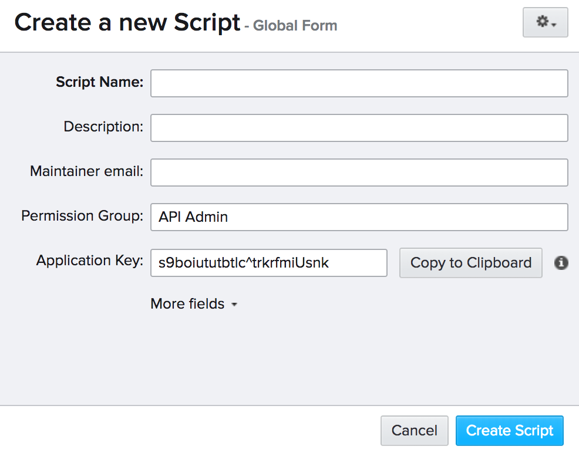

# Create and manage API scripts

Follow the steps below to create a new Script:

1.  Go to the Admin Menu and select “Scripts”.  
    
2.  Create a new Script using the “+ Script” button.
3.  Grab the value from the Application Key. You’ll need this to initiate a connection to .  
      
    
    > **Note:** API keys are treated like passwords, and once created cannot be viewed again via the  web app or API. Make sure you copy the key before proceeding.
    
4.  Now you can use your Script key to connect to . See [“ Methods” in our API documentation](https://developer.shotgridsoftware.com/python-api/reference.html#shotgun-methods) to learn more about how to connect to  with your Script.

> **Tip:** If for some reason you need to reset the Application Key of your Script, you’ll need to create a new  Script entity to do so. First rename your existing Script to something like “[My Script]—OLD”, then delete it. Create a new Script. The reason you need to rename the old one is that  requires unique names for each Script.

## When to set up a new Script

Script actions can be logged. The more fine-grained the use of individual Script keys, the easier it will be for you to track which Script is making changes for debugging. Having separate Scripts is also a good way to track which Scripts will be impacted by changes on your  site and who maintains the Script.