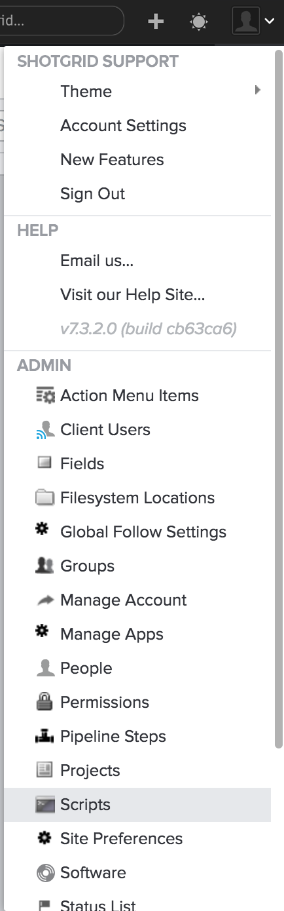

# API Overview

**Note:** For more information about the  API, see our [API documentation](http://developer.shotgridsoftware.com/python-api/) .

The  Python Application Programming Interface (API) enables users to easily integrate their tools with . Through it you can create automated processes, integrate with many third party software packages, and communicate with existing tools within your studio. Because the needs of every studio are very different, the  API provides powerful, low-level functionality and leaves most of the business logic to you.

The API is built using [Python](https://www.python.org/) , a common programming language used widely across the media and entertainment industry. Use of the [ Python API](https://github.com/shotgunsoftware/python-api) is included for free with your  site.

The API follows the CRUD pattern, allowing your script to run Create, Read, Update, and Delete actions for a single entity type. Many operations include the ability to define filters, columns to return, and sort results.

## Setting Up Your Environment with the Python API Overview Video

## Script Keys 

In order to communicate with the  server via the API, your script can authenticate with the server either by providing a user’s credentials or by utilizing a script key. You can generate new script keys from the Scripts page, listed in the Admin menu:

**Tip:** Register your scripts separately and have individual API keys for each. This will help you to monitor each of your scripts and the actions they are performing much more accurately in the [event logs](https://help.autodesk.com/view/SGSUB/ENU/?guid=SG_Administrator_ar_data_management_ar_event_logs_html).

## Personal Access Tokens (PAT)

In addition to script keys, you will also need to set up a Personal Access token in order to communicate with your  site. Reference the following video documentation to set this up:

- [Configure your Personal Access Token (PAT)](https://help.autodesk.com/view/SGSUB/ENU/?guid=SG_Migration_mi_migration_mi_overview_html#configure-your-personal-access-token-pat-).

## Common first projects

You can download the API at [https://github.com/shotgunsoftware/python-api](https://github.com/shotgunsoftware/python-api) . Some common first projects include:

1.  [Creating a Version and linking it to a Shot](http://developer.shotgridsoftware.com/python-api/cookbook/examples/basic_create_version_link_shot.html) . Allows you to automate the submission of new renders for review.
2.  [Uploading a thumbnail](http://developer.shotgridsoftware.com/python-api/cookbook/examples/basic_upload_thumbnail_version.html) . Everything on your site can have an up-to-date thumbnail without manually adding them.
3.  [Integrating  with your code repository such as SVN](http://developer.shotgridsoftware.com/python-api/cookbook/examples/svn_integration.html) . Utilize  to project manage any software development.

## Some things you can’t do with the API

*   Access or alter permission rules, for security reasons
*   Read or alter page settings
*   Access filter or query settings for individual pages or widgets
*   Interact with the UI
*   Add, edit, or remove conditional formatting rules
*   Create or edit query fields

## Action Menu Items (AMIs)

If you write a script that you want to easily launch from within the  interface, you can do so via [AMIs](https://developer.shotgridsoftware.com/67695b40/) . These are customizable options that appear in context menus you get when right-clicking on a row of data. When clicked, they will send a contextual data dump to a web server or a custom browser protocol handler, where you can then run custom business logic.

You can set up different AMIs for different entities, and can restrict access to them by project or by permission group.

## Event Trigger Daemon

Every action performed in  (either by a user or an API script) generates an Event. The [Event Daemon](https://github.com/shotgunsoftware/shotgunEvents) can monitor that event stream and then execute specific API scripts based on conditions you define. Some examples include:

*   Automatically changing downstream Task statuses based on the status of upstream Tasks.
*   Recalculating relevant cut duration fields when values change.
*   Performing file packaging and transfer operations when a Shot is set to a particular status.

## Additional information

For more information about the  API, see these articles:

*   [Download the  API from GitHub](https://github.com/shotgunsoftware/python-api/)
*   [ API documentation](http://developer.shotgridsoftware.com/python-api/)
*   [-dev list (Public)](https://groups.google.com/a/shotgunsoftware.com/forum/?fromgroups#!forum/shotgun-dev)
*   [ Event Daemon sample code](https://github.com/shotgunsoftware/shotgunEvents)
*   [Writing event driven triggers](https://developer.shotgridsoftware.com/0d8a11d9/)
*   [ schema](https://help.autodesk.com/view/SGSUB/ENU/?guid=SG_Administrator_ar_get_started_ar_shotgun_schema_html)
*   [API best practices](https://developer.shotgridsoftware.com/09b77cf4/)

## Contribute and collaborate

Have you made some amazing tools with  you want to share with the world? Awesome! We have an active and vibrant [developer community](https://community.shotgridsoftware.com/) who love to share and collaborate with each other. To get involved:

*   Join the [ Community](https://community.shotgridsoftware.com/) .
*   Post your code to [GitHub](https://github.com/) (make sure your code isn’t pipeline specific, is well documented, and has a README in either .txt or .mdk format).
*   Post a link and description to the dev list. The dev community and  developers will check it out, provide feedback, and sing your praises.

We are constantly amazed and inspired by many of the tools and integrations made by our clients. Show us what you can do!