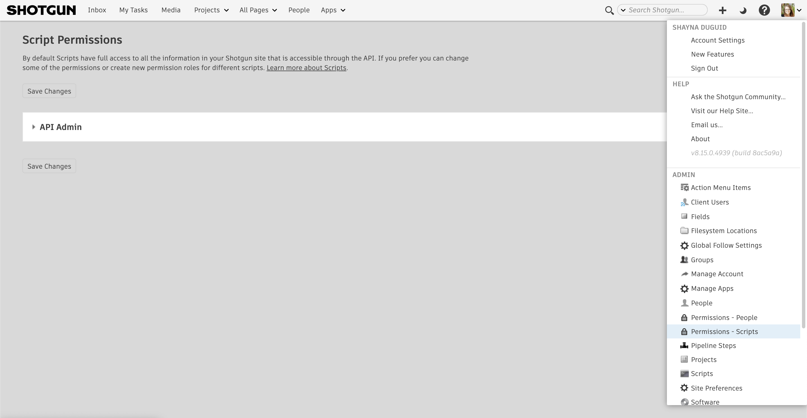
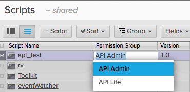

# API user permission groups

You can create separate Permission Groups for API users so that your scripts and keys can have different permission levels just like your People.

## Accessing the API user page

Go to your Admin Menu and select Permissions - Scripts.

Refer to the  for usage.

## How to use API user permission groups

Once you have created API permissions groups beyond the initial API Admin, you can use them for your API scripts.

1.  From the Admin menu, select "Scripts."
2.  Display the Permission Group column and select the appropriate Permission Group.  
    

## Examples

So why would you use this? There are many potential uses, but here are a couple to get you thinking:

**Example 1:** You want to give an API key to someone in your studio who should not have full Admin privileges.

**Example 2:** You want to give a read-only API key to a partner studio to perform a one-way sync from your {{ akn_product_name }} database to their {{ akn_product_name }} Database, and only expose a limited entity set.

**Example 3:** You want to restrict API scripts per project.

1.  Navigate to your **Permissions - Scripts** page via the Admin menu and create a new role. Make sure the "See Assigned Projects Only" advanced permission is enabled. You can also tweak any other permissions needed (e.g. if you only wanted them to have Read access on certain entities/fields).
2.  Navigate to the **Scripts** page via the Admin menu. Expose the "Projects" field. Here you can enter in Projects to restrict the script's scope to.
3.  Make sure to assign that script permission to the new one created in step 1, via the "Permission Group" field.