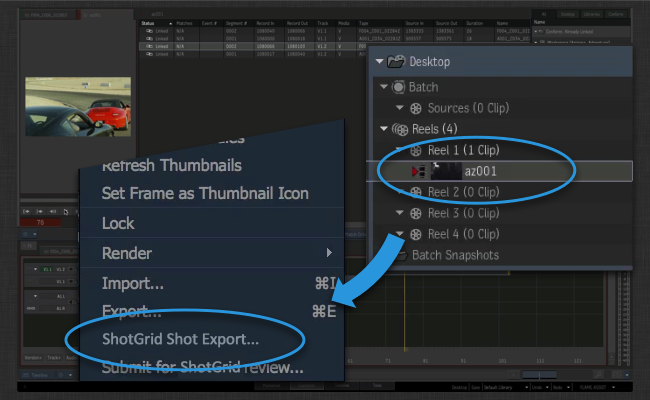
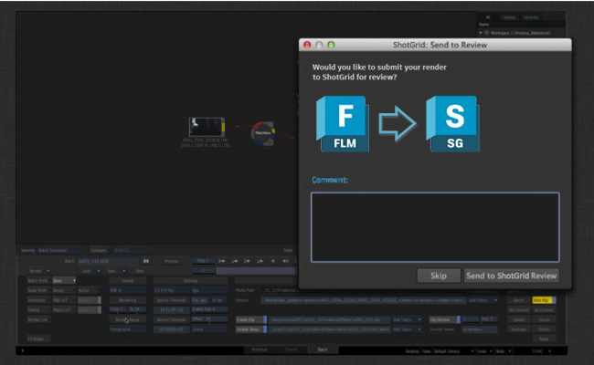

The  Flame Export App helps kickstart your project!

Once you have created an initial conform in Flame, the Shot Exporter can help you quickly
generate content in , render out plates to disk and send content to review.

Once you are up and running, the exporter app will also track all the renders happening in Flare or in Flame batch mode, making it easy to send content to review as part of your workflow.

## Pushing a conform to 

Once you have your conform set up in Flame for a sequence, and have **allocated shot names** to all the segments in your timeline, select the sequence, right click and choose the  Shot Export option.



This will bring up a  UI where you can enter some initial comments for your publish. These comments will be sent to review and also used when adding description to publishes and other content.

In addition to the description, you can also select which output data format you want to use for your exported plates. These presets are part of the toolkit app configuration and can be configured to suit the needs of your studio.


Once you click the submit button, a number of things will happen straight away:

- Shots and Tasks will be created in . The list of tasks to associate with each new Shot that gets created is configurable via a Task template setting to make it quick and painless to create consistent structures. The shots will be parented under a sequence by default, but this is also configurable and if you are working with Scenes or Episodes, it is possible to reconfigure the exporter to work with these instead.

- Once  contains the right data, folders will be created on disk using the standard folder creation mechanism. This ensures that the project can be kick-started with a set of consistent folders for all shots that are being created.

Once the two steps above have been carried out, you have the basic structure to proceed with further steps. These will happen in the background:

- Plates will be exported on disk for each shot according to the presets defined in your configuation. File locations are defined using the Toolkit Template system, meaning that the location of these plates will be well defined and understood by other tools downstream in the pipeline.

- Batch files and clip xml files will be exported. These are used by Flame to enable an iterative workflow where you can quickly render out new versions that are later pulled in to the main conform in Flame.

- Quicktimes are generated and uploaded to  for review.


## Sending batch renders to Review

Once you have published a Flame batch file for a Shot, you can launch Flare directly from that Shot in order to open up the batch file with render and output settings pre-populated. In order to render out a new version, simply click the Render Range Button.


Toolkit will display a dialog at this point where you can choose to send the render to  review or not.



Files will be published and tracked by  and optionally also sent to review.

## Want to learn more?

If you want to learn more, and see this workflow in action, head over to
the Flame engine documentation where we also have some video content that demonstrates the various workflows in action.

LINKBOX_ENGINE:software/tk-flame:The Flame Engine

As always, if you have question regarding integration or customization, don't hesitate to reach out to our Support: toolkitsupport@shotgunsoftware.com

# Advanced Topics

Below you'll find more advanced details relating to configuration and customization

## Using export presets

The exporter uses a concept of *Export Presets* in its configuration. When you launch the Export UI inside of Flame you see a dropdown with the available export presets. Each preset is a configuration option which allows you to configure how files are written to disk and uploaded to . High level settings such as file locations on disk are controlled directly in the environment configuration, making it easy to adjust the default configuration options to work with your pipeline.

More advanced settings and control over the actual export xml content that is being passed to flame in order to control Flame, is handled by a hook where the behaviour is defined for each preset. In the hook, you have complete control over how media is being generated by the exporter.

## Bypassing  server side transcoding
By default, Quicktimes are uploaded to  review by setting the `Version.sg_uploaded_movie` field. This in turn will trigger  server side transcoding; the uploaded quicktime will be further converted to `mp4` and `webm` representations tailored for playback in browsers and mobile. Sometimes, it can be beneficial to bypass this server side transcoding. This is possible by setting the `bypass_shotgun_transcoding` configuration setting. When this is set to true, the integration will upload directly to the `Version.sg_uploaded_movie_mp4` field in , thereby bypassing the server side transcoding. In this case, no `webm` version is generated, so review playback will not be possible in Firefox.

For more information, see https://support.shotgunsoftware.com/entries/26303513-Transcoding

## Customizing ffmpeg

When the exporter generates quicktimes, it uses a version of ffmpeg which comes distributed with Flame. By modifying the settings hook in the exporter, you can specify an external version of ffmpeg to use instead of the built-in one. The version of ffmpeg distributed with Flame is tracking the very latest advancements in ffmpeg transcoding and performance, so sometimes using the latest version may result in performance improvements.

Please note that the way h264 parameters are passed to ffmpeg has changed between the version that is used by default and the latest versions. By switching to the latest generation of ffmpeg, it is possible to implement exactly the recommended transcoding guidelines that results in optimal upload and performance on the  side. You can find these guidelines here:

https://support.shotgunsoftware.com/entries/26303513-Transcoding

We only recommend changing the ffmpeg version if you are an advanced user. In that case, follow these steps:

### Copying the settings hook

All settings that need to be modified can be found in the settings hook that comes shipped with the Flame export app. In order to modify this hook, you first need to copy this hook file from its default location inside the app location into your configuration. Inside your project configuration, you'll typically find the hook file in a location similar to `install/apps/app_store/tk-flame-export/va.b.c/hooks/settings.py`. Copy this file into the `hooks` location inside of your configuration, e.g. `config/hooks`. We recommend renaming it to something a little more verbose than just `settings.py` in order to make it clear what it is:

```
install/apps/app_store/tk-flame-export/va.b.c/hooks/settings.py -> config/hooks/flame_export_settings.py
```

Now edit your Flame environment configuration file. This is typically `config/env/includes/flame.yml`. Under the `tk-flame-export` heading, you'll find the path to the hook being defined as `settings_hook: '{self}/settings.py'`. This essentially means that the configuration will look for the hook file inside the app location (e.g. `{self}`). Changing this to `settings_hook: '{config}/flame_export_settings.py'` will tell Toolkit to look for the hook file inside the configuration instad. In summary:

```
settings_hook: '{self}/settings.py' -> '{config}/flame_export_settings.py'
```

### Modifying the hook

Now we are ready to start modifying our `config/hooks/flame_export_settings.py` hook! Open it up in a text editor. You'll notice several methods relating to ffmpeg and ffmpeg settings. The first one to modify is the following:

```
def get_external_ffmpeg_location(self):
    """
    Control which version of ffmpeg you want to use when doing transcoding.
    By default, this hook returns None, indicating that the app should use
    the built-in version of ffmpeg that comes with Flame.

    If you want to use a different version of ffmpeg, simply return the path
    to the ffmpeg binary here.

    :returns: path to ffmpeg as str, or None if the default should be used.
    """
    return None
```

By returning `None` by default, the exporter will use Flame's built-in ffmpeg. Change this to return a full path to your ffmpeg. Keep in mind that if you are running a backburner cluster, ffmpeg may be called from any machines in the cluster, so make sure the executable is installed everywhere.

Now that once the ffmpeg location is updated, you most likely either need or want to tweak the parameters passed to ffmpeg. This needs to be changed in two different methods:

- `get_ffmpeg_quicktime_encode_parameters` will return the parameters used when generating a quicktime to be uploaded to .

- `get_local_quicktime_ffmpeg_encode_parameters` will return the parameters used when a quicktime is written to disk.

For the  upload, we recommend using the default  encoding settings as a starting point:

```
def get_ffmpeg_quicktime_encode_parameters(self):
    return "-vcodec libx264 -pix_fmt yuv420p -vf 'scale=trunc((a*oh)/2)*2:720' -g 30 -b:v 2000k -vprofile high -bf 0"
```

For the local  transcode, we recommend basing your settings on the  transcode settings but removing the resolution constraints and increasing the bit rate:

```
def get_local_quicktime_ffmpeg_encode_parameters(self):
    return "-vcodec libx264 -pix_fmt yuv420p -g 30 -b:v 6000k -vprofile high -bf 0"
```

