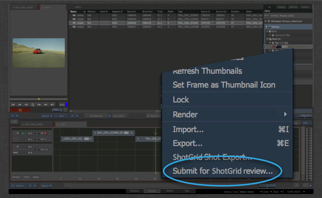
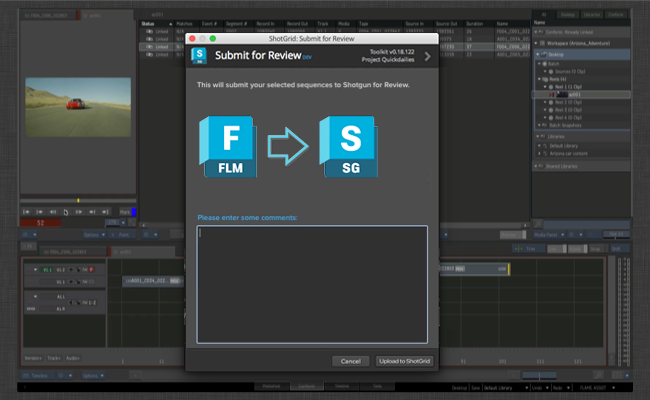

# Flame Review

The  Flame Review App makes it easy to push one or more sequences from Flame into  review.

Simply right click a sequence or a selection of sequences that you want to review:

Select the  Review Option:

A Toolkit UI will appear where you can add some review notes:

When you click ok, a background job will be generated and everything will happen behind the scenes.
The following steps will be carried out:

- The Sequence will be exported to disk as a quicktime. This export is handled as a Flame Quicktime export and you have complete control of the various settings via a configuration hook.

- Once the sequence is complete, Toolkit will check if there is a matching Sequence in . If not, a Sequence will be created automatically.

- A review version will be generated and associated with the sequence.

- Lastly, the quicktime will be uploaded to the review version.

The process supports audio tracks, transitions etc and should be a "what you see is what you get". Once in , you can review the media in many different ways, including the client review site and the  iPhone app.

## Customization and Settings

The Flame Review app can be customized in a couple of different ways:

- You can control which **Entity Type** that should be used in  to represent a Sequnce in Flame. For example, if you are working on episodic content, it may make more sense to link your review versions to episodes in  rather than sequences.

- You can customize which tasks the app should automatically add to new items created in . This is done via a task template setting and allows you to standardize the structure that's created.

- Via a hook, you get complete control over the xml preset that the app uses to generate a quicktime out of Flame.

