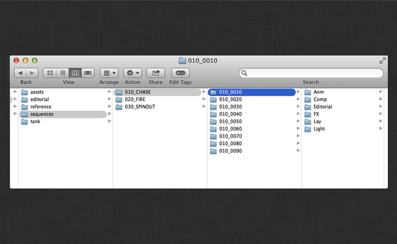

# Hiero/Nuke Studio Export

### Introduction

This app adds  awareness to Hiero's export dialog for sequences.

#### Overview Video & Demo

If you're new to  Toolkit or the Hiero integration, check out the following video which gives a fast-paced overview of what you can do in your pipeline with the  Toolkit Hiero integration.

If you're already familiar with Toolkit and Hiero, then feel free to continue on to the docs below.

<center>
<iframe src="https://player.vimeo.com/video/82572226" style="font-size: 1em; line-height: 1.45em;" width="500" height="281" frameborder="0"></iframe>
</center>

###  Shot Processor

When this app activates itself it registers a bunch of changes with the Hiero export dialog:


The first thing to notice is the new processor that is registered:


When you click on this processor, there are some new things to notice.

At the top of the dialog, there is extra UI that helps control how shots get created/updated in  as a result of exporting the sequence:


### Tags

By adjusting the dropdowns you can map various Hiero tags into  shot statuses and shot task templates. Thus via Hiero's tagging workflow you can set a  shot to being in progress or setup the tasks for the Shot for a green screen, cg extra, or whatever makes sense for your configuration. This UI is populated via a hook and is easy to configure for extra functionality.

### Collating

There are also options to control collating track items together that mirror Hiero's built in logic. If you have multiple items that make up a shot (either overlapping, on different tracks or with the same shot name on multiple tracks) then you should turn these options on. This will cause the  Toolkit Shot updater to treat the matching collated items as a single Shot.


For example, assume we have two track items representing shots 010 and 020. 010 comes first and 020 overlaps with the end of 010 on a different track. Since 010 comes first, it's the hero and with collating enabled,  treats the two items as a single shot, 010. This means Shot 010 will be created or updated in . The cut in will match the beginning of track item 010 and the cut out will match the end of track item 020. A Screening Room-ready Version will be created for each item, but both will be linked to Shot 010. A plate will be created for each item as a Published File but both will be linked to Shot 010. A single Nuke script will be published linked to Shot 010 containing 2 read nodes, one for each item. Note that in this situation, there is no creation or update to Shot 020 in , since it has been collated into Shot 010.


### Paths

Below the  UI is the standard paths dialog. There are three items that are added to Shots via Hiero by default... a default Nuke script, a default Nuke write location, and a default location for a plate transcode. The locations of these items are determined by the app configuration and can make full use of the templating system:


This app adds a `{tk_version}` token to Hiero which will be replaced by the version string, correctly formatted for  Toolkit.

### Custom Template Fields

Any tokens you define in the `custom_template_fields` setting that are resolved by the `resolve_custom_strings` hook will automatically be added to Hiero's list of valid replacement tokens and will be considered valid replacements in your Toolkit template paths.

For example, in your Toolkit `templates.yml` file, say you define a key with the following:

```
    resolution:
        type: str
        filter_by: alphanumeric
```

In your `project.yml` settings for `tk-hiero-export` you have:

```
  ...
  ...
  tk-hiero:
    apps:
      tk-hiero-export:
        custom_template_fields:
        - {description: Shot Resolution, keyword: resolution}
  ...
  ...
```

And then you modify the `resolve_custom_strings` hook with something like the following:

```
# Copyright (c) 2014  Software Inc.
#
# CONFIDENTIAL AND PROPRIETARY
#
# This work is provided "AS IS" and subject to the  Pipeline Toolkit
# Source Code License included in this distribution package. See LICENSE.
# By accessing, using, copying or modifying this work you indicate your
# agreement to the  Pipeline Toolkit Source Code License. All rights
# not expressly granted therein are reserved by  Software Inc.

from tank import Hook


class HieroResolveCustomStrings(Hook):
    """Translates a keyword string into its resolved value for a given task."""

    RESOLUTION_TOKEN_NAME = "{resolution}"


    def execute(self, task, keyword, **kwargs):
        """
        """

        self.parent.log_debug("attempting to resolve custom keyword: %s" % keyword)
        if keyword == self.RESOLUTION_TOKEN_NAME:
            translated_value = self._clip_resolution_string(task)
        else:
            raise RuntimeError("No translation handler found for custom_template_field: %s" % keyword)

        self.parent.log_debug("Custom resolver: %s -> %s" % (keyword, translated_value))
        return translated_value


    # Handle the {resolution_fs} token
    def _clip_resolution_string(self, task):
        """ returns sequence resolution or task format override"""
        width = ""
        height = ""

        sequence_format = task._sequence.format()

        width = sequence_format.width()
        height = sequence_format.height()

        if "reformat" in task._preset.properties():
            task_reformat_settings = task._preset.properties()["reformat"]
            if task_reformat_settings['to_type'] != "None":
                width = task_reformat_settings['width']
                height = task_reformat_settings['height']

        return "%sx%s" % (width, height)
```

You can now not only use the `resolution` token in Hiero but it will validate against any template paths you have defined in Toolkit so you can export to a location like:

```
    hiero_plate_path: "sequences/{Sequence}/{Shot}/hiero_plates/{resolution}/v{version}/{project}_{Shot}.mov"
```

###  Tasks

There are two new task types registered.

#####  Transcode Images

This is a subclass of the standard Hiero transcoding task, which will register the results of the transcode as a Publish in . Optionally a Version will also be created in . If a Version is created, then a Quicktime will also be created and uploaded as Screening Room media.

#####  Nuke Project File

This is a subclass of the standard Hiero Nuke script exporter, which registers the resulting Nuke script as a PublishedFile in  linked to the Shot. The settings allow you to specify which Toolkit-enabled WriteNodes to include in the file on export.


The app settings `plate_published_file_type` and `nuke_script_published_file_type` allow you to control what file type the PublishedFiles are registered as. In addition, `nuke_script_toolkit_write_nodes` allows you to control which WriteNode settings should be available in the export dialog.

### Export process

When the export is run, there will be some extra tasks that show up in the export queue:


Each shot will run a ShotUpdater tasks that is responsible for creating the Shot in  and creating the full Shot structure specified in the schema configuration:



### Sequence and Shot updates in 

The name of the Hiero sequence will be used for the sequence name, and the
shots will have their cut info filled in (Cut Order, Head In, Cut In, Cut Out,
Tail Out, Cut Duration, and Working Duration). In addition if poster frames
were selected for the sequence or the items that make up the shot, they will be
uploaded as the thumbnails for the shots.

If your workflow uses an entity other than **Sequence** as the shot parent
(like **Episode**), then you can override the `get_shot_parent` method in the
`hook_get_shot` hook. The default implementation creates (if necessary) and
returns a **Sequence**.

### Cut Schema Support

If your  site supports the Cuts schema (v7.0.0 or later), then this app
will automatically generate a **Cut** with corresponding **CutItems** in
. The **Cut** entity corresponds to the Hiero sequence and the
**CutItems** correspond to the items in the sequence. The **Cut** will be
linked to the parent entity (**Sequence** by default) as returned by the
`get_shot_parent` method in the `hook_get_shot` hook. The **CutItems** will be
associated with a **Shot** entity and linked to the reviewable **Version**
created during the export. After exporting, the **Cut** will be playable in the
**Media** tab in  and in **RV**.

All of the meta data associated with the **Cut** and **CutItem** entities is
inferred from Hiero except the _Cut Type_ field which can be specified in the
export UI.


The value here will show up in the **Type** field of the **Cut**.

It should be noted that the Cut schema is not supported when either of the
Collate options are selected, and creation of **Cut** and **CutItem** entries
will be skipped.

In addition, the Cut schema does not handle retimed clips. A debug warning will be logged when exporting retimed clips.

### Alternate Shot Hierarchies

For studios that don't work in the standard Sequence > Shot hierarchy, but perhaps use Episodes and/or Scenes, there is a hook `hiero_get_shot` that allows you to configure the app to work with whatever Shot hierarchy is in use at your studio.
