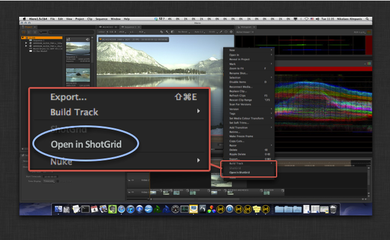

# Hiero/Nuke Studio Open in 

This app adds a context menu to the Hiero spreadsheet and timeline that allows you to 
open a given track item in  if there is a Shot for that item.



You typically configure this app by adding it to the time line and spreadsheet menus in 
Hiero by adding the following to the  Engine for Nuke configuration:

```yaml
    timeline_context_menu:
    - {app_instance: tk-hiero-openinshotgun, keep_in_menu: false, name: "Open in ", requires_selection: true}
    spreadsheet_context_menu:
    - {app_instance: tk-hiero-openinshotgun, keep_in_menu: false, name: "Open in ", requires_selection: true}
```


