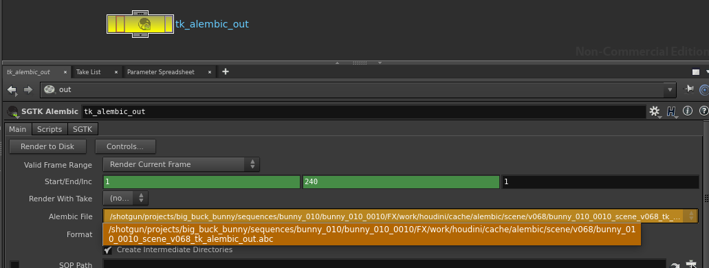

# Houdini Alembic Node

The Houdini Alembic Node App provides a custom  Alembic Output node which makes it easy to standardise the location where alembic files are output.  It can be configured for each environment.

## General Use

In order to use the  Alembic Output, save your script as a Toolkit work file first and then create a new node via the TAB menu in Houdini. This will create a node which looks similar to a normal Alembic output node:

The node can be configured with multiple output profiles, each using a different template path for where the alembic cache should be written to disk. 

Rather than entering a path by hand, you just specify which output profile to use and the node will compute the rest of the path automatically. You can see the computed path in the UI. 

The output alembic files will be versioned and the version number will always follow the current Houdini scene file version which will be incremented automatically when you publish using Multi Publish.

## Configuration

The Toolkit alembic node provides the ability to specify multiple output profiles for an environment configuration. Here's an example of configuring the node with multiple profiles:

<pre>
  tk-houdini:
    apps:
      tk-houdini-alembicnode:
        location: 
          name: tk-houdini-alembicnode
          type: app_store
          version: v0.2.2
        work_file_template: houdini_shot_work
        default_node_name: tk_alembic_out
        output_profiles:
          - name: For Publishing
            settings: {}
            color: [1.0, 0.5, 0.0]
            output_cache_template: houdini_shot_work_alembic_cache
          - name: Local Testing
            settings: {}
            color: [0.0, 0.5, 1.0]
            output_cache_template: houdini_shot_local_alembic_cache
</pre>

You can use the output profiles to alter the look of the node via the `color` field, and you can adjust individual parms on the underlying Alembic node by supplying key/value pairs matching those parms in the `settings` field. Finally, the `output_cache_template` field drives the output path for the alembic cache written to disk. 
