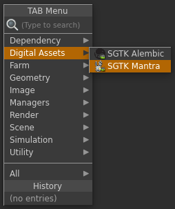

The Houdini Mantra Node App provides a custom  Mantra Output node which makes it easy to standardise the location where render files are output.  It can be configured for each environment.

# General Use

In order to use the  Mantra Node, save your script as a Toolkit work file first and then create a new node via the TAB menu in Houdini. This will create a node which looks similar to a normal Mantra output node:

The node can be configured with multiple output profiles, each using a different set of template paths for where the render output (images, ifd, dcm, aov, etc) should be written to disk.

Rather than entering a path by hand, you just specify which configuration to use and the node will compute the rest of the path automatically. You can see the computed path in the UI. 

The rendered files will be versioned and the version number will always follow the current Houdini scene file version which will be incremented automatically when you publish using Multi Publish.

# Configuration

The Toolkit mantra node provides the ability to specify multiple output profiles for an environment configuration. Here's an example of configuring the node with multiple profiles:

<pre>
  tk-houdini:
    apps:
      tk-houdini-mantranode:
        location: 
          name: tk-houdini-mantranode
          type: dev
          version: v0.2.2
        default_node_name: tk_mantra_out
        work_file_template: houdini_shot_work
        output_profiles:
          - name: Primary Render
            settings: {}
            color: [1.0, 0.5, 0.0]
            output_render_template: houdini_shot_render
            output_ifd_template: houdini_shot_ifd
            output_dcm_template: houdini_shot_dcm
            output_extra_plane_template: houdini_shot_extra_plane
          - name: Local Render
            settings: {}
            color: [0.0, 0.5, 1.0]
            output_render_template: houdini_shot_local_render
            output_ifd_template: houdini_shot_local_ifd
            output_dcm_template: houdini_shot_local_dcm
            output_extra_plane_template: houdini_shot_local_extra_plane
</pre>

You can use the output profiles to alter the look of the node via the `color` field, and you can adjust individual parms on the underlying Alembic node by supplying key/value pairs matching those parms in the `settings` field. Finally, the `output_*_template` fields drive the output paths for the files written to disk by the mantra renderer.