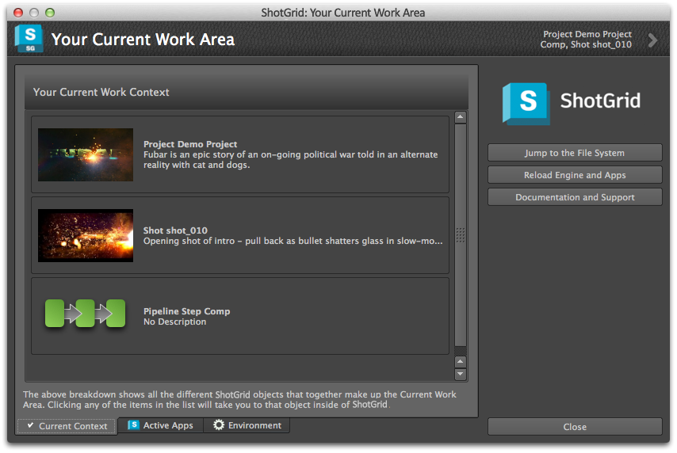

# About

This app gives a graphical breakdown of the current work area and all the apps running in the current environment. You can find it on the Context Menu:

## Reload all apps
There is a handy button this app that reloads the entire environment. This is useful if you are doing development and have made some code changes you want to try out! No need to restart Maya or Nuke, just hit the reload button!

In addition to the reload feature, this apps shows a breakdown of your current work area and all the apps that are currently loaded.

Three separate views exist:

## Current Work Area

This shows the current Shot or Asset, the current Task etc. If you double click any of the items in the list, the system will open the  Detail page for that item.

## Running Apps

A view of all the currently running apps, along with their version and description. Double clicking an app will launch the documentation page for that app.

## Current Environment

A view of the currently loaded environment file and engine. This can be useful for debugging purposes 🎀