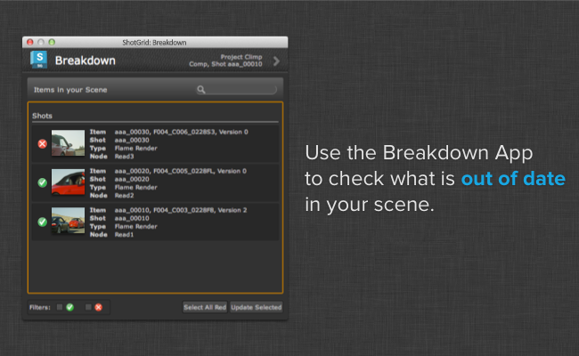

# Breakdown

The Scene Breakdown app shows you a list of referenced content and tells you which items are out of date. You access it from the  Menu.



You can select one more more items and hit update selected. This will switch the items to use the latest version of the content.

## Scanning the Scene

When the breakdown app scans the scene for references, it will call a special scanning hook. The scanning hook will return a list of nodes with file corresponding paths. For each reference it finds, it returns the file path, and tank will look at the file path and first check if it recognizes it as a publish, and if it does, see if there is a more recent version available.

If the user clicks the update button that is shown for outdated versions, the app will call another hook to do the actual update work. This means that by customizing these hooks it is relatively simple to add new custom nodes to the breakdown.

## Accessing  Data

If you need to access  data for the publish you are about to update to in the hook, this is straight forward; a single call to `find_publish` will retrieve metadata for all the items passed in from the app, like this:

```python
class BreakdownHook(Hook):

    def update(self, items):
        """
        Perform replacements given a number of scene items passed from the app.

        Once a selection has been performed in the main UI and the user clicks
        the update button, this method is called.

        The items parameter is a list of dictionaries on the same form as was
        generated by the scan_scene hook above. The path key now holds
        the that each node should be updated *to* rather than the current path.
        """

        engine = self.parent.engine

        # resolve  data for all paths passed via the items dictionary
        sg_data = tank.util.find_publish(engine.sgtk,
                                         [i["path"] for i in items],
                                         fields=["id", "code", "version_number"])

        for i in items:
            node_name = i["node"]
            node_type = i["type"]
            new_path = i["path"]
            # now that each item is processed, it is easy to access the
            #  data via a dictionary lookup:
            sg_data = sg_data.get(i["path"])

            # once we have all our desired info and metadata, we can go ahead
            # and apply the update business logic.
            # [-business logic here-]

```

## API Access

You can access the breakdown app programatically using its API. The following methods exist:

### Showing the breakdown UI

```
app_object.show_breakdown_dialog()
```

If you want to show the breakdown UI, execute the `show_breakdown_dialog()` method. Assuming the app is included under a `tk-multi-breakdown` section in your currently running environment, this could for example be done like this:

```
>>> import sgtk
>>> e = sgtk.platform.current_engine()
>>> e.apps["tk-multi-breakdown"].show_breakdown_dialog()
```

### Running the scene analysis

```
items = app_object.analyze_scene()
```

You can programmatically run the scene analysis logic by executing the `analyze_scene()` method. This executes exactly the same logic that the breakdown UI uses when it builds the listing of scene items.

The method returns a list of breakdown items. Each item is represented by a dictionary with a number of keys to describe the item. Only files whose path corresponds to a template in the Toolkit templates file will be detected. Files do not need to exist as publishes in , however if they do, this method will return basic  publish metadata for them.

The two keys `node_name` and `node_type` are used to return a DCC-centric "address" or representation which makes it possible to identify the path within the DCC. In for example Maya and Nuke, this will return the node name and type. The logic for this is implemented in the hooks and will vary between DCCs. This method will attempt to connect to , but the number of calls made are constant and independent of the scene complexity.

Here is an example of what a dictionary in the return data typically looks like:

```
{'fields': {'Sequence': 'aaa',
            'Shot': 'aaa_00010',
            'Step': 'Comp',
            'eye': '%V',
            'height': 1556,
            'name': 'test',
            'output': 'output',
            'version': 1,
            'width': 2048},
 'template': <Sgtk TemplatePath nuke_shot_render_pub_mono_dpx>,

 'node_name': 'Read2',
 'node_type': 'Read',

 'sg_data': {'code': 'aaa_00010_test_output_v001.%04d.dpx',
             'entity': {'id': 1660, 'name': 'aaa_00010', 'type': 'Shot'},
             'id': 1424,
             'name': 'test',
             'published_file_type': {'id': 3,
                                     'name': 'Rendered Image',
                                     'type': 'PublishedFileType'},
             'task': {'id': 4714, 'name': 'Comp', 'type': 'Task'},
             'type': 'PublishedFile',
             'project': {'id': 234, 'name': 'Climp', 'type': 'Project'},
             'version_number': 1},
 }
```

**Handy Tip!**: As you can see above, each item returns a `template` object and a `fields` dictionary to represent the path. If you want to see the actual raw path for the item, you can simply run `template_obj.apply_fields(fields_dict)`. In the context of one of the item dictionaries returned by this method, the code would be

```
breakdown_items = analyze_scene()
for item in breakdown_items:
   path = item["template"].apply_fields(item["fields"])
```

### Computing the highest version for an item

```
highest_version = app_object.compute_highest_version(template, fields)
```

In order to figure out the highest version for an item, use the `compute_highest_version(template, fields)` method. The `template` and `fields` parameters represent a path that should be analyzed are typically grabbed from the output of the `analyze_scene()` method. With the breakdown app, the template key containing the version number is always required to be named `{version}`.

This will perform a scan on disk to determine the highest version. The method returns the highest version number found on disk. See the usage example below for more details.

### Updating a scene item

```
app_object.update_item(node_type, node_name, template, fields)
```

In order to update an item, you can use the `update_item(node_type, node_name, template, fields)` method. The `template` and `fields` parameters represent a path that should be updated to. The `node_name` and `node_type` parameters are used to identify which node in the scene should be modified. Typically, these values are grabbed from the output of the `analyze_scene()` method.

This is similar to running the update in the breakdown UI. The actual update call will be dispatched to a hook which handles the DCC specific logic. See the usage example below for more details.

### Breakdown API example

Below is an example showing how to retrieve the scene breakdown and update all items that are not using the latest version.

```
# find the breakdown app instance
import sgtk
engine = sgtk.platform.current_engine()
breakdown_app = engine.apps["tk-multi-breakdown"]

# get list of breakdown items
items = breakdown_app.analyze_scene()

# now loop over all items
for item in items:

    # get the latest version on disk
    latest_version = breakdown_app.compute_highest_version(item["template"], item["fields"])

    # if our current version is out of date, update it!
    current_version = item["fields"]["version"]
    if latest_version > current_version:

        # make a fields dictionary representing the latest version
        latest_fields = copy.copy(item["fields"])
        latest_fields["version"] = latest_version

        # request that the breakdown updates to the latest version
        breakdown_app.update_item(item["node_type"], item["node_name"], item["template"], latest_fields)

```
