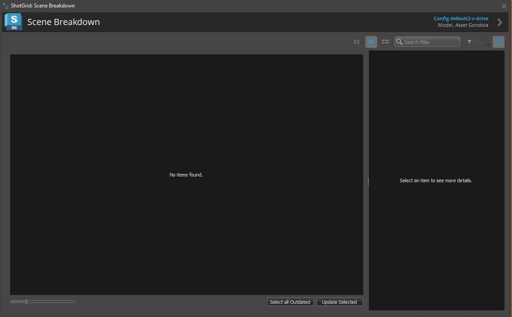

# Breakdown2

The Scene Breakdown2 app shows you a list of referenced content and tells you which items are not using the latest PublishedFile available. You access it from the  Menu.

## Scanning the Scene

## Accessing  Data

## API Access

### Showing the breakdown UI

### Running the scene analysis

### Computing the highest version for an item

### Updating a scene item

### Breakdown2 API example

