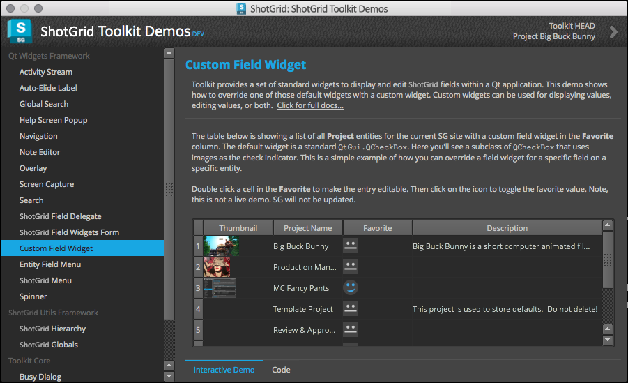
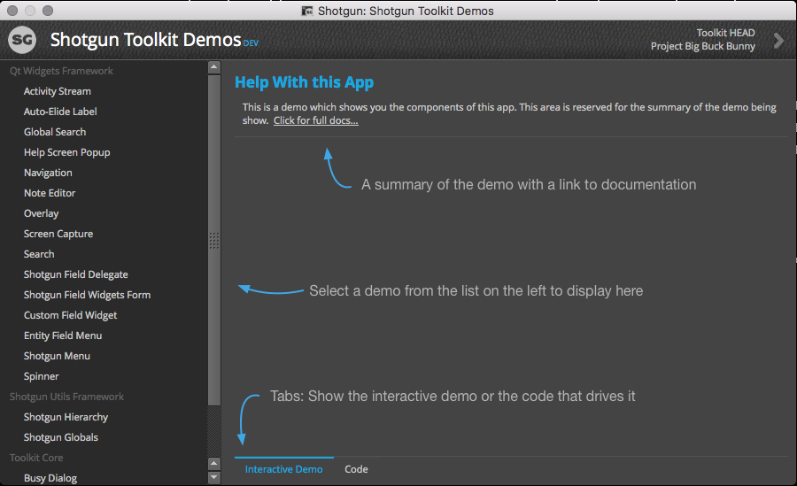
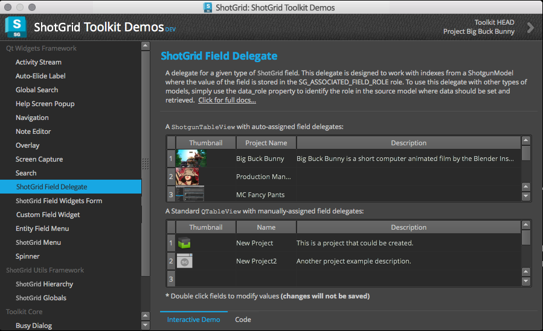
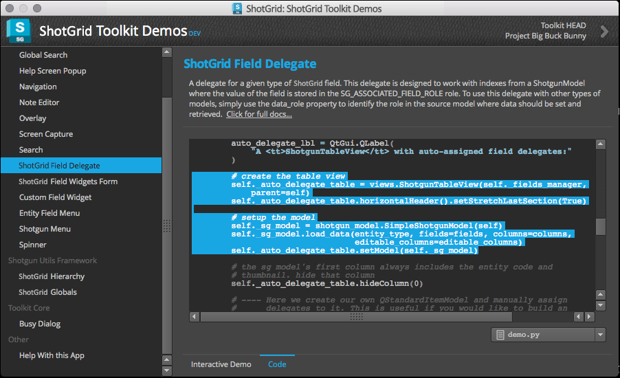

# Demo

The Demo App provides live demonstrations of 's native developer platform components including the  Utilities framework, the Qt Widgets frameworks and Toolkit core.



Each demo displayed in the app includes a working, interactive UI that shows how to use one or more components of the native platform. In addition, the code that is running is readily available to copy and paste into your own app.



The app is simple to use. Just select a demo from the list on the left and then interact with the components on the right. Some demos are as simple as displaying a single widget from the Qt Widgets framework. Other demos provide examples of how  platform components are commonly wired up for use in production apps.





New demos will be added as new components are added to the platform and as time permits. If there is a common pattern of component usage or a demo that you'd like to see, please let us know by [submitting a ticket](https://support.shotgunsoftware.com/hc/en-us/requests/new).

## Installation

To install the demo app, run the following command:

```
tank install_app project tk-shell tk-multi-demo
```

Once installed, you can run the following command to launch the app:

`./tank demos`
