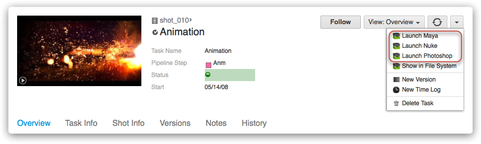

# Launch App

This app provides a shortcut to make it easy to jump from  to any supported application. It registers a  Action entry called for various entities in  according to your configuration choices.

## How It Works

Depending on your configuration options a menu entry will appear in  when right-clicking entities or using the  actions menu or gear menu.

For example, this screenshot comes from a site who's configuration uses this app three times to implement menus for Maya, Nuke and Photoshop.



Currently supported applications and engines are:

* 3DSMax
* Hiero
* Maya
* MotionBuilder
* Nuke
* Photoshop
* Mari
* Houdini
* Softimage
* Flame

### Use Command Line Arguments at Launch

Many applications have command line options that can be called to choose a different edition of the application (ex. Nuke vs. NukeX) or to specify other various usage aspects.  The launcher app has an 'args' setting for each OS that can be configured for this purpose.  For example if you put '--nukex' there, it will add that to the command line launch and NukeX will run instead of regular Nuke:

---FOLD---
Launch NukeX Example

```yaml
launch_nuke:
  engine: tk-nuke
  extra: {}
  hook_app_launch: default
  hook_before_app_launch: default
  linux_args: '--nukex'
  linux_path: '@nuke_linux'
  location: {name: tk-multi-launchapp, type: app_store, version: v0.2.15}
  mac_args: '--nukex'
  mac_path: '@nuke_mac'
  menu_name: Launch Nuke
  windows_args: '--nukex'
  windows_path: '@nuke_windows'
```
---FOLD---

### Set Environment Variables and Automate Behavior at Launch

Applications often require certain certain environment variables, plugin paths, etc. to be set in order to properly function in a studio pipeline. The launch app helps cover this case via the 'before_app_launch' hook, which allows you to define a snippet of code to run each time an application starts up. By default, the 'before_app_launch' hook is a simple pass-through that does nothing, but it can be overridden by following the instructions in <a href='https://developer.shotgridsoftware.com/425b1da4/#hooks'>this doc</a>.

For example, if you use Zync Render, the Zync Maya plugin directory needs to be part of both $PYTHONPATH and $XBMLANGPATH. To have the launch app set these environment variables, update the 'before_app_launch' hook with a few lines of code, as follows:

---FOLD---
Set Environment Variables Example

```python
def execute(self, **kwargs):
    """
    The execute functon of the hook will be called to start the required application        
    """

    # Example to show how to set env vars on Maya launch

    # Append the desired path to the existing $PYTHONPATH to ensure
    # everything upstream still works
    os.environ["PYTHONPATH"] = os.environ["PYTHONPATH"] + os.pathsep + "~/Library/zync/zync-maya"

    # Set $XBMLANGPATH to the desired path, may need to append it as
    # with $PYTHONPATH if already defined in your pipeline
    os.environ["XBMLANGPATH"] = "~/Library/zync/zync-maya"
```
---FOLD---

You can also use the 'before_app_launch' to automate other behavior, including  updates. For example, you can configure the launch app to update the Task status (in this case, to "in progress") each time it's run (as long as the launch is from a Task, of course), as follows:

---FOLD---
Automate Task Status Update Example

```python
def execute(self, **kwargs):
    """
    The execute functon of the hook will be called to start the required application        
    """

    # If there is a Task in the context, set its status to 'ip'

    if self.parent.context.task:
        task_id = self.parent.context.task['id']
        data = {
            'sg_status_list':'ip'
        }
        self.parent.shotgun.update("Task", task_id, data)
```
---FOLD---

As you can imagine, there are many possibilities here, and the launch app aims to provide the flexibility your pipeline needs.

### Launching Applications that do not have an Engine Yet

You can also use the launch app to start up applications that do not have a Toolkit engine yet. In this case, folders will be created on disk for the shot, task or asset you are launching from and the application will be launched, but no code will run after application startup and no  menu will appear inside the application. This means that you can launch applications that are not yet supported by Toolkit from within . 

In order to do this, configure the app with paths to the application you wish to launch, but leave the engine option as an empty string.

## Technical Details

### 3DSMax

This app automatically adds a MaxScript, `init_tank.ms`, to the 3DSMax command line that 3DSMax will run as part of its boot process.

When 3DSMax is booting, the following will happen:

1. 3DSMax will run `init_tank.ms` upon starting
1. `init_tank.ms` makes sure a Python interpreter is available and runs `tank_startup.py`
1. Using the  Toolkit Context API, the entity id passed from  is converted into a Toolkit Context. 
1. Start the appropriate Engine (via `tank.system.start_engine()`) and pass in the Context. The engine will take care of the rest.

### Maya

This app registers a `userSetup.py` auto start script with Maya which Maya will call as part of its boot process. 

When Maya is booting, the following will happen:

1. Maya starts execution of the `userSetup.py` startup script
1. Using the  Toolkit Context API, the entity id passed from  is converted into a Toolkit Context. 
1. Start the appropriate Engine (via `tank.system.start_engine()`) and pass in the Context. The engine will take care of the rest.

### MotionBuilder

This app registers a `init_tank.py` auto start script with MotionBuilder which MotionBuilder will call as part of its boot process. 

When MotionBuilder is booting, the following will happen:

1. MotionBuilder starts execution of the `init_tank.py` startup script
1. Using the  Toolkit Context API, the entity id passed from  is converted into a Toolkit Context. 
1. Start the appropriate Engine (via `tank.system.start_engine()`) and pass in the Context. The engine will take care of the rest.

### Nuke

This app registers a `menu.py` auto start script with Nuke which Nuke will call as part of its boot process. 

When Nuke is booting, the following will happen:

1. Nuke starts execution of the `menu.py` startup script
1. Using the  Toolkit Context API, the entity id passed from  is converted into a Toolkit Context. 
1. Start the appropriate Engine (via `tank.system.start_engine()`) and pass in the Context. The engine will take care of the rest.

### Photoshop

This app will use the Adobe Extension Manager to install or make sure the Tank plugin is installed.

When Photoshop is booting, the following will happen:

1. Photoshop will start the execution of the Tank Plugin
1. Using the  Toolkit Context API, the entity id passed from  is converted into a Toolkit Context. 
1. Start the appropriate Engine (via `tank.system.start_engine()`) and pass in the Context. The engine will take care of the rest.

#### Extra configs

If you intend to use this app to launch Photoshop you will need to supply four config values in the _extra_ section. Here are the configs and sane default values which you would need to adjust for your system and installation locations:

```yaml
mac_python_path: "/usr/bin/python"
windows_python_path: "C:\\Python27\\python.exe"
mac_extension_manager_path: "/Applications/Adobe Extension Manager CS6/Adobe Extension Manager CS6.app"
windows_extension_manager_path: "C:\\Program Files (x86)\\Adobe\\Adobe Extension Manager CS6\\XManCommand.exe"
```