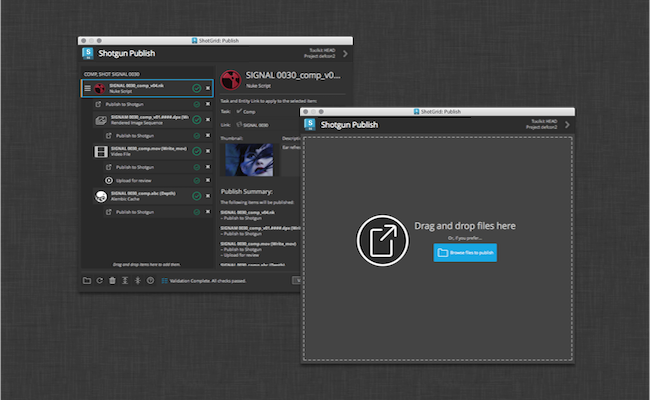

# Publish

## Overview

The Publish app allows artists to publish their work so that it can be used by artists downstream. It supports traditional publishing workflows within the artist’s content creation software as well as stand-alone publishing of any file on disk. When working in content creation software and using the basic  integration, the app will automatically discover and display items for the artist to publish. For more sophisticated production needs, studios can write custom publish plugins to drive artist workflows.

## Documentation

Full documentation for the Publisher can be found [here](https://developer.shotgridsoftware.com/d587be80/?title=Integrations+User+Guide#the-publisher)!

