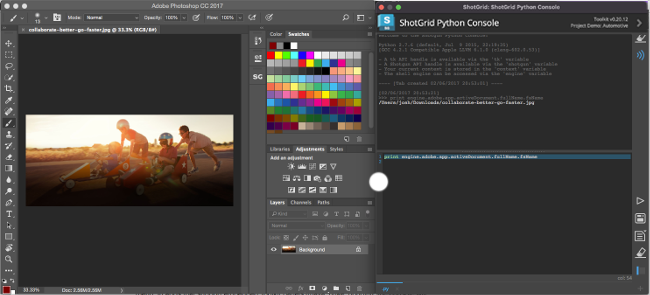
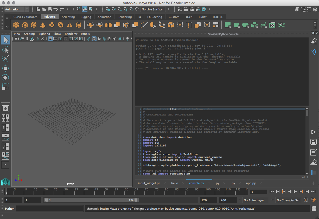
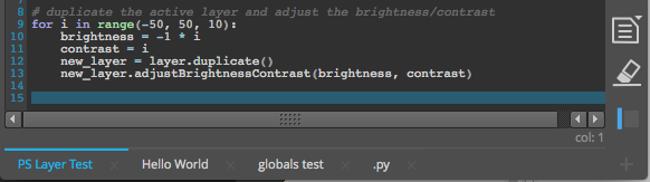
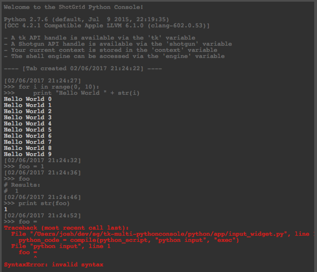
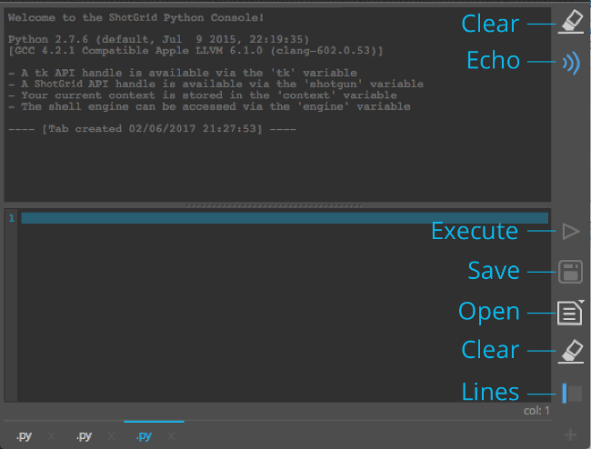
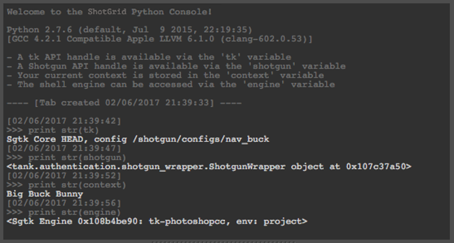
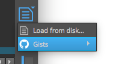

# Python Console

This is a python console panel for use in DCCs with access to a python interpreter that have limited or no support for interacting with said interpreter.

## Panel

Once installed, the console is registered as a panel in the DCC and is available in the  menu. In apps that support embedded Toolkit panels(maya, nuke, houdini), the console will display in a docked panel. When using with older versions of these DCCs or in a DCC that does not support panels, the console will simply be shown as a regular Toolkit dialog.

## Tabs

The python console displays one or more tabs, each containing an editor and an output window. New tabs can be created by clicking the `+` button in the bottom right hand corner. Tabs have an `x` button next to the tab name that allow you to delete the tab. Double clicking the tab itself will prompt you to enter a new name for the tab. Tabs can be rearranged via drag and drop. The state of the tabs is saved when the DCC is closed and restored on the next launch.

### Editor

The console has an input area for editing python. The editor includes line numbers, highlights the cursor's current line, and does some basic syntax highlighting. The console attempts to use the palette of the DCC to give it an integrated look and feel.

Block indenting and unindenting is supported. Select one or more lines and press `tab` to indent by four spaces or `shift + tab` to unindent by four spaces. It tries to keep the indentation in blocks of four so it will indent/unindent to the nearest whole block of four spaces.

Block commenting and uncommenting is also supported. Select one or more lines and press `cmd + /` on Mac, `ctrl + /` for Windows and Linux. If any of the selected lines don't have a `#` at the start it will add one to all selected lines. If all the lines do have a `#`, then it will remove them.

### Output

The output area displays the results of the executed python. Echoing the source python commands is turned on by default and is differentiated in the output by being prefixed with `>>>`. Each execution is also marked with a timestamp. There is a toggle for turning the echo off. Syntax and Runtime errors are shown in red with a full stack trace for debugging.

## Buttons

### Output

- **Clear** - Clear the contents of the output browser.
- **Echo** - Toggle echoing the executed commands in the output browser.

### Editor

- **Execute** - Execute the contents of the editor
- **Save** - Save the current contents of the editor to a file.
- **Open** - Open a file in the editor.
- **Clear** - Clear the contents of the editor.
- **Lines** - Toggle line numbers for the current tab

## Globals

Some /Toolkit globals are pre-defined in the console, similar to what is available in the [ Engine for the shell](https://support.shotgunsoftware.com/entries/95441287).

- Tk API handle is available via the `tk` variable
-  API handle is available via the `shotgun` variable
- The current context is stored in the `context` variable
- The shell engine can be accessed via the `engine` variable

## External sources

The app comes with a hook that can be implemented to load python source from an external location. The hook is called `external_sources_hook` and requires implementing a method called `get_external_source_actions`. The method should return a list of `QActions` that, when triggered, add a new tab (with content)to the console. An example implementation is provided that loads gists from github for a list of predefined users. The actions returned by the hook are shown in the popup menu displayed when the **Open** button is pressed and held.

## Hotkeys

- Execute selected with `Ctrl + Enter`
- Create a new tab with `Ctrl + T`
- Navigate tabs with `Ctrl + Shift + [` or `Ctrl + Shift + ]`
- Resize input/output font via `Ctrl + Wheel`

**NOTE:** These hotkeys may not be available in all DCCs.

## Other notes

- In some older versions of DCCs, leaving the python console open when closing the session may cause a crash. We believe this may be a bug in some older versions of PySide. More recent versions of DCCs, bundled with newer versions of PySide, do not appear to crash on exit. If you encounter this issue with a recent DCC release, please [submit a ticket](https://support.shotgunsoftware.com/hc/en-us/requests/new) so that we can investigate further.
