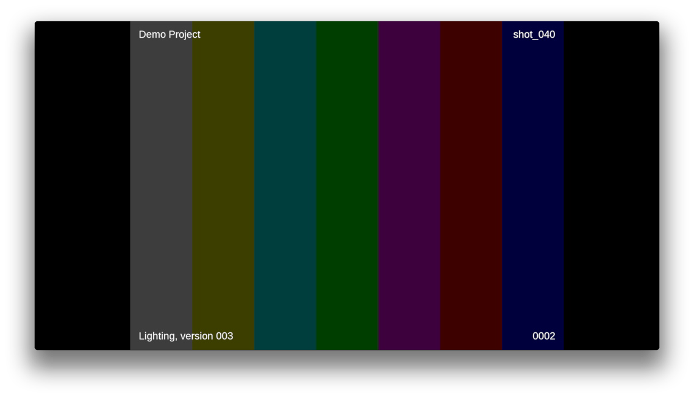

# Review Submission

## How do I use this App?

### As an API

This app have a mode that is meant to be called from inside other apps like the multi-publish app.

This mode creates quicktimes from image sequences and submits them as Versions to  in order to facilitate review. The generated quicktimes will have slates and burnins. Things such as font, logo position, movie compression options and burnin / slate information are currently hardcoded in the default hooks and as such you are encouraged to re-implement the hook function to adjust the behaviour.

Here are a the current default formats for slate and burnin:




Should you want to leverage this app from within your own apps or hooks here is a quick rundown of the simple way to go about it.

- Get the `tk-multi-reviewsubmission` app from the current engine. This can be done
  from inside a hook using the call `self.parent.engine.apps.get('tk-multi-reviewsubmission')`.
- If the app is available, call the `render_and_submit_version()` method.

Here's an example of what this can look like inside your hook code:

```python
review_submission_app = self.parent.engine.apps.get("tk-multi-reviewsubmission")
if review_submission_app:
    review_submission_app.render_and_submit_version(
        template,
        fields,
        first_frame,
        last_frame,
        sg_publishes,
        sg_task,
        comment,
        thumbnail_path,
        progress_cb,
        color_space
    )
```

The arguments that you need to pass to `render_and_submit_version` are as follows:

- `template`: A template that defines where the files to publish are located
- `fields`: Fields that will be used to fill out the template
- `first_frame`: The first frame of the image sequence to process
- `last_frame`: The last frame of the image sequence to process
- `sg_publishes`: A list of  Published File objects to link the version to.
- `sg_task`: A  Task link dictionary to link the version to.
- `comment`: Text to add to the Version's description.
- `thumbnail_path`: The path to a thumbnail to use for the version when the movie isn't being uploaded to  (this is set in the config)
- `progress_cb`: A callback to report progress with. This should be of the form: `callback(percent, message)`
- `color_space`: The color space that the input frames are in. In Nuke, this would be one of the enumeration values on the colorspace knob for the Write node.

### As a menu item

This mode adds a menu item to the  menu inside the DCC. 

This mode creates a quick snapshot of the current viewport and sends it to  Create as a Version draft. Then, the user can extend the review submission inside of  Create by adding annotations, text or comparison notes.

In order to add this functionality to your context, you need to:

- Set the `display_name` field to have it in the menu item.
- Set the `render_media_hook` field to a hook that tells how to render media in your DCC (tk-photoshopcc and tk-maya have a default implementation)
- Set the `submitter_hook` field to `{self}/submitter_create.py`

Like this:

```yaml
tk-multi-reviewsubmission:
  display_name: Send for review
  render_media_hook: "{self}/render_media.py:{self}/{engine_name}/render_media.py"
  submitter_hook: "{self}/submitter_create.py"
  location:
    type: app_store
    name: tk-multi-reviewsubmission
    version: v1.0.1
```
