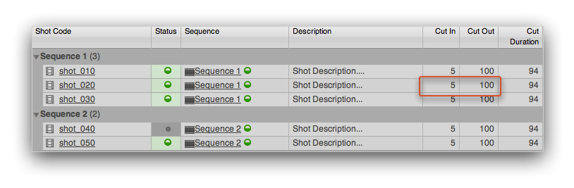
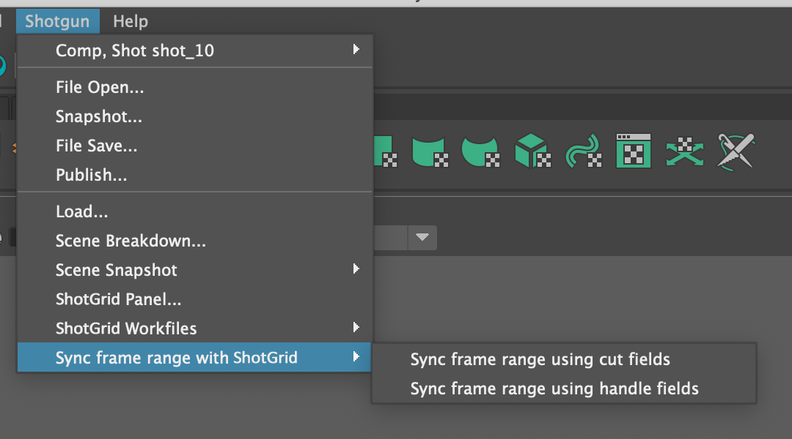

# Set Frame Range

This app helps managing the frame range in the currently open scene. You can access it from the  menu by clicking the **Sync Frame Range with ** menu option.

When you click it, the  Toolkit will look at the  entity associated with the current work area (typically a Shot) and look for in and out fields which contain the in and out frame information. Typically, this is something used in conjunction with Shots and in that case the app uses the standard shot in and out fields defined in 's default config. However, it is perfectly possible to configure the app to pull the frame ranges from other fields too.



Once you run the App, it will update the current scene with those ins and outs and finally display a summary message:


## Multiple  field synchronisation options

You can define multiple instances of this app in the  Menu by setting the `menu_name` property. This allows the possibility to define a multiple menu actions for synchronization of different  fields.

To do this, set a different app instance name, `menu_name` and in and out frame fields for each instance:

```yaml
tk-multi-setframerange_cuts:
  menu_name: Sync frame range using cut fields
  sg_in_frame_field: sg_cut_in
  sg_out_frame_field: sg_cut_out
  location: "@apps.tk-multi-setframerange.location"
tk-multi-setframerange_handles:
  menu_name: Sync frame range using handle fields
  sg_in_frame_field: sg_handle_in
  sg_out_frame_field: sg_handle_out
  location: "@apps.tk-multi-setframerange.location"
```
These should then appear as separate options in the  menu:



Note: this is new to version `v0.4.0` of the app.

## Operations hook

The software specific logic for getting the current scene frame range or setting the frame range is handled in the frame operations hook. If you are wanting to add support for a new engine or want to change how the behaviour is implemented, you can take over the frame operations hook by setting the `hook_frame_operation` app property and implementing your own get and set logic.

Note: this is new to version `v0.4.0` of the app.