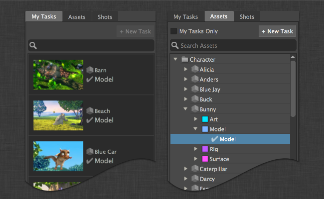
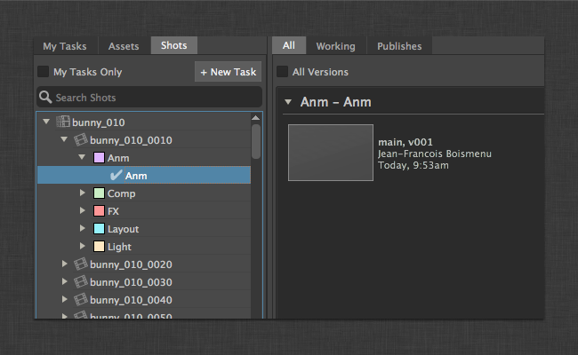
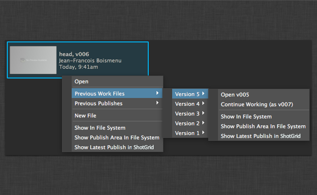
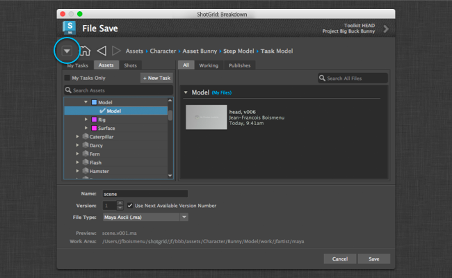
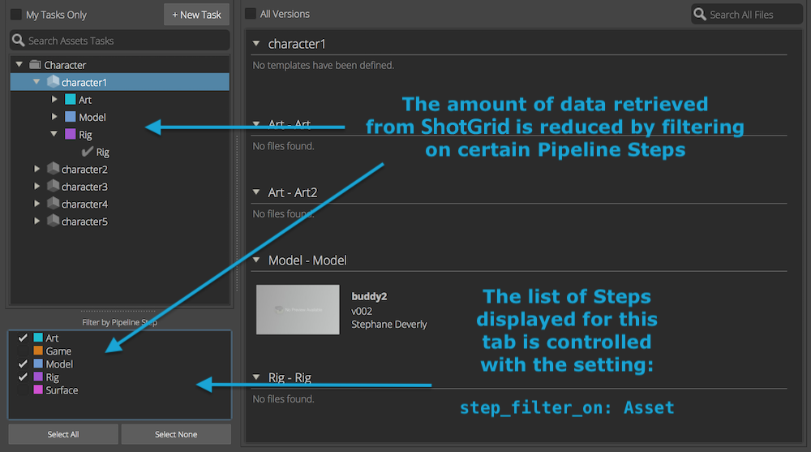
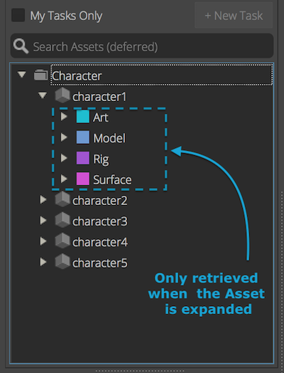

## File Open dialog

### Navigating your work areas



The main dialog is split in two halves. On the left hand side, there is a series of tabs. The first tab is called "My Tasks" and will display all the tasks that are assigned to the current user. It is very reminiscent of the "My Tasks" page on the  website.

Alternatively, the user can also browse for a  entity using the entities tabs. By default, the workfiles application allows to browse for any tasks associated on shots or assets by looking at the respective tab.

The set of tabs is entirely configurable through the `entities` settings in the environment files.

You can disable/enable this dialog by setting the `show_file_open: true/false` in the app settings.

### Finding files



On the right hand-side you will see the working files and publishes associated with the selection from the left hand-side. Working files and publishes can be viewed together or separately using the tabs "All", "Working" and "Publishes".

### Accessing previous versions



There are two ways to access previous versions. First, the user can click on the "All versions" box at the top of the browser, which will uncollapse the versions and list them all individually in the browser. Another option is to right-click on a file, which will allow you to access the last 10 versions.

### User sandboxes


If your pipeline configuration uses user sandboxes, only the files for the current user will be seen by default. If the user wants to see the files from other user's sandboxes, a button at the top will allow to pick which sandboxes to show files from.

### Narrowing results


You can narrow results in the any of the views by typing text. The search will match any item's name.

## File Save dialog

By default, the "File Save" dialog allows the user to save a file in the current context. The user will be prompted for a scene name, version number and an optional file extension, if available and the "Save" button will be greyed out. Only once the application has confirmed the next available version number for a scene name will the Save button at the bottom right be enabled.

You can disable/enable this dialog by setting the `show_file_save: true/false` in the app settings.

### Saving in a different context



In order to save a file in a different context, a user can click on the expand button at the top-left of the dialog which will expand the "File Save" dialog and allow to pick another context to save into.

### Adding the file extension dropdown


With the new file save dialog, it is possible to pick the extension of the file being saved. In order to enable this, you need to tweak your pipeline configuration's `templates.yml` file. First, a token needs to be defined in the token list inside `templates.yml`.

```
maya_extension:
    type: str
    choices:
        ma: Maya Ascii (.ma)
        mb: Maya Binary (.mb)
    default: ma
    alias: extension
```

`maya_extension` is the token's name. `choices` is a dictionary of file types that will be displayed in the dropdown. The keys (`ma` and `mb`) are the possible values that this template token can have. The values (`Maya Ascii (.ma)` and `Maya Binary (.mb)`) are UI friendly descriptions that can be used by a Toolkit application. The `alias` is an hint that is required by the workfiles application. It tells the application that this token is an extension and should be displayed in the dropdown widget.

Then, this token can be added to any Maya specific template.

```
maya_shot_work:
    definition: '@shot_root/work/maya/{name}.v{version}.{maya_extension}'
    root_name: 'primary'
```

## Context Change dialog


The context change dialog is similar to the open dialog except that it doesn't have a the right hand side for file browsing. You can select a task or entity and change your current engine context by pressing press the change context button.

You can disable/enable this dialog by setting the `show_change_context: true/false` in the app settings.

## Step filtering

When retrieving Tasks, and if `step` is included in the hierarchy, the amount of data retrieved from  can be reduced with Pipeline Step filtering: only Tasks linked to the selected list of Steps will be retrieved.

The list of Steps displayed in a tab is controlled with the `step_filter_on` setting. If not set, all existing Pipeline Steps are displayed.

The example below defines two tabs, respectively displaying Tasks for Assets and Shots:
```
  - caption: Assets Tasks
    entity_type: Task
    step_filter_on: Asset
    filters:
    - [entity, type_is, Asset]
    hierarchy: [entity.Asset.sg_asset_type, entity, step, content]
  - caption: Shots Tasks
    entity_type: Task
    step_filter_on: Shot
    filters:
    - [entity, type_is, Shot]
    hierarchy: [entity.Shot.sg_sequence, entity, step, content]
```




## Deferred queries

For better performances, building the Entities tree can be broken into two step queries:
- A first query is used to retrieve records from  and populate the top of the tree.
- A second query is used to retrieve children as the user expand the tree.

With the following settings, Assets and Shots would be retrieved from  when the app is started. And then Tasks linked to a particular Asset or Shot would only be retrieved when this Asset or Shot is selected or expanded in the tree view.

```
  entities:
  - caption: Assets
    entity_type: Asset
    hierarchy: [sg_asset_type, code]
    filters:
    sub_hierarchy:
      entity_type: Task
      filters:
      link_field: entity
      hierarchy: [step]
  - caption: Shots
    entity_type: Shot
    filters:
    hierarchy: [sg_sequence, code]
    sub_hierarchy:
      entity_type: Task
      filters:
      link_field: entity
      hierarchy: [step]
```



## Known Issues

- **3ds Max and Motionbuilder Support** - File performance is slower in these DCCs under Windows compared to Maya and Nuke.
- **Perforce/Versionless files** - The application still needs to go through testing with the Perforce workflow so it is very likely that it won't work well.