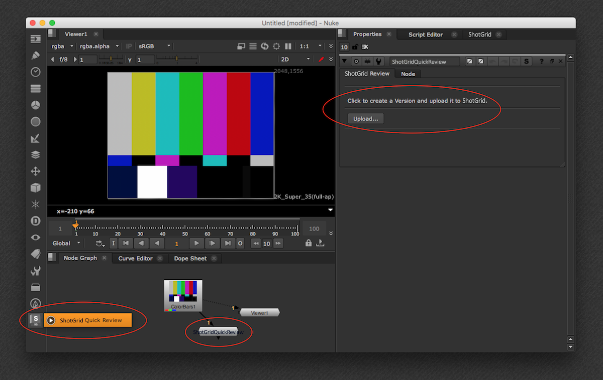
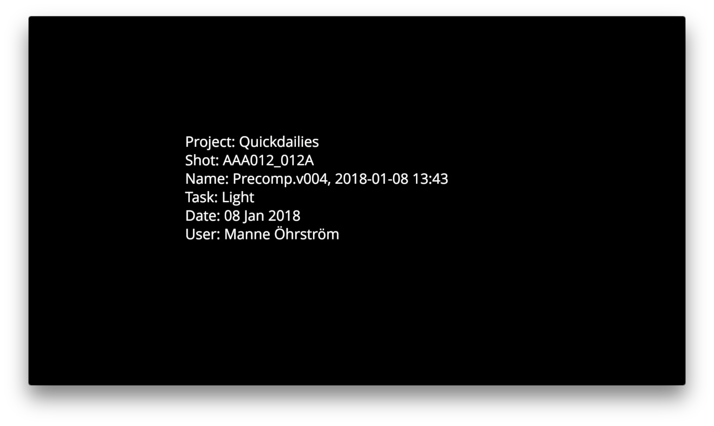
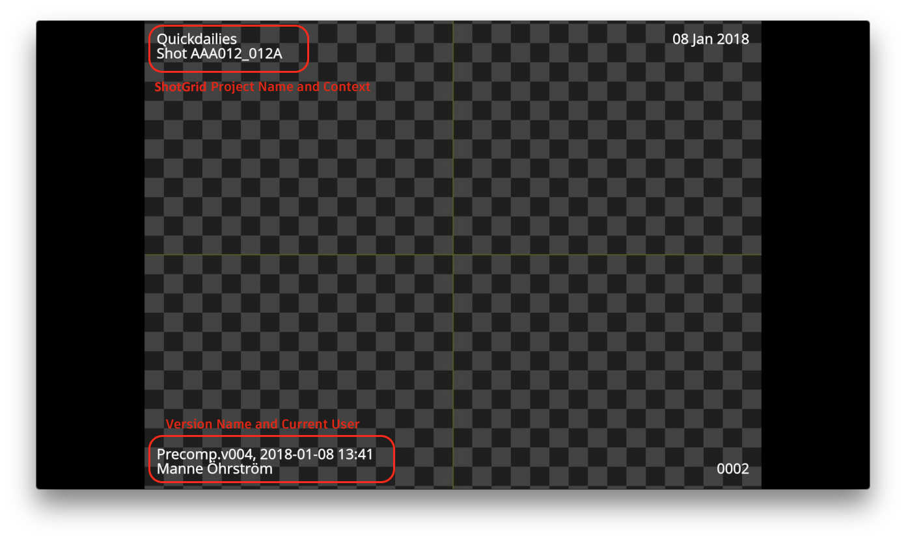

# Nuke Quickreview

The Quickreview app makes it easy to submit Nuke renders for review in . A **Version** in  will be created with each quickreview submission. It appears as a node in Nuke, located on the  Node menu. Simply create a new node, attach it to your Nuke network, double click it and click the Upload button.

You get presented with the following UI, allowing you control how your Version is created in :

The following items can be controlled:

- The version name is pre-populated based on the currently loaded nuke script and can be adjusted if needed.
- The entity link and task associated with the version is based on the current context and can be adjusted.
- The frame range to be submitted can be adjusted.
- The created Version can be added to a playlist. A dropdown with recent playlist are being displayed.

Once you press the Upload button, a quicktime will be generated in nuke and then uploaded to . Once uploaded, the following screen will be shown, allowing you to either show the Version in the Built-in  Panel in Nuke or in the web overlay player.

## Burnins and slate

By default, the app will generate a Quicktime with a slate and burn-ins:

 

## Customization

Most aspects of the review submission can be adjusted using hooks. Documentation can be found [here](http://developer.shotgunsoftware.com/tk-nuke-quickreview).

